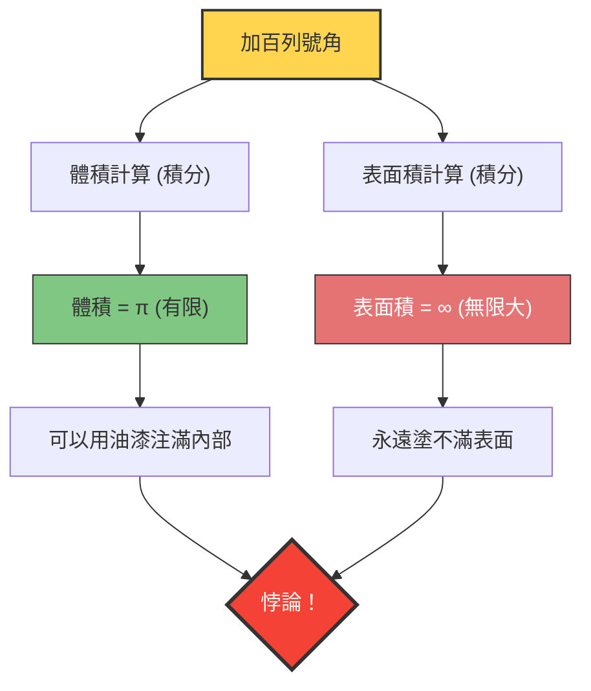

---
title: "能用油漆注滿，卻無法塗滿表面？：加百列號角"
description: "同時擁有「有限體積」與「無限表面積」，微積分學帶來的奇妙立體悖論。"
date: 2026-09-10T21:00:00+09:00
draft: false
slug: "gabriels-horn"
image: "img/gabriels_horn.jpg"
math: true
mermaid: true
categories: ["數學悖論", "微積分學"]
tags: ["悖論", "幾何學", "無限", "托里切利小號"]
---

如果有一個容器，「體積有限，但表面積卻是無限大」，那會發生什麼事呢？
直覺上這似乎是不可能的，但在數學世界裡，確實存在這樣的立體圖形。這就是**「加百列號角（Gabriel's Horn）」**，又被稱為**「托里切利小號（Torricelli's trumpet）」**。

這個圖形由義大利數學家埃萬傑利斯塔·托里切利於1641年發現，當時給數學家和哲學家們帶來了極大的震撼，並引發了關於「無限」本質的激烈爭論。

## 油漆悖論

如果將這個圖形的性質用日常的「油漆」來比喻，就會產生以下奇妙的悖論：

1. **用油漆注滿號角內部時**：
   因為號角的體積是有限的（精確來說是 $\pi$），所以只需倒入 $\pi$ 公升（約 3.14 公升）的油漆，就能完全填滿號角內部。
2. **在號角表面塗上油漆時**：
   號角的表面積是無限大的。因此，如果想用刷子在號角內側（或外側）的表面塗上油漆，無論準備多少油漆，都永遠無法塗完。

**「只需 3.14 公升的油漆就能注滿內部，但要塗滿表面卻需要無限的油漆。」**
為什麼會發生這種違反直覺的情況呢？

## 數學證明：微積分的魔法

加百列號角是將函數 $y = \frac{1}{x}$ 的圖形（其中 $x \ge 1$）繞著 $x$ 軸旋轉而生成的。
我們用微積分來計算這個立體的體積 $V$ 和表面積 $A$。

### 1. 體積的計算（為何有限）

旋轉體的體積 $V$ 可以藉由對截面積（半徑為 $\frac{1}{x}$ 的圓）進行積分來求得。

$$ V = \pi \int_{1}^{\infty} \left( \frac{1}{x} \right)^2 dx = \pi \int_{1}^{\infty} \frac{1}{x^2} dx $$

計算這個定積分：
$$ V = \pi \left[ -\frac{1}{x} \right]_{1}^{\infty} = \pi (0 - (-1)) = \pi $$
結果收斂為一個有限的值 $\pi$。

### 2. 表面積的計算（為何無限）

另一方面，表面積 $A$ 的計算如下：

$$ A = 2\pi \int_{1}^{\infty} y \sqrt{1 + \left(\frac{dy}{dx}\right)^2} dx $$

因為 $$ \frac{dy}{dx} = -\frac{1}{x^2} $$，所以平方根裡面變成 $1 + \frac{1}{x^4}$。
在這裡，對於所有的 $x \ge 1$，都有 $\sqrt{1 + \frac{1}{x^4}} > 1$，因此成立以下不等式：

$$ A > 2\pi \int_{1}^{\infty} \frac{1}{x} \cdot 1 dx = 2\pi \left[ \ln x \right]_{1}^{\infty} $$

自然對數 $\ln x$ 在 $x \to \infty$ 時會發散到無限大。因此，比它還要大的表面積 $A$ 當然也會發散到**無限大**。

## 這個悖論的「真相」

即使在數學上能證明其正確性，但在現實世界的感覺上可能還是令人難以接受。
「既然能用油漆注滿，而且油漆確實接觸到了內部的表面，難道表面不應該也被塗滿了嗎？」

這種直覺上的偏差，源自於**將數學概念與物理現實混為一談**。

在數學世界中，油漆的「厚度」可以無限變薄到趨近於零。加百列號角越往尖端會變得無限細小，但數學上的油漆能變得任意薄，流入那極度細小的尖端深處，用有限的體積包覆無限的表面積（只是，油漆膜的厚度越靠近尖端會越趨近於零）。

然而，在物理的現實世界中，油漆是由原子和分子（具有有限大小的粒子）構成的。
即使倒入真實的油漆，當號角的管徑變得比「油漆分子的直徑」還要細時，油漆就無法再往深處流動。換句話說，在物理上，既不可能注滿到尖端，也不可能塗滿無限的表面。

加百列號角是一個美麗的例子，它告訴我們，人類的直覺受限於「有限世界的規則」，並不總是能與處理「無限」的微積分世界相符。
