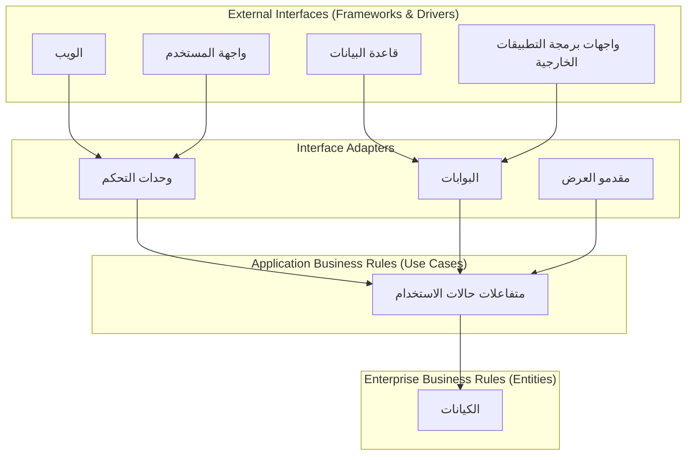
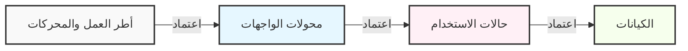
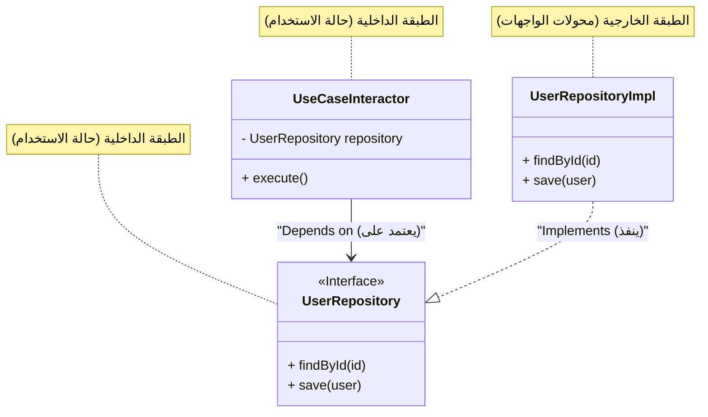

في تطوير البرمجيات الحديثة، يعد بناء "نظام مقاوم للتغيير" تحديًا دائمًا. التغييرات في متطلبات العمل، ظهور أطر عمل جديدة، تجديد واجهة المستخدم، وترحيل قواعد البيانات. استجابةً لكل هذه التغييرات، هناك حاجة إلى بنية يمكنها التكيف بمرونة دون إعادة بناء النظام بأكمله. كأحد الإجابات على ذلك، تم اقتراح **البنية النظيفة (Clean Architecture)** بواسطة Robert C. Martin (المعروف باسم العم بوب، Uncle Bob).

في هذه المقالة، سنتعمق في جوهر البنية النظيفة من خلال تاريخها، الغرض منها، تفاصيل الطبقات الأربع، قاعدة التبعية، وأمثلة تنفيذية محددة. سنقدم شرحًا تقنيًا عميقًا ومفصلاً للغاية.

## 1. مشاكل البنى التقليدية وتاريخ البنية النظيفة

من الناحية التاريخية، شهدت هندسة البرمجيات تحولات نموذجية مختلفة. في الأنظمة المبكرة، كانت تعليمات منطق العمل، واجهة المستخدم، ووصول البيانات متشابكة بشدة (ما يسمى بشفرة السباغيتي). بعد ذلك، بهدف فصل الاهتمامات (Separation of Concerns)، انتشرت البنية ثلاثية الطبقات (طبقة العرض، طبقة منطق العمل، وطبقة الوصول إلى البيانات).

ومع ذلك، كان هناك مشكلة رئيسية في البنية التقليدية ثلاثية الطبقات. وهي أن "**المجال (منطق العمل) يعتمد على قاعدة البيانات وأطر العمل**".

على سبيل المثال، إذا استدعت طبقة منطق العمل طبقة الوصول إلى البيانات (مثل ORM) مباشرةً، فإن التغييرات في مخطط قاعدة البيانات أو التغييرات في ORM ستمتد إلى منطق العمل. بعبارة أخرى، نشأ تناقض حيث أصبحت "قواعد العمل"، وهي الأكثر أهمية والتي لا ينبغي تغييرها، تعتمد على "البنية التحتية"، وهي الأكثر عرضة للتغييرات التقنية.

كحلول لهذه المشكلة، تم ابتكار البنى التالية:

*   **البنية السداسية (Ports and Adapters)** - Alistair Cockburn
*   **بنية البصلة (Onion Architecture)** - Jeffrey Palermo
*   **DCI (Data, Context and Interaction)** - James Coplien, Trygve Reenskaug
*   **BCE (Boundary-Control-Entity)** - Ivar Jacobson

كل هذه البنى لها نفس الغرض. ألا وهو "**فصل الاهتمامات**". يتمثل ذلك في تقسيم البرنامج إلى طبقات، بحيث يمكن اختبار كل منها بشكل مستقل، وتكون مستقلة عن الوكلاء الخارجيين (واجهة المستخدم، قاعدة البيانات، أطر العمل).

قام Robert C. Martin بدمج مفاهيم هذه البنى الممتازة وتلخيصها في قاعدة عملية واحدة أسماها "**البنية النظيفة (Clean Architecture)**".

## 2. الغرض من البنية النظيفة وخصائصها

النظام الذي يعتمد البنية النظيفة يتمتع بالخصائص التالية:

1.  **الاستقلالية عن أطر العمل (Independent of Frameworks)**: لا تعتمد البنية على وجود مكتبات برمجية غنية بالميزات. يتيح ذلك استخدام أطر العمل كـ "أدوات"، دون الحاجة إلى إجبار النظام على التوافق مع قيود إطار العمل.
2.  **قابلية الاختبار (Testable)**: يمكن اختبار قواعد العمل دون واجهة المستخدم، قاعدة البيانات، خادم الويب، أو أي عنصر خارجي آخر.
3.  **الاستقلالية عن واجهة المستخدم (Independent of UI)**: يمكن تغيير واجهة المستخدم بسهولة دون تغيير بقية النظام. على سبيل المثال، يمكن استبدال واجهة مستخدم الويب بواجهة مستخدم تعتمد على وحدة التحكم (Console UI) دون تغيير قواعد العمل.
4.  **الاستقلالية عن قاعدة البيانات (Independent of Database)**: يمكنك تغيير Oracle أو SQL Server إلى Mongo أو BigTable أو CouchDB وما إلى ذلك. قواعد العمل ليست مقيدة بقاعدة البيانات.
5.  **الاستقلالية عن أي وكيل خارجي (Independent of any external agency)**: في الواقع، قواعد العمل لا تعرف شيئًا عن العالم الخارجي.

## 3. الطبقات الأربع للبنية النظيفة (Layers)

تُمثل البنية النظيفة عمومًا برسم بياني لدوائر متحدة المركز. كلما اقتربت من المركز، أصبحت البرمجيات سياسات عالية المستوى (قواعد عمل عالية التجريد). وكلما اتجهت نحو الخارج، أصبحت آليات (تفاصيل محددة).



### 3.1. الكيانات (Entities)
تغلف الكيانات قواعد العمل على مستوى المؤسسة (Enterprise Business Rules). يمكن أن يكون الكيان كائنًا يحتوي على طرق، أو يمكن أن يكون مجموعة من هياكل البيانات والدوال. إنها القواعد الأكثر عمومية وعالية المستوى والتي يمكن إعادة استخدامها في تطبيقات مختلفة متعددة داخل الشركة.
حتى لو كنت تنشئ تطبيقًا واحدًا فقط، فإن الكيانات هي كائنات العمل لهذا التطبيق. الكيانات لا تتأثر أبدًا بالتغييرات الخارجية (مثل التغييرات في تنقل الصفحات أو التغييرات في الأمان).

### 3.2. حالات الاستخدام (Use Cases)
تحتوي طبقة حالات الاستخدام على قواعد العمل الخاصة بالتطبيق (Application Business Rules). هنا يتم تغليف وتنفيذ جميع حالات الاستخدام الخاصة بالنظام. تنسق حالات الاستخدام تدفق البيانات من وإلى الكيانات وتوجه الكيانات لتحقيق أهداف النظام.
يجب ألا تؤثر التغييرات في هذه الطبقة على الكيانات. كما أن التغييرات الخارجية مثل قاعدة البيانات، واجهة المستخدم، وأطر العمل لا تؤثر على هذه الطبقة. حالات الاستخدام معزولة تمامًا عن هذه الاهتمامات.

### 3.3. محولات الواجهات (Interface Adapters)
طبقة محولات الواجهات عبارة عن مجموعة من المحولات التي تقوم بتحويل البيانات من التنسيق المناسب لحالات الاستخدام والكيانات، إلى التنسيق المناسب للوكلاء الخارجيين مثل قاعدة البيانات والويب.
على سبيل المثال، تنتمي عناصر بنية MVC (نموذج-عرض-تحكم) الخاصة بـ GUI في عالم الويب إلى هنا. تتلقى وحدة التحكم إدخال المستخدم، وتمرره إلى حالة الاستخدام، ويتلقى مقدم العرض المخرجات من حالة الاستخدام ويقوم بتنسيقها للعرض (واجهة المستخدم).
كما أن دور هذه الطبقة هو تحويل البيانات إلى التنسيق الذي يمكن لقاعدة البيانات (مثل SQL) فهمه. يجب ألا يعرف الكود الموجود داخل هذه الطبقة أي شيء عن قاعدة البيانات.

### 3.4. أطر العمل والمحركات (Frameworks & Drivers)
تتكون الطبقة الخارجية من أدوات مثل قواعد البيانات وأطر عمل الويب. هنا عادةً لا تكتب الكثير من الكود بخلاف "كود الربط" للتواصل مع الدوائر الداخلية.
تحتفظ هذه الطبقة بجميع التفاصيل. الويب هو تفصيل. قاعدة البيانات هي تفصيل. نضع هذه التفاصيل في الخارج لتقليل الضرر إلى أدنى حد.

## 4. قاعدة التبعية (The Dependency Rule)

لجعل البنية النظيفة تعمل، هناك قاعدة واحدة بالغة الأهمية يجب عدم كسرها أبدًا. وهي "**قاعدة التبعية (The Dependency Rule)**".

> يجب أن تتجه تبعيات الكود المصدري دائمًا نحو الداخل (نحو السياسات عالية المستوى).

يجب ألا يعرف الكود الذي ينتمي إلى الدوائر الداخلية أي شيء عن الكود الذي ينتمي إلى الدوائر الخارجية. يجب عدم الإشارة إلى الأسماء (الدوال، الفئات، المتغيرات، إلخ) المعلنة في الدوائر الخارجية داخل الدوائر الداخلية.
وبالمثل، يجب عدم استخدام تنسيقات البيانات المستخدمة في الدوائر الخارجية داخل الدوائر الداخلية. وينطبق هذا بشكل خاص إذا كان هذا التنسيق ناتجًا عن إطار عمل في الدائرة الخارجية.



للتعبير عن ذلك رياضيًا، إذا كان مؤشر الطبقة هو $L_i$، وحددنا $i=0$ للكيانات (الطبقة الأعمق) و $i=3$ لأطر العمل (الطبقة الأبعد)، ففي حال وجود تبعية من طبقة $L_m$ إلى $L_n$، يجب أن تتحقق المتباينة التالية دائمًا:

$$ m > n $$

بمعنى آخر، يتجه متجه التبعية $\vec{D}$ دائمًا نحو المركز.

## 5. عبور الحدود: مبدأ انعكاس التبعية (DIP)

عند محاولة الالتزام بقاعدة التبعية، ستواجه سريعًا مشكلة كبيرة واحدة. "**ماذا تفعل عندما تحتاج حالة الاستخدام إلى جلب بيانات من قاعدة البيانات؟**"

إذا استدعت طبقة حالات الاستخدام (الداخلية) طبقة محولات الواجهات (تنفيذ المستودع الخارجي) بشكل مباشر، فإن التبعية ستتجه نحو الخارج، مما يشكل انتهاكًا لقاعدة التبعية.

ما يحل هذه المشكلة هو الحرف "D" في مبادئ SOLID (مبدأ انعكاس التبعية: Dependency Inversion Principle).

### تعريف مبدأ انعكاس التبعية (DIP)
1. يجب ألا تعتمد الوحدات عالية المستوى على الوحدات منخفضة المستوى. يجب أن يعتمد كلاهما على التجريدات.
2. يجب ألا تعتمد التجريدات على التفاصيل. يجب أن تعتمد التفاصيل على التجريدات.

لتحقيق ذلك، نُعرّف **واجهة (تجريد)** في طبقة حالات الاستخدام، ونقوم بـ **تنفيذ** تلك الواجهة في الطبقة الخارجية (محولات الواجهات). تعتمد طبقة حالات الاستخدام فقط على الواجهة التي حددتها، ولا تعتمد على التنفيذ الملموس في الخارج.



في الرسم البياني أعلاه، يكون تدفق التحكم (Control Flow) أثناء وقت التشغيل هو `UseCaseInteractor` $\rightarrow$ `UserRepositoryImpl`. ومع ذلك، فإن تبعية الكود المصدري (Source Code Dependency) هي `UserRepositoryImpl` $\rightarrow$ `UserRepository` (نحو الداخل). باستخدام تعدد الأشكال (Polymorphism)، تمكنا من توجيه تبعية الكود المصدري في الاتجاه المعاكس لتدفق التحكم. هذا هو سبب تسميته بـ "**انعكاس** التبعية".

## 6. مثال تنفيذي محدد باستخدام TypeScript

هنا، نوضح مثالًا بسيطًا لتنفيذ البنية النظيفة (ميزة تسجيل المستخدم) باستخدام TypeScript.

### 6.1. الكيانات (Entities)

قواعد العمل الأكثر مركزية.

```typescript
// src/domain/entities/User.ts
export class User {
    constructor(
        public readonly id: string,
        public readonly name: string,
        public readonly email: string,
        public readonly createdAt: Date
    ) {}

    // قواعد العمل الخاصة بالكيان (مثل التحقق من طول الاسم)
    public isValid(): boolean {
        return this.name.length >= 3 && this.email.includes('@');
    }
}
```

### 6.2. حالات الاستخدام (Use Cases)

في طبقة حالات الاستخدام، نحدد هياكل بيانات الإدخال والإخراج (DTO)، وواجهة المستودع لعكس التبعية.

```typescript
// src/application/repositories/UserRepository.ts
import { User } from '../../domain/entities/User';

// الواجهة المحددة بواسطة طبقة حالات الاستخدام
export interface UserRepository {
    findByEmail(email: string): Promise<User | null>;
    save(user: User): Promise<void>;
}

// src/application/usecases/RegisterUser/RegisterUserDTO.ts
export interface RegisterUserInputDTO {
    name: string;
    email: string;
}

export interface RegisterUserOutputDTO {
    id: string;
    name: string;
    email: string;
    createdAt: Date;
}

// src/application/usecases/RegisterUser/RegisterUserUseCase.ts
import { User } from '../../domain/entities/User';
import { UserRepository } from '../../repositories/UserRepository';
import { RegisterUserInputDTO, RegisterUserOutputDTO } from './RegisterUserDTO';

export class RegisterUserUseCase {
    // يعتمد على التجريد (الواجهة). لا يعتمد على التنفيذ الملموس.
    constructor(private readonly userRepository: UserRepository) {}

    public async execute(input: RegisterUserInputDTO): Promise<RegisterUserOutputDTO> {
        const existingUser = await this.userRepository.findByEmail(input.email);
        if (existingUser) {
            throw new Error('User already exists');
        }

        const newUser = new User(
            crypto.randomUUID(),
            input.name,
            input.email,
            new Date()
        );

        if (!newUser.isValid()) {
            throw new Error('Invalid user data');
        }

        // يستدعي عملية الحفظ في قاعدة البيانات الخارجية، لكن التبعية تتجه للداخل (للواجهة)
        await this.userRepository.save(newUser);

        return {
            id: newUser.id,
            name: newUser.name,
            email: newUser.email,
            createdAt: newUser.createdAt
        };
    }
}
```

### 6.3. محولات الواجهات (Interface Adapters)

نقوم بإنشاء عملية الوصول المحددة لقاعدة البيانات (تنفيذ المستودع) ووحدة التحكم التي تعالج طلبات HTTP.

```typescript
// src/adapters/repositories/PostgresUserRepository.ts
import { UserRepository } from '../../application/repositories/UserRepository';
import { User } from '../../domain/entities/User';
// نفترض عميل قاعدة البيانات كطبقة خارجية (Driver)
import { DatabaseClient } from '../../infrastructure/database/DatabaseClient';

export class PostgresUserRepository implements UserRepository {
    constructor(private readonly dbClient: DatabaseClient) {}

    public async findByEmail(email: string): Promise<User | null> {
        const record = await this.dbClient.query('SELECT * FROM users WHERE email = $1', [email]);
        if (!record) return null;
        return new User(record.id, record.name, record.email, record.created_at);
    }

    public async save(user: User): Promise<void> {
        await this.dbClient.query(
            'INSERT INTO users (id, name, email, created_at) VALUES ($1, $2, $3, $4)',
            [user.id, user.name, user.email, user.createdAt]
        );
    }
}

// src/adapters/controllers/UserController.ts
import { RegisterUserUseCase } from '../../application/usecases/RegisterUser/RegisterUserUseCase';

export class UserController {
    constructor(private readonly registerUserUseCase: RegisterUserUseCase) {}

    public async register(req: any, res: any): Promise<void> {
        try {
            const input = {
                name: req.body.name,
                email: req.body.email
            };
            const output = await this.registerUserUseCase.execute(input);
            res.status(201).json(output);
        } catch (error: any) {
            res.status(400).json({ message: error.message });
        }
    }
}
```

### 6.4. المكون الرئيسي (حقن التبعية: DI)

عند بدء تشغيل التطبيق، نقوم ببناء جميع التبعيات (الربط). يُطلق على هذا اسم Composition Root.

```typescript
// src/infrastructure/web/server.ts
import express from 'express';
import { DatabaseClient } from '../database/DatabaseClient';
import { PostgresUserRepository } from '../../adapters/repositories/PostgresUserRepository';
import { RegisterUserUseCase } from '../../application/usecases/RegisterUser/RegisterUserUseCase';
import { UserController } from '../../adapters/controllers/UserController';

const app = express();
app.use(express.json());

// 1. تهيئة المحرك
const dbClient = new DatabaseClient(/* معلومات الاتصال */);

// 2. تهيئة المحول (إنشاء كائن من الفئة الملموسة)
const userRepository = new PostgresUserRepository(dbClient);

// 3. تهيئة حالة الاستخدام (حقن الفئة الملموسة في الواجهة = DI)
const registerUserUseCase = new RegisterUserUseCase(userRepository);

// 4. تهيئة وحدة التحكم
const userController = new UserController(registerUserUseCase);

// التوجيه
app.post('/users', (req, res) => userController.register(req, res));

app.listen(3000, () => {
    console.log('Server is running on port 3000');
});
```

بهذه الطريقة، يتولى "نص التشغيل" الأبعد التعامل مع التفاصيل القذرة (إنشاء كائنات من الفئات الملموسة)، ويمرر واجهات نظيفة فقط للطبقات الداخلية، مما يؤدي إلى بنية تعزل منطق العمل تمامًا عن العالم الخارجي.

## 7. اعتبارات رياضية حول الاقتران والتماسك

في هندسة البرمجيات، هناك مقاييس لتقييم جودة البنية وهي **الاقتران (Coupling)** و **التماسك (Cohesion)**.

يمثل الاقتران $C$ قوة التبعية بين الوحدات (Modules). إذا كانت الوحدة $A$ تعتمد على الوحدة $B$، وافترضنا أن إجمالي عدد التبعيات في النظام هو $N_{dep}$، وعدد الوحدات هو $N_{mod}$، فإن أحد المقاييس التي تشير إلى التعقيد يمكن التعبير عنه على النحو التالي:

$$ Complexity \propto \frac{N_{dep}}{N_{mod}} $$

في البنية النظيفة، من خلال تطبيق DIP، نوجه سهم التبعية المادية نحو التجريد. تم تصميم وتيرة تغيير التجريد (الواجهة) (عدم الاستقرار: Instability $I$) لتكون منخفضة للغاية.

يُحسب عدم الاستقرار $I$ بالصيغة التالية (كما عرفه Robert C. Martin):
*   $C_e$ (Efferent Coupling): الاقتران الخارجي (عدد التبعيات الصادرة)
*   $C_a$ (Afferent Coupling): الاقتران الداخلي (عدد التبعيات الواردة)

$$ I = \frac{C_e}{C_e + C_a} $$

*   عندما يكون $I = 0$، يكون المكون مستقرًا تمامًا (لا يعتمد على أحد، ويعتمد عليه الآخرون).
*   عندما يكون $I = 1$، يكون المكون غير مستقر تمامًا (لا يعتمد عليه أحد، ويعتمد هو على الآخرين).

نظرًا لأن "طبقة الكيانات" في البنية النظيفة لها $C_e = 0$ (لا تعتمد على الخارج)، فإنها تصبح $I = 0$. بعبارة أخرى، إنها الطبقة الأكثر استقرارًا.
على العكس من ذلك، "طبقة واجهة المستخدم" أو "طبقة قاعدة البيانات" يكون لها $C_a \approx 0$ و $C_e > 0$، لذلك تصبح $I \approx 1$، مما يجعلها طبقات سهلة التغيير (طبقات غير مستقرة).

ينص المبدأ المهم للبنية SDP (Stable Dependencies Principle: مبدأ التبعيات المستقرة) على أن "**التبعية يجب أن تتجه نحو مكون أكثر استقرارًا (مكون ذو قيمة $I$ أصغر)**". الدوائر متحدة المركز للبنية النظيفة هي تصور دقيق لـ SDP، وهي مصممة بحيث تتجه التبعيات من الخارج ($I=1$) إلى الداخل ($I=0$).

## 8. استراتيجية الاختبار والبنية النظيفة

إحدى أكبر مزايا البنية النظيفة هي **سهولة الاختبار**. نظرًا لفصل الطبقات، يمكنك كتابة اختبارات لكل طبقة بشكل مستقل.

### 8.1. اختبار الكيانات (Unit Test)
نظرًا لأنه منطق نقي خالٍ من أي تبعيات خارجية، فليس هناك حاجة لقاعدة بيانات أو كائنات وهمية (mocks). إنه أسرع اختبار موثوق يمكنك تشغيله.

### 8.2. اختبار حالات الاستخدام (Unit Test with Mocks)
نظرًا لأن التبعيات الخارجية مثل المستودعات يتم تعريفها جميعًا كواجهات، فإن كل ما عليك فعله أثناء الاختبار هو حقن (DI) **كائنات وهمية أو تنفيذ في الذاكرة (Fake)** مخصص للاختبار. لا داعي لتشغيل قاعدة بيانات فعلية. يتيح لك ذلك اختبار التفرعات المعقدة لمنطق العمل ومعالجة الاستثناءات بسرعات عالية.

```typescript
// مثال لاختبار حالة الاستخدام (بافتراض Jest)
test('محاولة التسجيل ببريد إلكتروني موجود مسبقًا يجب أن ينتج عنها خطأ', async () => {
    // إنشاء مستودع مزيف (Fake)
    const mockRepo: UserRepository = {
        findByEmail: async (email) => new User('1', 'Test', email, new Date()), // إرجاع مستخدم موجود
        save: async (user) => {}
    };

    const useCase = new RegisterUserUseCase(mockRepo);
    
    // تنفيذ حالة الاستخدام والتأكد من الخطأ
    await expect(useCase.execute({ name: 'Bob', email: 'test@example.com' }))
        .rejects
        .toThrow('User already exists');
});
```

### 8.3. اختبار المحولات (Integration Test)
تختبر فئات تنفيذ المستودع فعليًا الاتصال بقاعدة البيانات وما إذا كان SQL صحيحًا. يختبر اختبار وحدة التحكم تلقي طلب HTTP وإرجاع JSON. هنا لا نقوم بالتحقق المفصل من منطق العمل، بل نكتفي بتأكيد صحة "التحويل" و"الاتصال".

## 9. عيوب البنية النظيفة ومتى يجب اعتمادها

البنية النظيفة التي تبدو قادرة على كل شيء ليست رصاصة فضية. هناك عيوب (مفاضلات) مثل ما يلي:

1.  **زيادة تكلفة التعلم الأولية وتكلفة التطوير**: يزداد عدد الملفات والواجهات (التجريدات) بشكل كبير. سيكون هناك الكثير من "الأكواد النمطية (boilerplate code)" مثل إعادة حزم DTOs.
2.  **مبالغة في المشاريع الصغيرة**: في النماذج الأولية التي يتم إنشاؤها في أيام قليلة أو الأدوات التي تُستخدم لمرة واحدة والتي نادرًا ما تتغير، غالبًا ما تكون هذه البنية تكلفة مهدرة. إنها أيضًا غير مناسبة لواجهات برمجة التطبيقات البسيطة التي تقوم فقط بعمليات CRUD.

**متى يجب اعتمادها**:
*   المنتجات التي يُتوقع الحفاظ عليها وتشغيلها لفترة طويلة (عدة سنوات أو أكثر).
*   الأنظمة ذات قواعد العمل المعقدة حيث تتغير المتطلبات بشكل متكرر.
*   عندما ترغب في تقسيم العمل في فرق تطوير كبيرة (الواجهة الأمامية، الخلفية، البنية التحتية، إلخ).
*   عندما تريد تصميم مجال عمل معقد بالتزامن مع التصميم المدفوع بالمجال (DDD: Domain-Driven Design).

## 10. الخلاصة

البنية النظيفة هي فلسفة تصميم لحماية جوهر النظام المسمى "قواعد العمل" من "التفاصيل" مثل واجهة المستخدم وقاعدة البيانات وأطر العمل.

يكمن جوهر هذا في **قاعدة التبعية** و **مبدأ انعكاس التبعية (DIP)**. من خلال تطبيقها بشكل صحيح، تصبح البرمجيات مرنة للتغيير، وأسهل للاختبار، ويمكنها الحفاظ على قيمتها على مدى فترات طويلة.

الأمر المهم ليس التقليد الأعمى لهيكل أدلة البنية النظيفة، بل فهم جوهر أسئلة مثل "**لماذا نقسمها بهذه الطريقة**" و"**أين تشير أسهم التبعية**"، وتطبيقها بشكل مناسب وفقًا لحجم مشروعك ومدى تعقيده.

---
*مرجع: "Clean Architecture: A Craftsman's Guide to Software Structure and Design" بقلم Robert C. Martin*
