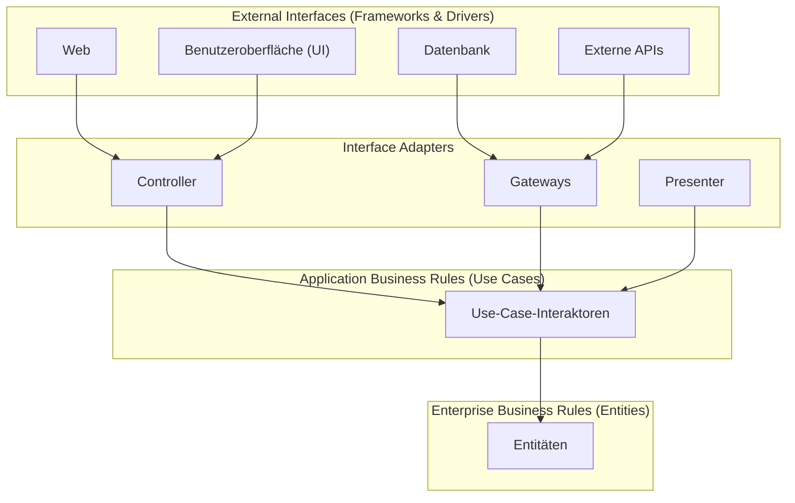
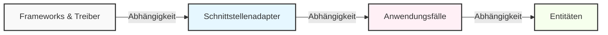
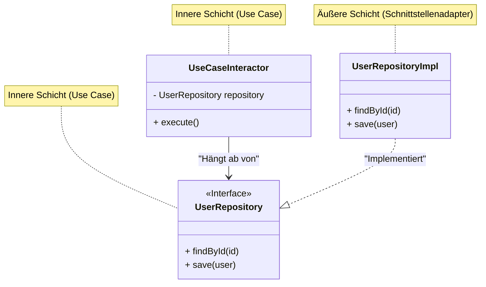

In der modernen Softwareentwicklung ist der Aufbau eines "veränderungsresistenten Systems" eine ständige Herausforderung. Änderungen der Geschäftsanforderungen, das Aufkommen neuer Frameworks, UI-Erneuerungen, Datenbankmigrationen. Für all diese Änderungen wird eine Architektur benötigt, die sich flexibel anpassen kann, ohne das gesamte System neu aufbauen zu müssen. Eine Antwort darauf ist die von Robert C. Martin (bekannt als Uncle Bob) vorgeschlagene **Clean Architecture**.

In diesem Artikel werden wir uns mit dem Wesen der Clean Architecture befassen, indem wir ihre Geschichte, ihren Zweck, die Details ihrer vier Schichten, die Abhängigkeitsregel und konkrete Implementierungsbeispiele betrachten. Wir werden eine sehr tiefe und detaillierte technische Erklärung liefern.

## 1. Probleme traditioneller Architekturen und die Geschichte der Clean Architecture

Historisch gesehen hat die Softwarearchitektur verschiedene Paradigmenwechsel erlebt. In frühen Systemen waren Geschäftslogik, UI und Datenzugriffscode eng miteinander gekoppelt (sogenannter Spaghetti-Code). Später, mit dem Ziel der Trennung von Anliegen (Separation of Concerns), wurde die 3-Schichten-Architektur (Präsentationsschicht, Geschäftslogikschicht, Datenzugriffsschicht) populär.

Die traditionelle 3-Schichten-Architektur hatte jedoch ein großes Problem: "**Die Domäne (Geschäftslogik) wird von der Datenbank und dem Framework abhängig.**"

Wenn beispielsweise die Geschäftslogikschicht die Datenzugriffsschicht (wie einen ORM) direkt aufruft, wirken sich Änderungen am Datenbankschema oder am ORM auf die Geschäftslogik aus. Das heißt, es entstand der Widerspruch, dass die "Geschäftsregeln", die am wichtigsten sind und nicht geändert werden sollten, von der "Infrastruktur" abhängig wurden, in der technische Änderungen am wahrscheinlichsten auftreten.

Als Lösung dafür wurden Architekturen wie die folgenden konzipiert:

*   **Hexagonale Architektur (Ports and Adapters)** - Alistair Cockburn
*   **Zwiebelarchitektur (Onion Architecture)** - Jeffrey Palermo
*   **DCI (Data, Context and Interaction)** - James Coplien, Trygve Reenskaug
*   **BCE (Boundary-Control-Entity)** - Ivar Jacobson

Alle diese Architekturen haben dasselbe Ziel: die "**Trennung von Anliegen (Separation of Concerns)**". Es geht darum, die Software in Schichten zu unterteilen, eine Umgebung zu schaffen, in der jede unabhängig testbar ist, und einen Zustand zu erreichen, in dem sie unabhängig von externen Agenten (UI, DB, Frameworks) ist.

Robert C. Martin integrierte diese hervorragenden architektonischen Konzepte, fasste sie zu einer einzigen praktischen Regel zusammen und nannte sie "**Clean Architecture**".

## 2. Zweck und Merkmale der Clean Architecture

Ein System, das die Clean Architecture übernimmt, weist die folgenden Merkmale auf:

1.  **Unabhängig von Frameworks (Independent of Frameworks)**: Die Architektur hängt nicht von der Existenz von funktionsreichen Softwarebibliotheken ab. Dadurch können Frameworks als "Werkzeuge" verwendet werden, ohne das System in die Einschränkungen des Frameworks zwingen zu müssen.
2.  **Testbar (Testable)**: Die Geschäftsregeln können ohne die UI, Datenbank, den Webserver oder andere externe Elemente getestet werden.
3.  **Unabhängig von der UI (Independent of UI)**: Die UI kann leicht geändert werden, ohne den Rest des Systems zu ändern. Beispielsweise kann eine Web-UI durch eine Konsolen-UI ersetzt werden, ohne die Geschäftsregeln zu ändern.
4.  **Unabhängig von der Datenbank (Independent of Database)**: Oracle oder SQL Server können gegen Mongo, BigTable, CouchDB usw. ausgetauscht werden. Geschäftsregeln sind nicht an die Datenbank gebunden.
5.  **Unabhängig von externen Agenten (Independent of any external agency)**: Tatsächlich wissen die Geschäftsregeln überhaupt nichts über die Außenwelt.

## 3. Die 4 Schichten (Layers) der Clean Architecture

Die Clean Architecture wird typischerweise durch konzentrische Kreise dargestellt. Je näher man dem Zentrum kommt, desto mehr repräsentiert die Software Richtlinien auf höherer Ebene (hochabstrakte Geschäftsregeln). Je weiter man nach außen geht, desto mehr wird sie zu Mechanismen (konkreten Details).



### 3.1. Entitäten (Entities)
Entitäten kapseln die unternehmensweiten Geschäftsregeln (Enterprise Business Rules). Eine Entität kann ein Objekt mit Methoden sein oder eine Menge von Datenstrukturen und Funktionen. Es sind die allgemeinsten und auf höchster Ebene angesiedelten Regeln, die von mehreren verschiedenen Anwendungen im Unternehmen wiederverwendet werden können.
Selbst wenn Sie nur eine einzige Anwendung erstellen, sind die Entitäten die Geschäftsobjekte dieser Anwendung. Entitäten sind von externen Änderungen (wie Änderungen in der Seitennavigation oder bei der Sicherheit) absolut nicht betroffen.

### 3.2. Anwendungsfälle (Use Cases)
Die Use-Case-Schicht enthält anwendungsspezifische Geschäftsregeln (Application Business Rules). Hier werden alle Anwendungsfälle des Systems gekapselt und implementiert. Use Cases orchestrieren den Datenfluss zu und von den Entitäten und weisen diese an, ihre Geschäftsregeln anzuwenden, um die Ziele des Anwendungsfalls zu erreichen.
Änderungen in dieser Schicht dürfen sich nicht auf die Entitäten auswirken. Ebenso wenig dürfen externe Änderungen an der Datenbank, der UI oder den Frameworks diese Schicht beeinflussen. Die Use Cases sind vollständig von diesen Belangen isoliert.

### 3.3. Schnittstellenadapter (Interface Adapters)
Die Schicht der Schnittstellenadapter ist eine Sammlung von Adaptern, die Daten von einem Format, das für die Use Cases und Entitäten bequem ist, in ein Format umwandeln, das für externe Agenten wie Datenbanken oder das Web am besten geeignet ist.
Zum Beispiel gehören die Elemente der MVC (Model-View-Controller) Architektur einer GUI für das Web hierher. Der Controller nimmt die Eingaben des Benutzers entgegen, reicht sie an den Use Case weiter, und der Presenter nimmt die Ausgabe des Use Cases entgegen und formatiert sie für die Ansicht (UI).
Es ist auch die Aufgabe dieser Schicht, Daten in ein Format zu konvertieren, das die Datenbank (wie SQL) versteht. Code, der weiter innen als diese Schicht liegt, sollte überhaupt nichts über die Datenbank wissen.

### 3.4. Frameworks und Treiber (Frameworks & Drivers)
Die äußerste Schicht besteht aus Werkzeugen wie Datenbanken und Web-Frameworks. Hier wird in der Regel wenig Code geschrieben, abgesehen von "Verbindungscode" (Glue-Code), um mit den inneren Kreisen zu kommunizieren.
In dieser Schicht werden alle Details aufbewahrt. Das Web ist ein Detail. Die Datenbank ist ein Detail. Um den Schaden so gering wie möglich zu halten, platzieren wir diese Details auf der Außenseite.

## 4. Die Abhängigkeitsregel (The Dependency Rule)

Es gibt eine wichtigste Regel, die niemals gebrochen werden darf, damit die Clean Architecture funktioniert. Dies ist die "**Abhängigkeitsregel (The Dependency Rule)**".

> Quellcode-Abhängigkeiten dürfen nur nach innen (auf Richtlinien höherer Ebene) gerichtet sein.

Code in den inneren Kreisen darf absolut nichts über Code in den äußeren Kreisen wissen. Namen (Funktionen, Klassen, Variablen usw.), die in einem äußeren Kreis deklariert sind, dürfen von Code in einem inneren Kreis nicht erwähnt werden.
Ebenso dürfen Datenformate, die in einem äußeren Kreis verwendet werden, nicht in einem inneren Kreis verwendet werden. Dies gilt insbesondere, wenn diese Formate durch ein Framework im äußeren Kreis generiert werden.



Mathematisch ausgedrückt: Wenn wir den Schichtindex als $L_i$ bezeichnen und $i=0$ als Entität (innerste Schicht) sowie $i=3$ als Framework (äußerste Schicht) definieren, dann muss für jede bestehende Abhängigkeit von einer Schicht $L_m$ zu $L_n$ immer die folgende Ungleichung gelten:

$$ m > n $$

Das heißt, der Vektor der Abhängigkeit $\vec{D}$ zeigt immer zum Zentrum.

## 5. Grenzen überschreiten: Das Dependency Inversion Principle (DIP)

Wenn man versucht, die Abhängigkeitsregel einzuhalten, stößt man sofort auf ein großes Problem: "**Was tun, wenn der Use Case Daten aus der Datenbank abrufen muss?**"

Wenn die Use-Case-Schicht (innen) direkt die Schnittstellenadapter-Schicht (die äußere Implementierung des Repositories) aufruft, würde die Abhängigkeit nach außen zeigen, was eine Verletzung der Abhängigkeitsregel wäre.

Die Lösung für dieses Problem ist das "D" aus den SOLID-Prinzipien (Dependency Inversion Principle: Prinzip der Abhängigkeitsumkehr).

### Definition des Dependency Inversion Principle (DIP)
1. High-Level-Module sollten nicht von Low-Level-Modulen abhängen. Beide sollten von Abstraktionen abhängen.
2. Abstraktionen sollten nicht von Details abhängen. Details sollten von Abstraktionen abhängen.

Um dies zu erreichen, definieren wir eine **Schnittstelle (Abstraktion)** in der Use-Case-Schicht und **implementieren** diese Schnittstelle in der äußeren Schicht (Schnittstellenadapter). Die Use-Case-Schicht hängt nur von der selbst definierten Schnittstelle ab und nicht von konkreten Implementierungen auf der Außenseite.



Im obigen Diagramm verläuft der Kontrollfluss (Control Flow) zur Laufzeit von `UseCaseInteractor` $\rightarrow$ `UserRepositoryImpl`. Die Quellcode-Abhängigkeit (Source Code Dependency) verläuft jedoch von `UserRepositoryImpl` $\rightarrow$ `UserRepository` (nach innen). Durch den Einsatz von Polymorphismus konnte die Quellcode-Abhängigkeit entgegen dem Kontrollfluss ausgerichtet werden. Das ist der Grund, warum es als "**Umkehrung** der Abhängigkeit" bezeichnet wird.

## 6. Konkretes Implementierungsbeispiel mit TypeScript

Hier zeigen wir ein einfaches Implementierungsbeispiel (Benutzerregistrierungsfunktion) der Clean Architecture unter Verwendung von TypeScript.

### 6.1. Entitäten (Entities)

Dies sind die zentralsten Geschäftsregeln.

```typescript
// src/domain/entities/User.ts
export class User {
    constructor(
        public readonly id: string,
        public readonly name: string,
        public readonly email: string,
        public readonly createdAt: Date
    ) {}

    // Entitätsspezifische Geschäftsregeln (z.B. Überprüfung der Namenslänge usw.)
    public isValid(): boolean {
        return this.name.length >= 3 && this.email.includes('@');
    }
}
```

### 6.2. Anwendungsfälle (Use Cases)

In der Use-Case-Schicht definieren wir die Datenstrukturen für Eingabe und Ausgabe (DTOs) sowie die Repository-Schnittstelle, um die Abhängigkeit umzukehren.

```typescript
// src/application/repositories/UserRepository.ts
import { User } from '../../domain/entities/User';

// Schnittstelle, die von der Use-Case-Schicht definiert wird
export interface UserRepository {
    findByEmail(email: string): Promise<User | null>;
    save(user: User): Promise<void>;
}

// src/application/usecases/RegisterUser/RegisterUserDTO.ts
export interface RegisterUserInputDTO {
    name: string;
    email: string;
}

export interface RegisterUserOutputDTO {
    id: string;
    name: string;
    email: string;
    createdAt: Date;
}

// src/application/usecases/RegisterUser/RegisterUserUseCase.ts
import { User } from '../../domain/entities/User';
import { UserRepository } from '../../repositories/UserRepository';
import { RegisterUserInputDTO, RegisterUserOutputDTO } from './RegisterUserDTO';

export class RegisterUserUseCase {
    // Hängt von der Abstraktion (Schnittstelle) ab. Nicht von der konkreten Implementierung.
    constructor(private readonly userRepository: UserRepository) {}

    public async execute(input: RegisterUserInputDTO): Promise<RegisterUserOutputDTO> {
        const existingUser = await this.userRepository.findByEmail(input.email);
        if (existingUser) {
            throw new Error('User already exists');
        }

        const newUser = new User(
            crypto.randomUUID(),
            input.name,
            input.email,
            new Date()
        );

        if (!newUser.isValid()) {
            throw new Error('Invalid user data');
        }

        // Ruft den Speichervorgang in der äußeren Datenbank auf, aber die Abhängigkeit zeigt nach innen (zur Schnittstelle)
        await this.userRepository.save(newUser);

        return {
            id: newUser.id,
            name: newUser.name,
            email: newUser.email,
            createdAt: newUser.createdAt
        };
    }
}
```

### 6.3. Schnittstellenadapter (Interface Adapters)

Wir erstellen die konkrete Zugriffsbearbeitung für die Datenbank (Repository-Implementierung) und den Controller zur Verarbeitung von HTTP-Anfragen.

```typescript
// src/adapters/repositories/PostgresUserRepository.ts
import { UserRepository } from '../../application/repositories/UserRepository';
import { User } from '../../domain/entities/User';
// Nimmt einen DB-Client als äußere Schicht (Treiber) an
import { DatabaseClient } from '../../infrastructure/database/DatabaseClient';

export class PostgresUserRepository implements UserRepository {
    constructor(private readonly dbClient: DatabaseClient) {}

    public async findByEmail(email: string): Promise<User | null> {
        const record = await this.dbClient.query('SELECT * FROM users WHERE email = $1', [email]);
        if (!record) return null;
        return new User(record.id, record.name, record.email, record.created_at);
    }

    public async save(user: User): Promise<void> {
        await this.dbClient.query(
            'INSERT INTO users (id, name, email, created_at) VALUES ($1, $2, $3, $4)',
            [user.id, user.name, user.email, user.createdAt]
        );
    }
}

// src/adapters/controllers/UserController.ts
import { RegisterUserUseCase } from '../../application/usecases/RegisterUser/RegisterUserUseCase';

export class UserController {
    constructor(private readonly registerUserUseCase: RegisterUserUseCase) {}

    public async register(req: any, res: any): Promise<void> {
        try {
            const input = {
                name: req.body.name,
                email: req.body.email
            };
            const output = await this.registerUserUseCase.execute(input);
            res.status(201).json(output);
        } catch (error: any) {
            res.status(400).json({ message: error.message });
        }
    }
}
```

### 6.4. Hauptkomponente (Dependency Injection: DI)

Beim Starten der Anwendung werden alle Abhängigkeiten konstruiert (Wiring). Dies wird als Composition Root bezeichnet.

```typescript
// src/infrastructure/web/server.ts
import express from 'express';
import { DatabaseClient } from '../database/DatabaseClient';
import { PostgresUserRepository } from '../../adapters/repositories/PostgresUserRepository';
import { RegisterUserUseCase } from '../../application/usecases/RegisterUser/RegisterUserUseCase';
import { UserController } from '../../adapters/controllers/UserController';

const app = express();
app.use(express.json());

// 1. Initialisierung des Treibers
const dbClient = new DatabaseClient(/* Verbindungsinformationen */);

// 2. Initialisierung des Adapters (Instanziierung konkreter Klassen)
const userRepository = new PostgresUserRepository(dbClient);

// 3. Initialisierung des Use Cases (Injektion des Konkreten in die Schnittstelle = DI)
const registerUserUseCase = new RegisterUserUseCase(userRepository);

// 4. Initialisierung des Controllers
const userController = new UserController(registerUserUseCase);

// Routing
app.post('/users', (req, res) => userController.register(req, res));

app.listen(3000, () => {
    console.log('Server is running on port 3000');
});
```

Auf diese Weise übernimmt das äußerste "Startskript" die schmutzigen Details (Instanziierung konkreter Klassen) und übergibt den inneren Schichten nur saubere Schnittstellen. Diese Struktur stellt sicher, dass die Geschäftslogik vollständig von der Außenwelt isoliert ist.

## 7. Mathematische Betrachtung von Kopplung (Coupling) und Kohäsion (Cohesion)

Im Software-Engineering dienen **Kopplung (Coupling)** und **Kohäsion (Cohesion)** als Metriken zur Bewertung der Qualität einer Architektur.

Die Kopplung $C$ stellt die Stärke der Abhängigkeiten zwischen Modulen dar. Wenn Modul $A$ von Modul $B$ abhängt, die Gesamtzahl der Abhängigkeiten im System $N_{dep}$ ist und die Anzahl der Module $N_{mod}$ ist, kann einer der Indikatoren für die Komplexität wie folgt ausgedrückt werden:

$$ Complexity \propto \frac{N_{dep}}{N_{mod}} $$

In der Clean Architecture lenkt die Anwendung des DIP die physikalischen Abhängigkeitspfeile hin zu Abstraktionen. Die Änderungshäufigkeit (Instabilität: $I$) der Abstraktionen (Schnittstellen) ist so konzipiert, dass sie sehr gering ist.

Die Instabilität $I$ wird mit der folgenden Formel berechnet (definiert von Robert C. Martin):
*   $C_e$ (Efferent Coupling): Ausgehende Kopplung (Anzahl der Dinge, von denen ich abhänge)
*   $C_a$ (Afferent Coupling): Eingehende Kopplung (Anzahl der Dinge, die von mir abhängen)

$$ I = \frac{C_e}{C_e + C_a} $$

*   Wenn $I = 0$, ist die Komponente völlig stabil (sie hängt von nichts ab und wird von anderen als Abhängigkeit genutzt).
*   Wenn $I = 1$, ist die Komponente völlig instabil (niemand hängt von ihr ab, aber sie hängt von anderen ab).

Die "Entitätsschicht" der Clean Architecture hat $C_e = 0$ (keine Abhängigkeit nach außen), also ist $I = 0$. Das bedeutet, es ist die stabilste Schicht.
Umgekehrt haben die "UI-Schicht" und die "DB-Schicht" $C_a \approx 0$ und $C_e > 0$, also ist $I \approx 1$, was sie zu leicht veränderbaren Schichten (instabilen Schichten) macht.

Ein wichtiges architektonisches Prinzip, das SDP (Stable Dependencies Principle), besagt: "**Abhängigkeiten müssen in Richtung stabilerer Komponenten zeigen (Komponenten mit einem kleineren $I$)**". Die konzentrischen Kreise der Clean Architecture visualisieren genau dieses SDP und sind so gestaltet, dass die Abhängigkeiten von außen ($I=1$) nach innen ($I=0$) weisen.

## 8. Teststrategie und Clean Architecture

Einer der größten Vorteile der Clean Architecture ist ihre **Testbarkeit**. Da die Schichten getrennt sind, können Tests für jede Schicht unabhängig geschrieben werden.

### 8.1. Testen von Entitäten (Unit Test)
Da es sich um reine Logik ohne externe Abhängigkeiten handelt, werden weder eine DB noch Mocks benötigt. Es sind zuverlässige Tests, die extrem schnell ausgeführt werden können.

### 8.2. Testen von Use Cases (Unit Test with Mocks)
Da alle externen Abhängigkeiten wie Repositories als Schnittstellen definiert sind, müssen Sie beim Testen lediglich **Test-Mocks oder In-Memory-Implementierungen (Fakes)** injizieren (DI). Es ist nicht erforderlich, eine echte Datenbank zu starten. Dies ermöglicht ein schnelles Testen komplexer Verzweigungen und Ausnahmen in der Geschäftslogik.

```typescript
// Beispiel für einen Use-Case-Test (unter Annahme von Jest)
test('Es sollte ein Fehler auftreten, wenn versucht wird, sich mit einer bestehenden E-Mail-Adresse zu registrieren', async () => {
    // Erstellung eines Fake-Repositories
    const mockRepo: UserRepository = {
        findByEmail: async (email) => new User('1', 'Test', email, new Date()), // Gibt einen bestehenden Benutzer zurück
        save: async (user) => {}
    };

    const useCase = new RegisterUserUseCase(mockRepo);
    
    // Ausführung des Use Cases und Fehler-Assertion
    await expect(useCase.execute({ name: 'Bob', email: 'test@example.com' }))
        .rejects
        .toThrow('User already exists');
});
```

### 8.3. Testen von Adaptern (Integration Test)
Die Implementierungsklasse des Repositories stellt eine tatsächliche Verbindung zur Datenbank her, um zu testen, ob das SQL korrekt ist. Der Test für den Controller überprüft den Teil, der eine HTTP-Anfrage empfängt und JSON zurückgibt. Hier wird keine detaillierte Überprüfung der Geschäftslogik durchgeführt; es wird nur bestätigt, dass die "Konvertierung" und die "Kommunikation" korrekt sind.

## 9. Nachteile der Clean Architecture und wann man sie übernehmen sollte

Obwohl die Clean Architecture allmächtig erscheint, ist sie keine Silberkugel. Die folgenden Nachteile (Kompromisse) existieren:

1.  **Erhöhte anfängliche Lern- und Entwicklungskosten**: Die Anzahl der Dateien und Schnittstellen (Abstraktionen) steigt signifikant an. Es gibt viel "Boilerplate-Code" (Standardcode) wie z.B. das Umpacken von DTOs.
2.  **Overkill für kleine Projekte**: Für einen Prototyp, der in wenigen Tagen erstellt wird, oder ein einmaliges Werkzeug, bei dem kaum Änderungen zu erwarten sind, ist die Übernahme dieser Architektur oft mit unnötigen Kosten verbunden. Auch für einfache APIs, die nur CRUD-Operationen ausführen, ist sie ungeeignet.

**Wann man sie übernehmen sollte**:
*   Produkte, die voraussichtlich über einen langen Zeitraum (mehrere Jahre oder länger) gewartet und betrieben werden.
*   Systeme, in denen die Geschäftsregeln komplex sind und sich Spezifikationen häufig ändern.
*   Wenn eine Arbeitsteilung (Frontend, Backend, Infrastruktur usw.) in einem großen Entwicklungsteam gefördert werden soll.
*   Wenn komplexe Geschäftsbereiche in Kombination mit Domain-Driven Design (DDD) modelliert werden sollen.

## 10. Fazit

Die Clean Architecture ist eine Designphilosophie, die den Kern des Systems, nämlich die "Geschäftsregeln", vor den "Details" wie der UI, Datenbanken und Frameworks schützt.

Ihr Kern besteht aus der **Abhängigkeitsregel** und dem **Dependency Inversion Principle (DIP)**. Durch deren korrekte Anwendung wird die Software flexibel gegenüber Änderungen, einfacher zu testen und kann ihren Wert über einen langen Zeitraum erhalten.

Wichtig ist nicht, die Verzeichnisstruktur der Clean Architecture blind zu imitieren, sondern das Wesentliche zu verstehen – "**warum es so aufgeteilt ist**" und "**wohin die Abhängigkeitspfeile zeigen**" – und sie entsprechend der Größe und Komplexität des eigenen Projekts angemessen anzuwenden.

---
*Referenz: "Clean Architecture: A Craftsman's Guide to Software Structure and Design" von Robert C. Martin*
