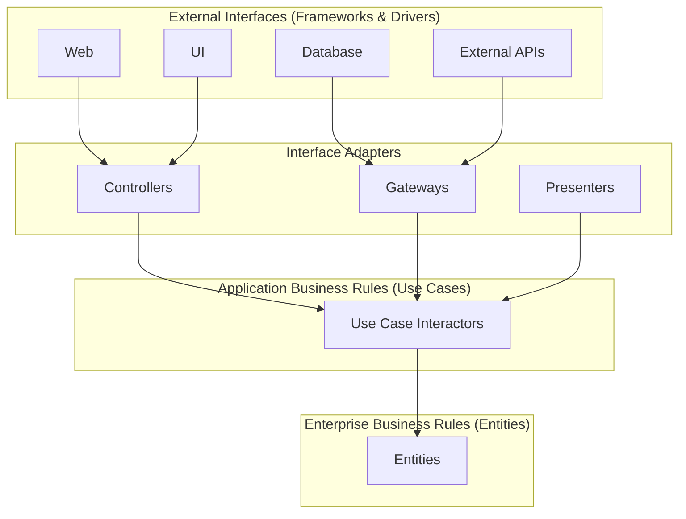
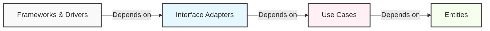
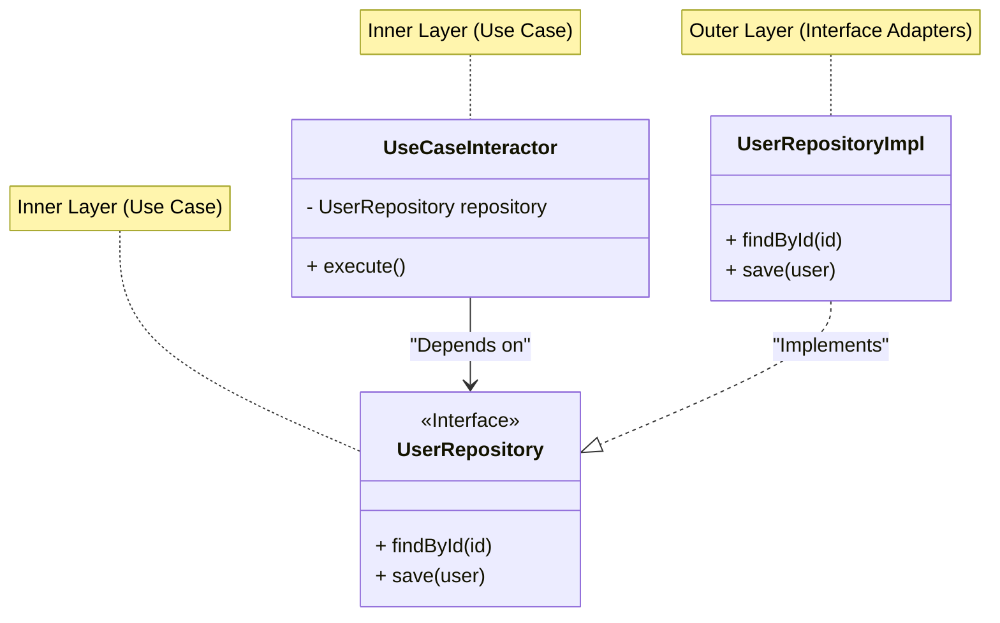

In modern software development, building a "resilient system" against change is a permanent challenge. Changes in business requirements, the rise of new frameworks, UI revamps, database migrations. For all these changes, an architecture that can flexibly adapt without rebuilding the entire system is required. One answer to this is **Clean Architecture**, advocated by Robert C. Martin (commonly known as Uncle Bob).

In this article, we will delve into the essence of Clean Architecture through its history, purpose, details of the 4 layers, the Dependency Rule, and specific implementation examples. We will provide a very deep and detailed technical explanation.

## 1. Problems with Traditional Architectures and the History of Clean Architecture

Historically, software architecture has experienced various paradigm shifts. In early systems, business logic, UI, and data access code were tightly coupled (so-called spaghetti code). Later, to achieve the Separation of Concerns, 3-tier architecture (presentation layer, business logic layer, data access layer) became popular.

However, the traditional 3-tier architecture had a major problem. That is, "**the domain (business logic) depends on the database and frameworks**".

For example, when the business logic layer directly calls the data access layer (like ORM), changes to the database schema or ORM propagate to the business logic. In other words, a contradiction arose where the "business rules", which are the most important and should not be changed, depended on the "infrastructure", where technical changes are most likely to occur.

As solutions to this, architectures like the following have been devised:

*   **Hexagonal Architecture (Ports and Adapters)** - Alistair Cockburn
*   **Onion Architecture** - Jeffrey Palermo
*   **DCI (Data, Context and Interaction)** - James Coplien, Trygve Reenskaug
*   **BCE (Boundary-Control-Entity)** - Ivar Jacobson

All these architectures have the same objective. That is the "**Separation of Concerns**". It is to divide the software into layers, making each independently testable and independent of external agents (UI, DB, frameworks).

Robert C. Martin integrated the concepts of these excellent architectures and summarized them into a single, practical rule, naming it "**Clean Architecture**".

## 2. Objectives and Characteristics of Clean Architecture

Systems that adopt Clean Architecture have the following characteristics:

1.  **Independent of Frameworks**: The architecture does not depend on the existence of some library of feature-laden software. This allows you to use frameworks as "tools", rather than having to cram your system into their limited constraints.
2.  **Testable**: The business rules can be tested without the UI, database, web server, or any other external element.
3.  **Independent of UI**: The UI can change easily, without changing the rest of the system. For example, a Web UI could be replaced with a console UI without changing the business rules.
4.  **Independent of Database**: You can swap out Oracle or SQL Server for Mongo, BigTable, CouchDB, or something else. Your business rules are not bound to the database.
5.  **Independent of any external agency**: In fact, your business rules simply don't know anything at all about the outside world.

## 3. The 4 Layers of Clean Architecture

Clean Architecture is generally represented by concentric circles. The closer to the center, the more the software becomes higher-level policies (highly abstract business rules). The further outwards, the more it becomes mechanisms (concrete details).



### 3.1. Entities
Entities encapsulate Enterprise wide business rules. An entity can be an object with methods, or it can be a set of data structures and functions. It doesn't matter so long as the entities could be used by many different applications in the enterprise. They are the most general and high-level rules.
If you don't have an enterprise, and are just writing a single application, then these entities are the business objects of the application. They are the least likely to change when something external changes. For example, you would not expect these objects to be affected by a change to page navigation or security.

### 3.2. Use Cases
The Use Case layer contains Application Business Rules. It encapsulates and implements all of the use cases of the system. Use cases orchestrate the flow of data to and from the entities, and direct those entities to use their enterprise wide business rules to achieve the goals of the use case.
We do not expect changes in this layer to affect the entities. We also do not expect this layer to be affected by changes to externalities such as the database, the UI, or any of the common frameworks. The use cases are completely isolated from such concerns.

### 3.3. Interface Adapters
The Interface Adapters layer is a set of adapters that convert data from the format most convenient for the use cases and entities, to the format most convenient for some external agency such as the database or the web.
For example, it is this layer that will wholly contain the MVC (Model-View-Controller) architecture of a GUI. The presenters, views, and controllers all belong in here. The models are likely just data structures that are passed from the controllers to the use cases, and then back from the use cases to the presenters and views.
Similarly, data is converted, in this layer, from the form most convenient for entities and use cases, into the form most convenient for whatever persistence framework is being used. No code inward of this circle should know anything at all about the database.

### 3.4. Frameworks & Drivers
The outermost layer is generally composed of frameworks and tools such as the database, the web framework, etc. Generally you don't write much code in this layer other than glue code that communicates to the next circle inwards.
This layer is where all the details go. The web is a detail. The database is a detail. We keep these things on the outside where they can do little harm.

## 4. The Dependency Rule

There is a overriding rule that makes Clean Architecture work, which must never be broken. That is "**The Dependency Rule**".

> Source code dependencies must point only inward, toward higher-level policies.

Nothing in an inner circle can know anything at all about something in an outer circle. In particular, the name of something declared in an outer circle must not be mentioned by the code in an inner circle. That includes functions, classes, variables, or any other named software entity.
By the same token, data formats used in an outer circle should not be used by an inner circle, especially if those formats are generated by a framework in an outer circle. We don't want anything in an outer circle to impact the inner circles.



Expressed mathematically, if we define the layer index as $L_i$, where $i=0$ is Entities (innermost layer) and $i=3$ is Frameworks (outermost layer), when a dependency from layer $L_m$ to $L_n$ exists, the following inequality must always hold true:

$$ m > n $$

In other words, the dependency vector $\vec{D}$ always points towards the center.

## 5. Crossing Boundaries: Dependency Inversion Principle (DIP)

When trying to adhere to the Dependency Rule, you immediately face a major problem: "**What if the use case needs to fetch data from the database?**"

If the use case layer (inner) directly calls the interface adapter layer (the outer Repository implementation), the dependency points outward, violating the Dependency Rule.

What solves this problem is the "D" in the SOLID principles (Dependency Inversion Principle).

### Definition of the Dependency Inversion Principle (DIP)
1. High-level modules should not depend on low-level modules. Both should depend on abstractions.
2. Abstractions should not depend on details. Details should depend on abstractions.

To achieve this, we define an **interface (abstraction)** in the use case layer, and **implement** that interface in the outer layer (interface adapter). The use case layer depends only on the interface it defined, and does not depend on the concrete implementation in the outer layer.



In the diagram above, the runtime control flow is `UseCaseInteractor` $\rightarrow$ `UserRepositoryImpl`. However, the source code dependency is `UserRepositoryImpl` $\rightarrow$ `UserRepository` (inward). By utilizing polymorphism, we were able to point the source code dependency in the opposite direction of the control flow. This is the reason it is called the "**inversion**" of dependency.

## 6. Concrete Implementation Example in TypeScript

Here, we show a simple implementation example of Clean Architecture (user registration feature) using TypeScript.

### 6.1. Entities

This is the central business rule.

```typescript
// src/domain/entities/User.ts
export class User {
    constructor(
        public readonly id: string,
        public readonly name: string,
        public readonly email: string,
        public readonly createdAt: Date
    ) {}

    // Entity-specific business rules (e.g., name length check)
    public isValid(): boolean {
        return this.name.length >= 3 && this.email.includes('@');
    }
}
```

### 6.2. Use Cases

In the use case layer, we define the input and output data structures (DTOs) and the repository interface to invert dependencies.

```typescript
// src/application/repositories/UserRepository.ts
import { User } from '../../domain/entities/User';

// Interface defined by the use case layer
export interface UserRepository {
    findByEmail(email: string): Promise<User | null>;
    save(user: User): Promise<void>;
}

// src/application/usecases/RegisterUser/RegisterUserDTO.ts
export interface RegisterUserInputDTO {
    name: string;
    email: string;
}

export interface RegisterUserOutputDTO {
    id: string;
    name: string;
    email: string;
    createdAt: Date;
}

// src/application/usecases/RegisterUser/RegisterUserUseCase.ts
import { User } from '../../domain/entities/User';
import { UserRepository } from '../../repositories/UserRepository';
import { RegisterUserInputDTO, RegisterUserOutputDTO } from './RegisterUserDTO';

export class RegisterUserUseCase {
    // Depends on an abstraction (interface). Does not depend on a concrete implementation.
    constructor(private readonly userRepository: UserRepository) {}

    public async execute(input: RegisterUserInputDTO): Promise<RegisterUserOutputDTO> {
        const existingUser = await this.userRepository.findByEmail(input.email);
        if (existingUser) {
            throw new Error('User already exists');
        }

        const newUser = new User(
            crypto.randomUUID(),
            input.name,
            input.email,
            new Date()
        );

        if (!newUser.isValid()) {
            throw new Error('Invalid user data');
        }

        // Calls the outer DB save process, but the dependency points inward (to the interface)
        await this.userRepository.save(newUser);

        return {
            id: newUser.id,
            name: newUser.name,
            email: newUser.email,
            createdAt: newUser.createdAt
        };
    }
}
```

### 6.3. Interface Adapters

We create the concrete access process to the database (Repository implementation) and the Controller that processes HTTP requests.

```typescript
// src/adapters/repositories/PostgresUserRepository.ts
import { UserRepository } from '../../application/repositories/UserRepository';
import { User } from '../../domain/entities/User';
// Assumes a DB client which is an outer layer (Driver)
import { DatabaseClient } from '../../infrastructure/database/DatabaseClient';

export class PostgresUserRepository implements UserRepository {
    constructor(private readonly dbClient: DatabaseClient) {}

    public async findByEmail(email: string): Promise<User | null> {
        const record = await this.dbClient.query('SELECT * FROM users WHERE email = $1', [email]);
        if (!record) return null;
        return new User(record.id, record.name, record.email, record.created_at);
    }

    public async save(user: User): Promise<void> {
        await this.dbClient.query(
            'INSERT INTO users (id, name, email, created_at) VALUES ($1, $2, $3, $4)',
            [user.id, user.name, user.email, user.createdAt]
        );
    }
}

// src/adapters/controllers/UserController.ts
import { RegisterUserUseCase } from '../../application/usecases/RegisterUser/RegisterUserUseCase';

export class UserController {
    constructor(private readonly registerUserUseCase: RegisterUserUseCase) {}

    public async register(req: any, res: any): Promise<void> {
        try {
            const input = {
                name: req.body.name,
                email: req.body.email
            };
            const output = await this.registerUserUseCase.execute(input);
            res.status(201).json(output);
        } catch (error: any) {
            res.status(400).json({ message: error.message });
        }
    }
}
```

### 6.4. Main Component (Dependency Injection: DI)

At application startup, we build (wire) all dependencies. This is called the Composition Root.

```typescript
// src/infrastructure/web/server.ts
import express from 'express';
import { DatabaseClient } from '../database/DatabaseClient';
import { PostgresUserRepository } from '../../adapters/repositories/PostgresUserRepository';
import { RegisterUserUseCase } from '../../application/usecases/RegisterUser/RegisterUserUseCase';
import { UserController } from '../../adapters/controllers/UserController';

const app = express();
app.use(express.json());

// 1. Initialize driver
const dbClient = new DatabaseClient(/* connection details */);

// 2. Initialize adapter (instantiate concrete class)
const userRepository = new PostgresUserRepository(dbClient);

// 3. Initialize use case (inject concrete class into interface = DI)
const registerUserUseCase = new RegisterUserUseCase(userRepository);

// 4. Initialize controller
const userController = new UserController(registerUserUseCase);

// Routing
app.post('/users', (req, res) => userController.register(req, res));

app.listen(3000, () => {
    console.log('Server is running on port 3000');
});
```

In this way, by making the outermost "startup script" take on the dirty details (instantiating concrete classes) and passing only clean interfaces to the inner layers, the business logic is completely isolated from the outside world.

## 7. Mathematical Considerations of Coupling and Cohesion

In software engineering, **Coupling** and **Cohesion** are metrics used to evaluate the quality of architecture.

Coupling $C$ represents the strength of dependencies between modules. If Module $A$ depends on Module $B$, assuming the total number of dependencies in the system is $N_{dep}$ and the number of modules is $N_{mod}$, one of the metrics indicating complexity can be expressed as follows:

$$ Complexity \propto \frac{N_{dep}}{N_{mod}} $$

In Clean Architecture, applying DIP makes the physical dependency arrows point towards abstractions. The frequency of change of abstractions (interfaces), known as Instability ($I$), is designed to be very low.

Instability $I$ is calculated by the following formula (defined by Robert C. Martin):
*   $C_e$ (Efferent Coupling): Outward coupling (number of things you depend on)
*   $C_a$ (Afferent Coupling): Inward coupling (number of things depending on you)

$$ I = \frac{C_e}{C_e + C_a} $$

*   When $I = 0$, the component is completely stable (depends on nothing, but is depended upon by others).
*   When $I = 1$, the component is completely unstable (is not depended upon, but depends on others).

The "Entities layer" in Clean Architecture has $C_e = 0$ (does not depend outward), so $I = 0$. That is, it is the most stable layer.
Conversely, layers like "UI" or "DB" have $C_a \approx 0$ and $C_e > 0$, so $I \approx 1$, making them easily changeable (unstable) layers.

An important architectural principle, SDP (Stable Dependencies Principle), states that "**dependencies must point in the direction of stability (components with smaller $I$)**". The concentric circles of Clean Architecture are exactly a visualization of this SDP, designed so that dependencies flow from the outside ($I=1$) to the inside ($I=0$).

## 8. Testing Strategy and Clean Architecture

One of the greatest benefits of Clean Architecture is **ease of testing**. Because the layers are separated, you can write tests tailored to each layer independently.

### 8.1. Testing Entities (Unit Test)
Because they contain pure logic with absolutely no external dependencies, neither a DB nor mocks are needed. They provide the most reliable tests that can be executed fastest.

### 8.2. Testing Use Cases (Unit Test with Mocks)
Since all external dependencies such as repositories are defined as interfaces, you simply need to inject (DI) **mocks or in-memory implementations (Fakes)** during testing. There is no need to spin up an actual database. This allows you to rapidly test complex branches and exception handling in the business logic.

```typescript
// Example of Use Case testing (assuming Jest)
test('should throw an error when trying to register with an existing email', async () => {
    // Create a Fake repository
    const mockRepo: UserRepository = {
        findByEmail: async (email) => new User('1', 'Test', email, new Date()), // Returns an existing user
        save: async (user) => {}
    };

    const useCase = new RegisterUserUseCase(mockRepo);
    
    // Execute use case and assert error
    await expect(useCase.execute({ name: 'Bob', email: 'test@example.com' }))
        .rejects
        .toThrow('User already exists');
});
```

### 8.3. Testing Adapters (Integration Test)
The repository implementation classes actually connect to the database to test if the SQL is correct. Controller tests receive HTTP requests and test the part that returns JSON. Here, we do not verify the details of the business logic, but merely ensure that the "conversion" and "communication" are correct.

## 9. Disadvantages of Clean Architecture and When to Adopt It

Although Clean Architecture seems like a panacea, it is not a silver bullet. There are disadvantages (trade-offs) as follows:

1.  **Increase in initial learning cost and development cost**: The number of files and interfaces (abstractions) increases significantly. There is a lot of "boilerplate code" such as repacking DTOs.
2.  **Overkill for small projects**: For prototypes built in a few days or one-off tools where changes rarely occur, adopting this architecture often results in unnecessary costs. It is also unsuitable for simple APIs that only perform CRUD operations.

**When to adopt**:
*   Products expected to be maintained and operated over a long period (several years or more).
*   Systems with complex business rules where specification changes occur frequently.
*   When you want to divide labor in a large development team (frontend, backend, infrastructure, etc.).
*   When you want to model a complex business domain by combining it with Domain-Driven Design (DDD).

## 10. Summary

Clean Architecture is a design philosophy intended to protect the core of a system, the "business rules", from "details" such as UI, databases, and frameworks.

At its core are **The Dependency Rule** and the **Dependency Inversion Principle (DIP)**. By applying these correctly, software becomes resilient to change, easy to test, and can maintain its value over a long period.

What's important is not blindly imitating the directory structure of Clean Architecture, but understanding the essence of "**why we divide it this way**" and "**where the dependency arrows point**", and applying it appropriately according to the scale and complexity of your own project.

---
*Reference: "Clean Architecture: A Craftsman's Guide to Software Structure and Design" by Robert C. Martin*
