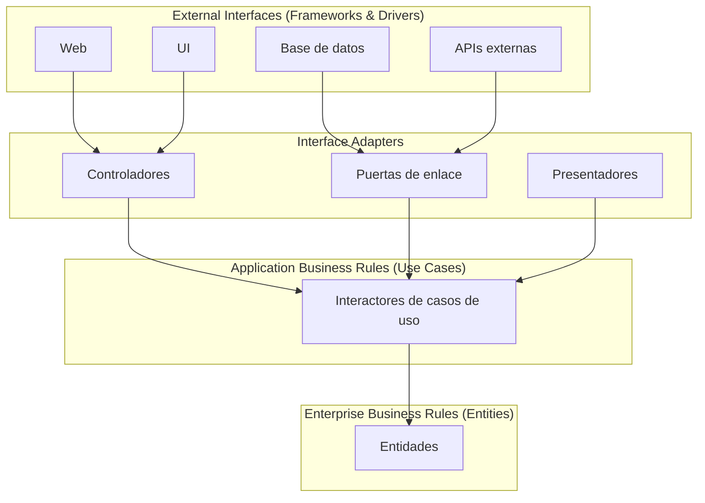
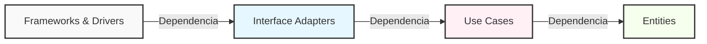
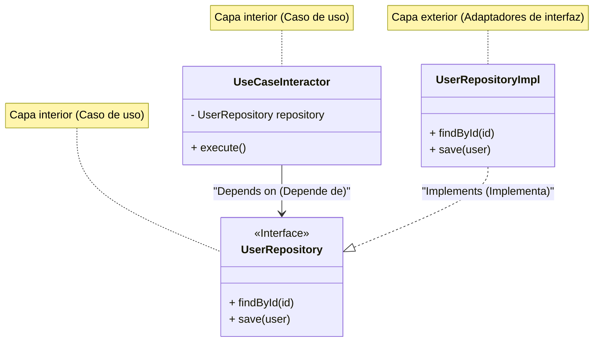

En el desarrollo de software moderno, construir un "sistema resistente al cambio" es un desafío eterno. Cambios en los requisitos comerciales, el surgimiento de nuevos frameworks, renovaciones de la interfaz de usuario (UI), migraciones de bases de datos. Frente a todos estos cambios, se requiere una arquitectura que pueda adaptarse de manera flexible sin tener que reconstruir todo el sistema. Una de las respuestas a esto es la **Arquitectura Limpia (Clean Architecture)**, propuesta por Robert C. Martin (comúnmente conocido como Uncle Bob).

En este artículo, profundizaremos en la esencia de Clean Architecture a través de su historia, propósito, detalles de sus 4 capas, la regla de dependencia y ejemplos de implementación específicos. Realizaremos una explicación técnica muy profunda y detallada.

## 1. Problemas con las arquitecturas tradicionales y la historia de Clean Architecture

Históricamente, la arquitectura de software ha experimentado varios cambios de paradigma. En los primeros sistemas, el código de la lógica de negocio, la UI y el acceso a datos estaban fuertemente acoplados (lo que se conoce como código espagueti). Posteriormente, con el propósito de la separación de preocupaciones (Separation of Concerns), se popularizó la arquitectura de 3 capas (capa de presentación, capa de lógica de negocio, capa de acceso a datos).

Sin embargo, la arquitectura tradicional de 3 capas tenía un gran problema. Este era que "**el dominio (lógica de negocio) terminaba dependiendo de la base de datos o el framework**".

Por ejemplo, si la capa de lógica de negocio llama directamente a la capa de acceso a datos (como un ORM), un cambio en el esquema de la base de datos o un cambio en el ORM afectará a la lógica de negocio. Es decir, se producía la contradicción de que las "reglas de negocio", que son las más importantes y no deberían cambiar, dependían de la "infraestructura", donde es más probable que ocurran cambios técnicos.

Como soluciones a esto, se han ideado arquitecturas como las siguientes:

*   **Arquitectura Hexagonal (Ports and Adapters)** - Alistair Cockburn
*   **Arquitectura Cebolla (Onion Architecture)** - Jeffrey Palermo
*   **DCI (Data, Context and Interaction)** - James Coplien, Trygve Reenskaug
*   **BCE (Boundary-Control-Entity)** - Ivar Jacobson

Todas estas arquitecturas tienen el mismo propósito. Ese es la "**separación de preocupaciones**". Dividir el software en capas, creando un estado donde cada una pueda ser probada de forma independiente y sea independiente de agentes externos (UI, base de datos, frameworks).

Robert C. Martin integró los conceptos de estas excelentes arquitecturas y las consolidó en una regla práctica única que llamó "**Clean Architecture**".

## 2. Propósito y características de Clean Architecture

Un sistema que adopta Clean Architecture tiene las siguientes características:

1.  **Independencia de frameworks (Independent of Frameworks)**: La arquitectura no depende de la existencia de bibliotecas de software ricas en funciones. Esto permite utilizar los frameworks como "herramientas" y elimina la necesidad de forzar el sistema en las restricciones del framework.
2.  **Testable (Testable)**: Las reglas de negocio se pueden probar sin la UI, la base de datos, el servidor web u otros elementos externos.
3.  **Independencia de la UI (Independent of UI)**: La UI puede cambiar fácilmente sin alterar el resto del sistema. Por ejemplo, una UI web puede ser reemplazada por una UI de consola sin cambiar las reglas de negocio.
4.  **Independencia de la base de datos (Independent of Database)**: Puede cambiar Oracle o SQL Server por Mongo, BigTable, CouchDB, etc. Las reglas de negocio no están atadas a la base de datos.
5.  **Independencia de cualquier agente externo (Independent of any external agency)**: De hecho, las reglas de negocio no saben nada sobre el mundo exterior.

## 3. Las 4 capas de Clean Architecture (Layers)

Clean Architecture se representa generalmente con un diagrama de círculos concéntricos. Cuanto más cerca del centro, el software se convierte en políticas de nivel superior (reglas de negocio con un alto nivel de abstracción). Cuanto más hacia el exterior, se convierte en mecanismos (detalles específicos).



### 3.1. Entidades (Entities)
Las entidades encapsulan las reglas de negocio a nivel empresarial (Enterprise Business Rules). Una entidad puede ser un objeto con métodos, o puede ser un conjunto de estructuras de datos y funciones. Son las reglas más generales y de alto nivel que se pueden reutilizar en múltiples aplicaciones diferentes dentro de la empresa.
Incluso si solo se está creando una única aplicación, las entidades son los objetos de negocio de esa aplicación. Incluso si hay cambios externos (como cambios en la navegación de la página o cambios en la seguridad), las entidades nunca se verán afectadas.

### 3.2. Casos de uso (Use Cases)
La capa de casos de uso contiene reglas de negocio específicas de la aplicación (Application Business Rules). Aquí se encapsulan e implementan todos los casos de uso del sistema. Los casos de uso coordinan el flujo de datos hacia y desde las entidades, e instruyen a las entidades a usar sus reglas de negocio para lograr los objetivos del caso de uso.
Los cambios en esta capa no deben afectar a las entidades. Además, los cambios externos como la base de datos, la UI o los frameworks no afectan a esta capa. Los casos de uso están completamente aislados de estas preocupaciones.

### 3.3. Adaptadores de interfaz (Interface Adapters)
La capa de adaptadores de interfaz es un conjunto de adaptadores que convierten los datos del formato más conveniente para los casos de uso y las entidades, al formato más conveniente para algún agente externo como la base de datos o la web.
Por ejemplo, los elementos de la arquitectura MVC (Modelo-Vista-Controlador) de una GUI en el mundo web pertenecen aquí. Los controladores toman la entrada del usuario, la pasan al caso de uso, y los presentadores toman la salida del caso de uso y la formatean para la vista (UI).
También es el rol de esta capa convertir los datos a un formato que la base de datos (como SQL) pueda entender. Ningún código dentro de esta capa debe saber nada sobre la base de datos.

### 3.4. Frameworks y controladores (Frameworks & Drivers)
La capa más externa está compuesta por herramientas como bases de datos, frameworks web, etc. Aquí, por lo general, no se escribe mucho código más que el "código pegamento (glue code)" para comunicarse con el círculo interior.
Esta capa contiene todos los detalles. La web es un detalle. La base de datos es un detalle. Mantenemos estas cosas en el exterior donde pueden hacer poco daño.

## 4. La regla de dependencia (The Dependency Rule)

Existe una regla muy importante y que absolutamente no se debe romper para que Clean Architecture funcione. Esa es "**La regla de dependencia (The Dependency Rule)**".

> Las dependencias del código fuente solo deben apuntar hacia adentro, hacia las políticas de nivel superior.

El código que pertenece a un círculo interior no debe saber nada sobre el código que pertenece a un círculo exterior. Ningún nombre declarado en un círculo exterior (funciones, clases, variables, etc.) debe ser mencionado por el código de un círculo interior.
De manera similar, los formatos de datos utilizados en un círculo exterior no deben ser utilizados en un círculo interior. Especialmente si ese formato es generado por un framework en un círculo exterior.



Expresado matemáticamente, si definimos el índice de la capa como $L_i$, con $i=0$ siendo las entidades (capa más interna) e $i=3$ siendo los frameworks (capa más externa), si existe una dependencia de una capa $L_m$ a $L_n$, siempre debe cumplirse la siguiente desigualdad:

$$ m > n $$

Es decir, el vector de dependencia $\vec{D}$ siempre apunta hacia el centro.

## 5. Cruzando fronteras: El principio de inversión de dependencias (DIP)

Al intentar adherirse a la regla de dependencia, uno se enfrenta rápidamente a un gran problema. "**¿Qué hacemos cuando el caso de uso necesita obtener datos de la base de datos?**"

Si la capa de casos de uso (interior) llama directamente a la capa de adaptadores de interfaz (la implementación del Repository en el exterior), la dependencia apuntará hacia el exterior, lo cual es una violación a la regla de dependencia.

Lo que resuelve este problema es la "D" de los principios SOLID (Dependency Inversion Principle: Principio de inversión de dependencias).

### Definición del Principio de inversión de dependencias (DIP)
1. Los módulos de alto nivel no deben depender de los módulos de bajo nivel. Ambos deben depender de abstracciones.
2. Las abstracciones no deben depender de los detalles. Los detalles deben depender de las abstracciones.

Para lograr esto, se define una **interfaz (abstracción)** en la capa de casos de uso, y la capa exterior (adaptadores de interfaz) **implementa** esa interfaz. La capa de casos de uso solo depende de la interfaz que definió ella misma, y no de la implementación específica externa.



En el diagrama anterior, el flujo de control en tiempo de ejecución (Control Flow) es `UseCaseInteractor` $\rightarrow$ `UserRepositoryImpl`. Sin embargo, la dependencia del código fuente (Source Code Dependency) es `UserRepositoryImpl` $\rightarrow$ `UserRepository` (hacia adentro). Al utilizar polimorfismo, pudimos dirigir la dependencia del código fuente en la dirección opuesta al flujo de control. Esta es la razón por la que se llama "**inversión**" de dependencias.

## 6. Ejemplo de implementación específica en TypeScript

Aquí mostraremos un ejemplo de implementación simple de Clean Architecture (función de registro de usuario) utilizando TypeScript.

### 6.1. Entidades (Entities)

Son las reglas de negocio más centrales.

```typescript
// src/domain/entities/User.ts
export class User {
    constructor(
        public readonly id: string,
        public readonly name: string,
        public readonly email: string,
        public readonly createdAt: Date
    ) {}

    // Reglas de negocio específicas de la entidad (ej: verificación de longitud del nombre, etc.)
    public isValid(): boolean {
        return this.name.length >= 3 && this.email.includes('@');
    }
}
```

### 6.2. Casos de uso (Use Cases)

En la capa de casos de uso, definimos las estructuras de datos de entrada y salida (DTO) y la interfaz del repositorio para invertir las dependencias.

```typescript
// src/application/repositories/UserRepository.ts
import { User } from '../../domain/entities/User';

// Interfaz definida por la capa de casos de uso
export interface UserRepository {
    findByEmail(email: string): Promise<User | null>;
    save(user: User): Promise<void>;
}

// src/application/usecases/RegisterUser/RegisterUserDTO.ts
export interface RegisterUserInputDTO {
    name: string;
    email: string;
}

export interface RegisterUserOutputDTO {
    id: string;
    name: string;
    email: string;
    createdAt: Date;
}

// src/application/usecases/RegisterUser/RegisterUserUseCase.ts
import { User } from '../../domain/entities/User';
import { UserRepository } from '../../repositories/UserRepository';
import { RegisterUserInputDTO, RegisterUserOutputDTO } from './RegisterUserDTO';

export class RegisterUserUseCase {
    // Depende de la abstracción (interfaz). No depende de la concreción.
    constructor(private readonly userRepository: UserRepository) {}

    public async execute(input: RegisterUserInputDTO): Promise<RegisterUserOutputDTO> {
        const existingUser = await this.userRepository.findByEmail(input.email);
        if (existingUser) {
            throw new Error('User already exists');
        }

        const newUser = new User(
            crypto.randomUUID(),
            input.name,
            input.email,
            new Date()
        );

        if (!newUser.isValid()) {
            throw new Error('Invalid user data');
        }

        // Llama al proceso de guardado en la BD externa, pero la dependencia apunta hacia adentro (interfaz)
        await this.userRepository.save(newUser);

        return {
            id: newUser.id,
            name: newUser.name,
            email: newUser.email,
            createdAt: newUser.createdAt
        };
    }
}
```

### 6.3. Adaptadores de interfaz (Interface Adapters)

Creamos el proceso de acceso concreto a la base de datos (Implementación del Repository) y el Controller que procesa la solicitud HTTP.

```typescript
// src/adapters/repositories/PostgresUserRepository.ts
import { UserRepository } from '../../application/repositories/UserRepository';
import { User } from '../../domain/entities/User';
// Se asume un cliente de base de datos que es la capa externa (Driver)
import { DatabaseClient } from '../../infrastructure/database/DatabaseClient';

export class PostgresUserRepository implements UserRepository {
    constructor(private readonly dbClient: DatabaseClient) {}

    public async findByEmail(email: string): Promise<User | null> {
        const record = await this.dbClient.query('SELECT * FROM users WHERE email = $1', [email]);
        if (!record) return null;
        return new User(record.id, record.name, record.email, record.created_at);
    }

    public async save(user: User): Promise<void> {
        await this.dbClient.query(
            'INSERT INTO users (id, name, email, created_at) VALUES ($1, $2, $3, $4)',
            [user.id, user.name, user.email, user.createdAt]
        );
    }
}

// src/adapters/controllers/UserController.ts
import { RegisterUserUseCase } from '../../application/usecases/RegisterUser/RegisterUserUseCase';

export class UserController {
    constructor(private readonly registerUserUseCase: RegisterUserUseCase) {}

    public async register(req: any, res: any): Promise<void> {
        try {
            const input = {
                name: req.body.name,
                email: req.body.email
            };
            const output = await this.registerUserUseCase.execute(input);
            res.status(201).json(output);
        } catch (error: any) {
            res.status(400).json({ message: error.message });
        }
    }
}
```

### 6.4. Componente principal (Inyección de dependencias: DI)

Al iniciar la aplicación, se construyen (enlazan) todas las dependencias. A esto se le llama Composition Root.

```typescript
// src/infrastructure/web/server.ts
import express from 'express';
import { DatabaseClient } from '../database/DatabaseClient';
import { PostgresUserRepository } from '../../adapters/repositories/PostgresUserRepository';
import { RegisterUserUseCase } from '../../application/usecases/RegisterUser/RegisterUserUseCase';
import { UserController } from '../../adapters/controllers/UserController';

const app = express();
app.use(express.json());

// 1. Inicialización de los drivers
const dbClient = new DatabaseClient(/* Información de conexión */);

// 2. Inicialización de los adaptadores (instanciar clases concretas)
const userRepository = new PostgresUserRepository(dbClient);

// 3. Inicialización de los casos de uso (inyectar concreción en la interfaz = DI)
const registerUserUseCase = new RegisterUserUseCase(userRepository);

// 4. Inicialización de los controladores
const userController = new UserController(registerUserUseCase);

// Enrutamiento
app.post('/users', (req, res) => userController.register(req, res));

app.listen(3000, () => {
    console.log('Server is running on port 3000');
});
```

De esta manera, el "script de inicio" más externo asume los detalles sucios (instanciación de clases concretas) y pasa solo interfaces limpias a las capas internas, de modo que la lógica de negocio queda completamente aislada del mundo exterior.

## 7. Consideraciones matemáticas sobre el acoplamiento y la cohesión

En la ingeniería de software, el **acoplamiento (Coupling)** y la **cohesión (Cohesion)** son métricas para evaluar la calidad de una arquitectura.

El acoplamiento $C$ representa la fuerza de la dependencia entre módulos. Si el módulo $A$ depende del módulo $B$, siendo $N_{dep}$ el número total de dependencias del sistema y $N_{mod}$ el número de módulos, una métrica que indica la complejidad se puede expresar de la siguiente manera:

$$ Complexity \propto \frac{N_{dep}}{N_{mod}} $$

En Clean Architecture, al aplicar DIP, las flechas de dependencia física se dirigen hacia la abstracción. La frecuencia de cambio (Inestabilidad: $I$) de la abstracción (interfaz) está diseñada para ser muy baja.

La inestabilidad $I$ se calcula mediante la siguiente fórmula (definición de Robert C. Martin):
*   $C_e$ (Efferent Coupling): Acoplamiento eferente (el número de clases de las que dependemos)
*   $C_a$ (Afferent Coupling): Acoplamiento aferente (el número de clases que dependen de nosotros)

$$ I = \frac{C_e}{C_e + C_a} $$

*   Si $I = 0$, el componente es completamente estable (no depende de nadie y otros dependen de él).
*   Si $I = 1$, el componente es completamente inestable (nadie depende de él y depende de otros).

La "capa de entidades" de Clean Architecture es $C_e = 0$ (no depende del exterior), por lo tanto, $I = 0$. Es decir, es la capa más estable.
A la inversa, la "capa UI" o la "capa DB" tienen $C_a \approx 0$ y $C_e > 0$, por lo que $I \approx 1$, lo que las convierte en capas fácilmente modificables (capas inestables).

Un principio importante de arquitectura, el SDP (Stable Dependencies Principle: Principio de dependencias estables), establece que "**las dependencias deben apuntar en la dirección de la estabilidad (componentes con $I$ menor)**". Los círculos concéntricos de Clean Architecture son exactamente una visualización de este SDP, diseñados de modo que las dependencias apunten desde el exterior ($I=1$) hacia el interior ($I=0$).

## 8. Estrategia de pruebas y Clean Architecture

Una de las mayores ventajas de Clean Architecture es la **facilidad de prueba**. Dado que las capas están separadas, se pueden escribir pruebas para cada capa de forma independiente.

### 8.1. Pruebas de entidades (Unit Test)
Dado que es pura lógica sin ninguna dependencia externa, no se necesita ni DB ni mocks. Es la prueba más rápida y segura de ejecutar.

### 8.2. Pruebas de casos de uso (Unit Test con Mocks)
Dado que todas las dependencias externas como los repositorios se definen como interfaces, solo es necesario inyectar (DI) **mocks de prueba o implementaciones en memoria (Fakes)** al momento de realizar la prueba. No es necesario levantar una base de datos real. Esto permite probar rápidamente las ramificaciones complejas y el manejo de excepciones de la lógica de negocio.

```typescript
// Ejemplo de prueba de caso de uso (asumiendo Jest)
test('Lanza un error si se intenta registrar con un correo electrónico existente', async () => {
    // Creación de repositorio Fake
    const mockRepo: UserRepository = {
        findByEmail: async (email) => new User('1', 'Test', email, new Date()), // Devuelve un usuario existente
        save: async (user) => {}
    };

    const useCase = new RegisterUserUseCase(mockRepo);
    
    // Ejecución del caso de uso y aserción de error
    await expect(useCase.execute({ name: 'Bob', email: 'test@example.com' }))
        .rejects
        .toThrow('User already exists');
});
```

### 8.3. Pruebas de adaptadores (Integration Test)
La clase de implementación del repositorio se conectará realmente a la base de datos para probar que el SQL es correcto. La prueba del controlador verifica la parte que recibe la solicitud HTTP y devuelve el JSON. Aquí no se realiza una validación detallada de la lógica de negocio, sino que solo se confirma que la "conversión" y la "comunicación" son correctas.

## 9. Desventajas de Clean Architecture y cuándo adoptarla

Aunque parece ser la panacea, Clean Architecture no es una bala de plata. Existen las siguientes desventajas (trade-offs):

1.  **Aumento del costo de aprendizaje inicial y costo de desarrollo**: El número de archivos e interfaces (abstracciones) aumenta significativamente. Hay mucho "código repetitivo (boilerplate)" como la reasignación de DTO.
2.  **Excesiva para proyectos pequeños (Overkill)**: Para prototipos creados en unos pocos días o herramientas de un solo uso en las que casi no ocurren cambios, adoptar esta arquitectura suele ser un costo innecesario. Tampoco es adecuada para API simples que solo realizan operaciones CRUD.

**Cuándo adoptarla**:
*   Productos que se espera mantener y operar durante un largo período de tiempo (varios años o más).
*   Sistemas con reglas de negocio complejas y cambios frecuentes de especificaciones.
*   Cuando se desea promover la división del trabajo (frontend, backend, infraestructura, etc.) en un equipo de desarrollo grande.
*   Cuando se desea modelar un dominio de negocio complejo combinándolo con el Diseño Dirigido por el Dominio (DDD: Domain-Driven Design).

## 10. Resumen

Clean Architecture es una filosofía de diseño para proteger el "núcleo" del sistema, es decir, las "reglas de negocio", de los "detalles" como la UI, la base de datos o los frameworks.

En su núcleo se encuentran **la regla de dependencia** y **el principio de inversión de dependencias (DIP)**. Al aplicar estos correctamente, el software se vuelve flexible a los cambios, fácil de probar y capaz de mantener su valor durante un largo período de tiempo.

Lo importante no es imitar ciegamente la estructura de directorios de Clean Architecture, sino entender la esencia de "**por qué se divide de esa manera**" y "**hacia dónde apuntan las flechas de dependencia**", y aplicarla adecuadamente según la escala y complejidad del propio proyecto.

---
*Referencia: "Clean Architecture: A Craftsman's Guide to Software Structure and Design" por Robert C. Martin*
