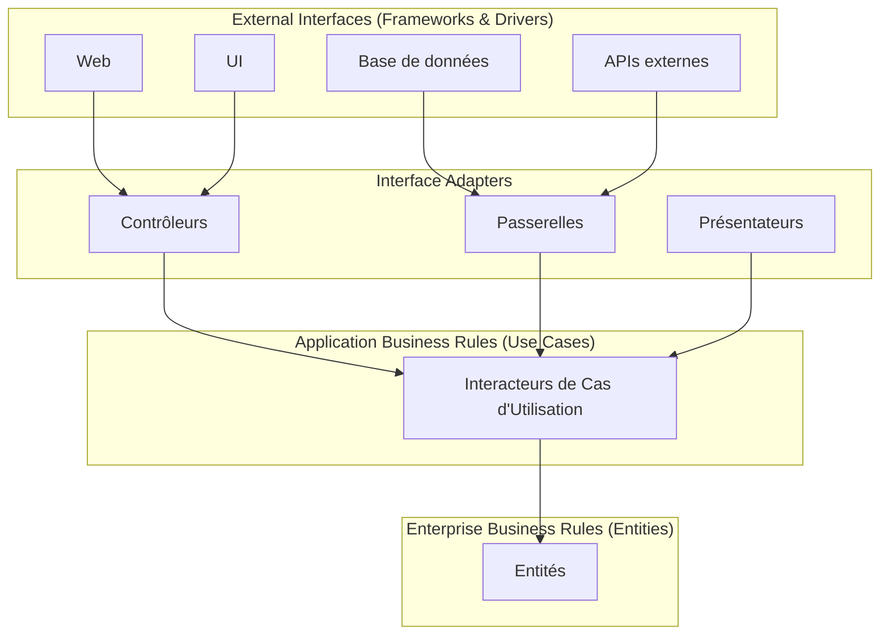
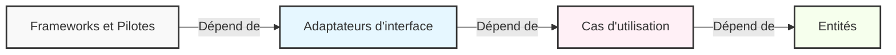
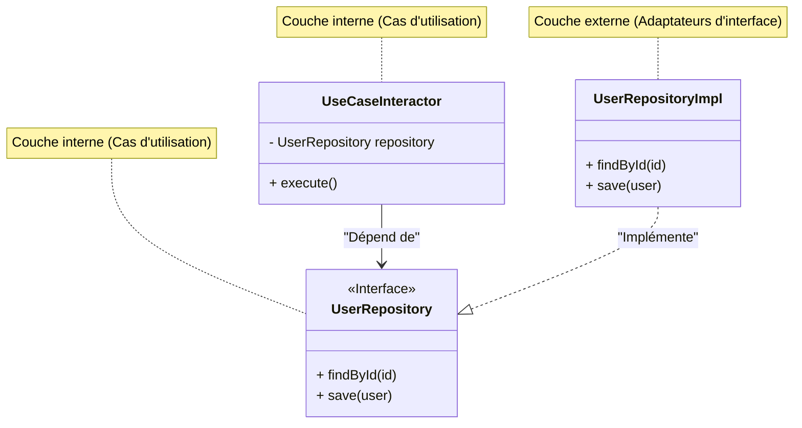

Dans le développement logiciel moderne, la construction d'un « système résilient aux changements » est un défi éternel. Changements des exigences métier, émergence de nouveaux frameworks, refonte de l'interface utilisateur (UI), migration de base de données. Face à tous ces changements, on recherche une architecture capable de s'adapter avec souplesse sans avoir à reconstruire le système entier. L'une des réponses à ce besoin est la **Clean Architecture**, proposée par Robert C. Martin (surnommé Oncle Bob, Uncle Bob).

Dans cet article, nous explorerons l'essence de la Clean Architecture à travers son histoire, son objectif, les détails de ses 4 couches, la règle de dépendance, ainsi que des exemples concrets d'implémentation. Nous fournirons une explication technique très approfondie et détaillée.

## 1. Les problèmes des architectures traditionnelles et l'histoire de la Clean Architecture

Historiquement, l'architecture logicielle a connu divers changements de paradigme. Dans les premiers systèmes, le code de la logique métier, de l'UI et de l'accès aux données était fortement couplé (ce qu'on appelle du code spaghetti). Par la suite, dans le but d'appliquer la séparation des préoccupations (Separation of Concerns), l'architecture en 3 tiers (couche de présentation, couche de logique métier, couche d'accès aux données) s'est popularisée.

Cependant, l'architecture en 3 tiers traditionnelle présentait un problème majeur : « **le domaine (la logique métier) finit par dépendre de la base de données et des frameworks** ».

Par exemple, si la couche de logique métier appelle directement la couche d'accès aux données (comme un ORM), un changement de schéma de base de données ou d'ORM se répercute sur la logique métier. En d'autres termes, il y avait une contradiction où les « règles métier », qui sont les plus importantes et ne devraient pas changer, dépendaient de « l'infrastructure », qui est la plus susceptible de subir des modifications techniques.

Pour résoudre ce problème, les architectures suivantes ont été conçues :

*   **Architecture Hexagonale (Ports and Adapters)** - Alistair Cockburn
*   **Architecture Oignon (Onion Architecture)** - Jeffrey Palermo
*   **DCI (Data, Context and Interaction)** - James Coplien, Trygve Reenskaug
*   **BCE (Boundary-Control-Entity)** - Ivar Jacobson

Toutes ces architectures ont le même objectif : la « **séparation des préoccupations** ». Il s'agit de diviser le logiciel en couches, où chacune peut être testée indépendamment et reste indépendante des agents externes (UI, base de données, frameworks).

Robert C. Martin a intégré les concepts de ces excellentes architectures et les a regroupés sous une seule règle pratique qu'il a nommée la « **Clean Architecture** ».

## 2. Objectifs et caractéristiques de la Clean Architecture

Un système qui adopte la Clean Architecture possède les caractéristiques suivantes :

1.  **Indépendant des frameworks (Independent of Frameworks)** : L'architecture ne dépend pas de l'existence de bibliothèques logicielles riches en fonctionnalités. Cela permet d'utiliser les frameworks comme des « outils » et vous évite d'avoir à contraindre le système aux limites de ces frameworks.
2.  **Testable** : Les règles métier peuvent être testées sans l'interface utilisateur (UI), la base de données, le serveur web ou tout autre élément externe.
3.  **Indépendant de l'interface utilisateur (Independent of UI)** : L'UI peut changer facilement sans modifier le reste du système. Par exemple, une UI Web pourrait être remplacée par une UI console sans changer les règles métier.
4.  **Indépendant de la base de données (Independent of Database)** : Vous pouvez remplacer Oracle ou SQL Server par Mongo, BigTable, CouchDB ou autre. Vos règles métier ne sont pas liées à la base de données.
5.  **Indépendant de tout agent externe (Independent of any external agency)** : En fait, vos règles métier ne connaissent absolument rien du monde extérieur.

## 3. Les 4 couches (Layers) de la Clean Architecture

La Clean Architecture est généralement représentée par des cercles concentriques. Plus on se rapproche du centre, plus le logiciel contient des politiques de haut niveau (règles métier abstraites). Plus on s'éloigne vers l'extérieur, plus on trouve les mécanismes (détails concrets).



### 3.1. Entités (Entities)
Les entités encapsulent les règles métier de l'entreprise à grande échelle (Enterprise Business Rules). Une entité peut être un objet avec des méthodes, ou un ensemble de structures de données et de fonctions. Ce sont les règles les plus générales et de plus haut niveau, réutilisables dans plusieurs applications différentes au sein de l'entreprise.
Même si vous ne créez qu'une seule application, ces entités constituent les objets métier de l'application. Elles ne sont en aucun cas affectées par un changement externe (comme un changement de navigation dans les pages ou un changement de sécurité).

### 3.2. Cas d'utilisation (Use Cases)
La couche des cas d'utilisation contient les règles métier spécifiques à l'application (Application Business Rules). C'est ici que sont encapsulés et mis en œuvre tous les cas d'utilisation du système. Les cas d'utilisation orchestrent le flux de données vers et depuis les entités, et dirigent ces entités pour utiliser leurs règles métier globales afin d'atteindre les objectifs du système.
Les modifications apportées à cette couche ne doivent pas affecter les entités. De plus, cette couche ne doit pas être affectée par des changements externes tels que la base de données, l'UI ou les frameworks. Les cas d'utilisation sont totalement isolés de ces préoccupations.

### 3.3. Adaptateurs d'interface (Interface Adapters)
La couche des adaptateurs d'interface est un ensemble d'adaptateurs qui convertissent les données du format le plus pratique pour les cas d'utilisation et les entités vers le format le plus pratique pour les agents externes tels que la base de données ou le Web.
Par exemple, dans le monde du Web, c'est ici que se trouvent les éléments de l'architecture MVC (Model-View-Controller) d'une GUI. Les contrôleurs prennent les entrées de l'utilisateur et les transmettent aux cas d'utilisation, et les présentateurs reçoivent la sortie des cas d'utilisation et la formatent pour la vue (UI).
C'est également le rôle de cette couche de convertir les données dans un format compréhensible par la base de données (comme le SQL). Aucun code à l'intérieur de cette couche ne devrait rien savoir de la base de données.

### 3.4. Frameworks et Pilotes (Frameworks & Drivers)
La couche la plus externe est composée d'outils tels que la base de données, le framework Web, etc. En général, on n'écrit pas beaucoup de code ici, si ce n'est du code de liaison (« glue code ») pour communiquer avec les cercles intérieurs.
C'est dans cette couche que tous les détails sont conservés. Le Web est un détail. La base de données est un détail. Nous gardons ces éléments à l'extérieur pour qu'ils fassent le moins de dégâts possible.

## 4. La Règle de Dépendance (The Dependency Rule)

Il existe une règle fondamentale et absolue pour que la Clean Architecture fonctionne. C'est la « **Règle de Dépendance (The Dependency Rule)** ».

> Les dépendances du code source ne doivent pointer que vers l'intérieur (vers les politiques de plus haut niveau).

Rien dans un cercle intérieur ne doit connaître quoi que ce soit d'un cercle extérieur. En particulier, le nom d'un élément (fonction, classe, variable, etc.) déclaré dans un cercle extérieur ne doit pas être mentionné par le code dans un cercle intérieur.
De même, les formats de données utilisés dans un cercle extérieur ne doivent pas être utilisés par un cercle intérieur, en particulier si ces formats sont générés par un framework d'un cercle extérieur.



Exprimé mathématiquement, si nous définissons l'indice de la couche comme $L_i$, où $i=0$ est l'entité (la couche la plus interne) et $i=3$ le framework (la couche la plus externe), si une dépendance existe d'une couche $L_m$ à $L_n$, l'inégalité suivante doit toujours être vérifiée :

$$ m > n $$

En d'autres termes, le vecteur de dépendance $\vec{D}$ pointe toujours vers le centre.

## 5. Franchir les frontières : Le Principe d'Inversion des Dépendances (DIP)

En essayant de respecter la règle de dépendance, on se heurte rapidement à un problème majeur : « **Que faire si un cas d'utilisation a besoin de récupérer des données depuis la base de données ?** »

Si la couche des cas d'utilisation (à l'intérieur) appelle directement la couche des adaptateurs d'interface (l'implémentation du Repository à l'extérieur), la dépendance pointerait vers l'extérieur, ce qui violerait la règle de dépendance.

La solution à ce problème réside dans le « D » des principes SOLID (Dependency Inversion Principle : le Principe d'Inversion des Dépendances).

### Définition du Principe d'Inversion des Dépendances (DIP)
1. Les modules de haut niveau ne doivent pas dépendre des modules de bas niveau. Les deux doivent dépendre d'abstractions.
2. Les abstractions ne doivent pas dépendre des détails. Les détails doivent dépendre des abstractions.

Pour y parvenir, on définit une **interface (abstraction)** dans la couche des cas d'utilisation, et on l'**implémente** dans la couche externe (les adaptateurs d'interface). La couche des cas d'utilisation ne dépend que de l'interface qu'elle a elle-même définie, et non de l'implémentation concrète externe.



Dans le diagramme ci-dessus, le flux de contrôle (Control Flow) à l'exécution est `UseCaseInteractor` $\rightarrow$ `UserRepositoryImpl`. Cependant, la dépendance du code source (Source Code Dependency) est `UserRepositoryImpl` $\rightarrow$ `UserRepository` (vers l'intérieur). En utilisant le polymorphisme, nous avons pu diriger la dépendance du code source dans la direction opposée au flux de contrôle. C'est pour cela qu'on l'appelle l'**inversion** des dépendances.

## 6. Exemple d'implémentation concrète en TypeScript

Voici un exemple simple d'implémentation de la Clean Architecture en TypeScript (une fonctionnalité d'inscription d'utilisateur).

### 6.1. Entités (Entities)

Il s'agit des règles métier les plus centrales.

```typescript
// src/domain/entities/User.ts
export class User {
    constructor(
        public readonly id: string,
        public readonly name: string,
        public readonly email: string,
        public readonly createdAt: Date
    ) {}

    // Règles métier spécifiques à l'entité (ex: vérification de la longueur du nom, etc.)
    public isValid(): boolean {
        return this.name.length >= 3 && this.email.includes('@');
    }
}
```

### 6.2. Cas d'utilisation (Use Cases)

Dans la couche des cas d'utilisation, nous définissons les structures de données d'entrée et de sortie (DTO) ainsi que l'interface du Repository pour inverser les dépendances.

```typescript
// src/application/repositories/UserRepository.ts
import { User } from '../../domain/entities/User';

// Interface définie par la couche des cas d'utilisation
export interface UserRepository {
    findByEmail(email: string): Promise<User | null>;
    save(user: User): Promise<void>;
}

// src/application/usecases/RegisterUser/RegisterUserDTO.ts
export interface RegisterUserInputDTO {
    name: string;
    email: string;
}

export interface RegisterUserOutputDTO {
    id: string;
    name: string;
    email: string;
    createdAt: Date;
}

// src/application/usecases/RegisterUser/RegisterUserUseCase.ts
import { User } from '../../domain/entities/User';
import { UserRepository } from '../../repositories/UserRepository';
import { RegisterUserInputDTO, RegisterUserOutputDTO } from './RegisterUserDTO';

export class RegisterUserUseCase {
    // Dépend d'une abstraction (interface). Ne dépend pas d'une implémentation concrète.
    constructor(private readonly userRepository: UserRepository) {}

    public async execute(input: RegisterUserInputDTO): Promise<RegisterUserOutputDTO> {
        const existingUser = await this.userRepository.findByEmail(input.email);
        if (existingUser) {
            throw new Error('User already exists');
        }

        const newUser = new User(
            crypto.randomUUID(),
            input.name,
            input.email,
            new Date()
        );

        if (!newUser.isValid()) {
            throw new Error('Invalid user data');
        }

        // Appelle le processus de sauvegarde en base de données à l'extérieur, 
        // mais la dépendance pointe vers l'intérieur (vers l'interface)
        await this.userRepository.save(newUser);

        return {
            id: newUser.id,
            name: newUser.name,
            email: newUser.email,
            createdAt: newUser.createdAt
        };
    }
}
```

### 6.3. Adaptateurs d'interface (Interface Adapters)

Nous créons ici le processus d'accès concret à la base de données (l'implémentation du Repository) et le Controller qui gère les requêtes HTTP.

```typescript
// src/adapters/repositories/PostgresUserRepository.ts
import { UserRepository } from '../../application/repositories/UserRepository';
import { User } from '../../domain/entities/User';
// On suppose que c'est un client de base de données de la couche externe (Driver)
import { DatabaseClient } from '../../infrastructure/database/DatabaseClient';

export class PostgresUserRepository implements UserRepository {
    constructor(private readonly dbClient: DatabaseClient) {}

    public async findByEmail(email: string): Promise<User | null> {
        const record = await this.dbClient.query('SELECT * FROM users WHERE email = $1', [email]);
        if (!record) return null;
        return new User(record.id, record.name, record.email, record.created_at);
    }

    public async save(user: User): Promise<void> {
        await this.dbClient.query(
            'INSERT INTO users (id, name, email, created_at) VALUES ($1, $2, $3, $4)',
            [user.id, user.name, user.email, user.createdAt]
        );
    }
}

// src/adapters/controllers/UserController.ts
import { RegisterUserUseCase } from '../../application/usecases/RegisterUser/RegisterUserUseCase';

export class UserController {
    constructor(private readonly registerUserUseCase: RegisterUserUseCase) {}

    public async register(req: any, res: any): Promise<void> {
        try {
            const input = {
                name: req.body.name,
                email: req.body.email
            };
            const output = await this.registerUserUseCase.execute(input);
            res.status(201).json(output);
        } catch (error: any) {
            res.status(400).json({ message: error.message });
        }
    }
}
```

### 6.4. Composant principal (Injection de dépendances : DI)

Au démarrage de l'application, nous construisons toutes les dépendances (câblage). C'est ce qu'on appelle la Racine de Composition (Composition Root).

```typescript
// src/infrastructure/web/server.ts
import express from 'express';
import { DatabaseClient } from '../database/DatabaseClient';
import { PostgresUserRepository } from '../../adapters/repositories/PostgresUserRepository';
import { RegisterUserUseCase } from '../../application/usecases/RegisterUser/RegisterUserUseCase';
import { UserController } from '../../adapters/controllers/UserController';

const app = express();
app.use(express.json());

// 1. Initialisation du Driver
const dbClient = new DatabaseClient(/* Informations de connexion */);

// 2. Initialisation de l'Adaptateur (Instanciation de la classe concrète)
const userRepository = new PostgresUserRepository(dbClient);

// 3. Initialisation du Cas d'Utilisation (Injection de la classe concrète dans l'interface = DI)
const registerUserUseCase = new RegisterUserUseCase(userRepository);

// 4. Initialisation du Contrôleur
const userController = new UserController(registerUserUseCase);

// Routage
app.post('/users', (req, res) => userController.register(req, res));

app.listen(3000, () => {
    console.log('Server is running on port 3000');
});
```

De cette manière, le « script de démarrage » situé dans la couche la plus externe prend en charge les détails désagréables (l'instanciation des classes concrètes) et ne transmet que des interfaces propres aux couches internes, isolant ainsi complètement la logique métier du monde extérieur.

## 7. Considérations mathématiques sur le couplage et la cohésion

En génie logiciel, le **couplage (Coupling)** et la **cohésion (Cohesion)** sont des métriques utilisées pour évaluer la qualité d'une architecture.

Le couplage $C$ représente la force de dépendance entre les modules. Si le module $A$ dépend du module $B$, en posant le nombre total de dépendances du système à $N_{dep}$ et le nombre de modules à $N_{mod}$, l'un des indicateurs de la complexité peut s'exprimer ainsi :

$$ Complexity \propto \frac{N_{dep}}{N_{mod}} $$

Dans la Clean Architecture, l'application du principe DIP permet d'orienter les flèches de dépendance physique vers des abstractions. L'instabilité (Instability : $I$), c'est-à-dire la fréquence de modification d'une abstraction (interface), est conçue pour être très faible.

L'instabilité $I$ est calculée par la formule suivante (définie par Robert C. Martin) :
*   $C_e$ (Efferent Coupling) : Couplage sortant (le nombre d'éléments dont dépend le composant)
*   $C_a$ (Afferent Coupling) : Couplage entrant (le nombre d'éléments dépendant du composant)

$$ I = \frac{C_e}{C_e + C_a} $$

*   Si $I = 0$, le composant est totalement stable (il ne dépend de rien, mais d'autres dépendent de lui).
*   Si $I = 1$, le composant est totalement instable (personne ne dépend de lui, et il dépend d'autres composants).

La « couche des entités » de la Clean Architecture a un $C_e = 0$ (ne dépend pas de l'extérieur), donc $I = 0$. C'est la couche la plus stable.
À l'inverse, la « couche UI » ou la « couche DB » ont un $C_a \approx 0$ et un $C_e > 0$, donc $I \approx 1$. Ce sont des couches facilement modifiables (couches instables).

Le SDP (Stable Dependencies Principle : Principe de Dépendances Stables), qui est un principe fondamental de l'architecture, stipule que « **les dépendances doivent pointer vers des composants plus stables (ceux dont le $I$ est plus petit)** ». Les cercles concentriques de la Clean Architecture sont justement la visualisation de ce SDP, où l'architecture est conçue pour que les dépendances aillent de l'extérieur ($I=1$) vers l'intérieur ($I=0$).

## 8. Stratégie de test et Clean Architecture

L'un des plus grands avantages de la Clean Architecture est la **facilité de test**. Les couches étant séparées, il est possible d'écrire des tests adaptés à chaque couche de manière indépendante.

### 8.1. Test des entités (Test Unitaire)
Puisqu'il s'agit d'une logique pure sans aucune dépendance externe, ni base de données ni mock ne sont nécessaires. C'est le test le plus fiable et le plus rapide à exécuter.

### 8.2. Test des cas d'utilisation (Test Unitaire avec Mocks)
Comme toutes les dépendances externes telles que les repositories sont définies sous forme d'interfaces, il suffit d'injecter (DI) des **mocks pour les tests ou des implémentations en mémoire (Fake)** lors des tests. Il n'est pas nécessaire de lancer une vraie base de données. Cela permet de tester rapidement les branchements complexes et la gestion des exceptions de la logique métier.

```typescript
// Exemple de test de cas d'utilisation (en supposant l'utilisation de Jest)
test('L\'inscription avec une adresse e-mail existante doit générer une erreur', async () => {
    // Création d'un Fake Repository
    const mockRepo: UserRepository = {
        findByEmail: async (email) => new User('1', 'Test', email, new Date()), // Retourne un utilisateur existant
        save: async (user) => {}
    };

    const useCase = new RegisterUserUseCase(mockRepo);
    
    // Exécution du cas d'utilisation et assertion de l'erreur
    await expect(useCase.execute({ name: 'Bob', email: 'test@example.com' }))
        .rejects
        .toThrow('User already exists');
});
```

### 8.3. Test des adaptateurs (Test d'Intégration)
La classe d'implémentation du Repository est testée en se connectant réellement à la base de données pour vérifier que le SQL est correct. Le test du Controller vérifie la partie qui reçoit la requête HTTP et renvoie le JSON. Ici, on ne procède pas à une validation détaillée de la logique métier, mais on vérifie seulement si la « conversion » et la « communication » sont correctes.

## 9. Les inconvénients de la Clean Architecture et quand l'adopter

Bien qu'elle semble être une solution universelle, la Clean Architecture n'est pas une balle d'argent. Elle présente des inconvénients (compromis) tels que :

1.  **Augmentation des coûts d'apprentissage initiaux et des coûts de développement** : Le nombre de fichiers et d'interfaces (abstractions) augmente considérablement. Il y aura beaucoup de « code de la plaque de base (boilerplate) » tel que le reconditionnement des DTO.
2.  **Surdimensionnée pour les petits projets** : Adopter cette architecture pour un prototype construit en quelques jours ou pour un outil à usage unique soumis à peu de changements représente souvent un coût inutile. Elle est également inadaptée pour une simple API ne gérant que des opérations CRUD.

**Quand l'adopter** :
*   Les produits dont la maintenance et l'exploitation sont prévues sur le long terme (plusieurs années).
*   Les systèmes où les règles métier sont complexes et font l'objet de changements de spécifications fréquents.
*   Lorsque vous souhaitez répartir le travail au sein d'une grande équipe de développement (front-end, back-end, infrastructure, etc.).
*   Lorsque vous souhaitez la combiner avec le Domain-Driven Design (DDD) pour modéliser des domaines métier complexes.

## 10. Résumé

La Clean Architecture est une philosophie de conception visant à protéger le cœur du système, c'est-à-dire les « règles métier », contre les « détails » tels que l'UI, la base de données ou les frameworks.

En son cœur se trouvent la **règle de dépendance** et le **Principe d'Inversion des Dépendances (DIP)**. En les appliquant correctement, les logiciels deviennent flexibles face aux changements, plus faciles à tester, et peuvent maintenir leur valeur sur le long terme.

L'important n'est pas de reproduire aveuglément la structure de répertoires de la Clean Architecture, mais de comprendre l'essence de « **pourquoi diviser de cette façon** » et « **vers où pointent les flèches de dépendance** », afin de l'appliquer correctement en fonction de la taille et de la complexité de votre propre projet.

---
*Reference: "Clean Architecture: A Craftsman's Guide to Software Structure and Design" by Robert C. Martin*
