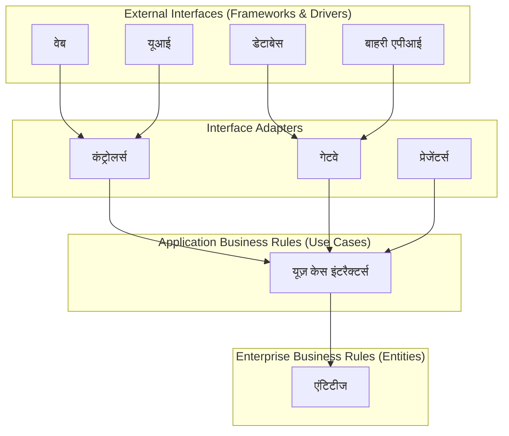
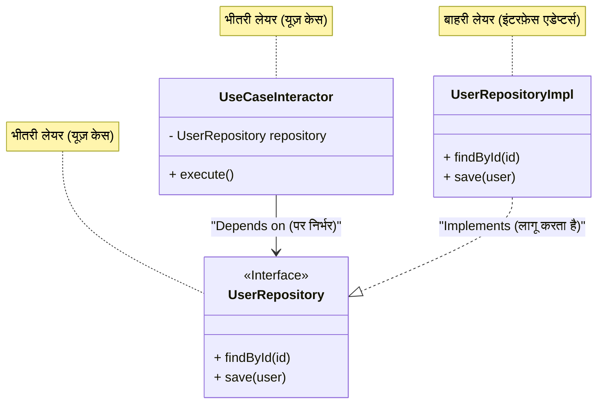

आधुनिक सॉफ्टवेयर विकास में, "परिवर्तन के प्रति लचीला सिस्टम" बनाना एक शाश्वत चुनौती है। व्यावसायिक आवश्यकताओं में बदलाव, नए फ्रेमवर्क का उदय, यूआई का नवीनीकरण, डेटाबेस माइग्रेशन। इन सभी परिवर्तनों के लिए, एक ऐसे आर्किटेक्चर की आवश्यकता होती है जो पूरे सिस्टम को फिर से बनाए बिना लचीले ढंग से अनुकूलित हो सके। इसके उत्तर में से एक के रूप में, रॉबर्ट सी. मार्टिन (जिन्हें अंकल बॉब के नाम से भी जाना जाता है) द्वारा **क्लीन आर्किटेक्चर (Clean Architecture)** का प्रस्ताव दिया गया था।

इस लेख में, हम क्लीन आर्किटेक्चर के इतिहास, उद्देश्य, इसके 4 लेयर्स (स्तरों) के विवरण, निर्भरता के नियम (Dependency Rule), और विशिष्ट कार्यान्वयन उदाहरणों के माध्यम से क्लीन आर्किटेक्चर के सार तक पहुंचेंगे। हम बहुत गहरी और विस्तृत तकनीकी व्याख्या करेंगे।

## 1. पारंपरिक आर्किटेक्चर की समस्याएं और क्लीन आर्किटेक्चर का इतिहास

ऐतिहासिक दृष्टि से, सॉफ्टवेयर आर्किटेक्चर ने विभिन्न प्रतिमानों (पैराडाइम शिफ्ट) का अनुभव किया है। शुरुआती प्रणालियों में, बिजनेस लॉजिक, यूआई और डेटा एक्सेस के कोड एक साथ जुड़े हुए थे (तथाकथित स्पेगेटी कोड)। बाद में, चिंताओं के पृथक्करण (Separation of Concerns) के उद्देश्य से, 3-टियर आर्किटेक्चर (प्रेजेंटेशन लेयर, बिजनेस लॉजिक लेयर, डेटा एक्सेस लेयर) लोकप्रिय हुआ।

हालांकि, पारंपरिक 3-टियर आर्किटेक्चर में एक बड़ी समस्या थी। वह यह है कि "**डोमेन (बिजनेस लॉजिक) डेटाबेस या फ्रेमवर्क पर निर्भर हो जाता है**"।

उदाहरण के लिए, यदि बिजनेस लॉजिक लेयर सीधे डेटा एक्सेस लेयर (जैसे ORM) को कॉल करता है, तो डेटाबेस स्कीमा में बदलाव या ORM में बदलाव बिजनेस लॉजिक को भी प्रभावित करेगा। दूसरे शब्दों में, एक विरोधाभास पैदा हो गया था जहाँ सबसे महत्वपूर्ण "बिजनेस रूल्स", जिन्हें नहीं बदला जाना चाहिए, "इन्फ्रास्ट्रक्चर" पर निर्भर हो गए, जो तकनीकी बदलावों के प्रति सबसे अधिक संवेदनशील है।

इसके समाधान के रूप में, निम्नलिखित आर्किटेक्चर तैयार किए गए हैं:

*   **हेक्सागोनल आर्किटेक्चर (Ports and Adapters)** - Alistair Cockburn
*   **अनियन आर्किटेक्चर** - Jeffrey Palermo
*   **DCI (Data, Context and Interaction)** - James Coplien, Trygve Reenskaug
*   **BCE (Boundary-Control-Entity)** - Ivar Jacobson

इन सभी आर्किटेक्चर का एक ही उद्देश्य है। वह है "**चिंताओं का पृथक्करण (Separation of Concerns)**"। सॉफ्टवेयर को लेयर्स (स्तरों) में विभाजित करना, ताकि प्रत्येक का स्वतंत्र रूप से परीक्षण किया जा सके, और एक ऐसी स्थिति बनाना जहाँ वे बाहरी एजेंटों (UI, DB, फ्रेमवर्क) से स्वतंत्र हों।

रॉबर्ट सी. मार्टिन ने इन उत्कृष्ट आर्किटेक्चर की अवधारणाओं को एकीकृत किया और उन्हें एक व्यावहारिक नियम के रूप में संकलित किया, जिसे उन्होंने "**क्लीन आर्किटेक्चर**" नाम दिया।

## 2. क्लीन आर्किटेक्चर का उद्देश्य और विशेषताएं

क्लीन आर्किटेक्चर को अपनाने वाले सिस्टम में निम्नलिखित विशेषताएं होती हैं:

1.  **फ्रेमवर्क से स्वतंत्र (Independent of Frameworks)**: आर्किटेक्चर सुविधा-संपन्न सॉफ्टवेयर लाइब्रेरी के अस्तित्व पर निर्भर नहीं करता है। यह आपको फ्रेमवर्क का उपयोग "टूल" के रूप में करने की अनुमति देता है, और सिस्टम को फ्रेमवर्क की बाधाओं में धकेलने की आवश्यकता नहीं होती है।
2.  **परीक्षण योग्य (Testable)**: बिजनेस रूल्स का परीक्षण UI, डेटाबेस, वेब सर्वर, या अन्य बाहरी तत्वों के बिना किया जा सकता है।
3.  **UI से स्वतंत्र (Independent of UI)**: UI को सिस्टम के बाकी हिस्सों को बदले बिना आसानी से बदला जा सकता है। उदाहरण के लिए, बिजनेस रूल्स को बदले बिना वेब UI को कंसोल UI से बदला जा सकता है।
4.  **डेटाबेस से स्वतंत्र (Independent of Database)**: आप Oracle या SQL Server को Mongo, BigTable, CouchDB आदि से बदल सकते हैं। बिजनेस रूल्स डेटाबेस से बंधे नहीं होते हैं।
5.  **किसी भी बाहरी एजेंट से स्वतंत्र (Independent of any external agency)**: वास्तव में, बिजनेस रूल्स बाहरी दुनिया के बारे में कुछ नहीं जानते हैं।

## 3. क्लीन आर्किटेक्चर के 4 लेयर्स (Layers)

क्लीन आर्किटेक्चर को आमतौर पर संकेंद्रित (concentric) वृत्तों के आरेख द्वारा दर्शाया जाता है। आप केंद्र के जितना करीब जाते हैं, सॉफ्टवेयर उतना ही उच्च-स्तरीय नीति (अमूर्त बिजनेस रूल्स) बन जाता है। आप जितना बाहर जाते हैं, वह उतना ही तंत्र (विशिष्ट विवरण) बन जाता है।



### 3.1. एंटिटीज (Entities)
एंटिटीज उद्यम-व्यापी बिजनेस रूल्स (Enterprise Business Rules) को इनकैप्सुलेट करते हैं। एक एंटिटी विधियों (methods) वाला एक ऑब्जेक्ट हो सकता है, या यह डेटा संरचनाओं और कार्यों का एक सेट हो सकता है। ये सबसे सामान्य और उच्च-स्तरीय नियम हैं जिनका उपयोग कंपनी के भीतर कई अलग-अलग एप्लिकेशन में किया जा सकता है।
यदि आप केवल एक ही एप्लिकेशन बना रहे हैं, तब भी एंटिटीज उस एप्लिकेशन के बिजनेस ऑब्जेक्ट हैं। बाहरी बदलाव (जैसे पेज नेविगेशन में बदलाव या सुरक्षा में बदलाव) होने पर भी, एंटिटीज कभी प्रभावित नहीं होते हैं।

### 3.2. यूज़ केस (Use Cases)
यूज़ केस लेयर में एप्लिकेशन-विशिष्ट बिजनेस रूल्स (Application Business Rules) शामिल होते हैं। यह सिस्टम के सभी यूज़ केस को इनकैप्सुलेट करता है और लागू करता है। यूज़ केस एंटिटीज से डेटा के प्रवाह को नियंत्रित करते हैं, और एंटिटीज को सिस्टम के लक्ष्यों को प्राप्त करने का निर्देश देते हैं।
इस लेयर में बदलाव का असर एंटिटीज पर नहीं पड़ना चाहिए। इसके अलावा, डेटाबेस, UI, या फ्रेमवर्क जैसे बाहरी बदलाव इस लेयर को प्रभावित नहीं करते हैं। यूज़ केस इन चिंताओं से पूरी तरह से अलग होते हैं।

### 3.3. इंटरफ़ेस एडेप्टर (Interface Adapters)
इंटरफ़ेस एडेप्टर लेयर एडेप्टर का एक सेट है जो डेटा को यूज़ केस और एंटिटीज के लिए सुविधाजनक प्रारूप से डेटाबेस या वेब जैसे बाहरी एजेंटों के लिए सुविधाजनक प्रारूप में परिवर्तित करता है।
उदाहरण के लिए, वेब की दुनिया में GUI के MVC (Model-View-Controller) आर्किटेक्चर के तत्व इसी लेयर से संबंधित हैं। कंट्रोलर उपयोगकर्ता के इनपुट को स्वीकार करता है, इसे यूज़ केस को पास करता है, और प्रेजेंटर यूज़ केस से आउटपुट प्राप्त करता है और इसे व्यू (UI) के लिए स्वरूपित करता है।
यह लेयर डेटा को उस प्रारूप में भी परिवर्तित करता है जिसे डेटाबेस (जैसे SQL) समझ सकता है। इस लेयर के अंदर के कोड को डेटाबेस के बारे में कुछ भी नहीं पता होना चाहिए।

### 3.4. फ्रेमवर्क और ड्राइवर (Frameworks & Drivers)
सबसे बाहरी लेयर डेटाबेस और वेब फ्रेमवर्क जैसे टूल्स से बनी होती है। यहाँ आमतौर पर हम अंदरूनी वृत्तों (inner circles) के साथ संवाद करने के लिए "ग्लू कोड (glue code)" के अलावा बहुत कम कोड लिखते हैं।
इस लेयर में सभी विवरण रखे जाते हैं। वेब एक विवरण है। डेटाबेस एक विवरण है। नुकसान को कम करने के लिए हम इन विवरणों को बाहर की ओर रखते हैं।

## 4. निर्भरता का नियम (The Dependency Rule)

क्लीन आर्किटेक्चर को स्थापित करने के लिए एक सबसे महत्वपूर्ण नियम है, जिसे कभी नहीं तोड़ा जाना चाहिए। वह है "**निर्भरता का नियम (The Dependency Rule)**"।

> स्रोत कोड की निर्भरता (Source code dependencies) केवल अंदर की ओर (उच्च-स्तरीय नीतियों की ओर) इशारा करनी चाहिए।

अंदर के वृत्त से संबंधित कोड को बाहर के वृत्त से संबंधित कोड के बारे में कुछ भी नहीं पता होना चाहिए। बाहर के वृत्त में घोषित नामों (फ़ंक्शन, क्लास, वेरिएबल आदि) का उल्लेख अंदर के वृत्त में नहीं किया जाना चाहिए।
इसी तरह, बाहर के वृत्त में उपयोग किए जाने वाले डेटा प्रारूप का उपयोग अंदर के वृत्त में नहीं किया जाना चाहिए। खासकर तब जब वह प्रारूप बाहर के वृत्त के फ्रेमवर्क द्वारा उत्पन्न किया गया हो।


गणितीय रूप से व्यक्त करें तो, यदि लेयर के इंडेक्स को $L_i$ मानें, जहाँ $i=0$ एंटिटी (सबसे भीतरी लेयर) है और $i=3$ फ्रेमवर्क (सबसे बाहरी लेयर) है, तो यदि किसी लेयर $L_m$ से $L_n$ पर निर्भरता मौजूद है, तो निम्नलिखित असमानता हमेशा सत्य होनी चाहिए:

$$ m > n $$

अर्थात्, निर्भरता का वेक्टर $\vec{D}$ हमेशा केंद्र की ओर होता है।

## 5. सीमाओं को पार करना: निर्भरता व्युत्क्रमण का सिद्धांत (DIP)

निर्भरता के नियम का पालन करने का प्रयास करते ही, तुरंत एक बड़ी समस्या सामने आती है: "**यदि यूज़ केस को डेटाबेस से डेटा प्राप्त करने की आवश्यकता है, तो क्या किया जाए?**"

यदि यूज़ केस लेयर (अंदर) सीधे इंटरफ़ेस एडेप्टर लेयर (बाहर के Repository के कार्यान्वयन) को कॉल करती है, तो निर्भरता बाहर की ओर हो जाएगी, जो निर्भरता के नियम का उल्लंघन है।

इस समस्या का समाधान SOLID सिद्धांतों का "D (Dependency Inversion Principle: निर्भरता व्युत्क्रमण सिद्धांत)" है।

### निर्भरता व्युत्क्रमण सिद्धांत (DIP) की परिभाषा
1. उच्च-स्तरीय मॉड्यूल को निम्न-स्तरीय मॉड्यूल पर निर्भर नहीं होना चाहिए। दोनों को अमूर्तन (abstractions) पर निर्भर होना चाहिए।
2. अमूर्तन को विवरण (details) पर निर्भर नहीं होना चाहिए। विवरण को अमूर्तन पर निर्भर होना चाहिए।

इसे प्राप्त करने के लिए, हम यूज़ केस लेयर में एक **इंटरफ़ेस (अमूर्तन)** परिभाषित करते हैं, और बाहरी लेयर (इंटरफ़ेस एडेप्टर) में उस इंटरफ़ेस को **लागू (implement)** करते हैं। यूज़ केस लेयर केवल अपने द्वारा परिभाषित इंटरफ़ेस पर निर्भर करती है, बाहरी विशिष्ट कार्यान्वयन पर नहीं।



ऊपर दिए गए चित्र में, रनटाइम पर नियंत्रण का प्रवाह (Control Flow) `UseCaseInteractor` $\rightarrow$ `UserRepositoryImpl` है। हालाँकि, स्रोत कोड की निर्भरता (Source Code Dependency) `UserRepositoryImpl` $\rightarrow$ `UserRepository` (अंदर की ओर) है। बहुरूपता (Polymorphism) का उपयोग करके, हम नियंत्रण के प्रवाह के विपरीत दिशा में स्रोत कोड की निर्भरता को निर्देशित करने में सक्षम हुए। यही कारण है कि इसे निर्भरता का "**व्युत्क्रमण (Inversion)**" कहा जाता है।

## 6. TypeScript का उपयोग करके विशिष्ट कार्यान्वयन उदाहरण

यहाँ, TypeScript का उपयोग करके क्लीन आर्किटेक्चर का एक सरल कार्यान्वयन उदाहरण (उपयोगकर्ता पंजीकरण सुविधा) दिया गया है।

### 6.1. एंटिटीज (Entities)

यह सबसे केंद्र में स्थित बिजनेस रूल है।

```typescript
// src/domain/entities/User.ts
export class User {
    constructor(
        public readonly id: string,
        public readonly name: string,
        public readonly email: string,
        public readonly createdAt: Date
    ) {}

    // एंटिटी-विशिष्ट बिजनेस रूल्स (उदा: नाम की लंबाई की जांच आदि)
    public isValid(): boolean {
        return this.name.length >= 3 && this.email.includes('@');
    }
}
```

### 6.2. यूज़ केस (Use Cases)

यूज़ केस लेयर में, हम इनपुट और आउटपुट डेटा संरचनाएं (DTO) और निर्भरता को उलटने के लिए एक रिपॉजिटरी इंटरफ़ेस परिभाषित करते हैं।

```typescript
// src/application/repositories/UserRepository.ts
import { User } from '../../domain/entities/User';

// यूज़ केस लेयर द्वारा परिभाषित इंटरफ़ेस
export interface UserRepository {
    findByEmail(email: string): Promise<User | null>;
    save(user: User): Promise<void>;
}

// src/application/usecases/RegisterUser/RegisterUserDTO.ts
export interface RegisterUserInputDTO {
    name: string;
    email: string;
}

export interface RegisterUserOutputDTO {
    id: string;
    name: string;
    email: string;
    createdAt: Date;
}

// src/application/usecases/RegisterUser/RegisterUserUseCase.ts
import { User } from '../../domain/entities/User';
import { UserRepository } from '../../repositories/UserRepository';
import { RegisterUserInputDTO, RegisterUserOutputDTO } from './RegisterUserDTO';

export class RegisterUserUseCase {
    // अमूर्तन (इंटरफ़ेस) पर निर्भर करता है। विशिष्टता पर निर्भर नहीं करता।
    constructor(private readonly userRepository: UserRepository) {}

    public async execute(input: RegisterUserInputDTO): Promise<RegisterUserOutputDTO> {
        const existingUser = await this.userRepository.findByEmail(input.email);
        if (existingUser) {
            throw new Error('User already exists');
        }

        const newUser = new User(
            crypto.randomUUID(),
            input.name,
            input.email,
            new Date()
        );

        if (!newUser.isValid()) {
            throw new Error('Invalid user data');
        }

        // बाहरी DB सेव प्रक्रिया को कॉल करता है, लेकिन निर्भरता अंदर (इंटरफ़ेस) की ओर है
        await this.userRepository.save(newUser);

        return {
            id: newUser.id,
            name: newUser.name,
            email: newUser.email,
            createdAt: newUser.createdAt
        };
    }
}
```

### 6.3. इंटरफ़ेस एडेप्टर (Interface Adapters)

डेटाबेस तक विशिष्ट पहुँच प्रक्रिया (Repository का कार्यान्वयन) और HTTP अनुरोधों को संसाधित करने वाला Controller बनाएँ।

```typescript
// src/adapters/repositories/PostgresUserRepository.ts
import { UserRepository } from '../../application/repositories/UserRepository';
import { User } from '../../domain/entities/User';
// बाहरी लेयर (Driver) होने के नाते DB क्लाइंट की उम्मीद है
import { DatabaseClient } from '../../infrastructure/database/DatabaseClient';

export class PostgresUserRepository implements UserRepository {
    constructor(private readonly dbClient: DatabaseClient) {}

    public async findByEmail(email: string): Promise<User | null> {
        const record = await this.dbClient.query('SELECT * FROM users WHERE email = $1', [email]);
        if (!record) return null;
        return new User(record.id, record.name, record.email, record.created_at);
    }

    public async save(user: User): Promise<void> {
        await this.dbClient.query(
            'INSERT INTO users (id, name, email, created_at) VALUES ($1, $2, $3, $4)',
            [user.id, user.name, user.email, user.createdAt]
        );
    }
}

// src/adapters/controllers/UserController.ts
import { RegisterUserUseCase } from '../../application/usecases/RegisterUser/RegisterUserUseCase';

export class UserController {
    constructor(private readonly registerUserUseCase: RegisterUserUseCase) {}

    public async register(req: any, res: any): Promise<void> {
        try {
            const input = {
                name: req.body.name,
                email: req.body.email
            };
            const output = await this.registerUserUseCase.execute(input);
            res.status(201).json(output);
        } catch (error: any) {
            res.status(400).json({ message: error.message });
        }
    }
}
```

### 6.4. मुख्य कंपोनेंट (निर्भरता इंजेक्शन: DI)

एप्लिकेशन शुरू करते समय, सभी निर्भरताओं का निर्माण (वायरिंग) किया जाता है। इसे Composition Root कहा जाता है।

```typescript
// src/infrastructure/web/server.ts
import express from 'express';
import { DatabaseClient } from '../database/DatabaseClient';
import { PostgresUserRepository } from '../../adapters/repositories/PostgresUserRepository';
import { RegisterUserUseCase } from '../../application/usecases/RegisterUser/RegisterUserUseCase';
import { UserController } from '../../adapters/controllers/UserController';

const app = express();
app.use(express.json());

// 1. ड्राइवर का इनिशियलाइज़ेशन
const dbClient = new DatabaseClient(/* कनेक्शन की जानकारी */);

// 2. एडेप्टर का इनिशियलाइज़ेशन (विशिष्ट क्लास को इंस्टैंशिएट करें)
const userRepository = new PostgresUserRepository(dbClient);

// 3. यूज़ केस का इनिशियलाइज़ेशन (विशिष्टता को इंटरफ़ेस में इंजेक्ट करें = DI)
const registerUserUseCase = new RegisterUserUseCase(userRepository);

// 4. कंट्रोलर का इनिशियलाइज़ेशन
const userController = new UserController(registerUserUseCase);

// राउटिंग
app.post('/users', (req, res) => userController.register(req, res));

app.listen(3000, () => {
    console.log('Server is running on port 3000');
});
```

इस तरह, सबसे बाहरी "स्टार्टअप स्क्रिप्ट" गंदे विवरण (विशिष्ट वर्गों की इंस्टेंटिएशन) को संभालती है और भीतरी लेयर में केवल साफ़ इंटरफ़ेस पास करती है। इस संरचना के साथ, बिजनेस लॉजिक बाहरी दुनिया से पूरी तरह से अलग हो जाता है।

## 7. कपलिंग और कोहेजन का गणितीय विचार

सॉफ्टवेयर इंजीनियरिंग में, आर्किटेक्चर की गुणवत्ता का आकलन करने के लिए संकेतक के रूप में **कपलिंग (Coupling)** और **कोहेजन (Cohesion)** का उपयोग किया जाता है।

कपलिंग $C$ मॉड्यूल के बीच निर्भरता की ताकत को दर्शाता है। यदि मॉड्यूल $A$ मॉड्यूल $B$ पर निर्भर करता है, तो सिस्टम की कुल निर्भरताओं की संख्या को $N_{dep}$ और मॉड्यूल की संख्या को $N_{mod}$ मानते हुए, जटिलता को दर्शाने वाले संकेतकों में से एक को इस प्रकार व्यक्त किया जा सकता है:

$$ Complexity \propto \frac{N_{dep}}{N_{mod}} $$

क्लीन आर्किटेक्चर में, DIP को लागू करके, भौतिक निर्भरता तीर को अमूर्तन की ओर निर्देशित किया जाता है। अमूर्तन (इंटरफ़ेस) की परिवर्तन आवृत्ति (Instability: $I$) को बहुत कम रखने के लिए डिज़ाइन किया गया है।

Instability $I$ की गणना निम्नलिखित सूत्र द्वारा की जाती है (रॉबर्ट सी. मार्टिन द्वारा परिभाषा):
*   $C_e$ (Efferent Coupling): जावक कपलिंग (जिन पर आप निर्भर हैं उनकी संख्या)
*   $C_a$ (Afferent Coupling): आवक कपलिंग (जो आप पर निर्भर हैं কর্তৃপক্ষের संख्या)

$$ I = \frac{C_e}{C_e + C_a} $$

*   यदि $I = 0$ है, तो वह कंपोनेंट पूरी तरह से स्थिर है (यह किसी पर निर्भर नहीं है, और अन्य इस पर निर्भर हैं)।
*   यदि $I = 1$ है, तो वह कंपोनेंट पूरी तरह से अस्थिर है (अन्य इस पर निर्भर नहीं हैं, और यह दूसरों पर निर्भर है)।

क्लीन आर्किटेक्चर की "एंटिटी लेयर" में $C_e = 0$ (बाहर पर निर्भर नहीं) है, इसलिए $I = 0$ होता है। दूसरे शब्दों में, यह सबसे स्थिर लेयर है।
इसके विपरीत, "UI लेयर" और "DB लेयर" में $C_a \approx 0$ है और $C_e > 0$ है, इसलिए $I \approx 1$ होता है, जिससे यह आसानी से परिवर्तनशील (अस्थिर) लेयर बन जाती है।

आर्किटेक्चर का एक महत्वपूर्ण सिद्धांत, SDP (Stable Dependencies Principle: स्थिर निर्भरता का सिद्धांत), यह बताता है कि "**निर्भरता हमेशा अधिक स्थिर कंपोनेंट (छोटा $I$ वाला कंपोनेंट) की ओर होनी चाहिए**"। क्लीन आर्किटेक्चर के संकेंद्रित वृत्त बिल्कुल इसी SDP का दृश्य रूप हैं, जहाँ निर्भरता बाहर ($I=1$) से अंदर ($I=0$) की ओर जाने के लिए डिज़ाइन की गई है।

## 8. परीक्षण रणनीति और क्लीन आर्किटेक्चर

क्लीन आर्किटेक्चर के सबसे बड़े फायदों में से एक इसकी **परीक्षण में आसानी (Testability)** है। क्योंकि लेयर्स अलग-अलग होती हैं, प्रत्येक लेयर के लिए परीक्षण स्वतंत्र रूप से लिखे जा सकते हैं।

### 8.1. एंटिटीज का परीक्षण (Unit Test)
चूँकि यह शुद्ध लॉजिक है जिसका बाहरी दुनिया पर कोई निर्भरता नहीं है, इसलिए DB या मॉक की कोई आवश्यकतान्वयन की आवश्यकता नहीं है। यह सबसे तेज़ और सबसे विश्वसनीय परीक्षण होता है।

### 8.2. यूज़ केस का परीक्षण (Unit Test with Mocks)
रिपॉजिटरी जैसी सभी बाहरी निर्भरताओं को इंटरफ़ेस के रूप में परिभाषित किया जाता है, इसलिए परीक्षण के दौरान आपको केवल **परीक्षण के लिए मॉक या इन-मेमोरी कार्यान्वयन (Fake)** को इंजेक्ट (DI) करने की आवश्यकता होती है। वास्तविक डेटाबेस शुरू करने की कोई आवश्यकता नहीं है। यह आपको बिजनेस लॉजिक की जटिल शाखाओं और अपवाद प्रबंधन का तेज़ी से परीक्षण करने की अनुमति देता है।

```typescript
// यूज़ केस परीक्षण का उदाहरण (Jest को मानते हुए)
test('मौजूदा ईमेल पते के साथ पंजीकरण करने पर त्रुटि होनी चाहिए', async () => {
    // Fake रिपॉजिटरी बनाना
    const mockRepo: UserRepository = {
        findByEmail: async (email) => new User('1', 'Test', email, new Date()), // मौजूदा उपयोगकर्ता लौटाता है
        save: async (user) => {}
    };

    const useCase = new RegisterUserUseCase(mockRepo);
    
    // यूज़ केस का निष्पादन और त्रुटि का दावा (Assertion)
    await expect(useCase.execute({ name: 'Bob', email: 'test@example.com' }))
        .rejects
        .toThrow('User already exists');
});
```

### 8.3. एडेप्टर का परीक्षण (Integration Test)
रिपॉजिटरी की कार्यान्वयन क्लास वास्तव में डेटाबेस से जुड़कर परीक्षण करती है कि SQL सही है या नहीं। कंट्रोलर का परीक्षण HTTP अनुरोध प्राप्त करने और JSON वापस करने वाले हिस्से का परीक्षण करता है। यहाँ हम बिजनेस लॉजिक का विस्तृत सत्यापन नहीं करते हैं, बल्कि केवल यह पुष्टि करते हैं कि "रूपांतरण" और "संचार" सही हैं।

## 9. क्लीन आर्किटेक्चर के नुकसान और इसे कब अपनाना चाहिए

हालाँकि क्लीन आर्किटेक्चर सर्वशक्तिमान लग सकता है, लेकिन यह कोई सिल्वर बुलेट नहीं है। इसके निम्नलिखित नुकसान (ट्रेड-ऑफ) मौजूद हैं:

1.  **प्रारंभिक सीखने की लागत और विकास लागत में वृद्धि**: फ़ाइलों और इंटरफेस (अमूर्तन) की संख्या में उल्लेखनीय वृद्धि होती है। DTO को रिपैक करने जैसे बहुत सारे "बॉयलरप्लेट कोड" बन जाते हैं।
2.  **छोटे प्रोजेक्ट्स के लिए आवश्यकता से अधिक (Overkill)**: कुछ दिनों में बनाए गए प्रोटोटाइप या ऐसे एकल उपकरणों के लिए इस आर्किटेक्चर को अपनाना अक्सर समय की बर्बादी होती है जिनमें शायद ही कभी बदलाव होते हैं। यह केवल CRUD संचालन वाले साधारण API के लिए भी अनुपयुक्त है।

**इसे कब अपनाना चाहिए**:
*   ऐसे उत्पाद जिनके लंबे समय (कई वर्षों) तक उपयोग और अनुरक्षित (maintain) होने की उम्मीद है।
*   ऐसे सिस्टम जिनमें जटिल बिजनेस रूल्स हैं और विनिर्देशों (specifications) में बार-बार बदलाव होते हैं।
*   जब आप एक बड़ी विकास टीम के साथ काम का विभाजन (फ्रंट-एंड, बैक-एंड, इंफ्रास्ट्रक्चर आदि) आगे बढ़ाना चाहते हैं।
*   जब आप डोमेन-ड्रिवेन डिज़ाइन (DDD: Domain-Driven Design) के साथ संयोजन करके एक जटिल व्यावसायिक क्षेत्र को मॉडल करना चाहते हैं।

## 10. निष्कर्ष

क्लीन आर्किटेक्चर एक डिज़ाइन दर्शन है जिसका उद्देश्य सिस्टम के मूल, "बिजनेस रूल्स" को UI, डेटाबेस और फ्रेमवर्क जैसे "विवरणों" से बचाना है।

इसके मूल में **निर्भरता का नियम** और **निर्भरता व्युत्क्रमण सिद्धांत (DIP)** हैं। इन्हें सही ढंग से लागू करने से सॉफ्टवेयर बदलावों के प्रति लचीला हो जाता है, परीक्षण में आसानी होती है, और यह लंबे समय तक अपना मूल्य बनाए रख सकता है।

महत्वपूर्ण बात क्लीन आर्किटेक्चर की निर्देशिका संरचना की आँख बंद करके नकल करना नहीं है, बल्कि इस सार को समझना है कि "**हम इसे इस तरह से क्यों विभाजित करते हैं**" और "**निर्भरता के तीर किस दिशा में हैं**", और इसे अपने प्रोजेक्ट के आकार और जटिलता के अनुसार उचित रूप से लागू करना है।

---
*Reference: "Clean Architecture: A Craftsman's Guide to Software Structure and Design" by Robert C. Martin*
