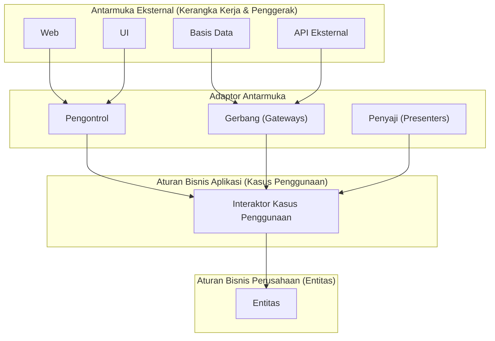
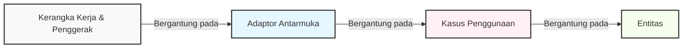
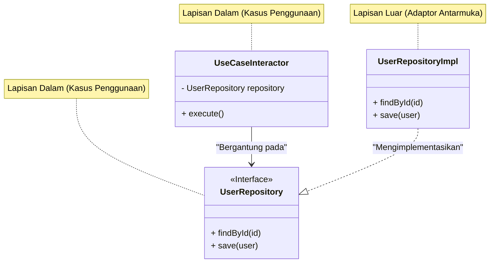

Dalam pengembangan perangkat lunak modern, membangun "sistem yang tangguh terhadap perubahan" adalah tantangan abadi. Perubahan persyaratan bisnis, munculnya kerangka kerja baru, perombakan UI, dan migrasi basis data. Terhadap semua perubahan ini, diperlukan arsitektur yang dapat beradaptasi secara fleksibel tanpa harus membangun ulang seluruh sistem. Sebagai salah satu jawabannya, **Clean Architecture (Arsitektur Bersih)** diusulkan oleh Robert C. Martin (dikenal sebagai Uncle Bob).

Pada artikel ini, kita akan menyelami esensi dari Clean Architecture melalui sejarah, tujuan, rincian dari keempat lapisannya, aturan ketergantungan, serta contoh implementasi konkret. Kami akan memberikan penjelasan teknis yang sangat mendalam dan terperinci.

## 1. Masalah pada Arsitektur Konvensional dan Sejarah Clean Architecture

Secara historis, arsitektur perangkat lunak telah mengalami berbagai pergeseran paradigma. Pada sistem-sistem awal, kode untuk logika bisnis, UI, dan akses data tergabung erat (biasa disebut kode spageti). Setelah itu, arsitektur 3 lapisan (lapisan presentasi, lapisan logika bisnis, lapisan akses data) menjadi populer dengan tujuan Pemisahan Perhatian (Separation of Concerns).

Namun, arsitektur 3 lapisan konvensional memiliki masalah besar. Yaitu "**domain (logika bisnis) menjadi bergantung pada basis data atau kerangka kerja (framework)**".

Sebagai contoh, jika lapisan logika bisnis memanggil lapisan akses data (seperti ORM) secara langsung, perubahan skema basis data atau perubahan ORM akan merembet ke logika bisnis. Dengan kata lain, timbul kontradiksi di mana "aturan bisnis" yang paling penting dan seharusnya tidak berubah, malah bergantung pada "infrastruktur" di mana perubahan teknis paling sering terjadi.

Sebagai solusi untuk masalah ini, arsitektur-arsitektur berikut telah dirancang:

*   **Hexagonal Architecture (Ports and Adapters)** - Alistair Cockburn
*   **Onion Architecture** - Jeffrey Palermo
*   **DCI (Data, Context and Interaction)** - James Coplien, Trygve Reenskaug
*   **BCE (Boundary-Control-Entity)** - Ivar Jacobson

Semua arsitektur ini memiliki tujuan yang sama. Tujuannya adalah "**Pemisahan Perhatian**". Yakni, membagi perangkat lunak ke dalam lapisan-lapisan, membuat masing-masing dapat diuji secara independen, dan menciptakan keadaan di mana perangkat lunak terlepas dari agen-agen eksternal (UI, DB, kerangka kerja).

Robert C. Martin mengintegrasikan konsep-konsep dari arsitektur-arsitektur luar biasa ini dan merangkumnya menjadi sebuah aturan praktis tunggal yang ia sebut "**Clean Architecture**".

## 2. Tujuan dan Karakteristik Clean Architecture

Sistem yang mengadopsi Clean Architecture memiliki karakteristik sebagai berikut:

1.  **Independen dari Kerangka Kerja (Independent of Frameworks)**: Arsitektur tidak bergantung pada keberadaan pustaka perangkat lunak yang kaya fitur. Hal ini memungkinkan kerangka kerja digunakan sebagai "alat", dan menghilangkan kebutuhan untuk menekan sistem ke dalam batasan-batasan kerangka kerja.
2.  **Dapat Diuji (Testable)**: Aturan bisnis dapat diuji tanpa UI, basis data, server web, atau elemen eksternal lainnya.
3.  **Independen dari UI (Independent of UI)**: UI dapat diubah dengan mudah tanpa mengubah bagian sistem lainnya. Misalnya, UI Web dapat diganti dengan UI Konsol tanpa mengubah aturan bisnis.
4.  **Independen dari Basis Data (Independent of Database)**: Anda dapat mengganti Oracle atau SQL Server dengan Mongo, BigTable, CouchDB, dan lainnya. Aturan bisnis tidak terikat pada basis data.
5.  **Independen dari Agen Eksternal Apa Pun (Independent of any external agency)**: Kenyataannya, aturan bisnis tidak mengetahui apa pun tentang dunia luar.

## 3. 4 Lapisan (Layers) dari Clean Architecture

Clean Architecture umumnya digambarkan dengan diagram lingkaran konsentris. Semakin dekat ke pusat, perangkat lunak menjadi kebijakan tingkat yang lebih tinggi (aturan bisnis dengan tingkat abstraksi yang tinggi). Semakin ke luar, menjadi mekanisme (detail konkret).



### 3.1. Entitas (Entities)
Entitas mengenkapsulasi aturan bisnis berskala perusahaan (Enterprise Business Rules). Entitas bisa berupa objek dengan metode, atau bisa juga berupa sekumpulan struktur data dan fungsi. Ini adalah aturan tingkat tinggi yang paling umum dan dapat digunakan kembali oleh beberapa aplikasi berbeda di dalam perusahaan.
Bahkan jika Anda hanya membuat satu aplikasi tunggal, entitas adalah objek bisnis dari aplikasi tersebut. Entitas tidak boleh terpengaruh oleh perubahan eksternal (seperti perubahan navigasi halaman atau perubahan keamanan).

### 3.2. Kasus Penggunaan (Use Cases)
Lapisan kasus penggunaan berisi aturan bisnis spesifik aplikasi (Application Business Rules). Di sinilah seluruh kasus penggunaan sistem dienkapsulasi dan diimplementasikan. Kasus penggunaan mengatur aliran data dari dan ke entitas, dan menginstruksikan entitas untuk mencapai tujuan sistem.
Perubahan pada lapisan ini tidak boleh memengaruhi entitas. Juga, perubahan eksternal seperti basis data, UI, atau kerangka kerja tidak memengaruhi lapisan ini. Kasus penggunaan sepenuhnya terpisah dari perhatian-perhatian tersebut.

### 3.3. Adaptor Antarmuka (Interface Adapters)
Lapisan adaptor antarmuka adalah sekumpulan adaptor yang mengonversi data dari format yang nyaman bagi kasus penggunaan dan entitas, ke format yang nyaman bagi agen eksternal seperti basis data atau Web.
Misalnya, elemen-elemen dari arsitektur MVC (Model-View-Controller) untuk GUI di dunia Web berada di sini. Pengontrol menerima input dari pengguna dan meneruskannya ke kasus penggunaan, kemudian penyaji menerima output dari kasus penggunaan dan memformatnya untuk tampilan (UI).
Peran lapisan ini juga untuk mengonversi data ke dalam format yang dapat dipahami oleh basis data (seperti SQL). Kode di sebelah dalam lapisan ini tidak boleh mengetahui apa pun tentang basis data.

### 3.4. Kerangka Kerja dan Penggerak (Frameworks & Drivers)
Lapisan terluar terdiri dari alat-alat seperti basis data, kerangka kerja Web, dll. Di sini biasanya Anda tidak banyak menulis kode selain "kode perekat (glue code)" untuk berkomunikasi dengan lingkaran-lingkaran di bagian dalam.
Lapisan ini menyimpan semua detail. Web adalah sebuah detail. Basis data adalah sebuah detail. Kita menempatkan detail-detail ini di luar agar dampak kerusakannya dapat diminimalkan.

## 4. Aturan Ketergantungan (The Dependency Rule)

Ada aturan yang paling penting dan mutlak tidak boleh dilanggar agar Clean Architecture dapat terbentuk. Itu adalah "**Aturan Ketergantungan (The Dependency Rule)**".

> Ketergantungan kode sumber (source code) hanya boleh mengarah ke dalam, menuju kebijakan tingkat yang lebih tinggi.

Kode yang berada di lingkaran dalam tidak boleh mengetahui apa pun tentang kode yang berada di lingkaran luar. Nama-nama (fungsi, kelas, variabel, dll.) yang dideklarasikan di lingkaran luar tidak boleh disebutkan di lingkaran dalam.
Demikian pula, format data yang digunakan di lingkaran luar tidak boleh digunakan di lingkaran dalam. Terutama jika format tersebut dihasilkan oleh kerangka kerja dari lingkaran luar.



Dinyatakan secara matematis, jika indeks lapisan didefinisikan sebagai $L_i$, dengan $i=0$ sebagai entitas (lapisan paling dalam) dan $i=3$ sebagai kerangka kerja (lapisan paling luar), jika terdapat ketergantungan dari lapisan $L_m$ ke $L_n$, maka pertidaksamaan berikut harus selalu berlaku:

$$ m > n $$

Artinya, vektor ketergantungan $\vec{D}$ selalu mengarah ke pusat.

## 5. Melintasi Batas: Prinsip Pembalikan Ketergantungan (DIP)

Ketika mencoba mematuhi aturan ketergantungan, kita segera dihadapkan pada satu masalah besar: "**Bagaimana jika kasus penggunaan perlu mengambil data dari basis data?**"

Jika lapisan kasus penggunaan (dalam) memanggil lapisan adaptor antarmuka (implementasi Repository di luar) secara langsung, ketergantungan akan mengarah ke luar, yang melanggar aturan ketergantungan.

Yang menyelesaikan masalah ini adalah huruf "D" dalam prinsip SOLID (Dependency Inversion Principle: Prinsip Pembalikan Ketergantungan).

### Definisi Prinsip Pembalikan Ketergantungan (DIP)
1. Modul tingkat tinggi tidak boleh bergantung pada modul tingkat rendah. Keduanya harus bergantung pada abstraksi.
2. Abstraksi tidak boleh bergantung pada detail. Detail harus bergantung pada abstraksi.

Untuk merealisasikannya, kita mendefinisikan **antarmuka (abstraksi)** di lapisan kasus penggunaan, dan lapisan luar (adaptor antarmuka) akan **mengimplementasikan** antarmuka tersebut. Lapisan kasus penggunaan hanya bergantung pada antarmuka yang didefinisikannya sendiri, dan tidak bergantung pada implementasi konkret di luar.



Pada gambar di atas, aliran kontrol (Control Flow) saat eksekusi adalah `UseCaseInteractor` $\rightarrow$ `UserRepositoryImpl`. Namun, ketergantungan kode sumber (Source Code Dependency) adalah `UserRepositoryImpl` $\rightarrow$ `UserRepository` (ke dalam). Dengan memanfaatkan polimorfisme, kita dapat mengarahkan ketergantungan kode sumber berlawanan dengan arah aliran kontrol. Inilah sebabnya disebut "**pembalikan**" ketergantungan.

## 6. Contoh Implementasi Konkret dengan TypeScript

Di sini, kami menunjukkan contoh implementasi sederhana dari Clean Architecture (fitur registrasi pengguna) menggunakan TypeScript.

### 6.1. Entitas (Entities)

Ini adalah aturan bisnis di pusat yang paling inti.

```typescript
// src/domain/entities/User.ts
export class User {
    constructor(
        public readonly id: string,
        public readonly name: string,
        public readonly email: string,
        public readonly createdAt: Date
    ) {}

    // Aturan bisnis spesifik entitas (misal: cek panjang nama dll.)
    public isValid(): boolean {
        return this.name.length >= 3 && this.email.includes('@');
    }
}
```

### 6.2. Kasus Penggunaan (Use Cases)

Di lapisan kasus penggunaan, kita mendefinisikan struktur data input dan output (DTO) serta antarmuka repositori untuk membalikkan ketergantungan.

```typescript
// src/application/repositories/UserRepository.ts
import { User } from '../../domain/entities/User';

// Antarmuka yang didefinisikan oleh lapisan kasus penggunaan
export interface UserRepository {
    findByEmail(email: string): Promise<User | null>;
    save(user: User): Promise<void>;
}

// src/application/usecases/RegisterUser/RegisterUserDTO.ts
export interface RegisterUserInputDTO {
    name: string;
    email: string;
}

export interface RegisterUserOutputDTO {
    id: string;
    name: string;
    email: string;
    createdAt: Date;
}

// src/application/usecases/RegisterUser/RegisterUserUseCase.ts
import { User } from '../../domain/entities/User';
import { UserRepository } from '../../repositories/UserRepository';
import { RegisterUserInputDTO, RegisterUserOutputDTO } from './RegisterUserDTO';

export class RegisterUserUseCase {
    // Bergantung pada abstraksi (antarmuka). Tidak bergantung pada hal yang konkret.
    constructor(private readonly userRepository: UserRepository) {}

    public async execute(input: RegisterUserInputDTO): Promise<RegisterUserOutputDTO> {
        const existingUser = await this.userRepository.findByEmail(input.email);
        if (existingUser) {
            throw new Error('User already exists');
        }

        const newUser = new User(
            crypto.randomUUID(),
            input.name,
            input.email,
            new Date()
        );

        if (!newUser.isValid()) {
            throw new Error('Invalid user data');
        }

        // Memanggil proses penyimpanan DB di luar, tapi ketergantungan mengarah ke dalam (antarmuka)
        await this.userRepository.save(newUser);

        return {
            id: newUser.id,
            name: newUser.name,
            email: newUser.email,
            createdAt: newUser.createdAt
        };
    }
}
```

### 6.3. Adaptor Antarmuka (Interface Adapters)

Kita membuat akses spesifik ke basis data (implementasi Repository) dan Controller yang memproses permintaan HTTP.

```typescript
// src/adapters/repositories/PostgresUserRepository.ts
import { UserRepository } from '../../application/repositories/UserRepository';
import { User } from '../../domain/entities/User';
// Asumsi klien DB yang merupakan lapisan luar (Driver)
import { DatabaseClient } from '../../infrastructure/database/DatabaseClient';

export class PostgresUserRepository implements UserRepository {
    constructor(private readonly dbClient: DatabaseClient) {}

    public async findByEmail(email: string): Promise<User | null> {
        const record = await this.dbClient.query('SELECT * FROM users WHERE email = $1', [email]);
        if (!record) return null;
        return new User(record.id, record.name, record.email, record.created_at);
    }

    public async save(user: User): Promise<void> {
        await this.dbClient.query(
            'INSERT INTO users (id, name, email, created_at) VALUES ($1, $2, $3, $4)',
            [user.id, user.name, user.email, user.createdAt]
        );
    }
}

// src/adapters/controllers/UserController.ts
import { RegisterUserUseCase } from '../../application/usecases/RegisterUser/RegisterUserUseCase';

export class UserController {
    constructor(private readonly registerUserUseCase: RegisterUserUseCase) {}

    public async register(req: any, res: any): Promise<void> {
        try {
            const input = {
                name: req.body.name,
                email: req.body.email
            };
            const output = await this.registerUserUseCase.execute(input);
            res.status(201).json(output);
        } catch (error: any) {
            res.status(400).json({ message: error.message });
        }
    }
}
```

### 6.4. Komponen Utama (Injeksi Ketergantungan: DI)

Saat aplikasi dijalankan, kita membangun (merangkai) seluruh dependensi. Ini disebut Composition Root.

```typescript
// src/infrastructure/web/server.ts
import express from 'express';
import { DatabaseClient } from '../database/DatabaseClient';
import { PostgresUserRepository } from '../../adapters/repositories/PostgresUserRepository';
import { RegisterUserUseCase } from '../../application/usecases/RegisterUser/RegisterUserUseCase';
import { UserController } from '../../adapters/controllers/UserController';

const app = express();
app.use(express.json());

// 1. Inisialisasi penggerak (driver)
const dbClient = new DatabaseClient(/* Info koneksi */);

// 2. Inisialisasi adaptor (membuat instance kelas konkret)
const userRepository = new PostgresUserRepository(dbClient);

// 3. Inisialisasi kasus penggunaan (menyuntikkan kelas konkret ke antarmuka = DI)
const registerUserUseCase = new RegisterUserUseCase(userRepository);

// 4. Inisialisasi pengontrol
const userController = new UserController(registerUserUseCase);

// Routing
app.post('/users', (req, res) => userController.register(req, res));

app.listen(3000, () => {
    console.log('Server is running on port 3000');
});
```

Dengan cara ini, "skrip startup" yang berada paling luar mengambil alih detail-detail kotor (pembuatan instance kelas konkret) dan hanya mewariskan antarmuka bersih ke lapisan dalam, sehingga logika bisnis sepenuhnya terisolasi dari dunia luar.

## 7. Analisis Matematis tentang Coupling (Kopling) dan Cohesion (Kohesi)

Dalam rekayasa perangkat lunak, **Coupling (Tingkat Keterkaitan)** dan **Cohesion (Tingkat Kepaduan)** adalah metrik untuk mengevaluasi kualitas arsitektur.

Coupling $C$ merepresentasikan kekuatan ketergantungan antar modul. Jika Modul $A$ bergantung pada Modul $B$, dan jumlah total ketergantungan dalam sistem adalah $N_{dep}$, serta jumlah modul adalah $N_{mod}$, salah satu indikator kompleksitas dapat dinyatakan sebagai berikut:

$$ Complexity \propto \frac{N_{dep}}{N_{mod}} $$

Dalam Clean Architecture, dengan menerapkan DIP, kita mengarahkan panah ketergantungan fisik menuju abstraksi. Frekuensi perubahan (Instability: $I$) dari abstraksi (antarmuka) dirancang sangat rendah.

Instability $I$ dihitung menggunakan rumus berikut (didefinisikan oleh Robert C. Martin):
*   $C_e$ (Efferent Coupling): Kopling keluar (jumlah dependensi dari modul ini ke modul lain)
*   $C_a$ (Afferent Coupling): Kopling ke dalam (jumlah dependensi dari modul lain ke modul ini)

$$ I = \frac{C_e}{C_e + C_a} $$

*   Jika $I = 0$, komponen tersebut sepenuhnya stabil (tidak bergantung pada siapa pun, dan diandalkan oleh yang lain).
*   Jika $I = 1$, komponen tersebut sepenuhnya tidak stabil (tidak diandalkan oleh yang lain, dan bergantung pada yang lain).

Dalam "Lapisan Entitas" pada Clean Architecture, karena $C_e = 0$ (tidak bergantung pada bagian luar), maka $I = 0$. Artinya, ini adalah lapisan yang paling stabil.
Sebaliknya, "Lapisan UI" dan "Lapisan DB" memiliki $C_a \approx 0$ dan $C_e > 0$, sehingga $I \approx 1$, menjadikannya lapisan yang mudah diubah (lapisan tidak stabil).

Prinsip penting dari arsitektur yaitu SDP (Stable Dependencies Principle: Prinsip Ketergantungan Stabil) menetapkan bahwa "**Ketergantungan harus mengarah pada komponen yang lebih stabil (komponen dengan nilai $I$ yang lebih kecil)**". Lingkaran konsentris dari Clean Architecture adalah visualisasi dari SDP ini, dirancang sedemikian rupa agar ketergantungan mengarah dari luar ($I=1$) ke dalam ($I=0$).

## 8. Strategi Pengujian dan Clean Architecture

Salah satu keuntungan terbesar dari Clean Architecture adalah **kemudahan pengujian**. Karena lapisan-lapisannya terpisah, Anda dapat menulis tes untuk masing-masing lapisan secara independen.

### 8.1. Pengujian Entitas (Unit Test)
Karena ini adalah logika murni tanpa ada ketergantungan eksternal sama sekali, DB maupun Mock tidak diperlukan. Ini adalah tes yang paling andal dan dapat dieksekusi paling cepat.

### 8.2. Pengujian Kasus Penggunaan (Unit Test with Mocks)
Karena semua ketergantungan eksternal seperti repositori didefinisikan sebagai antarmuka, saat pengujian, kita hanya perlu menyuntikkan (DI) **mock untuk pengujian atau implementasi dalam memori (Fake)**. Kita tidak perlu menjalankan basis data sungguhan. Hal ini memungkinkan percabangan yang kompleks dan penanganan pengecualian pada logika bisnis untuk diuji dengan cepat.

```typescript
// Contoh pengujian kasus penggunaan (Berasumsi menggunakan Jest)
test('Akan terjadi error jika mencoba mendaftar dengan email yang sudah ada', async () => {
    // Membuat repositori Fake
    const mockRepo: UserRepository = {
        findByEmail: async (email) => new User('1', 'Test', email, new Date()), // Mengembalikan pengguna yang sudah ada
        save: async (user) => {}
    };

    const useCase = new RegisterUserUseCase(mockRepo);
    
    // Eksekusi kasus penggunaan dan asersi error
    await expect(useCase.execute({ name: 'Bob', email: 'test@example.com' }))
        .rejects
        .toThrow('User already exists');
});
```

### 8.3. Pengujian Adaptor (Integration Test)
Kelas implementasi repositori benar-benar terhubung ke basis data untuk menguji apakah kueri SQL-nya sudah benar. Pengujian pengontrol akan menguji penerimaan permintaan HTTP dan pengembalian bagian JSON-nya. Di sini, validasi rinci atas logika bisnis tidak dilakukan, tetapi hanya memastikan bahwa "konversi" dan "komunikasi" sudah benar.

## 9. Kekurangan Clean Architecture dan Kapan Harus Mengadopsinya

Meskipun terlihat seperti solusi untuk segala hal, Clean Architecture bukanlah peluru perak. Terdapat kekurangan (trade-off) sebagai berikut:

1.  **Peningkatan biaya pembelajaran awal dan biaya pengembangan**: Jumlah file dan antarmuka (abstraksi) akan meningkat secara signifikan. Akan ada banyak "kode boilerplate (kode kerangka standar)" seperti pemindahan DTO.
2.  **Berlebihan untuk proyek skala kecil**: Untuk prototipe yang dibuat dalam beberapa hari atau perkakas sekali pakai yang hampir tidak pernah diubah, mengadopsi arsitektur ini sering kali menjadi biaya yang sia-sia. Arsitektur ini juga tidak cocok untuk API sederhana yang hanya melakukan operasi CRUD.

**Kapan harus mengadopsinya**:
*   Produk yang diperkirakan akan dikelola dan dioperasikan untuk jangka waktu yang panjang (lebih dari beberapa tahun).
*   Sistem dengan aturan bisnis yang kompleks dan sering mengalami perubahan spesifikasi.
*   Jika Anda ingin memajukan pembagian kerja dalam tim pengembangan skala besar (front-end, back-end, infrastruktur, dll.).
*   Jika Anda ingin memodelkan area bisnis yang kompleks dengan mengombinasikannya dengan Domain-Driven Design (DDD).

## 10. Kesimpulan

Clean Architecture adalah sebuah filosofi desain yang bertujuan untuk melindungi inti dari sistem, yaitu "aturan bisnis", dari "detail-detail" seperti UI, basis data, dan kerangka kerja.

Inti dari hal ini adalah **Aturan Ketergantungan** dan **Prinsip Pembalikan Ketergantungan (DIP)**. Dengan menerapkan ini dengan benar, perangkat lunak menjadi fleksibel terhadap perubahan, mudah diuji, dan mampu mempertahankan nilainya untuk jangka waktu yang lama.

Yang terpenting bukanlah meniru struktur direktori Clean Architecture secara membabi buta, melainkan memahami esensi dari "**mengapa dibagi seperti itu**" dan "**ke mana panah ketergantungan mengarah**", serta menerapkannya dengan tepat sesuai dengan skala dan kompleksitas proyek Anda sendiri.

---
*Referensi: "Clean Architecture: A Craftsman's Guide to Software Structure and Design" oleh Robert C. Martin*
