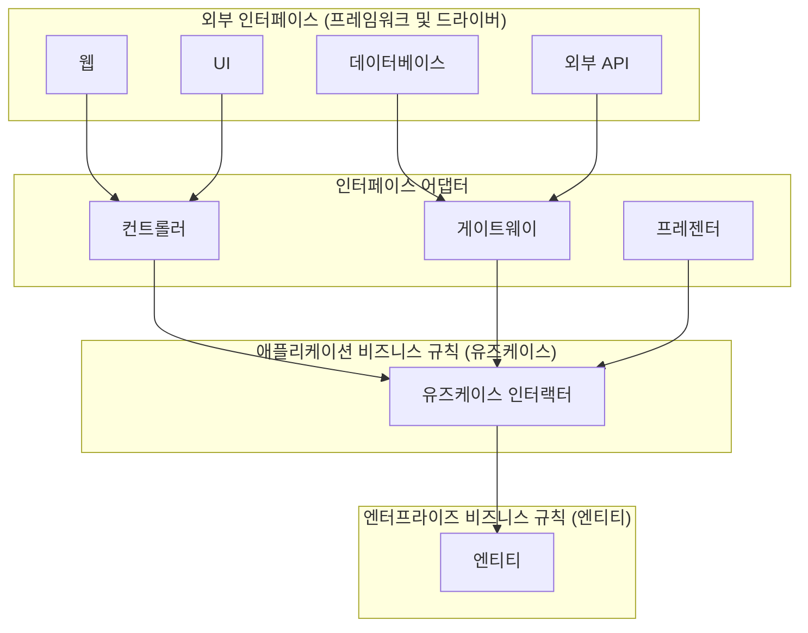
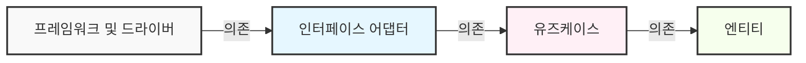
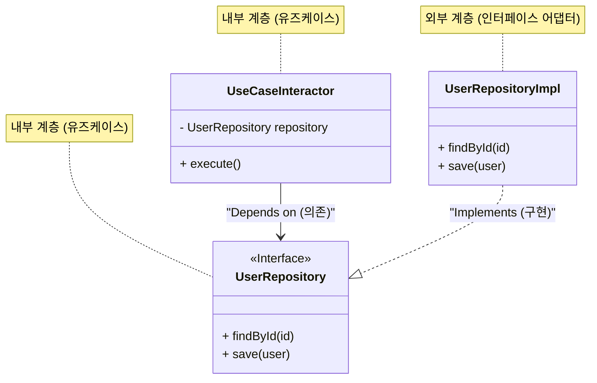

현대 소프트웨어 개발에서 '변화에 강한 시스템'을 구축하는 것은 영원한 과제입니다. 비즈니스 요구사항의 변경, 새로운 프레임워크의 대두, UI의 쇄신, 데이터베이스의 마이그레이션. 이 모든 변화에 대해 시스템 전체를 재구축하지 않고도 유연하게 적응할 수 있는 아키텍처가 요구되고 있습니다. 그 해답 중 하나로 Robert C. Martin(일명 엉클 밥, Uncle Bob)이 제창한 것이 **클린 아키텍처(Clean Architecture)**입니다.

본 문서에서는 클린 아키텍처의 역사, 목적, 4개의 계층에 대한 상세, 의존성 규칙, 그리고 구체적인 구현 예시를 통해 클린 아키텍처의 진수에 다가갑니다. 매우 깊고 상세한 기술적 해설을 제공합니다.

## 1. 기존 아키텍처의 문제점과 클린 아키텍처의 역사

역사적으로 볼 때 소프트웨어 아키텍처는 다양한 패러다임 전환을 겪어왔습니다. 초기 시스템에서는 비즈니스 로직, UI, 데이터 접근 코드가 강하게 결합되어 있었습니다(이른바 스파게티 코드). 그 후 관심사의 분리(Separation of Concerns)를 목적으로 3계층 아키텍처(프레젠테이션 계층, 비즈니스 로직 계층, 데이터 접근 계층)가 보급되었습니다.

하지만 기존의 3계층 아키텍처에는 큰 문제가 있었습니다. 바로 '**도메인(비즈니스 로직)이 데이터베이스나 프레임워크에 의존하게 된다**'는 점입니다.

예를 들어, 비즈니스 로직 계층이 데이터 접근 계층(ORM 등)을 직접 호출하면, 데이터베이스의 스키마 변경이나 ORM의 변경이 비즈니스 로직으로 파급되어 버립니다. 즉, 가장 중요하고 변경되어서는 안 될 '비즈니스 규칙'이, 가장 기술적인 변경이 일어나기 쉬운 '인프라'에 의존하게 된다는 모순이 발생하고 있었습니다.

이에 대한 해결책으로 다음과 같은 아키텍처들이 고안되어 왔습니다.

*   **헥사고날 아키텍처 (Ports and Adapters)** - Alistair Cockburn
*   **어니언 아키텍처** - Jeffrey Palermo
*   **DCI (Data, Context and Interaction)** - James Coplien, Trygve Reenskaug
*   **BCE (Boundary-Control-Entity)** - Ivar Jacobson

이러한 아키텍처들은 모두 같은 목적을 가지고 있습니다. 바로 '**관심사의 분리**'입니다. 소프트웨어를 계층으로 분할하고, 각각이 독립적으로 테스트 가능하며, 외부 에이전트(UI, DB, 프레임워크)로부터 독립적인 상태를 만드는 것입니다.

Robert C. Martin은 이러한 훌륭한 아키텍처의 개념들을 통합하고, 하나의 실용적인 규칙으로 정리한 것을 '**클린 아키텍처**'라고 명명했습니다.

## 2. 클린 아키텍처의 목적과 특성

클린 아키텍처를 도입한 시스템은 다음과 같은 특성을 가집니다.

1.  **프레임워크 독립성 (Independent of Frameworks)**: 아키텍처는 기능이 풍부한 소프트웨어 라이브러리의 존재에 의존하지 않습니다. 이를 통해 프레임워크를 '도구'로 사용할 수 있으며, 시스템을 프레임워크의 제약에 끼워 맞출 필요가 없어집니다.
2.  **테스트 가능성 (Testable)**: 비즈니스 규칙은 UI, 데이터베이스, 웹 서버 및 기타 외부 요소 없이도 테스트할 수 있습니다.
3.  **UI 독립성 (Independent of UI)**: UI는 시스템의 나머지 부분을 변경하지 않고도 쉽게 변경할 수 있습니다. 예를 들어, 웹 UI는 비즈니스 규칙을 변경하지 않고도 콘솔 UI로 대체될 수 있습니다.
4.  **데이터베이스 독립성 (Independent of Database)**: Oracle이나 SQL Server를 Mongo, BigTable, CouchDB 등으로 변경할 수 있습니다. 비즈니스 규칙은 데이터베이스에 얽매이지 않습니다.
5.  **외부 에이전트 독립성 (Independent of any external agency)**: 실제로 비즈니스 규칙은 외부 세계에 대해 아무것도 알지 못합니다.

## 3. 클린 아키텍처의 4가지 계층 (Layers)

클린 아키텍처는 일반적으로 동심원 형태의 그림으로 표현됩니다. 중심에 가까워질수록 소프트웨어는 상위 수준의 정책(추상도가 높은 비즈니스 규칙)이 됩니다. 바깥쪽으로 갈수록 메커니즘(구체적인 세부 사항)이 됩니다.



### 3.1. 엔티티 (Entities)
엔티티는 전사적인 비즈니스 규칙(Enterprise Business Rules)을 캡슐화합니다. 엔티티는 메서드를 가진 객체일 수도 있고, 데이터 구조와 함수의 집합일 수도 있습니다. 사내의 여러 다른 애플리케이션에서 재사용할 수 있는 가장 일반적이고 고차원적인 규칙입니다.
단일 애플리케이션만 구축하는 경우에도 엔티티는 해당 애플리케이션의 비즈니스 객체가 됩니다. 외부의 변경(페이지 내비게이션의 변경이나 보안 변경 등)이 있더라도 엔티티는 결코 영향을 받지 않습니다.

### 3.2. 유즈케이스 (Use Cases)
유즈케이스 계층은 애플리케이션 고유의 비즈니스 규칙(Application Business Rules)을 포함합니다. 여기서는 시스템의 모든 유즈케이스를 캡슐화하고 구현합니다. 유즈케이스는 엔티티와 그 사이의 데이터 흐름을 조정하며, 엔티티에게 시스템의 목표를 달성하도록 지시합니다.
이 계층의 변경이 엔티티에 영향을 주어서는 안 됩니다. 또한 데이터베이스, UI, 프레임워크 등 외부의 변경이 이 계층에 영향을 주지도 않습니다. 유즈케이스는 이러한 관심사들로부터 완전히 분리되어 있습니다.

### 3.3. 인터페이스 어댑터 (Interface Adapters)
인터페이스 어댑터 계층은 유즈케이스나 엔티티에게 편리한 데이터 형식에서 데이터베이스나 웹 등 외부 에이전트에게 편리한 데이터 형식으로 변환하는 어댑터의 집합입니다.
예를 들어 웹 환경에서 GUI의 MVC(Model-View-Controller) 아키텍처 요소들이 이곳에 속합니다. 컨트롤러는 사용자의 입력을 받아 유즈케이스로 전달하고, 유즈케이스의 출력을 프레젠터가 받아 뷰(UI)에 맞게 포맷팅합니다.
또한 데이터를 데이터베이스(SQL 등)가 이해할 수 있는 형식으로 변환하는 것도 이 계층의 역할입니다. 이 계층보다 안쪽의 코드는 데이터베이스에 대해 아무것도 알아서는 안 됩니다.

### 3.4. 프레임워크와 드라이버 (Frameworks & Drivers)
가장 바깥쪽 계층은 데이터베이스, 웹 프레임워크 등과 같은 도구들로 구성됩니다. 여기서는 보통 안쪽의 원들과 통신하기 위한 '연결 코드(글루 코드)' 이외의 코드는 거의 작성하지 않습니다.
이 계층에는 모든 세부 사항이 보관됩니다. 웹은 세부 사항입니다. 데이터베이스는 세부 사항입니다. 피해를 최소화하기 위해 이러한 세부 사항을 바깥쪽에 배치합니다.

## 4. 의존성 규칙 (The Dependency Rule)

클린 아키텍처를 성립시키기 위한 가장 중요하고 절대로 어겨서는 안 되는 규칙이 있습니다. 그것이 바로 '**의존성 규칙 (The Dependency Rule)**'입니다.

> 소스 코드의 의존성은 반드시 안쪽(상위 수준의 정책)을 향해야만 한다.

안쪽 원에 속하는 코드는 바깥쪽 원에 속하는 코드에 대해 아무것도 알아서는 안 됩니다. 바깥쪽 원에서 선언된 이름(함수, 클래스, 변수 등)을 안쪽 원에서 언급해서는 안 됩니다.
마찬가지로, 바깥쪽 원에서 사용되는 데이터 포맷을 안쪽 원에서 사용해서는 안 됩니다. 특히 그 포맷이 바깥쪽 원의 프레임워크에 의해 생성된 것이라면 더더욱 그렇습니다.



수학적으로 표현하면, 계층의 인덱스를 $L_i$ 라고 하고, $i=0$ 을 엔티티(가장 안쪽 계층), $i=3$ 을 프레임워크(가장 바깥쪽 계층)로 정의했을 때, 특정 계층 $L_m$ 에서 $L_n$ 으로의 의존성이 존재한다면 반드시 다음의 부등식이 성립해야 합니다.

$$ m > n $$

즉, 의존성 벡터 $\vec{D}$ 는 항상 중심을 향합니다.

## 5. 경계를 넘어서: 의존성 역전 원칙 (DIP)

의존성 규칙을 준수하려고 하면 곧바로 하나의 큰 문제에 직면하게 됩니다. '**유즈케이스가 데이터베이스에서 데이터를 가져와야 할 경우 어떻게 해야 하는가?**'

유즈케이스 계층(안쪽)이 인터페이스 어댑터 계층(바깥쪽의 Repository 구현체)을 직접 호출하면 의존성이 바깥쪽을 향하게 되어, 의존성 규칙 위반이 됩니다.

이 문제를 해결하는 것이 바로 SOLID 원칙 중 'D(Dependency Inversion Principle: 의존성 역전 원칙)'입니다.

### 의존성 역전 원칙 (DIP) 의 정의
1. 상위 모듈은 하위 모듈에 의존해서는 안 된다. 두 모듈 모두 추상화에 의존해야 한다.
2. 추상화는 세부 사항에 의존해서는 안 된다. 세부 사항이 추상화에 의존해야 참조해야 한다.

이를 구현하기 위해 유즈케이스 계층에 **인터페이스(추상화)**를 정의하고, 바깥쪽 계층(인터페이스 어댑터)에서 그 인터페이스를 **구현**합니다. 유즈케이스 계층은 자신이 정의한 인터페이스에만 의존하며, 바깥쪽의 구체적인 구현에는 의존하지 않습니다.



위의 그림에서 실행 시의 제어 흐름(Control Flow)은 `UseCaseInteractor` $\rightarrow$ `UserRepositoryImpl` 입니다. 하지만 소스 코드의 의존 관계(Source Code Dependency)는 `UserRepositoryImpl` $\rightarrow$ `UserRepository`(안쪽)가 됩니다. 다형성을 이용함으로써 제어 흐름과는 반대 방향으로 소스 코드의 의존 관계를 향하게 할 수 있었습니다. 이것이 '의존성의 **역전**'이라고 불리는 이유입니다.

## 6. TypeScript를 활용한 구체적인 구현 예시

여기서는 TypeScript를 사용하여 클린 아키텍처의 간단한 구현 예시(사용자 등록 기능)를 보여줍니다.

### 6.1. 엔티티 (Entities)

가장 중심에 있는 비즈니스 규칙입니다.

```typescript
// src/domain/entities/User.ts
export class User {
    constructor(
        public readonly id: string,
        public readonly name: string,
        public readonly email: string,
        public readonly createdAt: Date
    ) {}

    // 엔티티 고유의 비즈니스 규칙(예: 이름 길이 체크 등)
    public isValid(): boolean {
        return this.name.length >= 3 && this.email.includes('@');
    }
}
```

### 6.2. 유즈케이스 (Use Cases)

유즈케이스 계층에서는 입력과 출력의 데이터 구조(DTO)와 의존성을 역전시키기 위한 리포지토리 인터페이스를 정의합니다.

```typescript
// src/application/repositories/UserRepository.ts
import { User } from '../../domain/entities/User';

// 유즈케이스 계층이 정의하는 인터페이스
export interface UserRepository {
    findByEmail(email: string): Promise<User | null>;
    save(user: User): Promise<void>;
}

// src/application/usecases/RegisterUser/RegisterUserDTO.ts
export interface RegisterUserInputDTO {
    name: string;
    email: string;
}

export interface RegisterUserOutputDTO {
    id: string;
    name: string;
    email: string;
    createdAt: Date;
}

// src/application/usecases/RegisterUser/RegisterUserUseCase.ts
import { User } from '../../domain/entities/User';
import { UserRepository } from '../../repositories/UserRepository';
import { RegisterUserInputDTO, RegisterUserOutputDTO } from './RegisterUserDTO';

export class RegisterUserUseCase {
    // 추상(인터페이스)에 의존한다. 구상에는 의존하지 않는다.
    constructor(private readonly userRepository: UserRepository) {}

    public async execute(input: RegisterUserInputDTO): Promise<RegisterUserOutputDTO> {
        const existingUser = await this.userRepository.findByEmail(input.email);
        if (existingUser) {
            throw new Error('User already exists');
        }

        const newUser = new User(
            crypto.randomUUID(),
            input.name,
            input.email,
            new Date()
        );

        if (!newUser.isValid()) {
            throw new Error('Invalid user data');
        }

        // 바깥쪽의 DB 저장 처리를 호출하지만, 의존은 안쪽(인터페이스)을 향하고 있다
        await this.userRepository.save(newUser);

        return {
            id: newUser.id,
            name: newUser.name,
            email: newUser.email,
            createdAt: newUser.createdAt
        };
    }
}
```

### 6.3. 인터페이스 어댑터 (Interface Adapters)

데이터베이스로의 구체적인 접근 처리(Repository 구현)와 HTTP 요청을 처리하는 Controller를 작성합니다.

```typescript
// src/adapters/repositories/PostgresUserRepository.ts
import { UserRepository } from '../../application/repositories/UserRepository';
import { User } from '../../domain/entities/User';
// 바깥쪽 계층(Driver)인 DB 클라이언트를 가정
import { DatabaseClient } from '../../infrastructure/database/DatabaseClient';

export class PostgresUserRepository implements UserRepository {
    constructor(private readonly dbClient: DatabaseClient) {}

    public async findByEmail(email: string): Promise<User | null> {
        const record = await this.dbClient.query('SELECT * FROM users WHERE email = $1', [email]);
        if (!record) return null;
        return new User(record.id, record.name, record.email, record.created_at);
    }

    public async save(user: User): Promise<void> {
        await this.dbClient.query(
            'INSERT INTO users (id, name, email, created_at) VALUES ($1, $2, $3, $4)',
            [user.id, user.name, user.email, user.createdAt]
        );
    }
}

// src/adapters/controllers/UserController.ts
import { RegisterUserUseCase } from '../../application/usecases/RegisterUser/RegisterUserUseCase';

export class UserController {
    constructor(private readonly registerUserUseCase: RegisterUserUseCase) {}

    public async register(req: any, res: any): Promise<void> {
        try {
            const input = {
                name: req.body.name,
                email: req.body.email
            };
            const output = await this.registerUserUseCase.execute(input);
            res.status(201).json(output);
        } catch (error: any) {
            res.status(400).json({ message: error.message });
        }
    }
}
```

### 6.4. 메인 컴포넌트 (의존성 주입: DI)

애플리케이션 시작 시 모든 의존 관계를 구성(와이어링)합니다. 이를 Composition Root라고 부릅니다.

```typescript
// src/infrastructure/web/server.ts
import express from 'express';
import { DatabaseClient } from '../database/DatabaseClient';
import { PostgresUserRepository } from '../../adapters/repositories/PostgresUserRepository';
import { RegisterUserUseCase } from '../../application/usecases/RegisterUser/RegisterUserUseCase';
import { UserController } from '../../adapters/controllers/UserController';

const app = express();
app.use(express.json());

// 1. 드라이버 초기화
const dbClient = new DatabaseClient(/* 접속 정보 */);

// 2. 어댑터 초기화 (구상 클래스를 인스턴스화)
const userRepository = new PostgresUserRepository(dbClient);

// 3. 유즈케이스 초기화 (인터페이스에 구상을 주입 = DI)
const registerUserUseCase = new RegisterUserUseCase(userRepository);

// 4. 컨트롤러 초기화
const userController = new UserController(registerUserUseCase);

// 라우팅
app.post('/users', (req, res) => userController.register(req, res));

app.listen(3000, () => {
    console.log('Server is running on port 3000');
});
```

이처럼 가장 바깥쪽의 '시작 스크립트'가 더러운 세부 사항(구상 클래스의 인스턴스화)을 맡고, 안쪽 계층에는 깔끔한 인터페이스만 전달하는 구조로 만들면 비즈니스 로직은 외부 세계로부터 완전히 격리됩니다.

## 7. 결합도와 응집도의 수학적 고찰

소프트웨어 공학에서 아키텍처의 품질을 평가하는 지표로 **결합도(Coupling)**와 **응집도(Cohesion)**가 있습니다.

결합도 $C$ 란 모듈 간 의존성의 강도를 나타냅니다. 모듈 $A$ 가 모듈 $B$ 에 의존하는 경우, 시스템의 총 의존 관계 수를 $N_{dep}$, 모듈 수를 $N_{mod}$ 라고 할 때, 복잡도를 나타내는 지표 중 하나는 다음과 같이 표현할 수 있습니다.

$$ Complexity \propto \frac{N_{dep}}{N_{mod}} $$

클린 아키텍처에서 DIP를 적용함으로써 물리적인 의존성의 화살표를 추상화로 향하게 합니다. 추상화(인터페이스)의 변경 빈도(Instability: $I$)는 매우 낮게 설계됩니다.

Instability $I$ 는 다음 공식으로 계산됩니다(Robert C. Martin의 정의).
*   $C_e$ (Efferent Coupling): 바깥을 향한 결합 (자신이 의존하고 있는 수)
*   $C_a$ (Afferent Coupling): 안을 향한 결합 (자신에게 의존하고 있는 수)

$$ I = \frac{C_e}{C_e + C_a} $$

*   $I = 0$ 인 경우, 해당 컴포넌트는 완전히 안정적입니다(아무에게도 의존하지 않으며, 다른 곳에서 의존받고 있음).
*   $I = 1$ 인 경우, 해당 컴포넌트는 완전히 불안정합니다(다른 곳에서 의존받지 않으며, 다른 곳에 의존하고 있음).

클린 아키텍처의 '엔티티 계층'은 $C_e = 0$(바깥쪽에 의존하지 않음)이므로 $I = 0$ 이 됩니다. 즉, 가장 안정적인 계층입니다.
반대로 'UI 계층'이나 'DB 계층'은 $C_a \approx 0$ 이고 $C_e > 0$ 이기 때문에 $I \approx 1$ 이 되어, 쉽게 변경 가능한 계층(불안정한 계층)이 됩니다.

아키텍처의 중요한 원칙인 SDP(Stable Dependencies Principle: 안정된 의존성 원칙)는 '**의존성은 더 안정된 컴포넌트($I$가 작은 컴포넌트)를 향해야 한다**'고 규정하고 있습니다. 클린 아키텍처의 동심원은 바로 이 SDP를 시각화한 것이며, 바깥쪽($I=1$)에서 안쪽($I=0$)으로 의존성이 향하도록 설계되어 있습니다.

## 8. 테스트 전략과 클린 아키텍처

클린 아키텍처의 가장 큰 장점 중 하나는 **테스트의 용이성**입니다. 계층이 분리되어 있기 때문에 각 계층에 맞는 테스트를 독립적으로 작성할 수 있습니다.

### 8.1. 엔티티 테스트 (Unit Test)
외부에 대한 의존성이 전혀 없는 순수한 로직이므로 DB도 모킹도 필요하지 않습니다. 가장 빠르게 실행할 수 있는 확실한 테스트가 됩니다.

### 8.2. 유즈케이스 테스트 (Unit Test with Mocks)
리포지토리 등의 외부 의존성은 모두 인터페이스로 정의되어 있기 때문에, 테스트 시에는 **테스트용 모의 객체(Mock)나 인메모리 구현체(Fake)**를 주입(DI)하기만 하면 됩니다. 실제 데이터베이스를 띄울 필요는 없습니다. 이를 통해 비즈니스 로직의 복잡한 분기나 예외 처리를 고속으로 테스트할 수 있습니다.

```typescript
// 유즈케이스의 테스트 예시 (Jest를 가정)
test('기존 이메일 주소로 가입하려고 하면 에러가 발생한다', async () => {
    // Fake 리포지토리 생성
    const mockRepo: UserRepository = {
        findByEmail: async (email) => new User('1', 'Test', email, new Date()), // 기존 사용자를 반환
        save: async (user) => {}
    };

    const useCase = new RegisterUserUseCase(mockRepo);
    
    // 유즈케이스 실행 및 에러 단언(Assertion)
    await expect(useCase.execute({ name: 'Bob', email: 'test@example.com' }))
        .rejects
        .toThrow('User already exists');
});
```

### 8.3. 어댑터 테스트 (Integration Test)
리포지토리 구현 클래스는 실제로 데이터베이스에 연결하여 SQL이 올바른지 테스트합니다. 컨트롤러 테스트는 HTTP 요청을 받아 JSON을 반환하는 부분을 테스트합니다. 여기서는 비즈니스 로직의 상세한 검증은 수행하지 않으며, 어디까지나 '변환'과 '통신'이 올바른지 확인합니다.

## 9. 클린 아키텍처의 단점과 채택해야 할 시기

만능으로 보이는 클린 아키텍처지만 강력한 은탄환은 아닙니다. 다음과 같은 단점(트레이드오프)이 존재합니다.

1.  **초기 학습 비용과 개발 비용의 증가**: 파일 수나 인터페이스(추상화)의 수가 대폭 증가합니다. DTO의 데이터 복사와 같은 '보일러플레이트 코드(상용구 코드)'가 많아집니다.
2.  **소규모 프로젝트에는 오버킬**: 며칠 만에 만드는 프로토타입이나 변경이 거의 발생하지 않는 단발성 도구에서 이 아키텍처를 채택하는 것은 불필요한 비용 낭비가 되는 경우가 많습니다. CRUD 작업만 있는 단순한 API에도 적합하지 않습니다.

**채택해야 할 시기**:
*   장기간(수년 이상) 유지보수 및 운영될 것으로 예상되는 제품.
*   비즈니스 규칙이 복잡하고 사양 변경이 빈번하게 발생하는 시스템.
*   대규모 개발 팀에서 분업(프론트엔드, 백엔드, 인프라 등)을 진행하고 싶은 경우.
*   도메인 주도 설계(DDD: Domain-Driven Design)와 결합하여 복잡한 비즈니스 영역을 모델링하고 싶은 경우.

## 10. 요약

클린 아키텍처는 '비즈니스 규칙'이라는 시스템의 핵심을 UI나 데이터베이스, 프레임워크와 같은 '세부 사항'으로부터 보호하기 위한 설계 사상입니다.

그 핵심을 이루는 것은 **의존성 규칙**과 **의존성 역전 원칙(DIP)**입니다. 이를 올바르게 적용함으로써 소프트웨어는 변화에 유연해지고, 테스트가 쉬워지며, 오랜 기간에 걸쳐 그 가치를 계속 유지할 수 있습니다.

중요한 것은 클린 아키텍처의 디렉토리 구조를 맹목적으로 모방하는 것이 아니라, '**왜 그렇게 분할하는가**', '**의존성의 화살표는 어디를 향하고 있는가**'라는 본질을 이해하고, 자신의 프로젝트의 규모와 복잡성에 맞게 적절히 적용해 나가는 것입니다.

---
*Reference: "Clean Architecture: A Craftsman's Guide to Software Structure and Design" by Robert C. Martin*
