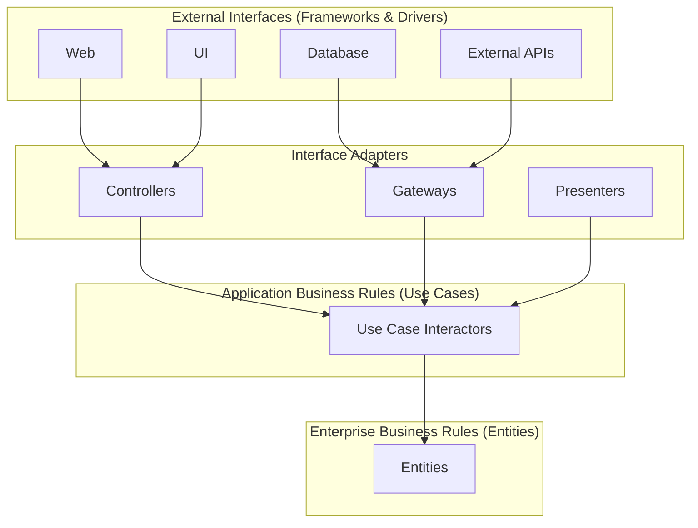
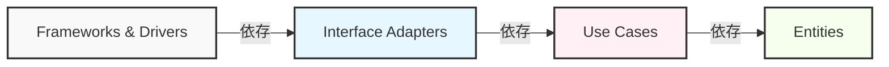
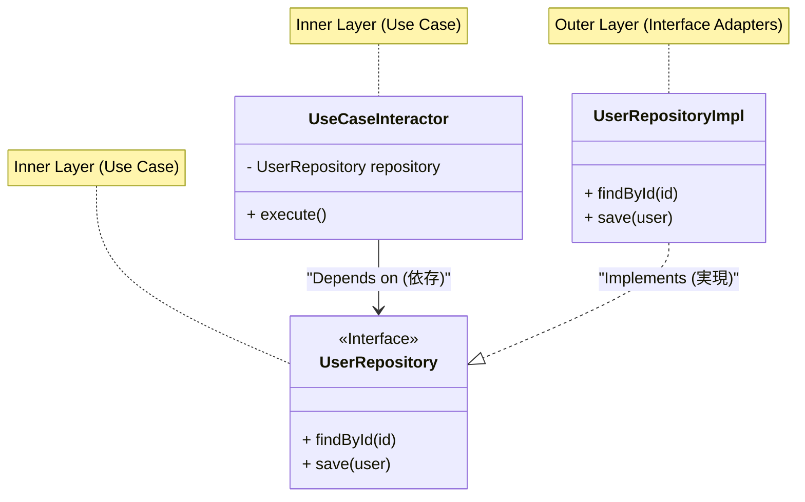

現代のソフトウェア開発において、「変化に強いシステム」を構築することは永遠の課題です。ビジネス要件の変更、新しいフレームワークの台頭、UIの刷新、データベースの移行。これらすべての変化に対して、システム全体を再構築することなく、柔軟に適応できるアーキテクチャが求められています。その答えの一つとして、Robert C. Martin（通称ボブおじさん、Uncle Bob）によって提唱されたのが**クリーンアーキテクチャ（Clean Architecture）**です。

本記事では、クリーンアーキテクチャの歴史、目的、4つの層の詳細、依存性のルール、そして具体的な実装例を通して、クリーンアーキテクチャの真髄に迫ります。非常に深く、詳細な技術的解説を行います。

## 1. 従来のアーキテクチャの問題点とクリーンアーキテクチャの歴史

歴史的に見ると、ソフトウェアアーキテクチャは様々なパラダイムシフトを経験してきました。初期のシステムでは、ビジネスロジック、UI、データアクセスのコードが密結合していました（いわゆるスパゲッティコード）。その後、関心の分離（Separation of Concerns）を目的として、3層アーキテクチャ（プレゼンテーション層、ビジネスロジック層、データアクセス層）が普及しました。

しかし、従来の3層アーキテクチャには大きな問題がありました。それは「**ドメイン（ビジネスロジック）がデータベースやフレームワークに依存してしまう**」という点です。

例えば、ビジネスロジック層がデータアクセス層（ORMなど）を直接呼び出すと、データベースのスキーマ変更やORMの変更がビジネスロジックに波及してしまいます。つまり、最も重要で変更されるべきでない「ビジネスのルール」が、最も技術的な変更が起こりやすい「インフラ」に依存してしまうという矛盾が生じていました。

これに対する解決策として、以下のようなアーキテクチャが考案されてきました。

*   **ヘキサゴナルアーキテクチャ (Ports and Adapters)** - Alistair Cockburn
*   **オニオンアーキテクチャ** - Jeffrey Palermo
*   **DCI (Data, Context and Interaction)** - James Coplien, Trygve Reenskaug
*   **BCE (Boundary-Control-Entity)** - Ivar Jacobson

これらのアーキテクチャはすべて同じ目的を持っています。それは「**関心の分離**」です。ソフトウェアをレイヤーに分割し、それぞれが独立してテスト可能であり、外部のエージェント（UI、DB、フレームワーク）から独立している状態を作ることです。

Robert C. Martinは、これらの優れたアーキテクチャの概念を統合し、一つの実用的なルールとしてまとめたものを「**クリーンアーキテクチャ**」と名付けました。

## 2. クリーンアーキテクチャの目的と特性

クリーンアーキテクチャを採用したシステムは、以下の特性を持ちます。

1.  **フレームワーク独立 (Independent of Frameworks)**: アーキテクチャは、機能豊富なソフトウェアライブラリの存在に依存しません。これにより、フレームワークを「ツール」として利用でき、システムをフレームワークの制約に押し込める必要がなくなります。
2.  **テスト可能 (Testable)**: ビジネスルールは、UI、データベース、Webサーバー、その他の外部要素なしでテストできます。
3.  **UI独立 (Independent of UI)**: UIはシステムの残りの部分を変更することなく容易に変更できます。例えば、Web UIはビジネスルールを変更することなくコンソールUIに置き換えることができます。
4.  **データベース独立 (Independent of Database)**: OracleやSQL ServerをMongo, BigTable, CouchDBなどに変更できます。ビジネスルールはデータベースに縛られません。
5.  **外部エージェント独立 (Independent of any external agency)**: 実際のところ、ビジネスルールは外の世界について何も知りません。

## 3. クリーンアーキテクチャの4つの層 (Layers)

クリーンアーキテクチャは一般的に同心円状の図で表されます。中心に近づくほど、ソフトウェアは上位レベルのポリシー（抽象度の高いビジネスルール）になります。外側に行くほど、メカニズム（具体的な詳細）になります。



### 3.1. エンティティ (Entities)
エンティティは、全社的なビジネスルール（Enterprise Business Rules）をカプセル化します。エンティティは、メソッドを持つオブジェクトである場合もあれば、データ構造と関数のセットである場合もあります。社内の複数の異なるアプリケーションで再利用できる、最も一般的で高レベルなルールです。
単一のアプリケーションしか作成していない場合でも、エンティティはそのアプリケーションのビジネスオブジェクトです。外部の変更（ページナビゲーションの変更やセキュリティの変更など）があったとしても、エンティティは決して影響を受けません。

### 3.2. ユースケース (Use Cases)
ユースケース層は、アプリケーション固有のビジネスルール（Application Business Rules）を含みます。ここではシステムのすべてのユースケースをカプセル化し、実装します。ユースケースは、エンティティとの間のデータの流れを調整し、エンティティにシステムの目標を達成するように指示します。
この層の変更がエンティティに影響を与えてはいけません。また、データベース、UI、フレームワークなどの外部の変更がこの層に影響を与えることもありません。ユースケースはこれらの関心事から完全に分離されています。

### 3.3. インターフェースアダプター (Interface Adapters)
インターフェースアダプター層は、ユースケースやエンティティにとって便利なデータ形式から、データベースやWebなどの外部エージェントにとって便利なデータ形式へと変換するアダプターのセットです。
例えば、Webの世界におけるGUIのMVC（Model-View-Controller）アーキテクチャの要素はここに属します。コントローラーはユーザーの入力を受け取り、ユースケースに渡し、ユースケースからの出力をプレゼンターが受け取り、ビュー（UI）にフォーマットします。
また、データをデータベース（SQLなど）が理解できる形式に変換するのもこの層の役割です。この層より内側のコードは、データベースについて何も知るべきではありません。

### 3.4. フレームワークとドライバ (Frameworks & Drivers)
最も外側の層は、データベース、Webフレームワークなどのツールで構成されます。ここでは通常、内側の円と通信するための「つなぎ（グルーコード）」以外のコードはあまり書きません。
この層には、すべての詳細が保持されます。Webは詳細です。データベースは詳細です。被害を最小限に抑えるために、これらの詳細を外側に配置します。

## 4. 依存性のルール (The Dependency Rule)

クリーンアーキテクチャを成立させるための最も重要で、絶対に破ってはいけないルールがあります。それが「**依存性のルール (The Dependency Rule)**」です。

> ソースコードの依存性は、内側（上位レベルのポリシー）に向かってのみ向けられなければならない。

内側の円に属するコードは、外側の円に属するコードについて何も知っていてはいけません。外側の円で宣言された名前（関数、クラス、変数など）を内側の円で言及してはなりません。
同様に、外側の円で使用されているデータフォーマットを内側の円で使用してはいけません。特に、そのフォーマットが外側の円のフレームワークによって生成されている場合はなおさらです。



数学的に表現すると、層のインデックスを $L_i$ とし、$i=0$ をエンティティ（最内層）、$i=3$ をフレームワーク（最外層）と定義した場合、ある層 $L_m$ から $L_n$ への依存が存在する場合、必ず以下の不等式が成り立たなければなりません。

$$ m > n $$

つまり、依存関係のベクトル $\vec{D}$ は常に中心へ向かいます。

## 5. 境界を越える：依存性逆転の原則 (DIP)

依存性のルールを遵守しようとすると、すぐに一つの大きな問題に直面します。「**ユースケースがデータベースからデータを取得する必要がある場合、どうすればよいのか？**」

ユースケース層（内側）がインターフェースアダプター層（外側のRepositoryの実装）を直接呼び出すと、依存性が外側に向かってしまい、依存性のルール違反となります。

この問題を解決するのが、SOLID原則の「D（Dependency Inversion Principle: 依存性逆転の原則）」です。

### 依存性逆転の原則 (DIP) の定義
1. 高位モジュールは低位モジュールに依存してはならない。両者は抽象に依存すべきである。
2. 抽象は詳細に依存してはならない。詳細は抽象に依存すべきである。

これを実現するために、ユースケース層に**インターフェース（抽象）**を定義し、外側の層（インターフェースアダプター）でそのインターフェースを**実装**します。ユースケース層は、自分が定義したインターフェースにのみ依存し、外側の具体的な実装には依存しません。



上の図において、実行時の制御の流れ（Control Flow）は `UseCaseInteractor` $\rightarrow$ `UserRepositoryImpl` です。しかし、ソースコードの依存関係（Source Code Dependency）は `UserRepositoryImpl` $\rightarrow$ `UserRepository`（内側）となります。ポリモーフィズムを利用することで、制御の流れとは逆方向にソースコードの依存関係を向けることができました。これが「依存性の**逆転**」と呼ばれる所以です。

## 6. TypeScriptによる具体的な実装例

ここでは、TypeScriptを用いて、クリーンアーキテクチャの簡単な実装例（ユーザー登録機能）を示します。

### 6.1. エンティティ (Entities)

最も中心にあるビジネスルールです。

```typescript
// src/domain/entities/User.ts
export class User {
    constructor(
        public readonly id: string,
        public readonly name: string,
        public readonly email: string,
        public readonly createdAt: Date
    ) {}

    // エンティティ固有のビジネスルール（例：名前の長さチェックなど）
    public isValid(): boolean {
        return this.name.length >= 3 && this.email.includes('@');
    }
}
```

### 6.2. ユースケース (Use Cases)

ユースケース層では、入力と出力のデータ構造（DTO）と、依存性を逆転させるためのリポジトリインターフェースを定義します。

```typescript
// src/application/repositories/UserRepository.ts
import { User } from '../../domain/entities/User';

// ユースケース層が定義するインターフェース
export interface UserRepository {
    findByEmail(email: string): Promise<User | null>;
    save(user: User): Promise<void>;
}

// src/application/usecases/RegisterUser/RegisterUserDTO.ts
export interface RegisterUserInputDTO {
    name: string;
    email: string;
}

export interface RegisterUserOutputDTO {
    id: string;
    name: string;
    email: string;
    createdAt: Date;
}

// src/application/usecases/RegisterUser/RegisterUserUseCase.ts
import { User } from '../../domain/entities/User';
import { UserRepository } from '../../repositories/UserRepository';
import { RegisterUserInputDTO, RegisterUserOutputDTO } from './RegisterUserDTO';

export class RegisterUserUseCase {
    // 抽象（インターフェース）に依存する。具象には依存しない。
    constructor(private readonly userRepository: UserRepository) {}

    public async execute(input: RegisterUserInputDTO): Promise<RegisterUserOutputDTO> {
        const existingUser = await this.userRepository.findByEmail(input.email);
        if (existingUser) {
            throw new Error('User already exists');
        }

        const newUser = new User(
            crypto.randomUUID(),
            input.name,
            input.email,
            new Date()
        );

        if (!newUser.isValid()) {
            throw new Error('Invalid user data');
        }

        // 外側のDB保存処理を呼び出すが、依存は内側（インターフェース）に向いている
        await this.userRepository.save(newUser);

        return {
            id: newUser.id,
            name: newUser.name,
            email: newUser.email,
            createdAt: newUser.createdAt
        };
    }
}
```

### 6.3. インターフェースアダプター (Interface Adapters)

データベースへの具体的なアクセス処理（Repositoryの実装）と、HTTPリクエストを処理するControllerを作成します。

```typescript
// src/adapters/repositories/PostgresUserRepository.ts
import { UserRepository } from '../../application/repositories/UserRepository';
import { User } from '../../domain/entities/User';
// 外側の層（Driver）であるDBクライアントを想定
import { DatabaseClient } from '../../infrastructure/database/DatabaseClient';

export class PostgresUserRepository implements UserRepository {
    constructor(private readonly dbClient: DatabaseClient) {}

    public async findByEmail(email: string): Promise<User | null> {
        const record = await this.dbClient.query('SELECT * FROM users WHERE email = $1', [email]);
        if (!record) return null;
        return new User(record.id, record.name, record.email, record.created_at);
    }

    public async save(user: User): Promise<void> {
        await this.dbClient.query(
            'INSERT INTO users (id, name, email, created_at) VALUES ($1, $2, $3, $4)',
            [user.id, user.name, user.email, user.createdAt]
        );
    }
}

// src/adapters/controllers/UserController.ts
import { RegisterUserUseCase } from '../../application/usecases/RegisterUser/RegisterUserUseCase';

export class UserController {
    constructor(private readonly registerUserUseCase: RegisterUserUseCase) {}

    public async register(req: any, res: any): Promise<void> {
        try {
            const input = {
                name: req.body.name,
                email: req.body.email
            };
            const output = await this.registerUserUseCase.execute(input);
            res.status(201).json(output);
        } catch (error: any) {
            res.status(400).json({ message: error.message });
        }
    }
}
```

### 6.4. メインコンポーネント (依存性の注入: DI)

アプリケーションの起動時に、すべての依存関係を構築（ワイヤリング）します。これを Composition Root と呼びます。

```typescript
// src/infrastructure/web/server.ts
import express from 'express';
import { DatabaseClient } from '../database/DatabaseClient';
import { PostgresUserRepository } from '../../adapters/repositories/PostgresUserRepository';
import { RegisterUserUseCase } from '../../application/usecases/RegisterUser/RegisterUserUseCase';
import { UserController } from '../../adapters/controllers/UserController';

const app = express();
app.use(express.json());

// 1. ドライバの初期化
const dbClient = new DatabaseClient(/* 接続情報 */);

// 2. アダプターの初期化 (具象クラスをインスタンス化)
const userRepository = new PostgresUserRepository(dbClient);

// 3. ユースケースの初期化 (インターフェースに具象を注入 = DI)
const registerUserUseCase = new RegisterUserUseCase(userRepository);

// 4. コントローラーの初期化
const userController = new UserController(registerUserUseCase);

// ルーティング
app.post('/users', (req, res) => userController.register(req, res));

app.listen(3000, () => {
    console.log('Server is running on port 3000');
});
```

このように、最も外側の「起動スクリプト」が、汚い詳細（具象クラスのインスタンス化）を引き受け、内側の層には綺麗なインターフェースだけを渡す構造にすることで、ビジネスロジックは外の世界から完全に隔離されます。

## 7. 結合度と凝集度の数学的考察

ソフトウェア工学において、アーキテクチャの品質を評価する指標として**結合度 (Coupling)** と **凝集度 (Cohesion)** があります。

結合度 $C$ とは、モジュール間の依存の強さを表します。モジュール $A$ が モジュール $B$ に依存している場合、システムの総依存関係の数を $N_{dep}$、モジュール数を $N_{mod}$ とすると、複雑度を示す指標の一つは以下のように表せます。

$$ Complexity \propto \frac{N_{dep}}{N_{mod}} $$

クリーンアーキテクチャにおいて、DIPを適用することで、物理的な依存の矢印を抽象に向かわせます。抽象（インターフェース）の変更頻度（Instability: $I$）は非常に低く設計されます。

Instability $I$ は以下の式で計算されます（Robert C. Martinによる定義）。
*   $C_e$ (Efferent Coupling): 外向きの結合（自分が依存している数）
*   $C_a$ (Afferent Coupling): 内向きの結合（自分に依存している数）

$$ I = \frac{C_e}{C_e + C_a} $$

*   $I = 0$ の場合、そのコンポーネントは完全に安定しています（誰にも依存せず、他から依存されている）。
*   $I = 1$ の場合、そのコンポーネントは完全に不安定です（他から依存されず、他に依存している）。

クリーンアーキテクチャの「エンティティ層」は、$C_e = 0$（外側に依存しない）であるため、$I = 0$ となります。つまり、最も安定した層です。
逆に、「UI層」や「DB層」は $C_a \approx 0$ であり、$C_e > 0$ であるため、$I \approx 1$ となり、容易に変更可能な層（不安定な層）となります。

アーキテクチャの重要な原則である SDP (Stable Dependencies Principle: 安定依存の原則) は、「**依存は、より安定したコンポーネント ($I$ が小さいコンポーネント) に向かっていなければならない**」と定めています。クリーンアーキテクチャの同心円は、まさにこの SDP を視覚化したものであり、外側（$I=1$）から内側（$I=0$）へと依存が向かうように設計されています。

## 8. テスト戦略とクリーンアーキテクチャ

クリーンアーキテクチャの最大のメリットの一つが、**テストの容易さ**です。層が分離されているため、各層に応じたテストを独立して記述できます。

### 8.1. エンティティのテスト (Unit Test)
外部への依存が一切ない純粋なロジックであるため、DBもモックも不要です。最速で実行できる確実なテストとなります。

### 8.2. ユースケースのテスト (Unit Test with Mocks)
リポジトリなどの外部依存はすべてインターフェースとして定義されているため、テスト時には**テスト用のモックやインメモリ実装（Fake）**を注入（DI）するだけで済みます。実際のデータベースを立ち上げる必要はありません。これにより、ビジネスロジックの複雑な分岐や例外処理を高速にテストできます。

```typescript
// ユースケースのテスト例 (Jestを想定)
test('既存のメールアドレスで登録しようとするとエラーになること', async () => {
    // Fakeリポジトリの作成
    const mockRepo: UserRepository = {
        findByEmail: async (email) => new User('1', 'Test', email, new Date()), // 既存ユーザーを返す
        save: async (user) => {}
    };

    const useCase = new RegisterUserUseCase(mockRepo);
    
    // ユースケースの実行とエラーのアサーション
    await expect(useCase.execute({ name: 'Bob', email: 'test@example.com' }))
        .rejects
        .toThrow('User already exists');
});
```

### 8.3. アダプターのテスト (Integration Test)
リポジトリの実装クラスは、実際にデータベースに接続してSQLが正しいかテストします。コントローラーのテストは、HTTPリクエストを受け取り、JSONを返す部分をテストします。ここではビジネスロジックの詳細な検証は行わず、あくまで「変換」と「通信」が正しいかを確認します。

## 9. クリーンアーキテクチャのデメリットと採用すべきタイミング

万能に見えるクリーンアーキテクチャですが、強力な銀の弾丸ではありません。以下のようなデメリット（トレードオフ）が存在します。

1.  **初期の学習コストと開発コストの増大**: ファイル数やインターフェース（抽象）の数が大幅に増えます。DTOの詰め替えなどの「ボイラープレートコード（定型コード）」が多くなります。
2.  **小規模なプロジェクトにはオーバーキル**: 数日で作成するプロトタイプや、変更がほとんど発生しない単発のツールにおいて、このアーキテクチャを採用するのは無駄なコストになることが多いです。CRUD操作のみの単純なAPIにも不向きです。

**採用すべきタイミング**:
*   長期間（数年以上）保守・運用されることが見込まれるプロダクト。
*   ビジネスルールが複雑で、頻繁に仕様変更が行われるシステム。
*   大規模な開発チームで分業（フロントエンド、バックエンド、インフラなど）を進めたい場合。
*   ドメイン駆動設計（DDD: Domain-Driven Design）と組み合わせて、複雑なビジネス領域をモデリングしたい場合。

## 10. まとめ

クリーンアーキテクチャは、「ビジネスルール」というシステムの中核を、UIやデータベース、フレームワークといった「詳細」から守るための設計思想です。

その中核をなすのは、**依存性のルール**と**依存性逆転の原則 (DIP)** です。これらを正しく適用することで、ソフトウェアは変化に対して柔軟になり、テストが容易になり、長期間にわたってその価値を維持し続けることができます。

重要なのは、クリーンアーキテクチャのディレクトリ構造を盲目的に模倣することではなく、「**なぜそのように分割するのか**」「**依存関係の矢印はどこを向いているか**」という本質を理解し、自身のプロジェクトの規模と複雑さに応じて適切に適用していくことです。

---
*Reference: "Clean Architecture: A Craftsman's Guide to Software Structure and Design" by Robert C. Martin*
