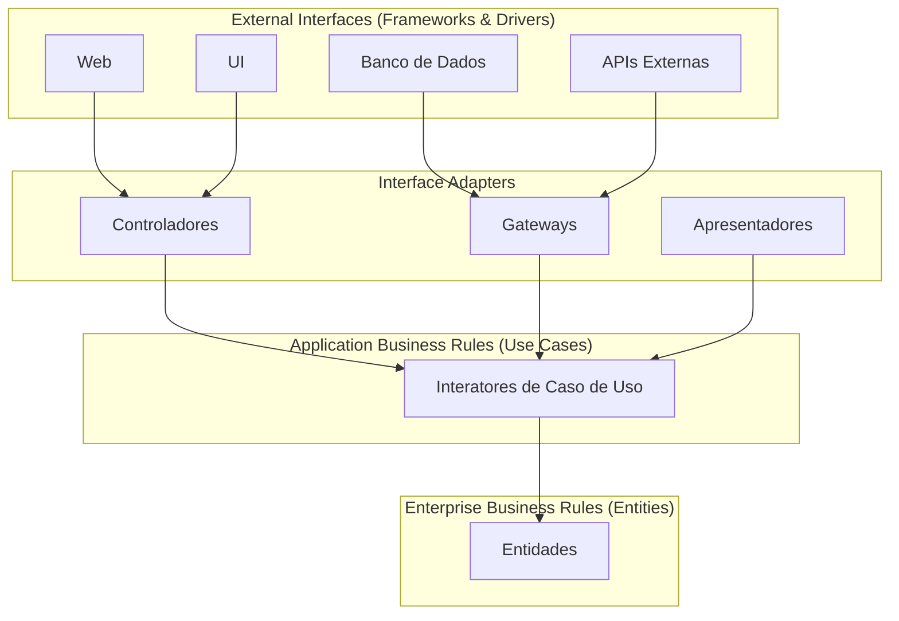
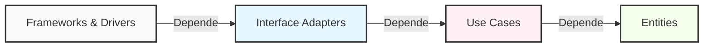
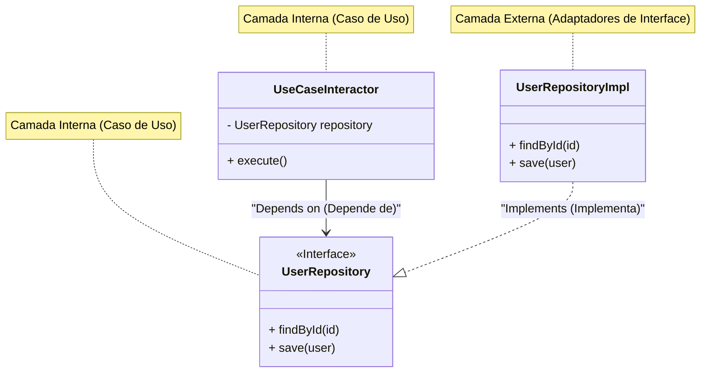

No desenvolvimento de software moderno, construir um "sistema resiliente a mudanças" é um desafio eterno. Mudanças nos requisitos de negócios, surgimento de novos frameworks, renovação da interface de usuário (UI) e migração de banco de dados. Para todas essas mudanças, é exigida uma arquitetura que possa se adaptar flexivelmente sem a necessidade de reconstruir todo o sistema. Uma das respostas para isso é a **Clean Architecture (Arquitetura Limpa)**, proposta por Robert C. Martin (conhecido como Uncle Bob).

Neste artigo, exploraremos a essência da Clean Architecture através de sua história, propósito, detalhes de suas quatro camadas, a Regra de Dependência e exemplos concretos de implementação. Faremos uma explicação técnica muito profunda e detalhada.

## 1. Os Problemas das Arquiteturas Tradicionais e a História da Clean Architecture

Historicamente, a arquitetura de software passou por várias mudanças de paradigma. Em sistemas iniciais, o código de lógica de negócios, UI e acesso a dados estava fortemente acoplado (o chamado código espaguete). Posteriormente, com o objetivo de separação de conceitos (Separation of Concerns), a arquitetura de três camadas (camada de apresentação, camada de lógica de negócios e camada de acesso a dados) tornou-se popular.

No entanto, a arquitetura de três camadas tradicional tinha um grande problema. Era que o "**domínio (lógica de negócios) acabava dependendo do banco de dados ou do framework**".

Por exemplo, se a camada de lógica de negócios chamasse diretamente a camada de acesso a dados (como um ORM), uma mudança no esquema do banco de dados ou no ORM se propagaria para a lógica de negócios. Em outras palavras, surgiu a contradição de que as "regras de negócios", que são as mais importantes e não deveriam ser alteradas, dependiam da "infraestrutura", que é onde as mudanças técnicas são mais propensas a ocorrer.

Como solução para isso, as seguintes arquiteturas foram idealizadas:

*   **Arquitetura Hexagonal (Ports and Adapters)** - Alistair Cockburn
*   **Onion Architecture (Arquitetura Cebola)** - Jeffrey Palermo
*   **DCI (Data, Context and Interaction)** - James Coplien, Trygve Reenskaug
*   **BCE (Boundary-Control-Entity)** - Ivar Jacobson

Todas essas arquiteturas têm o mesmo objetivo. É a "**Separação de Conceitos**". O objetivo é dividir o software em camadas, criando um estado em que cada uma é testável independentemente e independente de agentes externos (UI, DB, frameworks).

Robert C. Martin unificou os conceitos dessas excelentes arquiteturas e as resumiu em uma única regra prática, nomeando-a de "**Clean Architecture**".

## 2. Propósitos e Características da Clean Architecture

Sistemas que adotam a Clean Architecture possuem as seguintes características:

1.  **Independente de Frameworks (Independent of Frameworks)**: A arquitetura não depende da existência de bibliotecas de software ricas em recursos. Isso permite que você use frameworks como "ferramentas" em vez de ter que encaixar seu sistema nas restrições deles.
2.  **Testável (Testable)**: As regras de negócios podem ser testadas sem a UI, banco de dados, servidor Web ou qualquer outro elemento externo.
3.  **Independente de UI (Independent of UI)**: A UI pode ser alterada facilmente sem alterar o resto do sistema. Por exemplo, uma UI Web pode ser substituída por uma UI de console sem alterar as regras de negócios.
4.  **Independente de Banco de Dados (Independent of Database)**: Você pode trocar Oracle ou SQL Server por Mongo, BigTable, CouchDB ou qualquer outra coisa. Suas regras de negócios não estão vinculadas ao banco de dados.
5.  **Independente de agentes externos (Independent of any external agency)**: Na verdade, suas regras de negócios simplesmente não sabem nada sobre o mundo exterior.

## 3. As 4 Camadas da Clean Architecture (Layers)

A Clean Architecture é geralmente representada por um diagrama de círculos concêntricos. Quanto mais próximo do centro, mais o software representa as políticas de alto nível (regras de negócios altamente abstratas). Quanto mais para fora, mais se tornam mecanismos (detalhes concretos).



### 3.1. Entidades (Entities)
As entidades encapsulam as regras de negócios de toda a empresa (Enterprise Business Rules). Uma entidade pode ser um objeto com métodos ou pode ser um conjunto de estruturas de dados e funções. São as regras mais gerais e de alto nível que podem ser reutilizadas em diversas aplicações diferentes dentro da empresa.
Mesmo que você esteja criando apenas uma única aplicação, as entidades são os objetos de negócios dessa aplicação. Elas não são afetadas por nenhuma mudança externa (como mudanças na navegação de página ou mudanças de segurança).

### 3.2. Casos de Uso (Use Cases)
A camada de casos de uso contém as regras de negócios específicas da aplicação (Application Business Rules). Ela encapsula e implementa todos os casos de uso do sistema. Os casos de uso orquestram o fluxo de dados para e das entidades e orientam essas entidades a usar suas regras de negócios para atingir os objetivos do caso de uso.
Mudanças nesta camada não devem afetar as entidades. Além disso, essa camada não é afetada por mudanças externas como banco de dados, UI ou frameworks. Os casos de uso estão completamente isolados dessas preocupações.

### 3.3. Adaptadores de Interface (Interface Adapters)
A camada de adaptadores de interface é um conjunto de adaptadores que convertem dados do formato mais conveniente para os casos de uso e entidades, para o formato mais conveniente para agentes externos, como o Banco de Dados ou a Web.
Por exemplo, é aqui que residem os elementos da arquitetura MVC (Model-View-Controller) de uma GUI no mundo Web. Os controladores recebem a entrada do usuário e a passam para os casos de uso, e os apresentadores recebem a saída dos casos de uso e a formatam para a visualização (UI).
Também é função desta camada converter os dados no formato que o banco de dados (como SQL) possa entender. Nenhum código interno a este círculo deve saber nada sobre o banco de dados.

### 3.4. Frameworks e Drivers (Frameworks & Drivers)
A camada mais externa é geralmente composta de ferramentas como bancos de dados e frameworks da Web. Normalmente, você não escreve muito código nesta camada, a não ser o "código de cola" (glue code) que se comunica com o próximo círculo para dentro.
Esta camada contém todos os detalhes. A Web é um detalhe. O banco de dados é um detalhe. Mantemos essas coisas do lado de fora onde elas podem fazer pouco mal.

## 4. A Regra de Dependência (The Dependency Rule)

Existe uma regra primordial para fazer a Clean Architecture funcionar, e que nunca deve ser quebrada. É a "**Regra de Dependência (The Dependency Rule)**".

> As dependências do código-fonte devem apontar apenas para dentro, em direção às políticas de nível mais alto.

O código pertencente a um círculo interno não deve saber nada sobre o código de um círculo externo. Nenhum nome declarado em um círculo externo (funções, classes, variáveis, etc.) pode ser mencionado pelo código em um círculo interno.
Da mesma forma, formatos de dados usados em um círculo externo não devem ser usados por um círculo interno, especialmente se esses formatos forem gerados por um framework em um círculo externo.



Expressando matematicamente, se definirmos o índice da camada como $L_i$, onde $i=0$ é a Entidade (camada mais interna) e $i=3$ é o Framework (camada mais externa), se houver uma dependência de uma camada $L_m$ para $L_n$, a seguinte inequação deve ser sempre verdadeira:

$$ m > n $$

Ou seja, o vetor de dependência $\vec{D}$ aponta sempre para o centro.

## 5. Cruzando Fronteiras: Princípio da Inversão de Dependência (DIP)

Ao tentar aderir à Regra de Dependência, você logo enfrentará um grande problema. "**O que fazer quando um caso de uso precisa obter dados do banco de dados?**"

Se a camada de casos de uso (interna) chamar diretamente a camada de adaptadores de interface (a implementação do Repositório externa), a dependência apontará para fora, violando a Regra de Dependência.

O que resolve esse problema é o "D" dos princípios SOLID (Dependency Inversion Principle: Princípio da Inversão de Dependência).

### Definição do Princípio da Inversão de Dependência (DIP)
1. Módulos de alto nível não devem depender de módulos de baixo nível. Ambos devem depender de abstrações.
2. Abstrações não devem depender de detalhes. Detalhes devem depender de abstrações.

Para conseguir isso, definimos uma **interface (abstração)** na camada de caso de uso e a **implementamos** na camada externa (adaptadores de interface). A camada de caso de uso depende apenas da interface que ela mesma definiu e não depende da implementação concreta externa.



Na figura acima, o fluxo de controle (Control Flow) em tempo de execução é `UseCaseInteractor` $\rightarrow$ `UserRepositoryImpl`. No entanto, a dependência do código-fonte (Source Code Dependency) é `UserRepositoryImpl` $\rightarrow$ `UserRepository` (para dentro). Usando o polimorfismo, fomos capazes de direcionar a dependência do código-fonte na direção oposta ao fluxo de controle. É por isso que é chamado de "**Inversão**" de dependência.

## 6. Exemplo Concreto de Implementação em TypeScript

Aqui, mostramos um exemplo simples de implementação da Clean Architecture (funcionalidade de registro de usuário) usando TypeScript.

### 6.1. Entidades (Entities)

As regras de negócios mais centrais.

```typescript
// src/domain/entities/User.ts
export class User {
    constructor(
        public readonly id: string,
        public readonly name: string,
        public readonly email: string,
        public readonly createdAt: Date
    ) {}

    // Regra de negócios específica da entidade (ex: verificação do tamanho do nome)
    public isValid(): boolean {
        return this.name.length >= 3 && this.email.includes('@');
    }
}
```

### 6.2. Casos de Uso (Use Cases)

Na camada de caso de uso, definimos as estruturas de dados de entrada e saída (DTO) e a interface do repositório para inverter a dependência.

```typescript
// src/application/repositories/UserRepository.ts
import { User } from '../../domain/entities/User';

// Interface definida pela camada de caso de uso
export interface UserRepository {
    findByEmail(email: string): Promise<User | null>;
    save(user: User): Promise<void>;
}

// src/application/usecases/RegisterUser/RegisterUserDTO.ts
export interface RegisterUserInputDTO {
    name: string;
    email: string;
}

export interface RegisterUserOutputDTO {
    id: string;
    name: string;
    email: string;
    createdAt: Date;
}

// src/application/usecases/RegisterUser/RegisterUserUseCase.ts
import { User } from '../../domain/entities/User';
import { UserRepository } from '../../repositories/UserRepository';
import { RegisterUserInputDTO, RegisterUserOutputDTO } from './RegisterUserDTO';

export class RegisterUserUseCase {
    // Depende da abstração (interface). Não depende de implementações concretas.
    constructor(private readonly userRepository: UserRepository) {}

    public async execute(input: RegisterUserInputDTO): Promise<RegisterUserOutputDTO> {
        const existingUser = await this.userRepository.findByEmail(input.email);
        if (existingUser) {
            throw new Error('O usuário já existe');
        }

        const newUser = new User(
            crypto.randomUUID(),
            input.name,
            input.email,
            new Date()
        );

        if (!newUser.isValid()) {
            throw new Error('Dados de usuário inválidos');
        }

        // Chama o processo externo de salvar no DB, mas a dependência aponta para dentro (interface)
        await this.userRepository.save(newUser);

        return {
            id: newUser.id,
            name: newUser.name,
            email: newUser.email,
            createdAt: newUser.createdAt
        };
    }
}
```

### 6.3. Adaptadores de Interface (Interface Adapters)

Criamos o processo de acesso concreto ao banco de dados (implementação do Repositório) e o Controlador que processa requisições HTTP.

```typescript
// src/adapters/repositories/PostgresUserRepository.ts
import { UserRepository } from '../../application/repositories/UserRepository';
import { User } from '../../domain/entities/User';
// Assumindo cliente de DB que é a camada externa (Driver)
import { DatabaseClient } from '../../infrastructure/database/DatabaseClient';

export class PostgresUserRepository implements UserRepository {
    constructor(private readonly dbClient: DatabaseClient) {}

    public async findByEmail(email: string): Promise<User | null> {
        const record = await this.dbClient.query('SELECT * FROM users WHERE email = $1', [email]);
        if (!record) return null;
        return new User(record.id, record.name, record.email, record.created_at);
    }

    public async save(user: User): Promise<void> {
        await this.dbClient.query(
            'INSERT INTO users (id, name, email, created_at) VALUES ($1, $2, $3, $4)',
            [user.id, user.name, user.email, user.createdAt]
        );
    }
}

// src/adapters/controllers/UserController.ts
import { RegisterUserUseCase } from '../../application/usecases/RegisterUser/RegisterUserUseCase';

export class UserController {
    constructor(private readonly registerUserUseCase: RegisterUserUseCase) {}

    public async register(req: any, res: any): Promise<void> {
        try {
            const input = {
                name: req.body.name,
                email: req.body.email
            };
            const output = await this.registerUserUseCase.execute(input);
            res.status(201).json(output);
        } catch (error: any) {
            res.status(400).json({ message: error.message });
        }
    }
}
```

### 6.4. Componente Principal (Injeção de Dependência: DI)

Ao iniciar a aplicação, todas as dependências são construídas (fiação/wiring). Isso é chamado de Composition Root.

```typescript
// src/infrastructure/web/server.ts
import express from 'express';
import { DatabaseClient } from '../database/DatabaseClient';
import { PostgresUserRepository } from '../../adapters/repositories/PostgresUserRepository';
import { RegisterUserUseCase } from '../../application/usecases/RegisterUser/RegisterUserUseCase';
import { UserController } from '../../adapters/controllers/UserController';

const app = express();
app.use(express.json());

// 1. Inicialização do driver
const dbClient = new DatabaseClient(/* informações de conexão */);

// 2. Inicialização do adaptador (Instancia a classe concreta)
const userRepository = new PostgresUserRepository(dbClient);

// 3. Inicialização do caso de uso (Injeta a implementação concreta na interface = DI)
const registerUserUseCase = new RegisterUserUseCase(userRepository);

// 4. Inicialização do controlador
const userController = new UserController(registerUserUseCase);

// Roteamento
app.post('/users', (req, res) => userController.register(req, res));

app.listen(3000, () => {
    console.log('O servidor está rodando na porta 3000');
});
```

Dessa forma, o "script de inicialização" mais externo assume os detalhes sujos (instanciação de classes concretas) e passa apenas interfaces limpas para as camadas internas. Com essa estrutura, a lógica de negócios fica completamente isolada do mundo exterior.

## 7. Considerações Matemáticas sobre Acoplamento e Coesão

Na engenharia de software, o **Acoplamento (Coupling)** e a **Coesão (Cohesion)** são métricas para avaliar a qualidade de uma arquitetura.

O acoplamento $C$ representa a força da dependência entre módulos. Se o módulo $A$ depende do módulo $B$, e definirmos o número total de dependências do sistema como $N_{dep}$ e o número de módulos como $N_{mod}$, uma das métricas que indica a complexidade pode ser expressa da seguinte forma:

$$ Complexity \propto \frac{N_{dep}}{N_{mod}} $$

Na Clean Architecture, ao aplicar o DIP, direcionamos as setas de dependência física para abstrações. A frequência de mudança das abstrações (interfaces) (Instability: $I$) é projetada para ser muito baixa.

A Instability $I$ é calculada pela seguinte fórmula (conforme definido por Robert C. Martin):
*   $C_e$ (Efferent Coupling): Acoplamento eferente (quantos módulos ele depende)
*   $C_a$ (Afferent Coupling): Acoplamento aferente (quantos módulos dependem dele)

$$ I = \frac{C_e}{C_e + C_a} $$

*   Quando $I = 0$, o componente é perfeitamente estável (não depende de ninguém, e os outros dependem dele).
*   Quando $I = 1$, o componente é perfeitamente instável (ninguém depende dele, e ele depende de outros).

A "Camada de Entidades" da Clean Architecture tem $C_e = 0$ (não depende do exterior), portanto, $I = 0$. Em outras palavras, é a camada mais estável.
Por outro lado, as "Camadas de UI" ou "Camadas de DB" têm $C_a \approx 0$ e $C_e > 0$, de forma que $I \approx 1$, tornando-as camadas fáceis de alterar (camadas instáveis).

Um princípio arquitetural importante, o SDP (Stable Dependencies Principle: Princípio das Dependências Estáveis), determina que "**dependências devem apontar para os componentes mais estáveis (componentes com $I$ menor)**". Os círculos concêntricos da Clean Architecture são uma visualização exata desse SDP, projetados para que a dependência aponta de fora ($I=1$) para dentro ($I=0$).

## 8. Estratégia de Testes e Clean Architecture

Um dos maiores benefícios da Clean Architecture é a **facilidade de testes**. Como as camadas são separadas, você pode escrever testes de forma independente de acordo com cada camada.

### 8.1. Testes de Entidades (Unit Test)
Por ser puramente lógica sem dependências externas, não são necessários bancos de dados ou mocks. É o teste mais confiável e rápido que você pode executar.

### 8.2. Testes de Casos de Uso (Unit Test with Mocks)
Todas as dependências externas, como repositórios, são definidas como interfaces, então durante os testes você só precisa injetar (DI) **mocks para testes ou implementações em memória (Fake)**. Não é necessário subir um banco de dados real. Isso permite testar ramificações complexas e tratamento de exceções da lógica de negócios muito rapidamente.

```typescript
// Exemplo de teste de Caso de Uso (Assumindo Jest)
test('Deve resultar em erro ao tentar registrar com um endereço de email existente', async () => {
    // Criação do repositório Fake
    const mockRepo: UserRepository = {
        findByEmail: async (email) => new User('1', 'Test', email, new Date()), // Retorna usuário existente
        save: async (user) => {}
    };

    const useCase = new RegisterUserUseCase(mockRepo);
    
    // Execução do caso de uso e asserção de erro
    await expect(useCase.execute({ name: 'Bob', email: 'test@example.com' }))
        .rejects
        .toThrow('O usuário já existe');
});
```

### 8.3. Testes de Adaptadores (Integration Test)
A classe de implementação do repositório se conecta a um banco de dados real e testa se o SQL está correto. O teste do controlador testa a parte que recebe a requisição HTTP e retorna JSON. Aqui, não se faz uma verificação detalhada da lógica de negócios, mas apenas confirma-se se a "conversão" e a "comunicação" estão corretas.

## 9. Desvantagens da Clean Architecture e Quando Adotar

Embora a Clean Architecture pareça onipotente, ela não é uma bala de prata. Existem as seguintes desvantagens (trade-offs):

1.  **Aumento do custo inicial de aprendizado e desenvolvimento**: O número de arquivos e interfaces (abstrações) aumenta consideravelmente. Haverá muito "código boilerplate" (código clichê), como o reempacotamento de DTOs.
2.  **Exagero para projetos de pequena escala (Overkill)**: Para um protótipo construído em poucos dias ou ferramentas de uso único que quase nunca sofrerão alterações, adotar essa arquitetura costuma ser um desperdício de esforço. Também não é adequada para APIs simples que realizam apenas operações CRUD.

**Quando você deve adotar**:
*   Produtos com expectativa de manutenção e operação de longo prazo (vários anos ou mais).
*   Sistemas onde as regras de negócios são complexas e mudanças de especificações ocorrem com frequência.
*   Quando se quer avançar com a divisão de tarefas em grandes equipes de desenvolvimento (frontend, backend, infraestrutura, etc.).
*   Quando você deseja modelar domínios de negócios complexos combinando com DDD (Domain-Driven Design: Projeto Orientado a Domínio).

## 10. Conclusão

A Clean Architecture é uma filosofia de design destinada a proteger o núcleo do sistema, as "regras de negócios", de "detalhes" como UI, banco de dados e frameworks.

No centro disso estão a **Regra de Dependência** e o **Princípio da Inversão de Dependência (DIP)**. Ao aplicar esses princípios corretamente, o software se torna flexível às mudanças, fácil de testar e capaz de manter seu valor a longo prazo.

O importante não é imitar cegamente a estrutura de diretórios da Clean Architecture, mas entender a essência de "**por que dividir dessa forma**" e "**para onde as setas de dependência estão apontando**", aplicando-a adequadamente de acordo com o tamanho e a complexidade do seu próprio projeto.

---
*Referência: "Clean Architecture: A Craftsman's Guide to Software Structure and Design" by Robert C. Martin*
