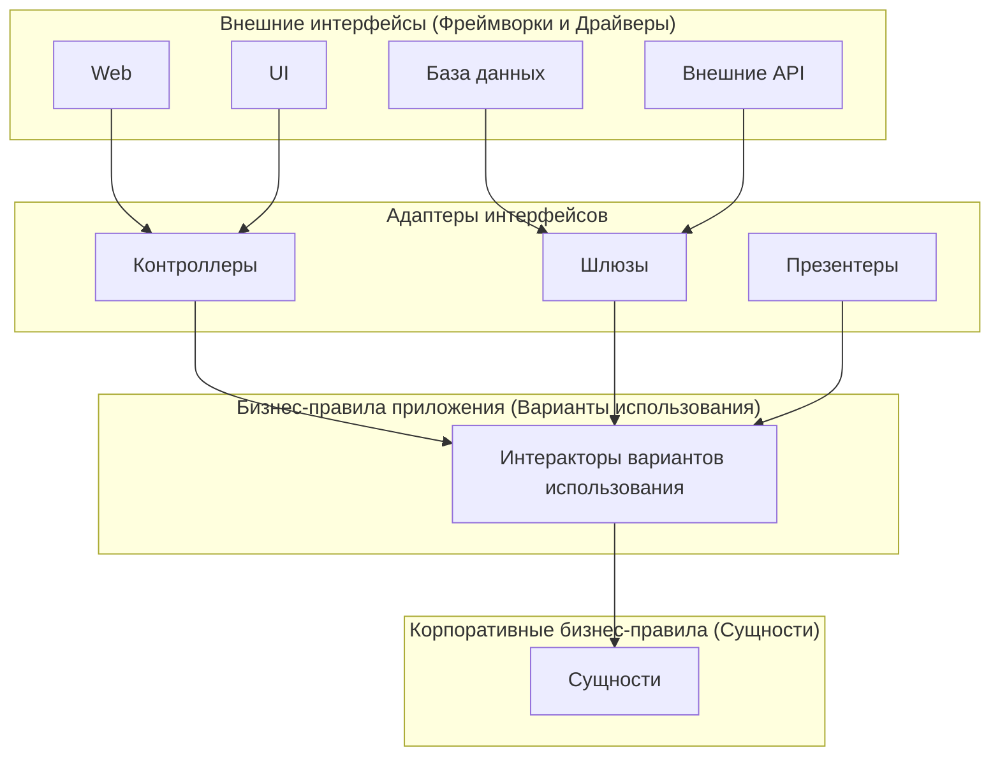
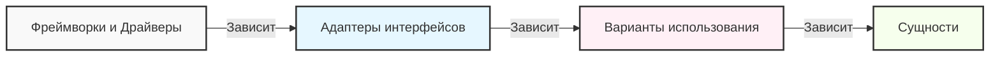
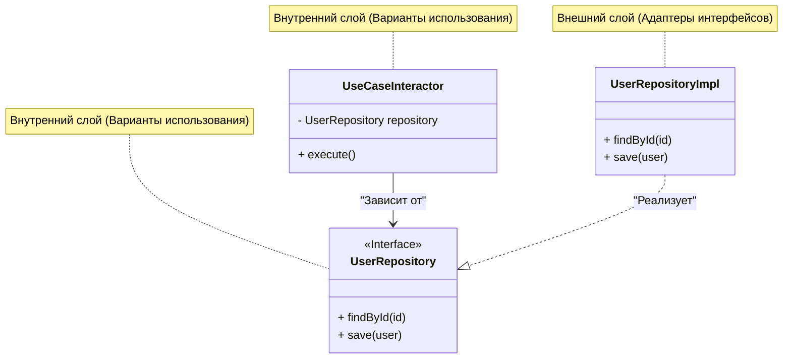

В современной разработке программного обеспечения создание "устойчивых к изменениям систем" является вечной проблемой. Изменение бизнес-требований, появление новых фреймворков, обновление UI, миграция баз данных. Для всех этих изменений требуется архитектура, которая может гибко адаптироваться без перестройки всей системы. Одним из ответов на этот вызов является **Чистая архитектура (Clean Architecture)**, предложенная Робертом С. Мартином (известным как Дядя Боб, Uncle Bob).

В этой статье мы раскроем суть Чистой архитектуры через её историю, цели, детали четырех слоев, правило зависимостей и конкретные примеры реализации. Мы проведем очень глубокий и подробный технический разбор.

## 1. Проблемы традиционных архитектур и история Чистой архитектуры

Исторически архитектура программного обеспечения претерпела различные смены парадигм. В ранних системах бизнес-логика, пользовательский интерфейс и код доступа к данным были тесно связаны (так называемый спагетти-код). Позже, с целью разделения ответственности (Separation of Concerns), получила распространение трехзвенная архитектура (слой представления, слой бизнес-логики, слой доступа к данным).

Однако традиционная трехзвенная архитектура имела серьезную проблему. Она заключалась в том, что "**домен (бизнес-логика) зависел от базы данных и фреймворков**".

Например, если слой бизнес-логики напрямую вызывает слой доступа к данным (такой как ORM), то изменения в схеме базы данных или изменения в ORM распространяются на бизнес-логику. Иными словами, возникало противоречие, при котором наиболее важные "бизнес-правила", которые не должны изменяться, зависели от "инфраструктуры", которая наиболее подвержена техническим изменениям.

В качестве решения этой проблемы были разработаны следующие архитектуры:

*   **Гексагональная архитектура (Ports and Adapters)** - Alistair Cockburn
*   **Луковая архитектура (Onion Architecture)** - Jeffrey Palermo
*   **DCI (Data, Context and Interaction)** - James Coplien, Trygve Reenskaug
*   **BCE (Boundary-Control-Entity)** - Ivar Jacobson

Все эти архитектуры преследуют одну и ту же цель. И это "**разделение ответственности**". Оно заключается в разделении программного обеспечения на слои, каждый из которых можно тестировать независимо, создавая состояние, в котором они независимы от внешних агентов (UI, БД, фреймворки).

Роберт С. Мартин интегрировал концепции этих выдающихся архитектур и объединил их в одно практическое правило, назвав его "**Чистой архитектурой**".

## 2. Цели и характеристики Чистой архитектуры

Системы, использующие Чистую архитектуру, обладают следующими характеристиками:

1.  **Независимость от фреймворков (Independent of Frameworks)**: Архитектура не зависит от существования многофункциональных библиотек программного обеспечения. Это позволяет использовать фреймворки как "инструменты", и нет необходимости втискивать систему в их ограничения.
2.  **Тестируемость (Testable)**: Бизнес-правила могут тестироваться без UI, базы данных, веб-сервера или других внешних элементов.
3.  **Независимость от UI (Independent of UI)**: Пользовательский интерфейс можно легко изменить без изменения остальной части системы. Например, веб-интерфейс можно заменить консольным интерфейсом без изменения бизнес-правил.
4.  **Независимость от базы данных (Independent of Database)**: Oracle или SQL Server можно заменить на Mongo, BigTable, CouchDB и так далее. Бизнес-правила не привязаны к базе данных.
5.  **Независимость от любых внешних агентов (Independent of any external agency)**: Фактически, бизнес-правила ничего не знают о внешнем мире.

## 3. Четыре слоя Чистой архитектуры (Layers)

Чистая архитектура обычно изображается в виде концентрических кругов. Чем ближе к центру, тем более высокоуровневыми политиками (бизнес-правилами с высокой степенью абстракции) становится программное обеспечение. Чем дальше от центра, тем больше механизмов (конкретных деталей).



### 3.1. Сущности (Entities)
Сущности инкапсулируют корпоративные бизнес-правила (Enterprise Business Rules). Сущность может быть объектом с методами или набором структур данных и функций. Это самые общие и высокоуровневые правила, которые можно повторно использовать во множестве различных приложений компании.
Даже если вы создаете только одно приложение, сущности являются бизнес-объектами этого приложения. Сущности никогда не подвергаются влиянию внешних изменений (таких как изменение навигации по страницам или изменения в безопасности).

### 3.2. Варианты использования (Use Cases)
Слой вариантов использования содержит специфичные для приложения бизнес-правила (Application Business Rules). Здесь инкапсулируются и реализуются все варианты использования системы. Варианты использования управляют потоком данных к сущностям и от них, а также предписывают сущностям достигать целей системы.
Изменения в этом слое не должны влиять на сущности. Аналогично, внешние изменения, такие как изменения в базе данных, UI или фреймворках, не влияют на этот слой. Варианты использования полностью изолированы от этих аспектов.

### 3.3. Адаптеры интерфейсов (Interface Adapters)
Слой адаптеров интерфейсов представляет собой набор адаптеров, которые преобразуют данные из форматов, наиболее удобных для вариантов использования и сущностей, в форматы, удобные для внешних агентов, таких как базы данных или веб.
Например, элементы архитектуры MVC (Model-View-Controller) для графических интерфейсов в веб-среде принадлежат именно этому слою. Контроллеры принимают пользовательский ввод, передают его в варианты использования, а презентеры получают вывод от вариантов использования и форматируют его для представления (UI).
Кроме того, задачей этого слоя является преобразование данных в формат, понятный базе данных (например, SQL). Код внутри этого слоя не должен ничего знать о базе данных.

### 3.4. Фреймворки и драйверы (Frameworks & Drivers)
Самый внешний слой состоит из таких инструментов, как базы данных и веб-фреймворки. Обычно здесь пишется не так много кода, кроме "связующего кода" (glue code) для взаимодействия со внутренними кругами.
В этом слое хранятся все детали. Веб — это деталь. База данных — это деталь. Чтобы минимизировать ущерб, мы располагаем эти детали снаружи.

## 4. Правило зависимостей (The Dependency Rule)

Существует самое важное правило, которое делает Чистую архитектуру возможной и которое ни в коем случае нельзя нарушать. Это "**Правило зависимостей (The Dependency Rule)**".

> Зависимости в исходном коде должны быть направлены только внутрь (к политикам более высокого уровня).

Код, принадлежащий внутренним кругам, не должен ничего знать о коде, принадлежащем внешним кругам. Имена (функции, классы, переменные и т.д.), объявленные во внешних кругах, не должны упоминаться во внутренних кругах.
Аналогично, форматы данных, используемые во внешних кругах, не должны использоваться во внутренних. Особенно это касается случаев, когда такие форматы генерируются фреймворком из внешнего круга.



Выражаясь математически, если индекс слоя обозначить как $L_i$, где $i=0$ — это сущности (самый внутренний слой), а $i=3$ — фреймворки (самый внешний слой), то в случае существования зависимости от слоя $L_m$ к $L_n$ обязательно должно выполняться следующее неравенство:

$$ m > n $$

Иными словами, вектор зависимости $\vec{D}$ всегда направлен к центру.

## 5. Пересечение границ: Принцип инверсии зависимостей (DIP)

При попытке соблюсти правило зависимостей мы быстро сталкиваемся с одной серьезной проблемой: "**Что делать, если варианту использования необходимо получить данные из базы данных?**"

Если слой вариантов использования (внутренний) напрямую вызывает слой адаптеров интерфейсов (внешняя реализация Repository), то зависимость будет направлена наружу, что является нарушением правила зависимостей.

Для решения этой проблемы используется принцип "D" из принципов SOLID (Dependency Inversion Principle: Принцип инверсии зависимостей).

### Определение принципа инверсии зависимостей (DIP)
1. Модули верхних уровней не должны зависеть от модулей нижних уровней. Оба типа модулей должны зависеть от абстракций.
2. Абстракции не должны зависеть от деталей. Детали должны зависеть от абстракций.

Чтобы реализовать это, мы определяем **интерфейс (абстракцию)** в слое вариантов использования и **реализуем** этот интерфейс во внешнем слое (адаптерах интерфейсов). Слой вариантов использования зависит только от интерфейса, который он сам определил, и не зависит от конкретных реализаций во внешних слоях.



На приведенной выше диаграмме поток управления (Control Flow) во время выполнения идет от `UseCaseInteractor` $\rightarrow$ `UserRepositoryImpl`. Однако зависимость в исходном коде (Source Code Dependency) идет от `UserRepositoryImpl` $\rightarrow$ `UserRepository` (внутрь). Используя полиморфизм, мы смогли направить зависимость в исходном коде в сторону, противоположную потоку управления. Именно поэтому это называется "**инверсией** зависимостей".

## 6. Конкретный пример реализации на TypeScript

Здесь мы покажем простой пример реализации Чистой архитектуры (функция регистрации пользователя) с использованием TypeScript.

### 6.1. Сущности (Entities)

Это самые центральные бизнес-правила.

```typescript
// src/domain/entities/User.ts
export class User {
    constructor(
        public readonly id: string,
        public readonly name: string,
        public readonly email: string,
        public readonly createdAt: Date
    ) {}

    // Специфичные бизнес-правила сущности (например: проверка длины имени и т.д.)
    public isValid(): boolean {
        return this.name.length >= 3 && this.email.includes('@');
    }
}
```

### 6.2. Варианты использования (Use Cases)

В слое вариантов использования мы определяем структуры данных ввода и вывода (DTO), а также интерфейс репозитория для инверсии зависимостей.

```typescript
// src/application/repositories/UserRepository.ts
import { User } from '../../domain/entities/User';

// Интерфейс, определяемый слоем вариантов использования
export interface UserRepository {
    findByEmail(email: string): Promise<User | null>;
    save(user: User): Promise<void>;
}

// src/application/usecases/RegisterUser/RegisterUserDTO.ts
export interface RegisterUserInputDTO {
    name: string;
    email: string;
}

export interface RegisterUserOutputDTO {
    id: string;
    name: string;
    email: string;
    createdAt: Date;
}

// src/application/usecases/RegisterUser/RegisterUserUseCase.ts
import { User } from '../../domain/entities/User';
import { UserRepository } from '../../repositories/UserRepository';
import { RegisterUserInputDTO, RegisterUserOutputDTO } from './RegisterUserDTO';

export class RegisterUserUseCase {
    // Зависит от абстракции (интерфейса). Не зависит от конкретной реализации.
    constructor(private readonly userRepository: UserRepository) {}

    public async execute(input: RegisterUserInputDTO): Promise<RegisterUserOutputDTO> {
        const existingUser = await this.userRepository.findByEmail(input.email);
        if (existingUser) {
            throw new Error('User already exists');
        }

        const newUser = new User(
            crypto.randomUUID(),
            input.name,
            input.email,
            new Date()
        );

        if (!newUser.isValid()) {
            throw new Error('Invalid user data');
        }

        // Вызываем процесс сохранения в БД во внешнем слое, но зависимость направлена внутрь (на интерфейс)
        await this.userRepository.save(newUser);

        return {
            id: newUser.id,
            name: newUser.name,
            email: newUser.email,
            createdAt: newUser.createdAt
        };
    }
}
```

### 6.3. Адаптеры интерфейсов (Interface Adapters)

Здесь мы создаем конкретную обработку доступа к базе данных (реализация Repository) и контроллер для обработки HTTP-запросов.

```typescript
// src/adapters/repositories/PostgresUserRepository.ts
import { UserRepository } from '../../application/repositories/UserRepository';
import { User } from '../../domain/entities/User';
// Предполагается клиент БД, являющийся внешним слоем (Driver)
import { DatabaseClient } from '../../infrastructure/database/DatabaseClient';

export class PostgresUserRepository implements UserRepository {
    constructor(private readonly dbClient: DatabaseClient) {}

    public async findByEmail(email: string): Promise<User | null> {
        const record = await this.dbClient.query('SELECT * FROM users WHERE email = $1', [email]);
        if (!record) return null;
        return new User(record.id, record.name, record.email, record.created_at);
    }

    public async save(user: User): Promise<void> {
        await this.dbClient.query(
            'INSERT INTO users (id, name, email, created_at) VALUES ($1, $2, $3, $4)',
            [user.id, user.name, user.email, user.createdAt]
        );
    }
}

// src/adapters/controllers/UserController.ts
import { RegisterUserUseCase } from '../../application/usecases/RegisterUser/RegisterUserUseCase';

export class UserController {
    constructor(private readonly registerUserUseCase: RegisterUserUseCase) {}

    public async register(req: any, res: any): Promise<void> {
        try {
            const input = {
                name: req.body.name,
                email: req.body.email
            };
            const output = await this.registerUserUseCase.execute(input);
            res.status(201).json(output);
        } catch (error: any) {
            res.status(400).json({ message: error.message });
        }
    }
}
```

### 6.4. Главный компонент (Внедрение зависимостей: DI)

При запуске приложения мы собираем (связываем) все зависимости. Это называется Корень композиции (Composition Root).

```typescript
// src/infrastructure/web/server.ts
import express from 'express';
import { DatabaseClient } from '../database/DatabaseClient';
import { PostgresUserRepository } from '../../adapters/repositories/PostgresUserRepository';
import { RegisterUserUseCase } from '../../application/usecases/RegisterUser/RegisterUserUseCase';
import { UserController } from '../../adapters/controllers/UserController';

const app = express();
app.use(express.json());

// 1. Инициализация драйвера
const dbClient = new DatabaseClient(/* Данные для подключения */);

// 2. Инициализация адаптера (создание экземпляра конкретного класса)
const userRepository = new PostgresUserRepository(dbClient);

// 3. Инициализация варианта использования (внедрение конкретной реализации в интерфейс = DI)
const registerUserUseCase = new RegisterUserUseCase(userRepository);

// 4. Инициализация контроллера
const userController = new UserController(registerUserUseCase);

// Маршрутизация
app.post('/users', (req, res) => userController.register(req, res));

app.listen(3000, () => {
    console.log('Server is running on port 3000');
});
```

Таким образом, создавая структуру, в которой самый внешний "скрипт запуска" берет на себя грязные детали (создание экземпляров конкретных классов) и передает во внутренние слои только чистые интерфейсы, мы полностью изолируем бизнес-логику от внешнего мира.

## 7. Математическое рассмотрение связности и сцепления

В программной инженерии в качестве метрик оценки качества архитектуры используются **связность (Coupling)** и **сцепление (Cohesion)**.

Связность $C$ представляет собой силу зависимости между модулями. Если модуль $A$ зависит от модуля $B$, то, обозначив общее количество зависимостей в системе как $N_{dep}$ и количество модулей как $N_{mod}$, один из показателей сложности можно выразить следующим образом:

$$ Complexity \propto \frac{N_{dep}}{N_{mod}} $$

В Чистой архитектуре применение DIP позволяет направить стрелки физических зависимостей в сторону абстракций. Абстракции (интерфейсы) проектируются так, чтобы частота их изменений (Нестабильность: $I$) была крайне низкой.

Нестабильность (Instability) $I$ вычисляется по следующей формуле (определение Роберта С. Мартина):
*   $C_e$ (Efferent Coupling): Исходящая связность (количество сущностей, от которых зависим мы)
*   $C_a$ (Afferent Coupling): Входящая связность (количество сущностей, которые зависят от нас)

$$ I = \frac{C_e}{C_e + C_a} $$

*   В случае $I = 0$, компонент абсолютно стабилен (ни от кого не зависит, но от него зависят другие).
*   В случае $I = 1$, компонент абсолютно нестабилен (от него никто не зависит, но он зависит от других).

В Чистой архитектуре "слой сущностей" имеет $C_e = 0$ (не зависит от внешнего мира), поэтому $I = 0$. То есть это самый стабильный слой.
И наоборот, "слой UI" или "слой БД" имеют $C_a \approx 0$ и $C_e > 0$, поэтому их $I \approx 1$, что делает их легко изменяемыми (нестабильными слоями).

Важный принцип архитектуры SDP (Stable Dependencies Principle: Принцип стабильных зависимостей) гласит, что "**зависимости должны быть направлены в сторону более стабильных компонентов (компонентов с меньшим значением $I$)**". Концентрические круги Чистой архитектуры — это как раз визуализация данного SDP; они спроектированы так, чтобы зависимости были направлены снаружи ($I=1$) внутрь ($I=0$).

## 8. Стратегия тестирования и Чистая архитектура

Одним из самых больших преимуществ Чистой архитектуры является **простота тестирования**. Поскольку слои разделены, вы можете независимо писать тесты, соответствующие каждому слою.

### 8.1. Тестирование сущностей (Модульное тестирование / Unit Test)
Поскольку это чистая логика без каких-либо внешних зависимостей, не нужны ни база данных, ни моки (mocks). Это самые быстрые и надежные тесты.

### 8.2. Тестирование вариантов использования (Unit Test with Mocks)
Поскольку все внешние зависимости, такие как репозитории, определены как интерфейсы, при тестировании достаточно внедрить (через DI) **моки для тестирования или реализации в памяти (Fake)**. Нет необходимости запускать реальную базу данных. Это позволяет быстро тестировать сложные ветвления и обработку исключений в бизнес-логике.

```typescript
// Пример тестирования варианта использования (предполагается Jest)
test('Возвращает ошибку при попытке регистрации с существующим адресом электронной почты', async () => {
    // Создание Fake репозитория
    const mockRepo: UserRepository = {
        findByEmail: async (email) => new User('1', 'Test', email, new Date()), // Возвращает существующего пользователя
        save: async (user) => {}
    };

    const useCase = new RegisterUserUseCase(mockRepo);
    
    // Выполнение варианта использования и проверка на ошибку
    await expect(useCase.execute({ name: 'Bob', email: 'test@example.com' }))
        .rejects
        .toThrow('User already exists');
});
```

### 8.3. Тестирование адаптеров (Интеграционное тестирование / Integration Test)
Классы реализации репозиториев фактически подключаются к базе данных для тестирования правильности SQL. Тесты контроллеров проверяют получение HTTP-запросов и возврат JSON. Здесь не проводится детальная проверка бизнес-логики; подтверждается лишь корректность "преобразования" и "коммуникации".

## 9. Недостатки Чистой архитектуры и когда её следует применять

Хотя Чистая архитектура кажется универсальной, она не является серебряной пулей. Существуют следующие недостатки (компромиссы):

1.  **Увеличение первоначальных затрат на обучение и разработку**: Значительно увеличивается количество файлов и интерфейсов (абстракций). Появляется много "шаблонного кода" (boilerplate code), такого как перекладывание данных из одних DTO в другие.
2.  **Избыточность для небольших проектов (Overkill)**: Применение этой архитектуры в прототипах, которые создаются за несколько дней, или в разовых инструментах, где почти не бывает изменений, часто является пустой тратой ресурсов. Она также не подходит для простых API, состоящих только из CRUD-операций.

**Когда следует применять**:
*   Продукты, которые планируется поддерживать и эксплуатировать в течение длительного периода (несколько лет и более).
*   Системы со сложными бизнес-правилами и частыми изменениями спецификаций.
*   Когда необходимо разделить работу (фронтенд, бэкенд, инфраструктура и т.д.) в большой команде разработчиков.
*   При необходимости моделирования сложных бизнес-областей в сочетании с предметно-ориентированным проектированием (DDD: Domain-Driven Design).

## 10. Заключение

Чистая архитектура — это философия проектирования, предназначенная для защиты ядра системы, то есть "бизнес-правил", от таких "деталей", как UI, базы данных и фреймворки.

В её основе лежат **Правило зависимостей** и **Принцип инверсии зависимостей (DIP)**. При правильном применении этих правил программное обеспечение становится гибким к изменениям, легко тестируемым и способным сохранять свою ценность на протяжении длительного времени.

Важно не слепо копировать структуру директорий Чистой архитектуры, а понимать суть: "**почему она разделена именно так**" и "**куда направлены стрелки зависимостей**", и применять её соответствующим образом в зависимости от масштаба и сложности вашего проекта.

---
*Источник: "Clean Architecture: A Craftsman's Guide to Software Structure and Design", Robert C. Martin*
