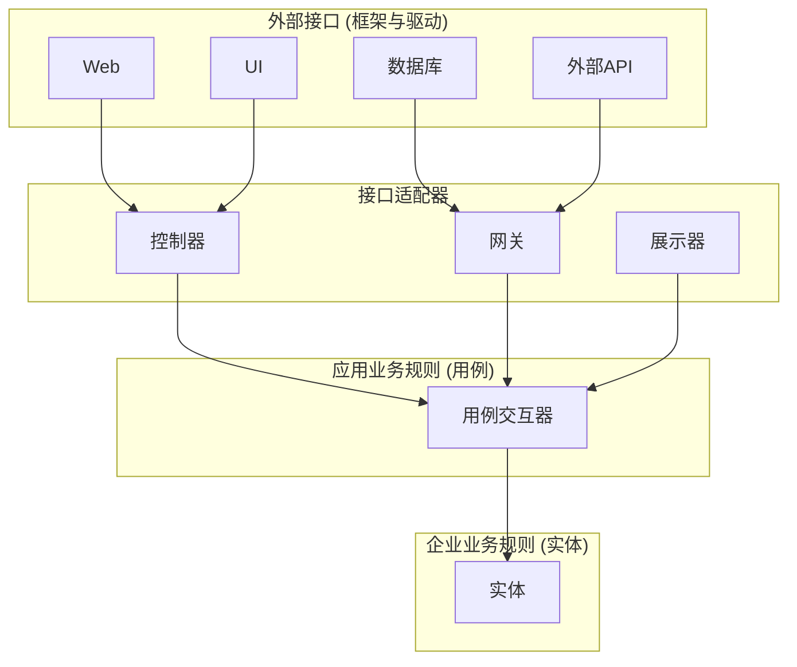
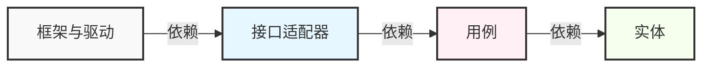
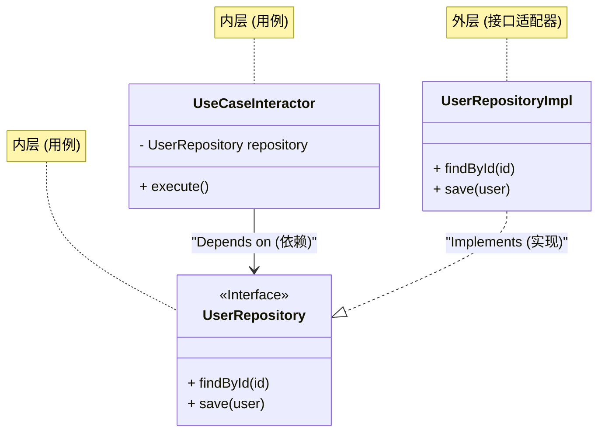

现代软件开发中，构建“拥抱变化的系统”是一个永恒的课题。业务需求的变更、新框架的崛起、UI的翻新、数据库的迁移。面对所有这些变化，我们需要一种能够灵活适应且无需重构整个系统的架构。作为其中的一个答案，Robert C. Martin（被戏称为Bob大叔，Uncle Bob）提出了**整洁架构（Clean Architecture）**。

本文将通过整洁架构的历史、目的、四个分层的细节、依赖规则以及具体的代码实现，深入探讨整洁架构的精髓。我们将进行非常深入且详细的技术解析。

## 1. 传统架构的问题与整洁架构的历史

从历史上看，软件架构经历了各种范式转变。在早期的系统中，业务逻辑、UI、数据访问代码紧密耦合（所谓的意大利面条代码）。此后，为了实现关注点分离（Separation of Concerns），三层架构（表现层、业务逻辑层、数据访问层）得到了普及。

然而，传统的三层架构存在一个重大问题，那就是“**领域（业务逻辑）会依赖于数据库或框架**”。

例如，当业务逻辑层直接调用数据访问层（如ORM）时，数据库表结构的修改或ORM的变更就会波及到业务逻辑。也就是说，出现了这样一种矛盾：最重要且最不应该被修改的“业务规则”，反而依赖了最容易发生技术性变更的“基础设施”。

作为解决这个问题的方案，以下架构被相继提出：

*   **六边形架构 (Ports and Adapters)** - Alistair Cockburn
*   **洋葱架构** - Jeffrey Palermo
*   **DCI (Data, Context and Interaction)** - James Coplien, Trygve Reenskaug
*   **BCE (Boundary-Control-Entity)** - Ivar Jacobson

所有这些架构都具有相同的目的。那就是“**关注点分离**”。将软件划分为多个分层，使各层能够独立进行测试，并处于独立于外部代理（UI、数据库、框架）的状态。

Robert C. Martin将这些优秀的架构理念进行了整合，并总结为一个实用的规则，将其命名为“**整洁架构**”。

## 2. 整洁架构的目的与特性

采用整洁架构的系统具有以下特性：

1.  **独立于框架 (Independent of Frameworks)**: 架构不依赖于功能丰富的软件库的存在。这使得你可以将框架作为“工具”使用，而无需将系统强行塞入框架的约束中。
2.  **可测试 (Testable)**: 可以在没有UI、数据库、Web服务器或任何其他外部元素的情况下测试业务规则。
3.  **独立于UI (Independent of UI)**: UI可以在不改变系统其他部分的情况下轻松变更。例如，可以在不更改业务规则的情况下，将Web UI替换为控制台UI。
4.  **独立于数据库 (Independent of Database)**: 你可以将Oracle或SQL Server替换为Mongo、BigTable、CouchDB等。业务规则不与数据库绑定。
5.  **独立于任何外部代理 (Independent of any external agency)**: 实际上，你的业务规则对外部世界一无所知。

## 3. 整洁架构的四个分层 (Layers)

整洁架构通常用同心圆的图形来表示。越靠近中心，软件代表的策略层次就越高（抽象程度越高的业务规则）。越往外围，就越是机制（具体的细节）。



### 3.1. 实体 (Entities)
实体封装了全企业范围的业务规则（Enterprise Business Rules）。实体可以是一个带有方法的对象，也可以是一组数据结构和函数。它们是可以在企业内多个不同应用中复用的、最通用和最高层的规则。
即使你只编写了一个应用，实体也是该应用的业务对象。即使外部发生了变化（例如页面导航或安全机制的改变），实体也绝不会受到影响。

### 3.2. 用例 (Use Cases)
用例层包含了特定于应用的业务规则（Application Business Rules）。这一层封装并实现了系统的所有用例。用例协调流入和流出实体的数据流，并指示实体去实现系统的目标。
这一层的变更绝不应该影响实体。同时，数据库、UI、框架等外部的变更也不会影响这一层。用例完全与这些关注点隔离开来。

### 3.3. 接口适配器 (Interface Adapters)
接口适配器层是一组适配器，负责将数据格式从对用例和实体最方便的形式，转换为对外部代理（如数据库和Web）最方便的形式。
例如，Web世界中GUI的MVC（Model-View-Controller）架构元素就属于这里。控制器接收用户输入并传递给用例，展示器接收用例的输出并将其格式化为视图（UI）。
此外，将数据转换为数据库（如SQL）能够理解的格式也是这一层的职责。该层以内的任何代码都不应该了解关于数据库的任何信息。

### 3.4. 框架与驱动 (Frameworks & Drivers)
最外层由数据库、Web框架等工具组成。在这里，通常除了与内层通信的“胶水代码（Glue Code）”之外，不会编写太多其他代码。
这一层包含了所有的细节。Web是细节，数据库也是细节。为了将损害降到最低，我们将这些细节放在最外层。

## 4. 依赖规则 (The Dependency Rule)

为了使整洁架构成立，有一个最重要且绝对不能打破的规则。那就是“**依赖规则 (The Dependency Rule)**”。

> 源码的依赖关系必须只能指向同心圆的内侧（高层策略）。

属于内侧的任何代码都不应该知道外侧代码的任何信息。在外侧声明的名称（如函数、类、变量等）绝对不能在内侧被引用。
同样，外侧使用的数据格式也不应该被内侧使用，特别是当该格式是由外侧的框架生成时更是如此。



用数学方式来表达，如果定义层级索引为 $L_i$，其中 $i=0$ 为实体（最内层），$i=3$ 为框架（最外层），当存在从某一层 $L_m$ 到 $L_n$ 的依赖时，必然满足以下不等式：

$$ m > n $$

也就是说，依赖关系向量 $\vec{D}$ 总是指向中心的。

## 5. 跨越边界：依赖反转原则 (DIP)

在试图遵守依赖规则时，很快就会面临一个重大问题：“**如果用例需要从数据库获取数据，该怎么办？**”

如果用例层（内侧）直接调用接口适配器层（外侧的Repository实现），依赖就会指向外侧，从而违反了依赖规则。

解决这个问题的方法是SOLID原则中的“D（Dependency Inversion Principle: 依赖反转原则）”。

### 依赖反转原则 (DIP) 的定义
1. 高层模块不应该依赖低层模块。两者都应该依赖抽象。
2. 抽象不应该依赖细节。细节应该依赖抽象。

为了实现这一点，我们在用例层定义一个**接口（抽象）**，并在外层（接口适配器）**实现**该接口。用例层只依赖它自己定义的接口，而不依赖外层的具体实现。



在上面的图中，运行时的控制流（Control Flow）是 `UseCaseInteractor` $\rightarrow$ `UserRepositoryImpl`。然而，源码的依赖关系（Source Code Dependency）却是 `UserRepositoryImpl` $\rightarrow$ `UserRepository`（内侧）。通过利用多态，我们成功地使源码的依赖关系指向了与控制流相反的方向。这就是它被称为“依赖**反转**”的原因。

## 6. 使用TypeScript的具体实现示例

在这里，我们使用TypeScript来展示一个整洁架构的简单实现示例（用户注册功能）。

### 6.1. 实体 (Entities)

这是位于最中心的业务规则。

```typescript
// src/domain/entities/User.ts
export class User {
    constructor(
        public readonly id: string,
        public readonly name: string,
        public readonly email: string,
        public readonly createdAt: Date
    ) {}

    // 实体特有的业务规则（例：名字长度检查等）
    public isValid(): boolean {
        return this.name.length >= 3 && this.email.includes('@');
    }
}
```

### 6.2. 用例 (Use Cases)

在用例层，我们定义了输入和输出的数据结构（DTO），以及用于反转依赖的仓储（Repository）接口。

```typescript
// src/application/repositories/UserRepository.ts
import { User } from '../../domain/entities/User';

// 由用例层定义的接口
export interface UserRepository {
    findByEmail(email: string): Promise<User | null>;
    save(user: User): Promise<void>;
}

// src/application/usecases/RegisterUser/RegisterUserDTO.ts
export interface RegisterUserInputDTO {
    name: string;
    email: string;
}

export interface RegisterUserOutputDTO {
    id: string;
    name: string;
    email: string;
    createdAt: Date;
}

// src/application/usecases/RegisterUser/RegisterUserUseCase.ts
import { User } from '../../domain/entities/User';
import { UserRepository } from '../../repositories/UserRepository';
import { RegisterUserInputDTO, RegisterUserOutputDTO } from './RegisterUserDTO';

export class RegisterUserUseCase {
    // 依赖于抽象（接口），而不依赖于具体实现。
    constructor(private readonly userRepository: UserRepository) {}

    public async execute(input: RegisterUserInputDTO): Promise<RegisterUserOutputDTO> {
        const existingUser = await this.userRepository.findByEmail(input.email);
        if (existingUser) {
            throw new Error('User already exists');
        }

        const newUser = new User(
            crypto.randomUUID(),
            input.name,
            input.email,
            new Date()
        );

        if (!newUser.isValid()) {
            throw new Error('Invalid user data');
        }

        // 调用外层的数据库保存逻辑，但依赖方向指向内层（接口）
        await this.userRepository.save(newUser);

        return {
            id: newUser.id,
            name: newUser.name,
            email: newUser.email,
            createdAt: newUser.createdAt
        };
    }
}
```

### 6.3. 接口适配器 (Interface Adapters)

我们创建了对数据库进行具体访问的处理（Repository的实现）以及处理HTTP请求的Controller。

```typescript
// src/adapters/repositories/PostgresUserRepository.ts
import { UserRepository } from '../../application/repositories/UserRepository';
import { User } from '../../domain/entities/User';
// 假设为外层（Driver）的数据库客户端
import { DatabaseClient } from '../../infrastructure/database/DatabaseClient';

export class PostgresUserRepository implements UserRepository {
    constructor(private readonly dbClient: DatabaseClient) {}

    public async findByEmail(email: string): Promise<User | null> {
        const record = await this.dbClient.query('SELECT * FROM users WHERE email = $1', [email]);
        if (!record) return null;
        return new User(record.id, record.name, record.email, record.created_at);
    }

    public async save(user: User): Promise<void> {
        await this.dbClient.query(
            'INSERT INTO users (id, name, email, created_at) VALUES ($1, $2, $3, $4)',
            [user.id, user.name, user.email, user.createdAt]
        );
    }
}

// src/adapters/controllers/UserController.ts
import { RegisterUserUseCase } from '../../application/usecases/RegisterUser/RegisterUserUseCase';

export class UserController {
    constructor(private readonly registerUserUseCase: RegisterUserUseCase) {}

    public async register(req: any, res: any): Promise<void> {
        try {
            const input = {
                name: req.body.name,
                email: req.body.email
            };
            const output = await this.registerUserUseCase.execute(input);
            res.status(201).json(output);
        } catch (error: any) {
            res.status(400).json({ message: error.message });
        }
    }
}
```

### 6.4. 主组件 (依赖注入: DI)

在应用程序启动时，构建所有的依赖关系（组装）。这被称为组合根（Composition Root）。

```typescript
// src/infrastructure/web/server.ts
import express from 'express';
import { DatabaseClient } from '../database/DatabaseClient';
import { PostgresUserRepository } from '../../adapters/repositories/PostgresUserRepository';
import { RegisterUserUseCase } from '../../application/usecases/RegisterUser/RegisterUserUseCase';
import { UserController } from '../../adapters/controllers/UserController';

const app = express();
app.use(express.json());

// 1. 初始化驱动
const dbClient = new DatabaseClient(/* 连接信息 */);

// 2. 初始化适配器 (实例化具体类)
const userRepository = new PostgresUserRepository(dbClient);

// 3. 初始化用例 (将具体实现注入到接口中 = DI)
const registerUserUseCase = new RegisterUserUseCase(userRepository);

// 4. 初始化控制器
const userController = new UserController(registerUserUseCase);

// 路由
app.post('/users', (req, res) => userController.register(req, res));

app.listen(3000, () => {
    console.log('Server is running on port 3000');
});
```

通过这种方式，最外层的“启动脚本”承担了肮脏的细节（实例化具体类），只向内层传递干净的接口结构，从而将业务逻辑与外部世界完全隔离开来。

## 7. 耦合度与内聚度的数学考量

在软件工程中，评价架构质量的指标有**耦合度 (Coupling)** 和 **内聚度 (Cohesion)**。

耦合度 $C$ 表示模块间依赖的强度。如果模块 $A$ 依赖于模块 $B$，设系统总依赖关系数为 $N_{dep}$，模块数为 $N_{mod}$，则表示复杂度的一个指标可如下表示：

$$ Complexity \propto \frac{N_{dep}}{N_{mod}} $$

在整洁架构中，通过应用DIP，我们将物理依赖的箭头指向了抽象。抽象（接口）的变更频率（不稳定性：$I$）被设计得非常低。

不稳定性 $I$ 可以通过以下公式计算（根据Robert C. Martin的定义）。
*   $C_e$ (Efferent Coupling): 向外的耦合（所依赖的数量）
*   $C_a$ (Afferent Coupling): 向内的耦合（依赖于自身的数量）

$$ I = \frac{C_e}{C_e + C_a} $$

*   如果 $I = 0$，则该组件是完全稳定的（不依赖任何其他组件，被其他组件所依赖）。
*   如果 $I = 1$，则该组件是完全不稳定的（不被其他组件所依赖，只依赖其他组件）。

在整洁架构的“实体层”中，$C_e = 0$（不依赖外部），因此 $I = 0$。也就是说，它是最稳定的层。
相反，“UI层”或“数据库层”是 $C_a \approx 0$ 且 $C_e > 0$，因此 $I \approx 1$，它们成为容易被更改的层（不稳定的层）。

架构的重要原则 SDP（Stable Dependencies Principle: 稳定依赖原则）规定，“**依赖必须指向更稳定的组件（$I$ 较小的组件）**”。整洁架构的同心圆正是这个 SDP 的可视化，设计上使得依赖从外部（$I=1$）指向内部（$I=0$）。

## 8. 测试策略与整洁架构

整洁架构最大的优势之一就是**易于测试**。由于各层是分离的，可以独立编写针对各层的测试。

### 8.1. 实体的测试 (Unit Test)
因为它是没有任何外部依赖的纯粹逻辑，所以不需要数据库也不需要Mock。这是执行最快、最可靠的测试。

### 8.2. 用例的测试 (Unit Test with Mocks)
由于仓储等外部依赖全部被定义为接口，所以在测试时只需注入（DI）**用于测试的Mock或内存实现（Fake）**即可。无需启动实际的数据库。这使得能够快速测试业务逻辑的复杂分支和异常处理。

```typescript
// 用例的测试示例 (假设使用Jest)
test('尝试使用已存在的邮箱地址注册时会报错', async () => {
    // 创建Fake仓储
    const mockRepo: UserRepository = {
        findByEmail: async (email) => new User('1', 'Test', email, new Date()), // 返回已存在的用户
        save: async (user) => {}
    };

    const useCase = new RegisterUserUseCase(mockRepo);
    
    // 执行用例并断言错误
    await expect(useCase.execute({ name: 'Bob', email: 'test@example.com' }))
        .rejects
        .toThrow('User already exists');
});
```

### 8.3. 适配器的测试 (Integration Test)
仓储的具体实现类实际上会连接到数据库以测试SQL是否正确。控制器的测试则验证接收HTTP请求并返回JSON的部分。在这里，不进行业务逻辑的详细验证，仅仅是为了确认“转换”和“通信”是否正确。

## 9. 整洁架构的缺点与采用时机

看起来万能的整洁架构，并不是强大的银弹。它存在以下缺点（权衡）：

1.  **初期的学习成本和开发成本增加**：文件数量和接口（抽象）的数量会大幅增加。会有大量如DTO转换等“样板代码（Boilerplate Code）”。
2.  **对小型项目是大材小用**：对于几天内做出的原型，或者几乎不会发生变更的一次性工具，采用这种架构通常是浪费成本。也不适合只有CRUD操作的简单API。

**应采用的时机**：
*   预计长期（数年以上）维护和运营的产品。
*   业务规则复杂且频繁进行需求变更的系统。
*   想要在大型开发团队中推进分工（前端、后端、基础设施等）的情况。
*   希望结合领域驱动设计（DDD: Domain-Driven Design）来对复杂的业务领域进行建模的情况。

## 10. 总结

整洁架构是一种设计思想，旨在保护被称为“业务规则”的系统核心，使其免受UI、数据库和框架等“细节”的影响。

其核心在于**依赖规则**和**依赖反转原则 (DIP)**。正确应用这些原则，可使软件对变化更加灵活，更容易测试，并在长时期内持续维持其价值。

重要的是，不要盲目模仿整洁架构的目录结构，而是要理解“**为什么要这样划分**”以及“**依赖关系的箭头指向哪里**”的本质，并根据自身项目的规模和复杂性适当地加以应用。

---
*Reference: "Clean Architecture: A Craftsman's Guide to Software Structure and Design" by Robert C. Martin*
