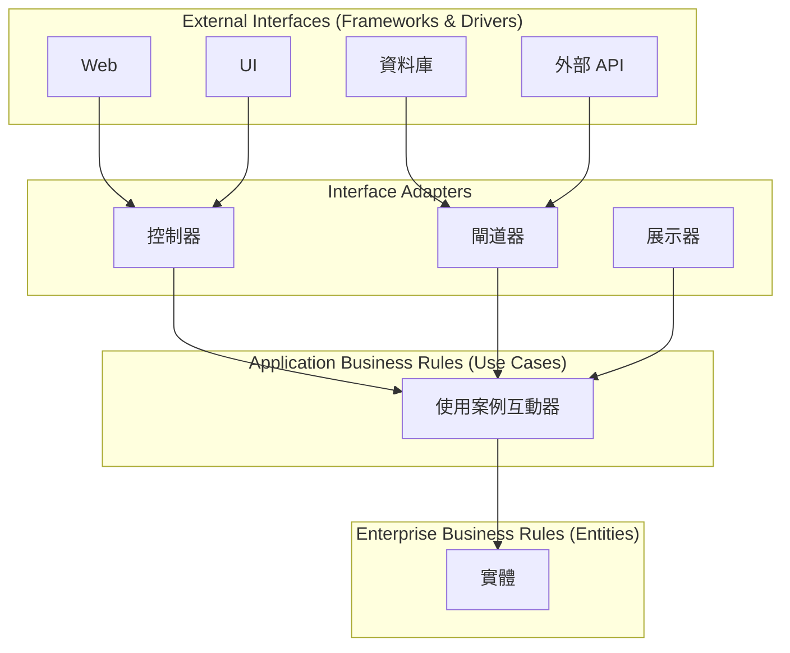
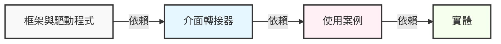
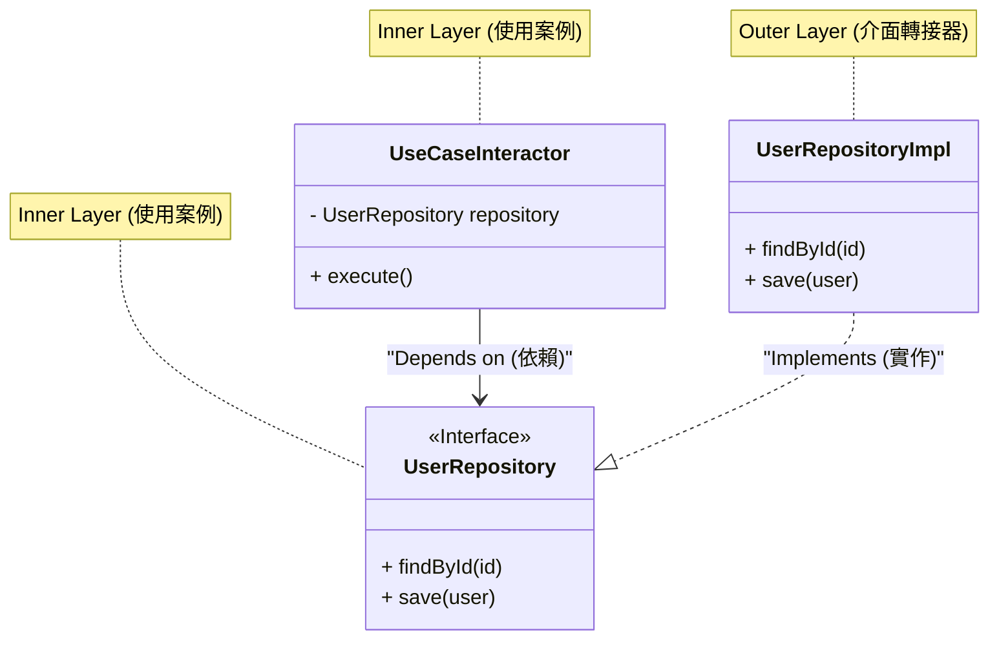

現代軟體開發中，建構「適應變化的系統」是一個永恆的課題。業務需求的變更、新框架的崛起、UI 的翻新、資料庫的轉移。面對這一切的變化，我們需要一種不需要重構整個系統就能靈活適應的架構。作為解答之一，Robert C. Martin（被稱為 Uncle Bob）提出了**整潔架構（Clean Architecture）**。

本文將透過整潔架構的歷史、目的、四個層次的細節、依賴規則，以及具體的實作範例，深入探討整潔架構的精髓。我們將進行非常深入且詳細的技術解說。

## 1. 傳統架構的問題點與整潔架構的歷史

從歷史來看，軟體架構經歷了各種典範轉移。早期的系統中，業務邏輯、UI、資料存取的程式碼高度耦合（也就是所謂的義大利麵程式碼）。之後，為了關注點分離（Separation of Concerns），三層式架構（表現層、業務邏輯層、資料存取層）變得普及。

然而，傳統的三層式架構有一個巨大的問題。那就是「**領域（業務邏輯）會依賴於資料庫或框架**」。

例如，當業務邏輯層直接呼叫資料存取層（如 ORM 等）時，資料庫的綱要變更或 ORM 的變更就會波及業務邏輯。也就是說，產生了一個矛盾：最重要、最不應該被變更的「業務規則」，竟然依賴於最容易發生技術變更的「基礎設施」。

作為這個問題的解決方案，以下幾種架構被構思出來：

*   **六角架構 (Ports and Adapters)** - Alistair Cockburn
*   **洋蔥架構 (Onion Architecture)** - Jeffrey Palermo
*   **DCI (Data, Context and Interaction)** - James Coplien, Trygve Reenskaug
*   **BCE (Boundary-Control-Entity)** - Ivar Jacobson

這些架構都有相同的目的。那就是「**關注點分離**」。將軟體分割成不同層次，使其每一層都能獨立測試，並處於獨立於外部代理（UI、資料庫、框架）的狀態。

Robert C. Martin 將這些優秀架構的概念整合，並將它們歸納成一個實用的規則，命名為「**整潔架構**」。

## 2. 整潔架構的目的與特性

採用整潔架構的系統具有以下特性：

1.  **獨立於框架 (Independent of Frameworks)**：架構不依賴於功能豐富的軟體函式庫的存在。這使得您可以將框架作為「工具」來使用，而無需將系統強塞進框架的限制中。
2.  **可測試 (Testable)**：業務規則可以在沒有 UI、資料庫、Web 伺服器或其他外部元素的情況下進行測試。
3.  **獨立於 UI (Independent of UI)**：UI 可以在不改變系統其餘部分的情況下輕鬆變更。例如，Web UI 可以替換為 Console UI，而無需變更業務規則。
4.  **獨立於資料庫 (Independent of Database)**：您可以將 Oracle 或 SQL Server 替換為 Mongo、BigTable、CouchDB 等。業務規則不會被資料庫所綁定。
5.  **獨立於外部代理 (Independent of any external agency)**：實際上，業務規則對外部世界一無所知。

## 3. 整潔架構的四個層次 (Layers)

整潔架構通常以同心圓的圖形表示。越靠近中心，軟體就越屬於高層級的策略（抽象度較高的業務規則）。越往外圍，就越是機制（具體的細節）。



### 3.1. 實體 (Entities)
實體封裝了全公司範圍的業務規則（Enterprise Business Rules）。實體可以是擁有方法的物件，也可以是資料結構與函式的集合。它們是可以在公司內多個不同應用程式中重複使用的，最通用且高層級的規則。
即使您只建立單一應用程式，實體也是該應用程式的業務物件。即使發生外部變更（例如頁面導覽變更或安全性變更），實體也絕對不會受到影響。

### 3.2. 使用案例 (Use Cases)
使用案例層包含特定於應用程式的業務規則（Application Business Rules）。這裡封裝並實作了系統的所有使用案例。使用案例負責協調往返於實體之間的資料流，並指示實體以達成系統的目標。
這一層的變更不應該影響實體。此外，資料庫、UI、框架等外部的變更也不會影響這一層。使用案例完全與這些關注點分離。

### 3.3. 介面轉接器 (Interface Adapters)
介面轉接器層是一組轉接器，負責將資料從對使用案例和實體方便的格式，轉換為對資料庫或 Web 等外部代理方便的格式。
例如，在 Web 世界中，GUI 的 MVC（Model-View-Controller）架構元素就屬於這裡。控制器接收使用者的輸入，傳遞給使用案例，展示器接收來自使用案例的輸出，並將其格式化給視圖（UI）。
此外，將資料轉換為資料庫（如 SQL）能夠理解的格式，也是這一層的職責。這一層內側的程式碼不應該對資料庫有任何了解。

### 3.4. 框架與驅動程式 (Frameworks & Drivers)
最外層由資料庫、Web 框架等工具組成。通常在這裡，除了與內圈溝通的「黏合程式碼（Glue Code）」之外，我們不會撰寫太多其他程式碼。
這一層保留了所有的細節。Web 是細節。資料庫也是細節。為了將損害降到最低，我們將這些細節放置在最外側。

## 4. 依賴規則 (The Dependency Rule)

為了使整潔架構成立，有一個最重要且絕對不能打破的規則。那就是「**依賴規則 (The Dependency Rule)**」。

> 原始碼的依賴關係必須只能指向內側（高層級的策略）。

屬於內圈的程式碼，絕對不能知道任何關於外圈程式碼的事情。在外圈宣告的名稱（函式、類別、變數等），不得在內圈被提及。
同樣地，外圈使用的資料格式也不應該在內圈使用。特別是當該格式是由外圈的框架所生成時更是如此。



用數學來表示的話，假設層級索引為 $L_i$，$i=0$ 定義為實體（最內層），$i=3$ 定義為框架（最外層），當存在從某一層 $L_m$ 到 $L_n$ 的依賴關係時，必定要滿足以下不等式：

$$ m > n $$

也就是說，依賴關係的向量 $\vec{D}$ 總是朝向中心。

## 5. 跨越邊界：依賴反轉原則 (DIP)

當我們試圖遵守依賴規則時，很快就會面臨一個巨大的問題：「**當使用案例需要從資料庫取得資料時，該怎麼辦？**」

如果使用案例層（內側）直接呼叫介面轉接器層（外側的 Repository 實作），依賴關係就會指向外側，從而違反了依賴規則。

解決這個問題的方法，是 SOLID 原則中的「D（Dependency Inversion Principle: 依賴反轉原則）」。

### 依賴反轉原則 (DIP) 的定義
1. 高層模組不應該依賴於低層模組。兩者都應該依賴於抽象。
2. 抽象不應該依賴於細節。細節應該依賴於抽象。

為了實現這一點，我們在使用案例層定義**介面（抽象）**，並在外層（介面轉接器）**實作**該介面。使用案例層只依賴於自己定義的介面，而不依賴於外層的具體實作。



在上面的圖中，執行時期的控制流程（Control Flow）是 `UseCaseInteractor` $\rightarrow$ `UserRepositoryImpl`。然而，原始碼的依賴關係（Source Code Dependency）則是 `UserRepositoryImpl` $\rightarrow$ `UserRepository`（內側）。透過利用多型（Polymorphism），我們成功地將原始碼的依賴關係指向與控制流程相反的方向。這就是為什麼被稱為依賴的「**反轉**」的緣故。

## 6. 使用 TypeScript 的具體實作範例

這裡我們使用 TypeScript 來展示一個簡單的整潔架構實作範例（使用者註冊功能）。

### 6.1. 實體 (Entities)

位於最中心的業務規則。

```typescript
// src/domain/entities/User.ts
export class User {
    constructor(
        public readonly id: string,
        public readonly name: string,
        public readonly email: string,
        public readonly createdAt: Date
    ) {}

    // 實體特有的業務規則（例如：名稱長度檢查等）
    public isValid(): boolean {
        return this.name.length >= 3 && this.email.includes('@');
    }
}
```

### 6.2. 使用案例 (Use Cases)

在使用案例層中，我們定義輸入和輸出的資料結構（DTO），以及為了反轉依賴而使用的 Repository 介面。

```typescript
// src/application/repositories/UserRepository.ts
import { User } from '../../domain/entities/User';

// 使用案例層所定義的介面
export interface UserRepository {
    findByEmail(email: string): Promise<User | null>;
    save(user: User): Promise<void>;
}

// src/application/usecases/RegisterUser/RegisterUserDTO.ts
export interface RegisterUserInputDTO {
    name: string;
    email: string;
}

export interface RegisterUserOutputDTO {
    id: string;
    name: string;
    email: string;
    createdAt: Date;
}

// src/application/usecases/RegisterUser/RegisterUserUseCase.ts
import { User } from '../../domain/entities/User';
import { UserRepository } from '../../repositories/UserRepository';
import { RegisterUserInputDTO, RegisterUserOutputDTO } from './RegisterUserDTO';

export class RegisterUserUseCase {
    // 依賴於抽象（介面）。不依賴於具體實作。
    constructor(private readonly userRepository: UserRepository) {}

    public async execute(input: RegisterUserInputDTO): Promise<RegisterUserOutputDTO> {
        const existingUser = await this.userRepository.findByEmail(input.email);
        if (existingUser) {
            throw new Error('User already exists');
        }

        const newUser = new User(
            crypto.randomUUID(),
            input.name,
            input.email,
            new Date()
        );

        if (!newUser.isValid()) {
            throw new Error('Invalid user data');
        }

        // 呼叫外層的 DB 儲存處理，但依賴是指向內側（介面）的
        await this.userRepository.save(newUser);

        return {
            id: newUser.id,
            name: newUser.name,
            email: newUser.email,
            createdAt: newUser.createdAt
        };
    }
}
```

### 6.3. 介面轉接器 (Interface Adapters)

建立對資料庫的具體存取處理（Repository 的實作），以及處理 HTTP 請求的 Controller。

```typescript
// src/adapters/repositories/PostgresUserRepository.ts
import { UserRepository } from '../../application/repositories/UserRepository';
import { User } from '../../domain/entities/User';
// 設想為外層（Driver）的 DB 客戶端
import { DatabaseClient } from '../../infrastructure/database/DatabaseClient';

export class PostgresUserRepository implements UserRepository {
    constructor(private readonly dbClient: DatabaseClient) {}

    public async findByEmail(email: string): Promise<User | null> {
        const record = await this.dbClient.query('SELECT * FROM users WHERE email = $1', [email]);
        if (!record) return null;
        return new User(record.id, record.name, record.email, record.created_at);
    }

    public async save(user: User): Promise<void> {
        await this.dbClient.query(
            'INSERT INTO users (id, name, email, created_at) VALUES ($1, $2, $3, $4)',
            [user.id, user.name, user.email, user.createdAt]
        );
    }
}

// src/adapters/controllers/UserController.ts
import { RegisterUserUseCase } from '../../application/usecases/RegisterUser/RegisterUserUseCase';

export class UserController {
    constructor(private readonly registerUserUseCase: RegisterUserUseCase) {}

    public async register(req: any, res: any): Promise<void> {
        try {
            const input = {
                name: req.body.name,
                email: req.body.email
            };
            const output = await this.registerUserUseCase.execute(input);
            res.status(201).json(output);
        } catch (error: any) {
            res.status(400).json({ message: error.message });
        }
    }
}
```

### 6.4. 主要元件 (依賴注入: DI)

在應用程式啟動時，建構所有的依賴關係（Wiring）。這被稱為 Composition Root。

```typescript
// src/infrastructure/web/server.ts
import express from 'express';
import { DatabaseClient } from '../database/DatabaseClient';
import { PostgresUserRepository } from '../../adapters/repositories/PostgresUserRepository';
import { RegisterUserUseCase } from '../../application/usecases/RegisterUser/RegisterUserUseCase';
import { UserController } from '../../adapters/controllers/UserController';

const app = express();
app.use(express.json());

// 1. 驅動程式的初始化
const dbClient = new DatabaseClient(/* 連線資訊 */);

// 2. 轉接器的初始化 (將具體類別實例化)
const userRepository = new PostgresUserRepository(dbClient);

// 3. 使用案例的初始化 (將具體實作注入到介面 = DI)
const registerUserUseCase = new RegisterUserUseCase(userRepository);

// 4. 控制器的初始化
const userController = new UserController(registerUserUseCase);

// 路由
app.post('/users', (req, res) => userController.register(req, res));

app.listen(3000, () => {
    console.log('Server is running on port 3000');
});
```

像這樣，最外層的「啟動腳本」承擔了骯髒的細節（具體類別的實例化），並讓內層只接收乾淨的介面，透過這種結構，業務邏輯就能完全與外部世界隔離。

## 7. 耦合度與內聚度的數學探討

在軟體工程中，用來評估架構品質的指標有**耦合度 (Coupling)** 與 **內聚度 (Cohesion)**。

耦合度 $C$ 代表模組之間依賴的強度。當模組 $A$ 依賴於模組 $B$ 時，若系統的總依賴關係數為 $N_{dep}$，模組數為 $N_{mod}$，則表示複雜度的一個指標可以如下表示：

$$ Complexity \propto \frac{N_{dep}}{N_{mod}} $$

在整潔架構中，透過應用 DIP，我們將物理依賴的箭頭指向抽象。抽象（介面）的變更頻率（不穩定性，Instability: $I$）被設計為非常低。

不穩定性 $I$ 由以下公式計算（根據 Robert C. Martin 的定義）：
*   $C_e$ (Efferent Coupling): 向外耦合（自己所依賴的數量）
*   $C_a$ (Afferent Coupling): 向內耦合（依賴於自己的數量）

$$ I = \frac{C_e}{C_e + C_a} $$

*   當 $I = 0$ 時，該元件完全穩定（不依賴任何人，且被他人依賴）。
*   當 $I = 1$ 時，該元件完全不穩定（不被他人依賴，且依賴他人）。

整潔架構的「實體層」因為 $C_e = 0$（不依賴外側），所以 $I = 0$。也就是說，它是最穩定的層。
反之，「UI 層」或「DB 層」的 $C_a \approx 0$，且 $C_e > 0$，因此 $I \approx 1$，成為容易變更的層（不穩定的層）。

作為架構重要原則的 SDP（Stable Dependencies Principle: 穩定依賴原則）規定：「**依賴必須指向更穩定的元件（$I$ 較小的元件）**」。整潔架構的同心圓正是將這個 SDP 視覺化，並被設計為依賴總是從外側（$I=1$）指向內側（$I=0$）。

## 8. 測試策略與整潔架構

整潔架構最大的優點之一，就是**測試的容易度**。由於層次被分離，我們可以針對每一層獨立撰寫相應的測試。

### 8.1. 實體的測試 (Unit Test)
因為是完全沒有外部依賴的純粹邏輯，所以不需要 DB 也不需要 Mock。這是能夠最快執行且最確實的測試。

### 8.2. 使用案例的測試 (Unit Test with Mocks)
由於 Repository 等外部依賴全部都被定義為介面，測試時只需要注入（DI）**測試用的 Mock 或記憶體內實作（Fake）**即可。不需要啟動實際的資料庫。如此一來，就能高速地測試業務邏輯的複雜分支和例外處理。

```typescript
// 使用案例的測試範例 (假設使用 Jest)
test('嘗試使用既有的電子郵件地址註冊時會發生錯誤', async () => {
    // 建立 Fake Repository
    const mockRepo: UserRepository = {
        findByEmail: async (email) => new User('1', 'Test', email, new Date()), // 傳回既有使用者
        save: async (user) => {}
    };

    const useCase = new RegisterUserUseCase(mockRepo);
    
    // 執行使用案例並驗證錯誤
    await expect(useCase.execute({ name: 'Bob', email: 'test@example.com' }))
        .rejects
        .toThrow('User already exists');
});
```

### 8.3. 轉接器的測試 (Integration Test)
Repository 的實作類別會實際連接到資料庫來測試 SQL 是否正確。Controller 的測試則是測試接收 HTTP 請求並回傳 JSON 的部分。在這裡不進行業務邏輯的詳細驗證，純粹只確認「轉換」與「通訊」是否正確。

## 9. 整潔架構的缺點與應採用的時機

整潔架構雖然看起來像是萬能的，但並不是強力的銀彈。存在著以下缺點（權衡）：

1.  **初期學習成本與開發成本的增加**：檔案數量和介面（抽象）的數量會大幅增加。像是 DTO 重新封裝等「樣板程式碼（Boilerplate Code）」會變多。
2.  **對小規模專案來說是大材小用（Overkill）**：對於只要幾天就能做出來的原型，或是幾乎不會發生變更的一次性工具，採用這種架構通常會造成無謂的成本浪費。對於只有 CRUD 操作的單純 API 也不適合。

**應該採用的時機**：
*   預期會長期（數年以上）維護與營運的產品。
*   業務規則複雜，且頻繁進行規格變更的系統。
*   希望在大規模開發團隊中推進分工（前端、後端、基礎設施等）的情況。
*   希望結合領域驅動設計（DDD: Domain-Driven Design）來對複雜業務領域進行塑模的情況。

## 10. 總結

整潔架構是一種設計理念，旨在保護「業務規則」這個系統的核心，使其免受 UI、資料庫、框架等「細節」的影響。

其核心是**依賴規則**與**依賴反轉原則 (DIP)**。透過正確應用這些原則，軟體能夠更靈活地適應變化，測試也變得容易，並能在很長一段時間內持續維持其價值。

重要的是，不要盲目地模仿整潔架構的目錄結構，而是要理解「**為什麼要這樣分割**」、「**依賴關係的箭頭指向哪裡**」的本質，並根據自身專案的規模和複雜度來適當地應用。

---
*Reference: "Clean Architecture: A Craftsman's Guide to Software Structure and Design" by Robert C. Martin*
