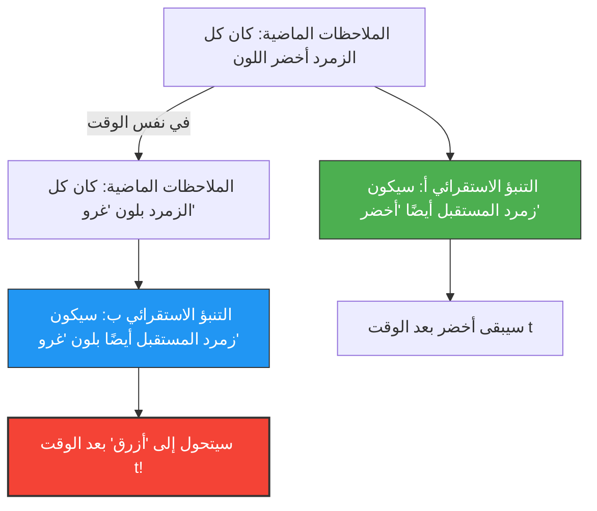

نحن نتوقع "المستقبل" بناءً على "تجارب الماضي".
"بما أن الشمس أشرقت من الشرق بالأمس، فإنها ستشرق من الشرق غدًا أيضًا."
"بما أن كل الزمرد الذي رأيناه حتى الآن كان أخضر اللون، فإن الزمرد الذي سيتم استخراجه في المرة القادمة سيكون أخضر أيضًا."

هذا النوع من الاستدلال يُسمى "الاستقراء"، وهو أساس كل العلوم. ولكن في عام 1955، ابتكر الفيلسوف نيلسون جودمان مفهومًا لونيًا غريبًا يوضح أن هذا الاستقراء يحمل عيبًا جوهريًا. هذه هي **مفارقة "غرو" (Grue)**.

## تعريف اللون الجديد "غرو" (Grue)

عرّف جودمان خاصية (لونًا) جديدة تسمى "غرو" (Grue)، وهي مزيج من "الأخضر" (Green) و"الأزرق" (Blue)، على النحو التالي:

> **تعريف "غرو" (Grue):**
> يُقال إن شيئًا ما بلون "غرو" إذا كان قد لوحظ قبل وقت محدد $t$ (على سبيل المثال 1 يناير 2030) وكان "أخضر" (Green)، وإذا لوحظ في الوقت $t$ أو بعده وكان "أزرق" (Blue).

$$
\text{Grue} = 
\begin{cases} 
\text{Green} & (\text{الوقت} < t) \\
\text{Blue} & (\text{الوقت} \ge t) 
\end{cases}
$$

وفقًا لهذا التعريف، فإن الزمردة الخضراء التي تحملها بيدك الآن (قبل الوقت $t$) هي "خضراء" وفي نفس الوقت بلون "غرو".

## لماذا تُعتبر مفارقة؟

تحدث المفارقة عندما نحاول التنبؤ بالمستقبل.
حتى الآن، كان كل الزمرد الذي لاحظته البشرية "أخضر". لذلك، باستخدام الاستقراء، نتوقع ما يلي:

**الفرضية أ: "كل الزمرد لونه 'أخضر'"**

ولكن، انتظر لحظة. جميع الزمرد الذي تم ملاحظته حتى الآن يعود إلى ما قبل الوقت $t$، لذلك لابد أنه كان جميعها بلون "غرو" أيضًا. وبالتالي، من بيانات الملاحظة نفسها تمامًا، يمكننا التوصل إلى التنبؤ التالي:

**الفرضية ب: "كل الزمرد لونه 'غرو'"**

إذا اتبعنا قواعد الاستقراء، فإن جميع ملاحظات الماضي تدعم الفرضية أ، وبنفس "القوة تمامًا" تدعم أيضًا الفرضية ب.

## هل سيتحول الزمرد إلى اللون الأزرق؟

إذا كانت الفرضية ب صحيحة، ففي اللحظة التي يحل فيها الوقت $t$، يجب أن يتحول كل الزمرد في العالم في وقت واحد إلى اللون "الأزرق" (من تعريف "غرو").

حدسياً، نفكر قائلين: "هذا هراء. الفرضية ب هي تلاعب غير طبيعي بالكلمات، والفرضية أ (الأخضر) هي الصحيحة بالتأكيد".

ومع ذلك، فإن تساؤل جودمان يذهب إلى أعمق من ذلك بكثير.
**"الأخضر" و"غرو"، كلاهما فرضيتان تتوافقان تمامًا مع بيانات الماضي، فلماذا نعتبر تنبؤ "الأخضر" فقط مبررًا ونستبعد تنبؤ "غرو"؟ وما هو "الأساس المنطقي" لذلك؟**

## تحدي "اطراد الطبيعة"

لتجنب هذه المشكلة، قد يتبادر إلى الذهن اعتراض يقول: "يجب أن نستخدم مفاهيم بسيطة مثل 'الأخضر'، ولا ينبغي لنا أن نستخدم مفاهيم معقدة تتضمن الزمن مثل 'غرو'".

لكن جودمان أوضح بالمقابل أنه إذا قمنا بتعريف لون يسمى "بلين" (Bleen: أزرق حتى الوقت $t$، وأخضر بعد ذلك)، فإن مفهوم "الأخضر" بحد ذاته سيصبح مفهومًا معقدًا يعتمد على الزمن كالتالي: "غرو حتى الوقت $t$، وبلين بعد ذلك".
بمعنى آخر، أي الكلمات نعتبرها "أساسية" هو مجرد مسألة عادة في لغتنا.

أثبتت مفارقة "غرو" (لغز الاستقراء الجديد) لجودمان أن النظريات العلمية لا تتحدد فقط بالبيانات الموضوعية المجردة، بل تعتمد بشدة على "الإطار المفاهيمي (اللغة) الذي نستخدمه لتقسيم العالم وفهمه".

حتى في سياق الذكاء الاصطناعي والتعلم الآلي، حتى لو كانت بيانات التدريب هي نفسها، فإن التنبؤات للمستقبل قد تتغير تمامًا بناءً على "بنية النموذج (الميزات التي يركز عليها)". كمشكلة "التركيب الزائد" (Overfitting) أو "التحيز" (Bias)، تستمر هذه المفارقة في حمل أهمية كبيرة حتى في يومنا هذا.
