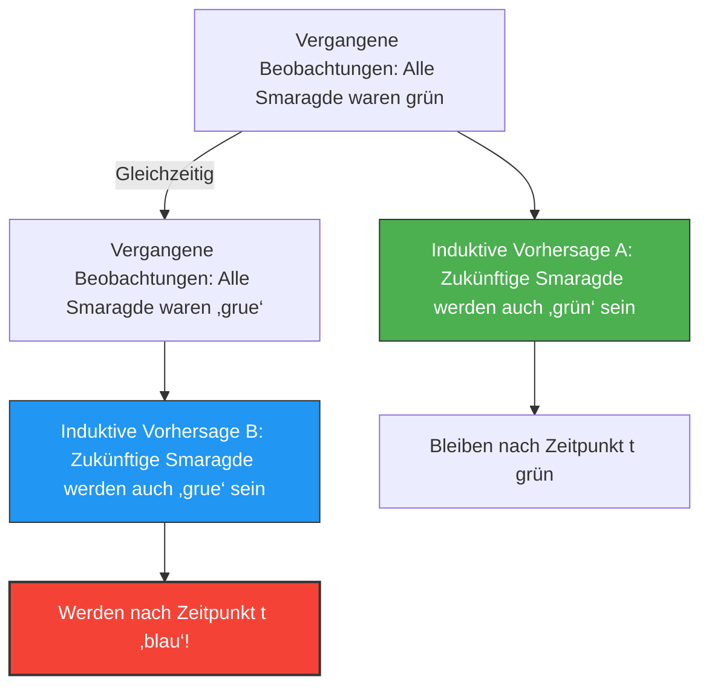

Wir sagen die „Zukunft“ aus „vergangenen Erfahrungen“ voraus.
„Da die Sonne gestern im Osten aufgegangen ist, wird sie auch morgen im Osten aufgehen.“
„Da alle bisher gesehenen Smaragde grün waren, wird der nächste ausgegrabene Smaragd auch grün sein.“

Diese Art von Schlussfolgerung wird „Induktion“ genannt und bildet die Grundlage aller Wissenschaften. Doch im Jahr 1955 entwarf der Philosoph Nelson Goodman das Konzept einer seltsamen Farbe, um zu zeigen, dass diese Induktion einen fundamentalen Fehler aufweist. Das ist das **„Grue“-Paradoxon**.

## Definition der neuen Farbe „Grue“

Goodman definierte eine neue Eigenschaft (Farbe) namens „Grue“, die aus „Green“ (Grün) und „Blue“ (Blau) zusammengesetzt ist, wie folgt:

> **Definition von Grue:**
> Dass ein Objekt „grue“ ist, bedeutet, dass es „grün“ (Green) ist, wenn es vor einem bestimmten Zeitpunkt $t$ (zum Beispiel 1. Januar 2030) beobachtet wird, und „blau“ (Blue), wenn es ab oder nach dem Zeitpunkt $t$ beobachtet wird.

$$
\text{Grue} = 
\begin{cases} 
\text{Green} & (\text{Zeit} < t) \\
\text{Blue} & (\text{Zeit} \ge t) 
\end{cases}
$$

Nach dieser Definition ist der grüne Smaragd, den Sie gerade (vor der Zeit $t$) in der Hand halten, sowohl „grün“ als auch „grue“.

## Warum ist das ein Paradoxon?

Das Paradoxon entsteht, wenn wir versuchen, die Zukunft vorherzusagen.
Alle Smaragde, die die Menschheit bisher beobachtet hat, waren „grün“. Daher verwenden wir die Induktion, um wie folgt zu prognostizieren:

**Hypothese A: „Alle Smaragde sind ‚grün‘.“**

Aber Moment mal. Da die bisher beobachteten Smaragde aus der Zeit vor $t$ stammen, müssen sie auch alle „grue“ gewesen sein. Daher lässt sich aus genau denselben Beobachtungsdaten auch die folgende Vorhersage ableiten:

**Hypothese B: „Alle Smaragde sind ‚grue‘.“**

Wenn wir den Regeln der Induktion folgen, stützen alle vergangenen Beobachtungen Hypothese B mit „genau derselben Stärke“, mit der sie Hypothese A stützen.

## Werden Smaragde blau?

Wenn Hypothese B richtig ist, müssen im Moment des Eintreffens von Zeitpunkt $t$ alle Smaragde auf der Welt gleichzeitig „blau“ werden (gemäß der Definition von Grue).

Intuitiv denken wir: „Das ist Unsinn. Hypothese B ist ein unnatürliches Wortspiel, und Hypothese A (grün) ist sicherlich die richtige.“

Aber Goodmans Fragestellung geht viel tiefer:
**Da beide Hypothesen, „grün“ und „grue“, perfekt mit vergangenen Daten übereinstimmen, warum halten wir dann nur die „grün“-Vorhersage für legitim und verwerfen die „grue“-Vorhersage? Was ist die „logische Grundlage“ dafür?**

## Die Herausforderung für die „Gleichförmigkeit der Natur“

Um dieses Problem zu umgehen, fällt uns der Einwand ein: „Wir sollten einfache Konzepte wie ‚grün‘ verwenden und keine komplexen, zeitabhängigen Konzepte wie ‚grue‘.“

Goodman zeigte jedoch umgekehrt, dass wenn wir eine Farbe „Bleen“ definieren (blau bis zum Zeitpunkt $t$, danach grün), das Konzept von „grün“ selbst zu einem zeitabhängigen komplexen Konzept wird: „grue bis zum Zeitpunkt $t$, danach bleen“.
Mit anderen Worten, welches Wort wir als „grundlegend“ betrachten, ist nur eine Gewohnheit unserer Sprache.

Goodmans „Grue“-Paradoxon (das neue Rätsel der Induktion) hat bewiesen, dass wissenschaftliche Theorien nicht nur durch rein objektive Daten bestimmt werden, sondern stark davon abhängen, „welchen begrifflichen Rahmen (Sprache) wir verwenden, um die Welt zu strukturieren“.

Auch im Kontext von KI und maschinellem Lernen ist dieses Paradoxon heute noch von großer Bedeutung – als das Problem der „Überanpassung“ (Overfitting) und des „Bias“, bei denen selbst bei identischen Trainingsdaten die Vorhersagen für die Zukunft aufgrund der „Struktur des Modells (auf welche Merkmale es achtet)“ völlig unterschiedlich ausfallen können.
