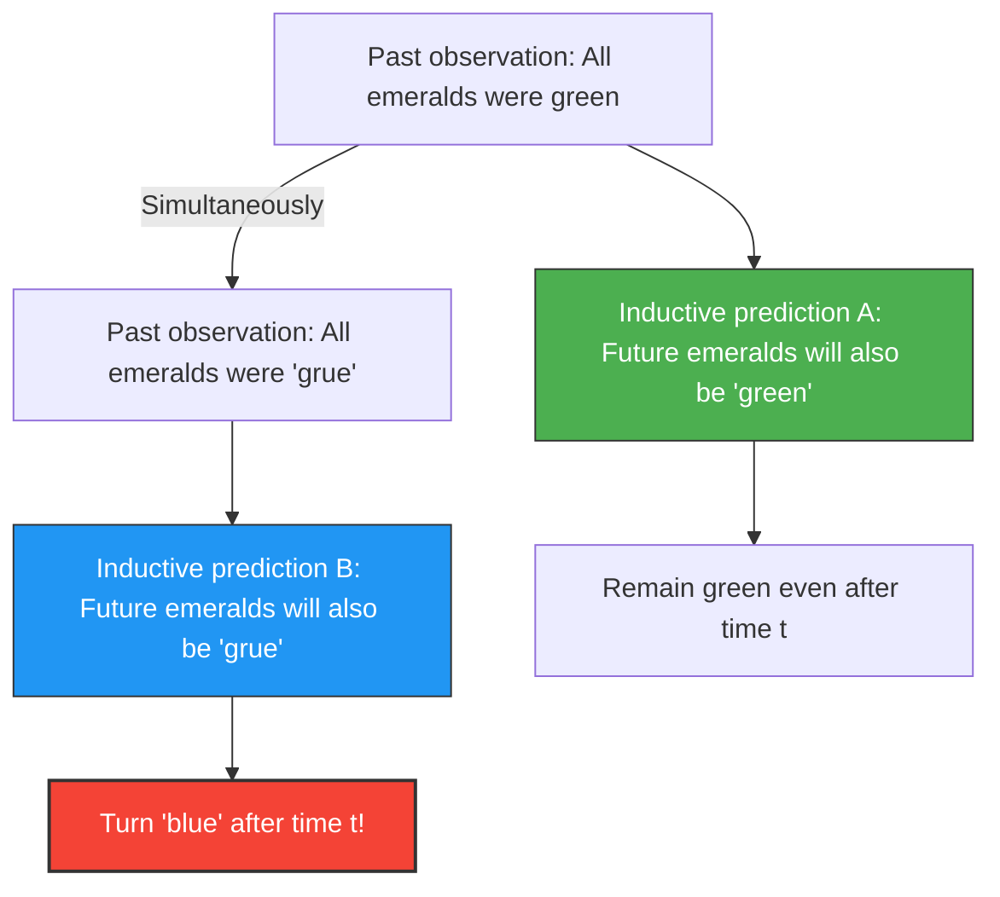

We predict the "future" from "past experiences".
"The sun rose from the east yesterday, so it will rise from the east tomorrow as well."
"All emeralds we have seen so far were green, so the next emerald unearthed will also be green."

Such reasoning is called "induction", and it is the foundation of all science. However, in 1955, philosopher Nelson Goodman devised a bizarre concept of color to show that this induction has a fundamental flaw. That is the **"Grue" paradox**.

## Definition of the New Color "Grue"

Goodman defined a new property (color) called "Grue", which is a synthesis of "Green" and "Blue", as follows.

> **Definition of Grue:**
> An object is "grue" if it is observed before a specific time $t$ (e.g., January 1, 2030) and is "green", and if it is observed at or after time $t$ and is "blue".

$$
\text{Grue} = 
\begin{cases} 
\text{Green} & (\text{Time} < t) \\
\text{Blue} & (\text{Time} \ge t) 
\end{cases}
$$

According to this definition, the green emerald you hold in your hand right now (before time $t$) is simultaneously "green" and "grue".

## Why is it a Paradox?

The paradox occurs when we try to predict the future.
All emeralds humanity has observed so far have been "green". Therefore, using induction, we predict the following:

**Hypothesis A: "All emeralds are 'green'"**

But wait a minute. Since all emeralds observed so far were from before time $t$, they must have also all been "grue". Therefore, from exactly the same observational data, the following prediction also holds true.

**Hypothesis B: "All emeralds are 'grue'"**

If we follow the rules of induction, past observations support Hypothesis B with "exactly the same strength" as they support Hypothesis A.

## Will Emeralds Turn Blue?

If Hypothesis B is correct, the moment time $t$ arrives, all emeralds in the world must simultaneously turn "blue" (from the definition of grue).

Intuitively, we think, "That's absurd. Hypothesis B is unnatural wordplay, and Hypothesis A (green) must be the correct one."

However, Goodman's question lies much deeper.
**Even though both "green" and "grue" hypotheses perfectly match past data, why do we consider only the "green" prediction as valid and eliminate the "grue" prediction? What is the "logical basis" for that?**

## Challenge to the "Uniformity of Nature"

To avoid this problem, an objection comes to mind: "We should use simple concepts like 'green' and not complex, time-dependent concepts like 'grue'."

However, Goodman showed the opposite: if we define a color "Bleen" (blue until time $t$, green thereafter), the very concept of "green" becomes a complex, time-dependent concept ("grue" until time $t$, "bleen" thereafter).
In other words, which words we take as "fundamental" is merely a habit of our language.

Goodman's "Grue" paradox (the new riddle of induction) proved that scientific theories are not determined merely by objective data alone, but depend heavily on "what conceptual framework (language) we use to carve up the world".

Even in the context of AI and machine learning, this paradox continues to hold significant meaning today as the problem of "overfitting" and "bias", where even with the same training data, predictions for the future can completely change depending on the "structure of the model (which features it focuses on)".
