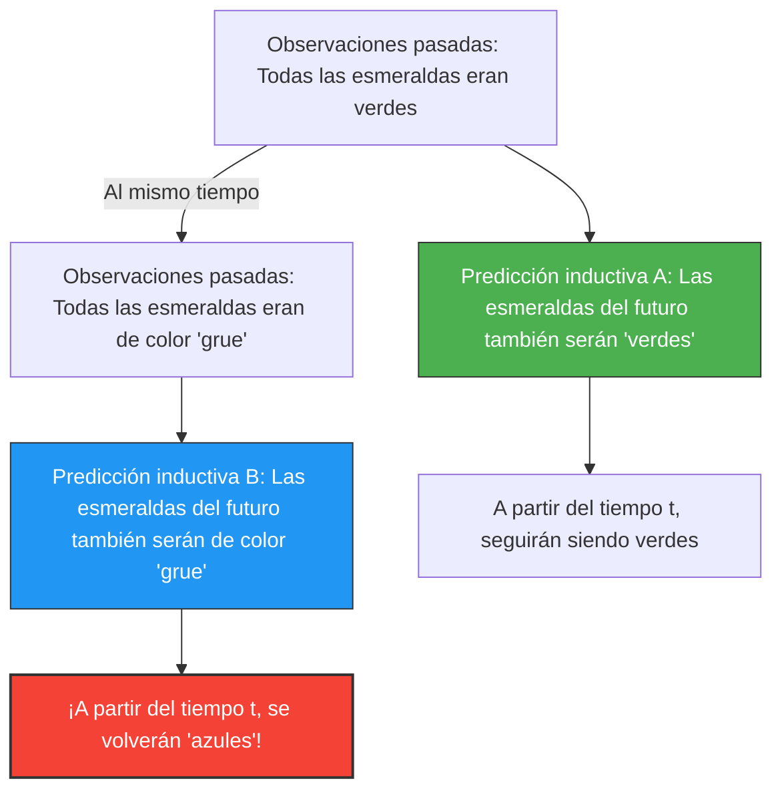

Predecimos el "futuro" a partir de la "experiencia pasada".
"Como el sol salió ayer por el este, mañana también saldrá por el este".
"Como todas las esmeraldas que hemos visto hasta ahora eran verdes, la próxima esmeralda que se extraiga también será verde".

Este tipo de razonamiento se denomina "inducción" y es la base de toda la ciencia. Sin embargo, en 1955, el filósofo Nelson Goodman ideó un extraño concepto de color que demostraba que esta inducción tiene un defecto fundamental. Esta es la **paradoja del «grue»**.

## La definición del nuevo color «grue»

Goodman definió una nueva propiedad (color) llamada «grue» (una síntesis de «verde» (Green) y «azul» (Blue)) de la siguiente manera:

> **Definición de Grue:**
> Decir que un objeto es «grue» significa que si se observa antes de un tiempo específico $t$ (por ejemplo, el 1 de enero de 2030), es «verde» (Green), y si se observa a partir del tiempo $t$, es «azul» (Blue).

$$
\text{Grue} = 
\begin{cases} 
\text{Green} & (\text{tiempo} < t) \\
\text{Blue} & (\text{tiempo} \ge t) 
\end{cases}
$$

Según esta definición, la esmeralda verde que tienes ahora mismo en la mano (antes del tiempo $t$) es al mismo tiempo «verde» y de color «grue».

## ¿Por qué es una paradoja?

La paradoja surge cuando intentamos predecir el futuro.
Todas las esmeraldas que la humanidad ha observado hasta la fecha han sido «verdes». Por lo tanto, utilizando la inducción, predecimos lo siguiente:

**Hipótesis A: "Todas las esmeraldas son 'verdes'"**

Pero un momento. Como las esmeraldas observadas hasta ahora son anteriores al tiempo $t$, todas ellas también deberían haber sido de color «grue». Por lo tanto, a partir exactamente de los mismos datos de observación, también es válida la siguiente predicción:

**Hipótesis B: "Todas las esmeraldas son de color 'grue'"**

Si seguimos las reglas de la inducción, las observaciones pasadas apoyan la Hipótesis B con "exactamente la misma fuerza" con la que apoyan la Hipótesis A.

## ¿Se volverán azules las esmeraldas?

Si la Hipótesis B es correcta, en el instante en que llegue el tiempo $t$, todas las esmeraldas del mundo deberán volverse «azules» de golpe (por la definición de grue).

Intuitivamente pensamos: "Eso es absurdo. La Hipótesis B es un juego de palabras antinatural y la Hipótesis A (verde) tiene que ser la correcta".

Sin embargo, la pregunta de Goodman es mucho más profunda.
**Si tanto la hipótesis «verde» como la hipótesis «grue» concuerdan perfectamente con los datos del pasado, ¿por qué consideramos que solo la predicción «verde» es legítima y descartamos la predicción «grue»? ¿Cuál es nuestro "fundamento lógico" para ello?**

## Un desafío a la "Uniformidad de la Naturaleza"

Para evitar este problema, surge la objeción de que "deberíamos utilizar conceptos simples como el 'verde' y no conceptos complejos que incluyan el tiempo, como el 'grue'".

Sin embargo, Goodman demostró a la inversa que si definimos un color «bleen» (Bleen: azul hasta el tiempo $t$, y verde a partir de entonces), el propio concepto de «verde» se convierte en un concepto complejo dependiente del tiempo: "grue hasta el tiempo $t$, y bleen a partir de entonces".
En otras palabras, decidir qué palabras son "básicas" es simplemente una convención de nuestro lenguaje.

La paradoja del «grue» (el nuevo enigma de la inducción) de Goodman demostró que las teorías científicas no se determinan únicamente por datos empíricos objetivos, sino que dependen en gran medida de "qué marco conceptual (lenguaje) utilizamos para fragmentar el mundo".

Incluso en el contexto de la inteligencia artificial y el aprendizaje automático, donde los datos de entrenamiento pueden ser los mismos, las predicciones para el futuro pueden cambiar por completo dependiendo de la "estructura del modelo" (a qué características se presta atención). Como un problema de "sobreajuste" (overfitting) o "sesgo", esta paradoja sigue teniendo un significado importante en la actualidad.
