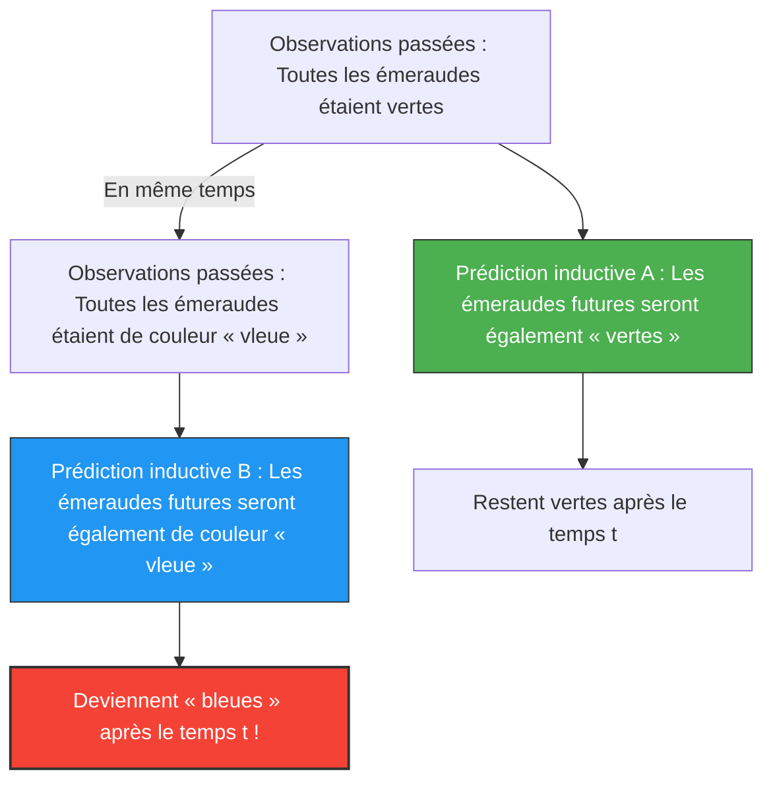

Nous prédisons le « futur » à partir de l'« expérience passée ».
« Le soleil s'est levé à l'est hier, donc il se lèvera à l'est demain. »
« Toutes les émeraudes vues jusqu'à présent étaient vertes, donc la prochaine émeraude déterrée sera aussi verte. »

Ce type de raisonnement est appelé « induction » et constitue la base de toute science. Cependant, en 1955, le philosophe Nelson Goodman a inventé un concept de couleur étrange pour montrer que cette induction présente un défaut fondamental. C'est le **paradoxe de « vleu » (Grue)**.

## Définition de la nouvelle couleur « vleu » (Grue)

Goodman a défini une nouvelle propriété (couleur) appelée « vleu » (Grue), combinant « vert » (Green) et « bleu » (Blue), de la manière suivante :

> **Définition de vleu (Grue) :**
> Un objet est « vleu » si, observé avant un certain temps $t$ (par exemple, le 1er janvier 2030), il est « vert », et si, observé à partir du temps $t$, il est « bleu ».

$$
\text{Grue} = 
\begin{cases} 
\text{Green} & (\text{Temps} < t) \\
\text{Blue} & (\text{Temps} \ge t) 
\end{cases}
$$

Selon cette définition, l'émeraude verte que vous tenez actuellement dans votre main (avant le temps $t$) est à la fois de couleur « verte » et de couleur « vleue ».

## Pourquoi est-ce un paradoxe ?

Le paradoxe survient lorsque nous essayons de prédire l'avenir.
Toutes les émeraudes que l'humanité a observées jusqu'à présent étaient « vertes ». Par conséquent, en utilisant l'induction, nous prédisons ce qui suit :

**Hypothèse A : « Toutes les émeraudes sont "vertes" »**

Mais attendez un instant. Comme toutes les émeraudes observées jusqu'à présent l'ont été avant le temps $t$, elles ont toutes également été de couleur « vleue ». Par conséquent, à partir des mêmes données d'observation, la prédiction suivante est également valable :

**Hypothèse B : « Toutes les émeraudes sont de couleur "vleue" »**

Si nous suivons les règles de l'induction, toutes les observations passées soutiennent l'hypothèse B avec « exactement la même force » qu'elles soutiennent l'hypothèse A.

## Les émeraudes deviendront-elles bleues ?

Si l'hypothèse B est correcte, au moment où le temps $t$ arrivera, toutes les émeraudes du monde devront simultanément devenir « bleues » (d'après la définition de vleu).

Intuitivement, nous pensons : « C'est absurde. L'hypothèse B est un jeu de mots artificiel, et l'hypothèse A (vert) doit être la bonne. »

Cependant, la question de Goodman va beaucoup plus loin.
**Les hypothèses « verte » et « vleue » correspondent toutes deux parfaitement aux données passées, alors pourquoi considérons-nous que seule la prédiction « verte » est justifiée et rejetons-nous la prédiction « vleue » ? Quel est le « fondement logique » de cela ?**

## Un défi à l'« uniformité de la nature »

Pour éviter ce problème, une objection vient à l'esprit : « Nous devrions utiliser des concepts simples comme "vert", et ne pas utiliser de concepts complexes incluant le temps comme "vleu". »

Cependant, Goodman a montré à l'inverse que si l'on définit une couleur « blert » (Bleen : bleu jusqu'au temps $t$, puis vert par la suite), alors le concept même de « vert » devient un concept complexe dépendant du temps : « vleu jusqu'au temps $t$, et blert par la suite ».
En d'autres termes, le choix des mots que nous considérons comme étant de « base » n'est qu'une question d'habitudes linguistiques.

Le paradoxe de « vleu » de Goodman (la nouvelle énigme de l'induction) a prouvé que les théories scientifiques ne sont pas déterminées uniquement par des données objectives, mais dépendent fortement du « cadre conceptuel (langage) que nous utilisons pour découper le monde ».

Même dans le contexte de l'IA et de l'apprentissage automatique, ce paradoxe conserve une signification importante aujourd'hui en tant que problème de « surapprentissage » (overfitting) ou de « biais ». Il montre que, même avec les mêmes données d'apprentissage, la prédiction pour l'avenir change complètement en fonction de la « structure du modèle (quelles caractéristiques sont privilégiées) ».
