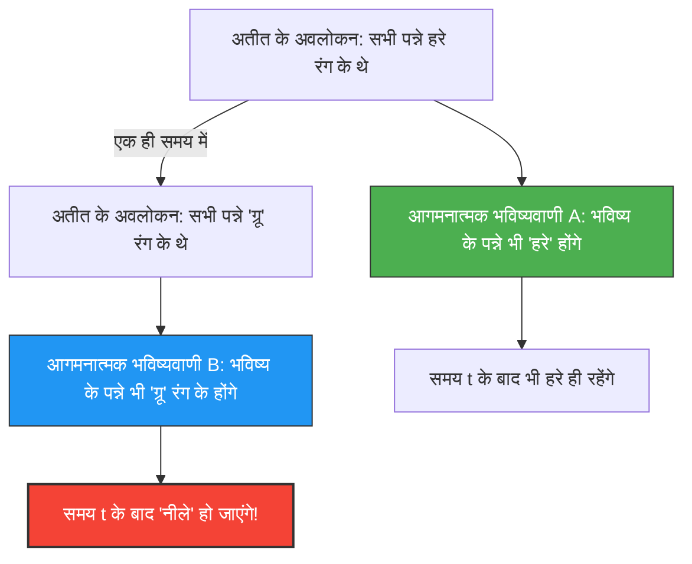

---
title: "क्या पन्ना हरा है, या 'ग्रू' रंग का? : गुडमैन की आगमन की नई पहेली"
description: "हो सकता है कि कल दुनिया के सभी पन्ने नीले रंग में बदल जाएँ। 'ग्रू' का विरोधाभास जो वैज्ञानिक भविष्यवाणियों के आधार को पूरी तरह से हिला देता है।"
date: 2026-09-10T21:00:00+09:00
draft: false
slug: "grue-paradox"
image: "img/grue_paradox.jpg"
math: true
mermaid: true
categories: ["गणितीय विरोधाभास", "दर्शन", "तर्कशास्त्र"]
tags: ["विरोधाभास", "आगमन", "ग्रू", "विज्ञान का दर्शन"]
---

हम 'अतीत के अनुभवों' से 'भविष्य' की भविष्यवाणी करते हैं।
"सूरज कल भी पूर्व से उगा था, इसलिए वह कल भी पूर्व से ही उगेगा।"
"अब तक देखे गए सभी पन्ने हरे रंग के थे, इसलिए अगली बार निकाला जाने वाला पन्ना भी हरा ही होगा।"

इस प्रकार के तर्क को 'आगमन' (Induction) कहा जाता है, और यह सभी विज्ञानों का आधार है। लेकिन 1955 में, दार्शनिक नेल्सन गुडमैन ने एक अजीब रंग अवधारणा तैयार की जो यह दर्शाती है कि इस आगमन में एक मौलिक दोष है। इसे ही **'ग्रू (Grue)' का विरोधाभास** कहा जाता है।

## एक नए रंग 'ग्रू (Grue)' की परिभाषा

गुडमैन ने 'हरा (Green)' और 'नीला (Blue)' मिलाकर 'ग्रू (Grue)' नामक एक नए गुण (रंग) को इस प्रकार परिभाषित किया:

> **ग्रू (Grue) की परिभाषा:**
> किसी वस्तु के 'ग्रू' होने का अर्थ है कि यदि इसे एक विशिष्ट समय $t$ (उदाहरण के लिए, 1 जनवरी 2030) से पहले देखा जाता है, तो यह 'हरा (Green)' है, और यदि इसे समय $t$ के बाद देखा जाता है, तो यह 'नीला (Blue)' है।

$$
\text{Grue} = 
\begin{cases} 
\text{Green} & (\text{समय} < t) \\
\text{Blue} & (\text{समय} \ge t) 
\end{cases}
$$

इस परिभाषा के अनुसार, वर्तमान में (समय $t$ से पहले) आपके हाथ में मौजूद हरे रंग का पन्ना एक ही समय में 'हरा' होने के साथ-साथ 'ग्रू' भी है।

## यह एक विरोधाभास क्यों है?

विरोधाभास तब उत्पन्न होता है जब हम भविष्य की भविष्यवाणी करने का प्रयास करते हैं।
मानव जाति द्वारा अब तक देखे गए सभी पन्ने 'हरे' रहे हैं। इसलिए, हम आगमन का उपयोग करते हुए इस प्रकार भविष्यवाणी करते हैं:

**परिकल्पना A: "सभी पन्ने 'हरे' हैं"**

लेकिन, जरा रुकिए। चूँकि अब तक देखे गए पन्ने समय $t$ से पहले के हैं, इसलिए वे सभी 'ग्रू' रंग के भी रहे होंगे। अतः, बिल्कुल उन्हीं अवलोकन डेटा के आधार पर, निम्नलिखित भविष्यवाणी भी सत्य हो सकती है:

**परिकल्पना B: "सभी पन्ने 'ग्रू' रंग के हैं"**

आगमन के नियमों के अनुसार, अतीत के सभी अवलोकन जिस मजबूती से परिकल्पना A का समर्थन करते हैं, "बिल्कुल उसी मजबूती" से वे परिकल्पना B का भी समर्थन कर रहे हैं।

## क्या पन्ने नीले रंग में बदल जाएंगे?

यदि परिकल्पना B सही है, तो समय $t$ के आते ही, दुनिया भर के सभी पन्ने एक साथ 'नीले' हो जाने चाहिए (ग्रू की परिभाषा के अनुसार)।

हम सहज रूप से सोचते हैं, "ऐसा बेतुका नहीं हो सकता। परिकल्पना B एक अस्वाभाविक शब्दों का खेल है, और परिकल्पना A (हरा) निश्चित रूप से सही है।"

लेकिन गुडमैन का प्रश्न इससे कहीं अधिक गहरा है।
**"हरा" और "ग्रू", जब दोनों परिकल्पनाएं पिछले डेटा के साथ पूरी तरह से मेल खाती हैं, तो हम केवल "हरे" रंग की भविष्यवाणी को ही वैध क्यों मानते हैं और "ग्रू" रंग की भविष्यवाणी को खारिज क्यों करते हैं? इसका "तार्किक आधार" क्या है?**

## "प्रकृति की एकरूपता" को चुनौती

इस समस्या से बचने के लिए, एक प्रतिवाद दिमाग में आ सकता है: "हमें 'हरा' जैसी सरल अवधारणाओं का उपयोग करना चाहिए और 'ग्रू' जैसी समय-सम्मिलित जटिल अवधारणाओं का नहीं।"

लेकिन गुडमैन ने इसके विपरीत यह दर्शाया कि यदि हम 'ब्रीन (Bleen: समय $t$ तक नीला, उसके बाद हरा)' नामक रंग को परिभाषित करते हैं, तो 'हरा' रंग की अवधारणा स्वयं एक समय-निर्भर जटिल अवधारणा बन जाती है—अर्थात्, 'समय $t$ तक ग्रू, और उसके बाद ब्रीन'।
दूसरे शब्दों में, हम किस शब्द को 'मूल' मानते हैं, यह केवल हमारी भाषाई आदत है।

गुडमैन का 'ग्रू' विरोधाभास (आगमन की नई पहेली) यह साबित करता है कि वैज्ञानिक सिद्धांत केवल वस्तुनिष्ठ डेटा द्वारा निर्धारित नहीं होते, बल्कि इस बात पर भी दृढ़ता से निर्भर करते हैं कि "हम दुनिया को समझने के लिए किस वैचारिक ढाँचे (भाषा) का उपयोग कर रहे हैं।"

AI और मशीन लर्निंग के संदर्भ में भी, इस विरोधाभास का आधुनिक समय में गहरा महत्व बना हुआ है, विशेष रूप से 'ओवरफिटिंग (Overfitting)' और 'बायस (Bias)' की समस्याओं के रूप में—जहाँ समान प्रशिक्षण डेटा होने के बावजूद 'मॉडल की संरचना (किन विशेषताओं पर ध्यान दिया जाता है)' के आधार पर भविष्यवाणियां पूरी तरह से बदल सकती हैं।
