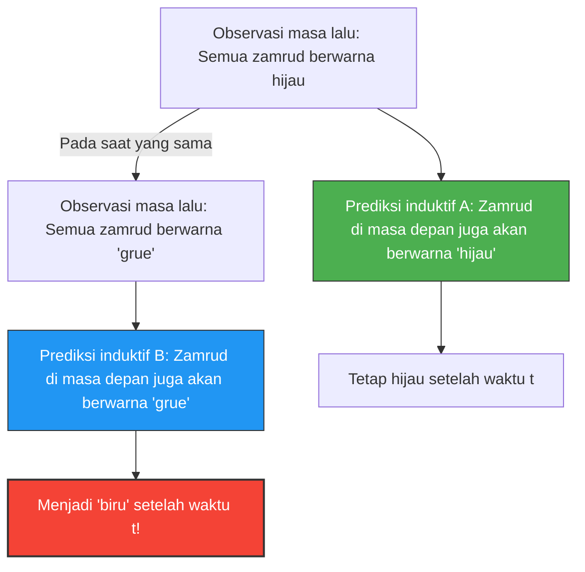

---
title: "Apakah zamrud berwarna hijau atau 'grue'? Teka-teki baru induksi Goodman"
description: "Besok, zamrud di seluruh dunia mungkin berubah menjadi biru. Paradoks 'grue' yang mengguncang dasar prediksi ilmiah."
date: 2026-09-10T21:00:00+09:00
draft: false
slug: "grue-paradox"
image: "img/grue_paradox.jpg"
math: true
mermaid: true
categories: ["Paradoks Matematika", "Filsafat", "Logika"]
tags: ["Paradoks", "Induksi", "Grue", "Filsafat Sains"]
---

Kita memprediksi "masa depan" berdasarkan "pengalaman masa lalu".
"Matahari terbit dari timur kemarin, jadi besok juga akan terbit dari timur."
"Semua zamrud yang pernah dilihat sejauh ini berwarna hijau, jadi zamrud berikutnya yang digali juga akan berwarna hijau."

Inferensi semacam ini disebut "induksi" dan merupakan dasar dari semua ilmu pengetahuan. Namun pada tahun 1955, filsuf Nelson Goodman menemukan konsep warna aneh yang menunjukkan bahwa induksi ini memiliki kelemahan mendasar. Ini adalah **Paradoks "Grue"**.

## Definisi Warna Baru "Grue"

Goodman mendefinisikan sifat (warna) baru yang disebut "Grue", yang merupakan gabungan dari "Hijau (Green)" dan "Biru (Blue)", sebagai berikut:

> **Definisi Grue:**
> Suatu objek dikatakan "grue" jika diamati sebelum waktu tertentu $t$ (misalnya, 1 Januari 2030) ia berwarna "hijau (Green)", dan jika diamati pada atau setelah waktu $t$ ia berwarna "biru (Blue)".

$$
\text{Grue} = 
\begin{cases} 
\text{Green} & (\text{Waktu} < t) \\
\text{Blue} & (\text{Waktu} \ge t) 
\end{cases}
$$

Menurut definisi ini, zamrud hijau yang Anda pegang di tangan Anda saat ini (sebelum waktu $t$) berwarna "hijau" sekaligus "grue".

## Mengapa Ini Menjadi Paradoks?

Paradoks terjadi ketika kita mencoba memprediksi masa depan.
Sejauh ini, semua zamrud yang diamati oleh umat manusia berwarna "hijau". Oleh karena itu, kita memprediksi menggunakan induksi sebagai berikut:

**Hipotesis A: "Semua zamrud berwarna 'hijau'"**

Namun, tunggu sebentar. Karena zamrud yang diamati sejauh ini berada sebelum waktu $t$, semuanya pasti juga berwarna "grue". Oleh karena itu, dari data observasi yang sama persis, prediksi berikut juga dapat dibuat:

**Hipotesis B: "Semua zamrud berwarna 'grue'"**

Jika kita mengikuti aturan induksi, semua observasi masa lalu mendukung Hipotesis A dengan "kekuatan yang sama persis" sebagaimana mereka mendukung Hipotesis B.

## Akankah Zamrud Berubah Menjadi Biru?

Jika Hipotesis B benar, saat waktu $t$ tiba, semua zamrud di dunia harus berubah menjadi "biru" secara bersamaan (menurut definisi grue).

Kita secara intuitif berpikir, "Itu konyol. Hipotesis B hanyalah permainan kata-kata yang tidak wajar, dan Hipotesis A (hijau) pasti lebih tepat."

Namun, pertanyaan Goodman terletak lebih dalam.
**Kedua hipotesis, baik "hijau" maupun "grue", sepenuhnya konsisten dengan data masa lalu, lalu mengapa kita menganggap hanya prediksi "hijau" yang valid dan menolak prediksi "grue"? Apa "dasar logis" untuk itu?**

## Tantangan terhadap "Keseragaman Alam"

Untuk menghindari masalah ini, muncul argumen balasan: "Kita harus menggunakan konsep sederhana seperti 'hijau' dan tidak menggunakan konsep kompleks yang melibatkan waktu seperti 'grue'."

Namun, Goodman menunjukkan bahwa sebaliknya, jika kita mendefinisikan warna "Bleen" (biru sampai waktu $t$, hijau setelahnya), konsep "hijau" itu sendiri menjadi konsep kompleks yang bergantung pada waktu: "grue sampai waktu $t$, bleen setelahnya".
Dengan kata lain, kata mana yang kita anggap "dasar" hanyalah kebiasaan bahasa kita.

Paradoks "grue" (teka-teki baru tentang induksi) dari Goodman membuktikan bahwa teori ilmiah tidak hanya ditentukan oleh sekadar data objektif, tetapi sangat bergantung pada "kerangka konseptual (bahasa) seperti apa yang kita gunakan untuk memahami dunia".

Bahkan dalam konteks AI dan pembelajaran mesin (machine learning), paradoks ini tetap memiliki makna penting di era modern sebagai masalah "overfitting" dan "bias", di mana meskipun data pelatihannya sama, prediksi terhadap masa depan dapat berubah sepenuhnya tergantung pada "struktur model (fitur mana yang menjadi fokus)".
