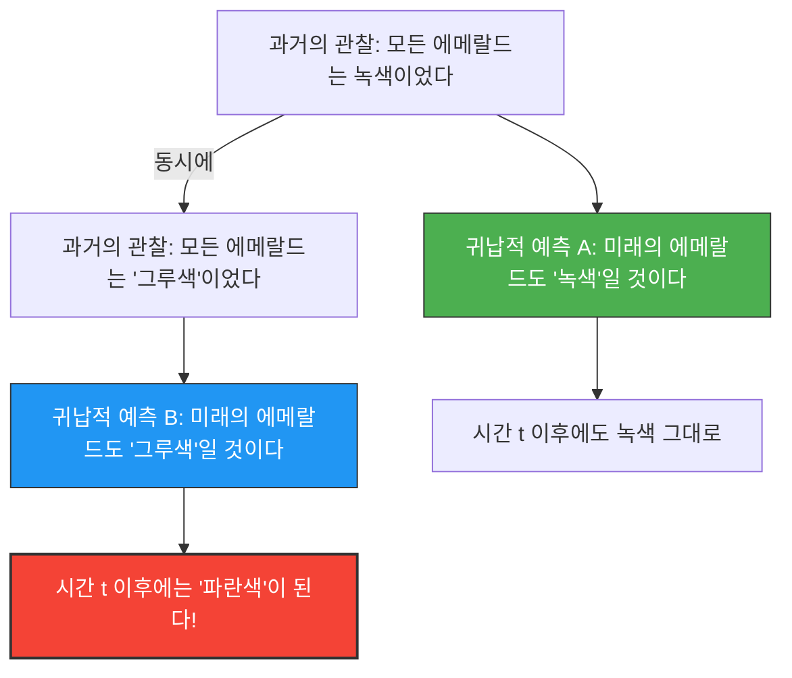

---
title: "에메랄드는 녹색인가, 아니면 '그루'색인가?: 굿맨의 새로운 귀납의 수수께끼"
description: "내일이 되면 전 세계의 에메랄드가 파란색으로 변할지도 모른다. 과학적 예측의 근거를 뿌리째 뒤흔드는 '그루'의 역설."
date: 2026-09-10T21:00:00+09:00
draft: false
slug: "grue-paradox"
image: "img/grue_paradox.jpg"
math: true
mermaid: true
categories: ["수학 역설", "철학", "논리학"]
tags: ["역설", "귀납법", "그루", "과학철학"]
---

우리는 '과거의 경험'으로부터 '미래'를 예측합니다.
"태양은 어제도 동쪽에서 떴으니, 내일도 동쪽에서 뜰 것이다."
"지금까지 본 에메랄드는 모두 녹색이었으니, 다음에 캐낼 에메랄드도 녹색일 것이다."

이러한 추론을 '귀납법'이라고 부르며, 모든 과학의 기초가 됩니다. 하지만 1955년, 철학자 넬슨 굿맨은 이 귀납법이 근본적인 결함을 안고 있음을 보여주는 기묘한 색의 개념을 고안했습니다. 그것이 **'그루(Grue)'의 역설**입니다.

## 새로운 색 '그루(Grue)'의 정의

굿맨은 '녹색(Green)'과 '파란색(Blue)'을 합성한 '그루(Grue)'라는 새로운 성질(색)을 다음과 같이 정의했습니다.

> **그루(Grue)의 정의:**
> 어떤 물체가 '그루'라는 것은, 특정 시간 $t$(예를 들어 서기 2030년 1월 1일) 이전에 관찰된 경우에는 '녹색(Green)'이며, 시간 $t$ 이후에 관찰된 경우에는 '파란색(Blue)'인 것을 의미한다.

$$
\text{Grue} = 
\begin{cases} 
\text{Green} & (\text{시간} < t) \\
\text{Blue} & (\text{시간} \ge t) 
\end{cases}
$$

이 정의에 따르면, 지금 현재(시간 $t$ 이전) 당신이 손에 들고 있는 녹색 에메랄드는 '녹색'인 동시에 '그루색'이기도 합니다.

## 왜 그것이 역설인가?

역설은 우리가 미래를 예측하려고 할 때 발생합니다.
지금까지 인류가 관찰해 온 모든 에메랄드는 '녹색'이었습니다. 따라서 우리는 귀납법을 사용하여 다음과 같이 예측합니다.

**가설 A: "모든 에메랄드는 '녹색'이다"**

하지만 잠깐만요. 지금까지 관찰된 에메랄드는 시간 $t$ 이전의 것이므로, 모두 '그루색'이기도 했을 것입니다. 따라서 완전히 동일한 관찰 데이터로부터 다음과 같은 예측도 성립합니다.

**가설 B: "모든 에메랄드는 '그루색'이다"**

귀납법의 규칙을 따른다면, 과거의 모든 관찰이 가설 A를 지지하는 것과 '완전히 동일한 강도'로 가설 B도 지지하고 있는 것이 됩니다.

## 에메랄드는 파란색으로 변할 것인가?

만약 가설 B가 옳다고 한다면, 시간 $t$가 도래한 순간에 전 세계의 모든 에메랄드는 일제히 '파란색'으로 변해야만 합니다(그루의 정의에 의해).

우리는 직감적으로 "그런 바보 같은 일은 없다. 가설 B는 부자연스러운 말장난이며, 가설 A(녹색)가 옳은 것이 당연하다"라고 생각합니다.

하지만 굿맨의 질문은 더 깊은 곳에 있습니다.
**"녹색"과 "그루색", 두 가설 모두 과거의 데이터와 완전히 일치하는데, 왜 우리는 "녹색"의 예측만을 정당하다고 간주하고 "그루색"의 예측을 배제하는 것일까? 그 '논리적인 근거'는 무엇인가?**

## "자연의 제일성(斉一性)"에 대한 도전

이 문제를 피하기 위해, "'녹색'과 같은 단순한 개념을 사용해야 하며, '그루'처럼 시간이 포함된 복잡한 개념은 사용해서는 안 된다"는 반론이 떠오릅니다.

하지만 굿맨은 반대로 "블린(Bleen: 시간 $t$까지는 파란색, 그 이후는 녹색)"이라는 색을 정의하면, "녹색"이라는 개념 자체가 "시간 $t$까지는 그루, 그 이후는 블린"이라는 시간에 의존하는 복잡한 개념이 되어버린다는 것을 보여주었습니다.
즉, 어떤 단어를 '기본'으로 삼을 것인지는 우리의 언어 습관에 불과한 것입니다.

굿맨의 "그루"의 역설(새로운 귀납의 수수께끼)은, 과학 이론이 단순한 객관적인 데이터만으로 결정되는 것이 아니라, 우리가 "어떤 개념의 틀(언어)을 사용하여 세상을 바라보고 있는가"에 강하게 의존하고 있음을 증명했습니다.

AI나 머신러닝의 맥락에서도, 학습 데이터가 동일하더라도 "모델의 구조(어떤 특징에 주목할 것인가)"에 따라 미래에 대한 예측이 완전히 달라진다는 "과적합(Overfitting)"이나 "편향(Bias)"의 문제로서 이 역설은 현대에도 중요한 의미를 계속해서 가지고 있습니다.
