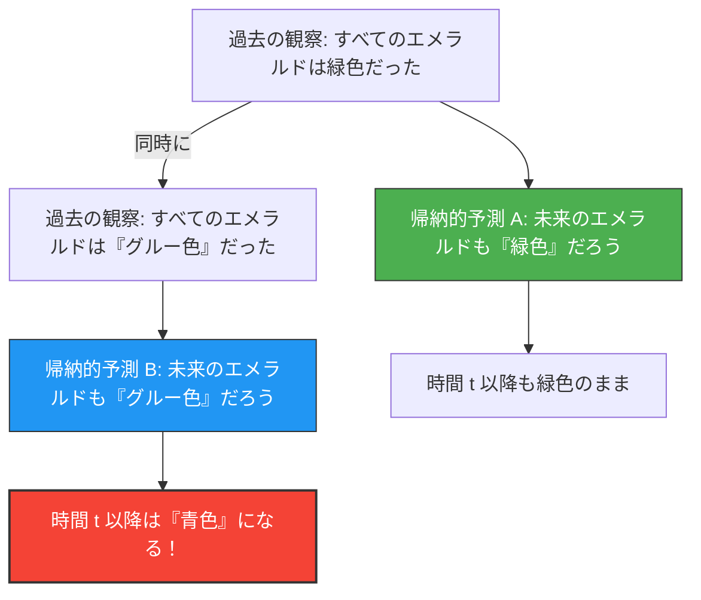

私たちは「過去の経験」から「未来」を予測します。
「太陽は昨日も東から昇ったから、明日も東から昇るだろう」
「今まで見たエメラルドはすべて緑色だったから、次に掘り出されるエメラルドも緑色だろう」

このような推論を「帰納法」と呼び、すべての科学の基礎となっています。しかし1955年、哲学者ネルソン・グッドマンは、この帰納法が根本的な欠陥を抱えていることを示す、奇妙な色の概念を考案しました。それが**「グルー（Grue）」のパラドックス**です。

## 新しい色「グルー（Grue）」の定義

グッドマンは、「緑（Green）」と「青（Blue）」を合成した「グルー（Grue）」という新しい性質（色）を次のように定義しました。

> **グルー（Grue）の定義：**
> ある物体が「グルー」であるとは、特定の時間 $t$（たとえば西暦2030年1月1日）より前に観察された場合は「緑色（Green）」であり、時間 $t$ 以降に観察された場合は「青色（Blue）」であることを意味する。

$$
\text{Grue} = 
\begin{cases} 
\text{Green} & (\text{時間} < t) \\
\text{Blue} & (\text{時間} \ge t) 
\end{cases}
$$

この定義によれば、今現在（時間 $t$ より前）あなたが手に持っている緑色のエメラルドは、「緑色」であると同時に「グルー色」でもあります。

## なぜそれがパラドックスなのか？

パラドックスは、私たちが未来を予測しようとした時に発生します。
これまでに人類が観察してきたすべてのエメラルドは「緑色」でした。したがって、私たちは帰納法を用いて次のように予測します。

**仮説A：「すべてのエメラルドは『緑色』である」**

しかし、ちょっと待ってください。これまでに観察されたエメラルドは時間 $t$ より前のものなので、すべて「グルー色」でもあったはずです。したがって、全く同じ観察データから、次のような予測も成り立ちます。

**仮説B：「すべてのエメラルドは『グルー色』である」**

帰納法のルールに従うなら、過去のすべての観察が仮説Aを支持しているのと「全く同じ強さ」で、仮説Bも支持していることになります。

## エメラルドは青に変わるのか？

もし仮説Bが正しいとすれば、時間 $t$ が到来した瞬間に、世界中のすべてのエメラルドは一斉に「青色」に変わらなければなりません（グルーの定義より）。

私たちは直感的に「そんな馬鹿なことはない。仮説Bは不自然な言葉遊びであり、仮説A（緑色）の方が正しいに決まっている」と考えます。

しかし、グッドマンの問いかけはもっと深いところにあります。
**「緑色」と「グルー色」、どちらの仮説も過去のデータに完全に一致しているのに、なぜ私たちは「緑色」の予測だけを正当だとみなし、「グルー色」の予測を排除するのか？その「論理的な根拠」は何なのか？**

## 「自然の斉一性」への挑戦

この問題を回避するために、「『緑』のような単純な概念を使うべきで、『グルー』のように時間を含んだ複雑な概念は使うべきではない」という反論が思い浮かびます。

しかしグッドマンは、逆に「ブリーン（Bleen：時間 $t$ までは青、それ以降は緑）」という色を定義すれば、「緑色」という概念自体が「時間 $t$ まではグルー、それ以降はブリーン」という時間依存の複雑な概念になってしまうことを示しました。
つまり、どの言葉を「基本」とするかは、私たちの言語の習慣に過ぎないのです。

グッドマンの「グルー」のパラドックス（新しい帰納の謎）は、科学理論が単なる客観的なデータだけで決まるのではなく、私たちが「どのような概念の枠組み（言語）を使って世界を切り取っているか」に強く依存していることを証明しました。

AIや機械学習の文脈でも、学習データが同じであっても「モデルの構造（どの特徴に注目するか）」によって、未来に対する予測が全く変わってしまうという「過学習（オーバーフィッティング）」や「バイアス」の問題として、このパラドックスは現代でも重要な意味を持ち続けています。
