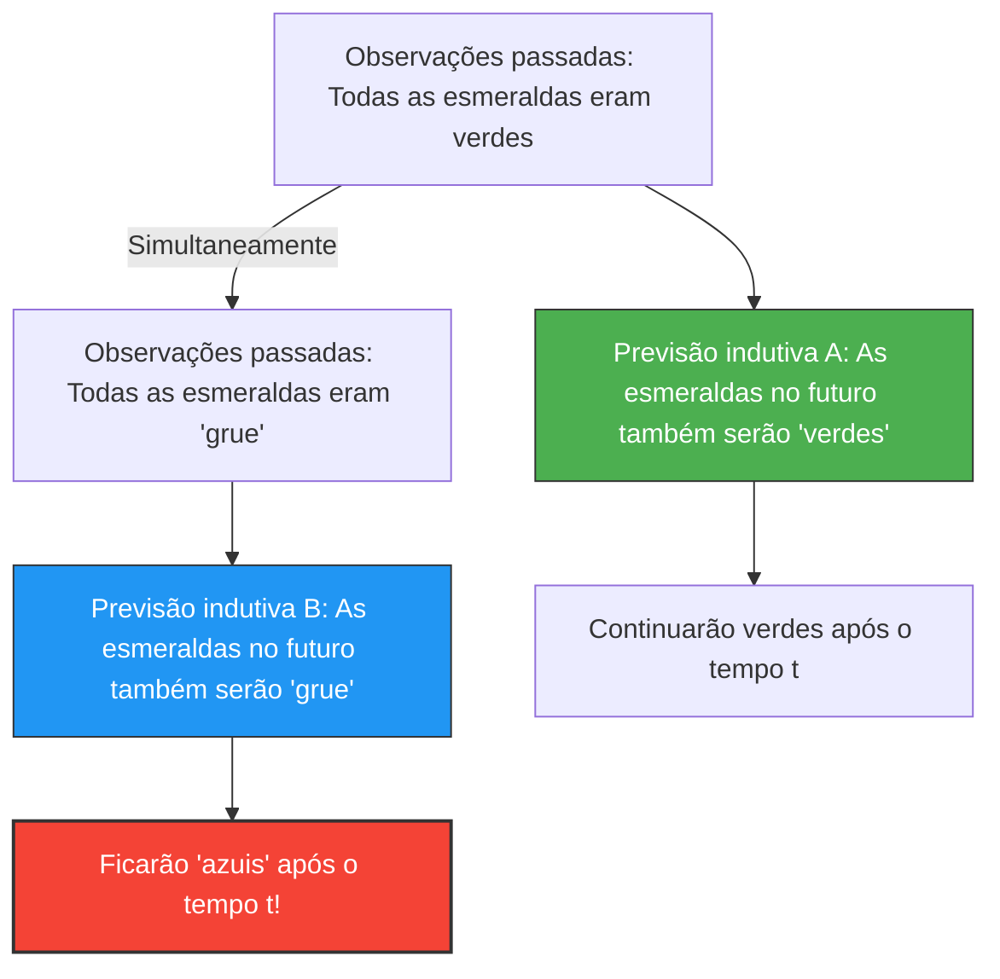

---
title: "Esmeraldas são verdes ou 'grue'? O Novo Enigma da Indução de Goodman"
description: "Amanhã, todas as esmeraldas do mundo podem ficar azuis. O paradoxo 'grue' que abala os fundamentos das previsões científicas."
date: 2026-09-10T21:00:00+09:00
draft: false
slug: "grue-paradox"
image: "img/grue_paradox.jpg"
math: true
mermaid: true
categories: ["Paradoxos Matemáticos", "Filosofia", "Lógica"]
tags: ["Paradoxo", "Indução", "Grue", "Filosofia da Ciência"]
---

Nós prevemos o "futuro" a partir de "experiências passadas".
"O sol nasceu no leste ontem, então amanhã também nascerá no leste."
"Todas as esmeraldas que vi até agora eram verdes, então a próxima esmeralda a ser escavada também será verde."

Esse tipo de raciocínio é chamado de "indução" e é a base de toda a ciência. No entanto, em 1955, o filósofo Nelson Goodman concebeu um estranho conceito de cor para mostrar que essa indução tem uma falha fundamental. Esse é o **paradoxo de "Grue"**.

## A Definição da Nova Cor "Grue"

Goodman definiu uma nova propriedade (cor) chamada "Grue", que é uma combinação de "Verde" (Green) e "Azul" (Blue), da seguinte maneira:

> **Definição de Grue:**
> Diz-se que um objeto é "grue" se, ao ser observado antes de um tempo específico $t$ (por exemplo, 1º de janeiro de 2030), ele for "verde" (Green), e se for observado após o tempo $t$, ele for "azul" (Blue).

$$
\text{Grue} = 
\begin{cases} 
\text{Green} & (\text{tempo} < t) \\
\text{Blue} & (\text{tempo} \ge t) 
\end{cases}
$$

De acordo com essa definição, uma esmeralda verde que você tem nas mãos agora (antes do tempo $t$) é simultaneamente "verde" e "grue".

## Por Que Isso é um Paradoxo?

O paradoxo ocorre quando tentamos prever o futuro.
Todas as esmeraldas que a humanidade observou até hoje eram "verdes". Portanto, usando a indução, prevemos o seguinte:

**Hipótese A: "Todas as esmeraldas são 'verdes'."**

Mas espere um momento. Como todas as esmeraldas observadas até agora o foram antes do tempo $t$, elas também deviam ser todas "grue". Portanto, a partir dos mesmos exatos dados observacionais, a seguinte previsão também é válida:

**Hipótese B: "Todas as esmeraldas são 'grue'."**

Se seguirmos as regras da indução, com a mesma "exata força" que todas as observações passadas apoiam a Hipótese A, elas também apoiam a Hipótese B.

## As Esmeraldas Ficarão Azuis?

Se a Hipótese B estiver correta, no instante em que o tempo $t$ chegar, todas as esmeraldas do mundo deverão ficar "azuis" simultaneamente (pela definição de grue).

Intuitivamente pensamos: "Isso é um absurdo. A Hipótese B é um jogo de palavras não natural, e a Hipótese A (verde) deve estar correta."

No entanto, o questionamento de Goodman vai muito mais fundo.
**Tanto a hipótese "verde" quanto a hipótese "grue" são perfeitamente consistentes com os dados passados. Então, por que consideramos apenas a previsão "verde" como válida e descartamos a previsão "grue"? Qual é a "base lógica" para isso?**

## Um Desafio à "Uniformidade da Natureza"

Para contornar esse problema, surge a objeção de que "devemos usar conceitos simples como 'verde', e não conceitos complexos envolvendo o tempo como 'grue'."

Mas Goodman mostrou que se, inversamente, definirmos uma cor chamada "Bleen" (azul até o tempo $t$, verde depois disso), o próprio conceito de "verde" se torna um conceito complexo e dependente do tempo: "grue até o tempo $t$, bleen depois disso".

Ou seja, quais palavras assumimos como "básicas" é apenas uma questão de nossos hábitos linguísticos.

O paradoxo grue de Goodman (o novo enigma da indução) provou que as teorias científicas não são determinadas apenas por dados puramente objetivos, mas dependem fortemente de "qual estrutura conceitual (linguagem) usamos para interpretar o mundo."

Mesmo no contexto da Inteligência Artificial e do aprendizado de máquina, com os mesmos dados de treinamento, previsões para o futuro podem mudar completamente dependendo da "estrutura do modelo (em quais características focar)". Assim, este paradoxo continua sendo muito relevante hoje como problemas de "sobreajuste (overfitting)" e "viés (bias)".
