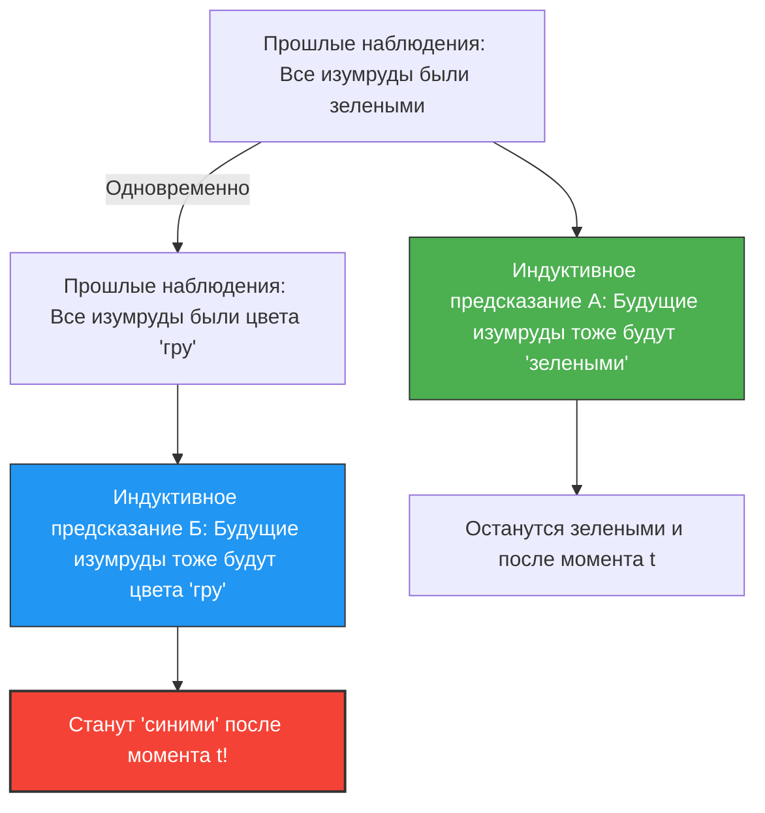

---
title: "Изумруды зеленые или цвета «гру»? Новая загадка индукции Гудмена"
description: "Завтра все изумруды в мире могут стать синими. Парадокс «гру», который разрушает основы научных предсказаний."
date: 2026-09-10T21:00:00+09:00
draft: false
slug: "grue-paradox"
image: "img/grue_paradox.jpg"
math: true
mermaid: true
categories: ["Математические парадоксы", "Философия", "Логика"]
tags: ["Парадокс", "Индукция", "Гру", "Философия науки"]
---

Мы предсказываем «будущее» на основе «прошлого опыта».
«Солнце вчера взошло на востоке, поэтому и завтра оно взойдет на востоке».
«Все изумруды, которые мы видели до сих пор, были зелеными, поэтому следующий выкопанный изумруд тоже будет зеленым».

Такое рассуждение называется «индукцией» и является основой всей науки. Однако в 1955 году философ Нельсон Гудмен придумал странную концепцию цвета, чтобы показать, что эта индукция имеет фундаментальный недостаток. Это **парадокс «гру» (Grue)**.

## Определение нового цвета «гру» (Grue)

Гудмен определил новое свойство (цвет) под названием «гру» (Grue), образованное из слов «зеленый» (Green) и «синий» (Blue), следующим образом.

> **Определение гру (Grue):**
> Объект является «гру», если при наблюдении до определенного момента времени $t$ (например, 1 января 2030 года) он «зеленый» (Green), а при наблюдении после момента времени $t$ он «синий» (Blue).

$$
\text{Grue} = 
\begin{cases} 
\text{Green} & (\text{Время} < t) \\
\text{Blue} & (\text{Время} \ge t) 
\end{cases}
$$

Согласно этому определению, прямо сейчас (до момента $t$) зеленый изумруд в вашей руке одновременно является и «зеленым», и цвета «гру».

## Почему это парадокс?

Парадокс возникает, когда мы пытаемся предсказать будущее.
Все изумруды, которые человечество наблюдало до сих пор, были «зелеными». Следовательно, используя индукцию, мы предсказываем следующее:

**Гипотеза А: «Все изумруды — 'зеленые'»**

Но подождите-ка. Поскольку изумруды, наблюдавшиеся до сих пор, были до момента времени $t$, они все должны были быть и цвета «гру». Следовательно, на основе точно тех же данных наблюдений можно сделать следующее предсказание:

**Гипотеза Б: «Все изумруды — цвета 'гру'»**

Если следовать правилам индукции, то все прошлые наблюдения поддерживают гипотезу Б с «совершенно одинаковой силой», с какой они поддерживают гипотезу А.

## Станут ли изумруды синими?

Если гипотеза Б верна, то в тот момент, когда наступит время $t$, все изумруды в мире должны будут одновременно стать «синими» (согласно определению «гру»).

Мы интуитивно думаем: «Такого абсурда не может быть. Гипотеза Б — это неестественная игра слов, и Гипотеза А (зеленый) определенно более правильная».

Однако вопрос Гудмена лежит гораздо глубже.
**«Зеленый» и цвет «гру» — обе гипотезы полностью соответствуют прошлым данным, так почему же мы считаем обоснованным только предсказание «зеленого» и отвергаем предсказание «гру»? Каково «логическое основание» для этого?**

## Вызов «Единообразию природы»

Чтобы избежать этой проблемы, на ум приходит такое возражение: «Мы должны использовать простые понятия, такие как 'зеленый', и не должны использовать сложные понятия, включающие время, такие как 'гру'».

Однако Гудмен, наоборот, показал, что если определить цвет «блин» (Bleen: синий до момента $t$, а затем зеленый), то само понятие «зеленый» станет зависимым от времени сложным понятием: «гру до момента $t$, а затем блин».
Иными словами, то, какое слово считать «базовым», является лишь нашей языковой привычкой.

Парадокс Гудмена «гру» (новая загадка индукции) доказал, что научные теории определяются не просто объективными данными, а сильно зависят от того, «какую концептуальную структуру (язык) мы используем, чтобы вычленить часть мира».

В контексте ИИ и машинного обучения этот парадокс по-прежнему имеет важное значение и сегодня — как проблема «переобучения» (overfitting) и «предвзятости» (bias), когда даже при одинаковых данных для обучения предсказания относительно будущего могут совершенно измениться в зависимости от «структуры модели (на какие признаки обращается внимание)».
