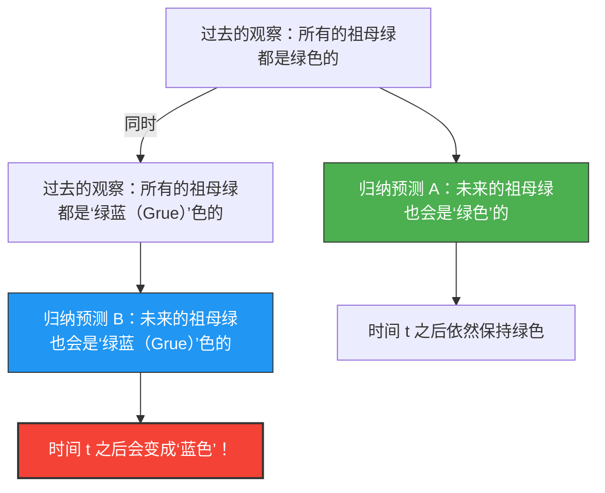

我们通过“过去的经验”来预测“未来”。
“因为太阳昨天也是从东方升起的，所以明天也会从东方升起。”
“因为迄今为止我们看到的祖母绿全都是绿色的，所以接下来挖出的祖母绿也会是绿色的。”

这种推理被称为“归纳法”，它是所有科学的基础。然而在1955年，哲学家纳尔逊·古德曼（Nelson Goodman）构想出了一种奇怪的颜色概念，证明了这种归纳法存在着根本性的缺陷。这就是**“绿蓝（Grue）”悖论**。

## 新颜色“绿蓝（Grue）”的定义

古德曼将“绿色（Green）”和“蓝色（Blue）”合成了一种名为“绿蓝（Grue）”的新性质（颜色），并进行了如下定义：

> **绿蓝（Grue）的定义：**
> 如果某个物体是“绿蓝（Grue）”色的，意味着在特定时间 $t$（例如公元2030年1月1日）之前观察到它是“绿色（Green）”的，而在时间 $t$ 之后观察到它则是“蓝色（Blue）”的。

$$
\text{Grue} = 
\begin{cases} 
\text{Green} & (\text{时间} < t) \\
\text{Blue} & (\text{时间} \ge t) 
\end{cases}
$$

根据这个定义，现在（在时间 $t$ 之前）你手里拿着的绿色祖母绿，它既是“绿色”的，同时也是“绿蓝（Grue）”色的。

## 为什么这是一个悖论？

当试图去预测未来时，悖论就产生了。
迄今为止，人类观察到的所有祖母绿都是“绿色”的。因此，我们使用归纳法做出如下预测：

**假设A：“所有的祖母绿都是‘绿色’的”**

但是，请等一下。因为迄今为止观察到的祖母绿都是在时间 $t$ 之前的，所以它们肯定也全都是“绿蓝（Grue）”色的。因此，从完全相同的观察数据中，同样也可以得出如下预测：

**假设B：“所有的祖母绿都是‘绿蓝（Grue）’色的”**

如果遵循归纳法的规则，那么过去所有的观察在支持假设A的同时，也以“完全相同的强度”支持着假设B。

## 祖母绿会变成蓝色吗？

如果假设B是正确的，那么在时间 $t$ 到来的瞬间，世界上所有的祖母绿都必须一齐变成“蓝色”（根据“绿蓝”的定义）。

我们在直觉上会认为“这怎么可能。假设B不过是不自然的文字游戏，假设A（绿色）肯定是正确的”。

但是，古德曼的质问则处于更深的层次。
**“绿色”和“绿蓝（Grue）色”，这两个假设都与过去的数据完全一致，那为什么我们只认为“绿色”的预测是正当的，而要排除“绿蓝（Grue）色”的预测呢？它的“逻辑依据”到底是什么？**

## 对“自然齐一性”的挑战

为了回避这个问题，我们很容易想到一种反驳：“应该使用像‘绿色’这样简单的概念，而不应该使用像‘绿蓝（Grue）’这样包含了时间的复杂概念”。

但是古德曼反过来指出，如果我们定义一种颜色叫“蓝绿（Bleen：直到时间 $t$ 为止是蓝色，之后是绿色）”，那么“绿色”这个概念本身也就变成了一种依赖于时间的复杂概念：“直到时间 $t$ 为止是‘绿蓝’，之后是‘蓝绿’”。
也就是说，将哪个词语作为“基础”，不过是取决于我们语言的习惯而已。

古德曼的“绿蓝（Grue）”悖论（新归纳之谜）证明了科学理论不仅仅由客观数据决定，还强烈地依赖于我们“使用怎样的概念框架（语言）去切割这个世界”。

即使在人工智能和机器学习的语境下，即使训练数据相同，根据“模型的结构（关注哪些特征）”的不同，对未来的预测也会完全改变。作为这种“过拟合（Overfitting）”或“偏差（Bias）”问题，该悖论在现代依然具有重要的意义。
