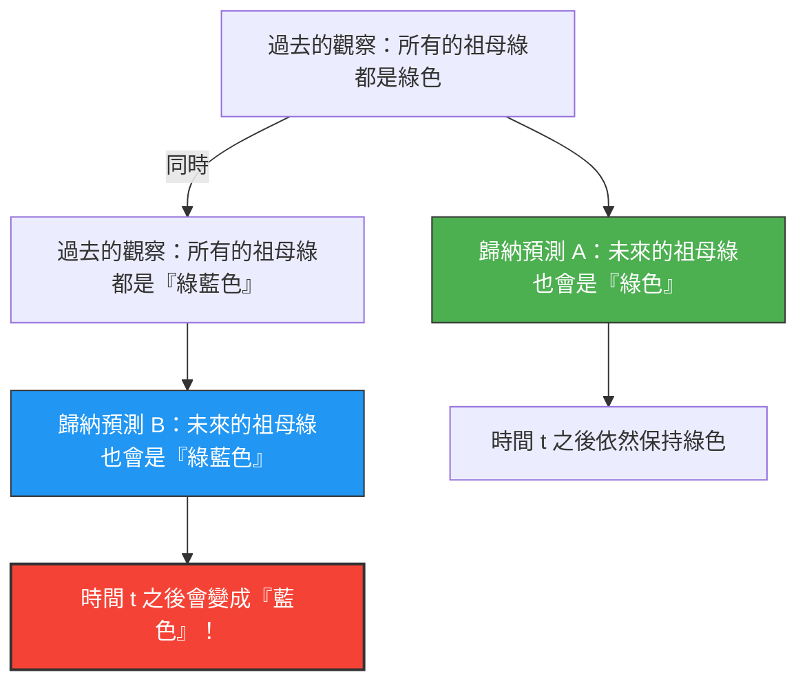

我們透過「過去的經驗」來預測「未來」。
「太陽昨天也從東方升起，所以明天也會從東方升起吧」
「至今為止看到的祖母綠全都是綠色，所以接下來挖掘出來的祖母綠也會是綠色吧」

這樣的推論被稱為「歸納法」，是所有科學的基礎。然而在1955年，哲學家納爾遜·古德曼（Nelson Goodman）構想出了一個奇特的顏色概念，指出這種歸納法存在著根本性的缺陷。這就是**「綠藍（Grue）」悖論**。

## 新顏色「綠藍（Grue）」的定義

古德曼將「綠色（Green）」與「藍色（Blue）」結合，定義了一種新的性質（顏色）「綠藍（Grue）」，如下所示：

> **綠藍（Grue）的定義：**
> 某個物體是「綠藍」色，意味著如果在特定時間 $t$（例如西元2030年1月1日）之前被觀察到，它就是「綠色（Green）」；如果在時間 $t$ 之後被觀察到，它就是「藍色（Blue）」。

$$
\text{Grue} = 
\begin{cases} 
\text{Green} & (\text{時間} < t) \\
\text{Blue} & (\text{時間} \ge t) 
\end{cases}
$$

根據這個定義，現在（時間 $t$ 之前）你手中拿著的綠色祖母綠，不僅是「綠色」，同時也是「綠藍色」。

## 為什麼這是一個悖論？

當我們試圖預測未來時，悖論就產生了。
至今為止人類觀察到的所有祖母綠都是「綠色」。因此，我們使用歸納法做出以下預測：

**假設A：「所有的祖母綠都是『綠色』」**

但是，請等一下。至今為止觀察到的祖母綠都是在時間 $t$ 之前的，所以它們應該也都是「綠藍色」。因此，從完全相同的觀察數據中，我們也可以得出以下預測：

**假設B：「所有的祖母綠都是『綠藍色』」**

如果遵循歸納法的規則，過去所有的觀察支持假設A的強度，與支持假設B的強度是「完全一樣」的。

## 祖母綠會變成藍色嗎？

如果假設B是正確的，那麼當時間 $t$ 到來的那一瞬間，全世界所有的祖母綠都必須同時變成「藍色」（根據綠藍色的定義）。

我們直覺上會認為「不可能有這麼荒謬的事。假設B只是不自然的文字遊戲，假設A（綠色）肯定才是正確的」。

然而，古德曼的提問更具深度。
**「綠色」與「綠藍色」，這兩個假設都完全符合過去的數據，但為什麼我們只將「綠色」的預測視為正當，而排除「綠藍色」的預測呢？其「邏輯基礎」究竟是什麼？**

## 對「自然齊一性」的挑戰

為了解決這個問題，可能會有人提出反駁：「我們應該使用像『綠色』這樣單純的概念，而不該使用像『綠藍色』這種包含時間的複雜概念。」

但是古德曼反而指出，如果我們定義一種顏色叫「藍綠（Bleen：在時間 $t$ 之前是藍色，之後是綠色）」，那麼「綠色」這個概念本身，就會變成「在時間 $t$ 之前是綠藍，之後是藍綠」這種依賴時間的複雜概念。
也就是說，要以哪個詞彙作為「基礎」，不過是我們語言習慣的問題罷了。

古德曼的「綠藍」悖論（新歸納之謎）證明了，科學理論並非單純僅由客觀數據來決定，而是強烈依賴於我們「使用了什麼樣的概念框架（語言）來理解這個世界」。

即使在AI和機器學習的領域中，即便訓練數據相同，根據「模型的結構（關注哪些特徵）」，對未來的預測也會變得截然不同。作為「過度擬合（Overfitting）」和「偏見（Bias）」的問題，這個悖論在現代依然具有重要的意義。
