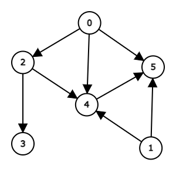

# Graphen-Editor

Vorstellung einer Webseite, auf der Sie einfache Graphen erstellen können.

[https://csacademy.com/app/graph_editor/](https://csacademy.com/app/graph_editor/)

Sie können Graphen erstellen, indem Sie numerische Werte eingeben.
Außerdem scheint es, dass man die Elemente auch mit der Maus bewegen kann.

Durch Klicken auf `Directed` können Sie auch einen gerichteten Graphen erstellen.

Sie können die erstellten Graphen als Bild speichern, indem Sie `Download as PNG` verwenden.
