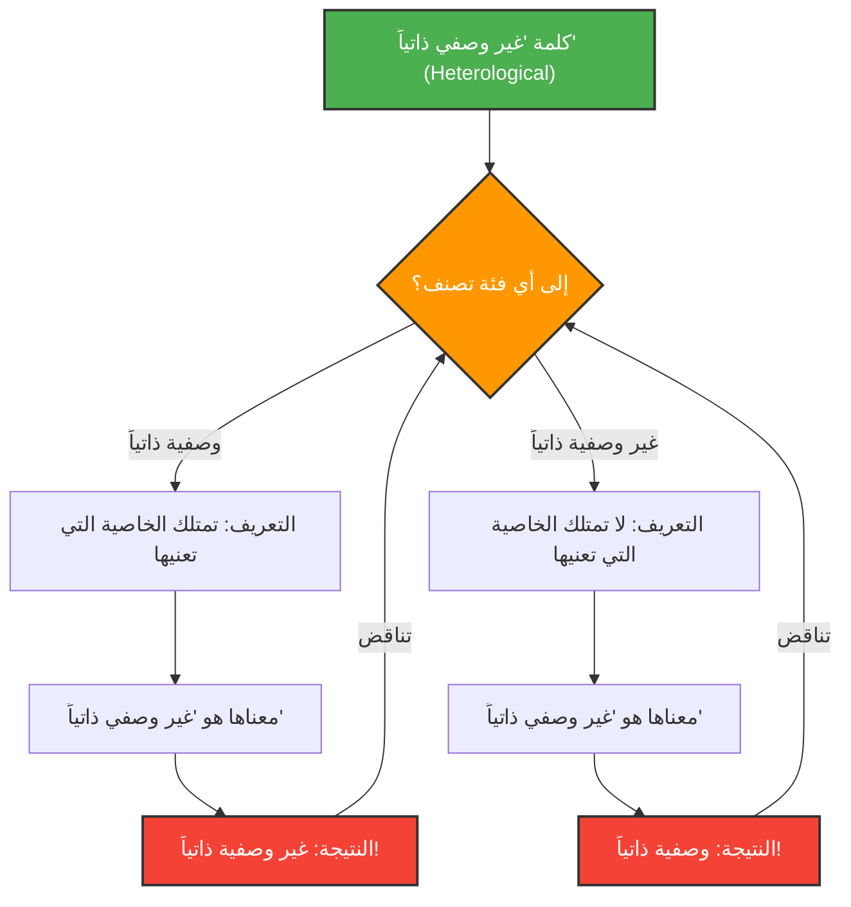

---
title: "عندما تصف الكلمات نفسها: مفارقة غريلينغ-نيلسون"
description: "نستكشف المتاهة العميقة للمنطق ودلالات الألفاظ التي يخلقها تصنيف الكلمات إلى 'وصفية ذاتياً' و'غير وصفية ذاتياً'."
date: 2026-09-10T21:00:00+09:00
draft: false
slug: "grelling-nelson-paradox"
image: "img/grelling_nelson.jpg"
math: true
mermaid: true
categories: ["مفارقات رياضية", "منطق"]
tags: ["مفارقة", "علم الدلالة", "مرجعية ذاتية", "نظرية المجموعات"]
---

الكلمات هي أدوات لوصف العالم، ولكن عندما نحاول وصف الكلمات نفسها، يمكن للمنطق أن يقع في فخ غير متوقع.

**"مفارقة غريلينغ-نيلسون" (Grelling-Nelson Paradox)**، التي ابتكرها كورت غريلينغ وليونارد نيلسون في عام 1908، هي مفارقة دلالية شهيرة تسلط الضوء على حدود "تعريف الكلمات بالكلمات".

## تصنيف الكلمات إلى مجموعتين

اعتقد غريلينغ ونيلسون أنه يمكن تصنيف جميع الصفات (الكلمات) إلى المجموعتين التاليتين:

1. **وصفية ذاتياً (Autological)**: الكلمة التي تمتلك الخاصية التي تعنيها الكلمة نفسها.
2. **غير وصفية ذاتياً (Heterological)**: الكلمة التي لا تمتلك الخاصية التي تعنيها الكلمة نفسها.

### دعونا نلقي نظرة على بعض الأمثلة

**أمثلة على الكلمات الوصفية ذاتياً:**
- **"قصير (short)"**: هذه الكلمة بحد ذاتها قصيرة.
- **"إنجليزي (English)"**: هذه الكلمة بحد ذاتها لغة إنجليزية.
- **"اسم (noun)"**: هذه الكلمة هي اسم.
- **"خماسي المقاطع (pentasyllabic)"**: كلمة "pen-ta-syl-lab-ic" بالإنجليزية تتكون من 5 مقاطع.

**أمثلة على الكلمات غير الوصفية ذاتياً:**
- **"طويل (long)"**: هذه الكلمة بحد ذاتها قصيرة وليست طويلة.
- **"ألماني (German)"**: هذه الكلمة يابانية (أو إنجليزية أو عربية)، وليست ألمانية.
- **"غير مرئي (invisible)"**: هذه الكلمة مرئية بوضوح الآن على الشاشة أو الورق.

حتى الآن، يبدو الأمر وكأنه مجرد تلاعب بالكلمات. يجب أن تكون كل كلمة قابلة للتصنيف بالضرورة إلى إما أنها تجسد معناها أو لا تجسده.

## السؤال القاتل: ظهور المفارقة

الآن، تبدأ المفارقة من هنا. دعونا نفكر في الكلمة التالية.

> **هل الكلمة "غير وصفي ذاتياً" (Heterological) بحد ذاتها وصفية ذاتياً؟ أم أنها غير وصفية ذاتياً؟**

في مواجهة هذا السؤال، سنواجه تناقضًا بغض النظر عن الإجابة التي نختارها.

### الحالة 1: افتراض أن كلمة "غير وصفي ذاتياً" هي "وصفية ذاتياً"

إذا كانت الكلمة "غير وصفي ذاتياً" (Heterological) هي "وصفية ذاتياً"، فبناءً على التعريف، "يجب أن تمتلك الخاصية التي تعنيها الكلمة نفسها".
لكن معنى هذه الكلمة هو "غير وصفي ذاتياً".
بعبارة أخرى، امتلاكها لخاصية "غير وصفي ذاتياً" يعني أنها "غير وصفية ذاتياً".
**افترضنا أنها وصفية ذاتياً، لكن النتيجة كانت أنها غير وصفية ذاتياً.** (تناقض)

### الحالة 2: افتراض أن كلمة "غير وصفي ذاتياً" هي "غير وصفية ذاتياً"

إذا كانت الكلمة "غير وصفي ذاتياً" (Heterological) هي "غير وصفية ذاتياً"، فبناءً على التعريف، "الكلمة نفسها لا تمتلك الخاصية التي تعنيها".
بما أن معنى هذه الكلمة هو "غير وصفي ذاتياً"، فإن عدم امتلاكها لهذه الخاصية يعني أنها "وصفية ذاتياً".
**افترضنا أنها غير وصفية ذاتياً، لكن النتيجة كانت أنها وصفية ذاتياً.** (تناقض)

في كلتا الحالتين ينهار المنطق.

## الارتباط بالرياضيات والمنطق: قريبة مفارقة راسل

هذه المفارقة ليست مجرد خطأ حسابي بسيط أو وهم مثل "لغز الدولار المفقود". بل لها نفس البنية الأساسية التي تمتلكها **مفارقة راسل** ("هل مجموعة كل المجموعات التي لا تحتوي على نفسها، تحتوي على نفسها؟") التي هزت أسس الرياضيات.

يمكن القول إن مفارقة غريلينغ-نيلسون هي النسخة الدلالية (معنى الكلمات) من مفارقة راسل.

مفارقة راسل في نظرية المجموعات:
$$ R = \\{ x \mid x \notin x \\} $$
عند تعريف هذه المجموعة، فإن السؤال عما إذا كان $R \in R$ أو $R \notin R$ يؤدي إلى تناقض.

مفارقة غريلينغ-نيلسون في علم الدلالة:
عند تعريف $Het(x)$ كـ "الكلمة $x$ لا تمتلك الخاصية $x$ (أي أنها غير وصفية ذاتياً)"، نقع في التناقض المنطقي التالي:
$$ Het(\text{"Het"}) \iff \neg Het(\text{"Het"}) $$

## لماذا هذه المفارقة مهمة؟

عندما تشير الكلمات إلى نفسها (مرجعية ذاتية)، يكون هناك دائماً خطر كامن لحدوث أخطاء تشبه الحلقات اللانهائية.

هذه ليست مجرد مشكلة في الفلسفة أو اللغويات. ففي مجالات علوم الكمبيوتر والذكاء الاصطناعي، عندما يحاول برنامج ما تقييم وتعديل الكود الخاص به، أو عندما يفسر نموذج معالجة لغة طبيعية التناقضات الدلالية، فإنه يواجه جدراناً منطقية مشابهة.

مفارقة غريلينغ-نيلسون هي تجربة فكرية تُظهر بشكل رائع "الأخطاء" (القيود) التي يمتلكها نظام "اللغة" بشكل جوهري.
