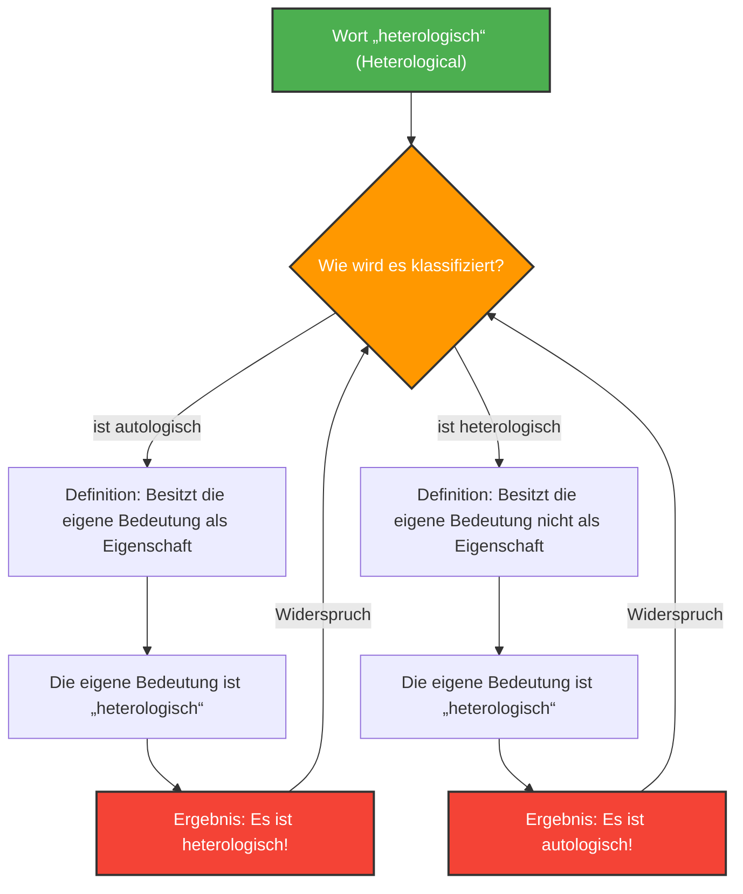

Wörter sind Werkzeuge zur Beschreibung der Welt, aber wenn man versucht, Wörter selbst zu beschreiben, kann die Logik in unerwartete Fallen geraten.

Das 1908 von Kurt Grelling und Leonard Nelson erdachte **„Grelling-Nelson-Paradoxon“** ist ein berühmtes Paradoxon der Semantik, das genau diese Grenzen aufzeigt, wenn „Wörter Wörter definieren“.

## Wörter in zwei Kategorien einteilen

Grelling und Nelson waren der Ansicht, dass sich alle Adjektive (Wörter) in die folgenden zwei Gruppen einteilen lassen.

1. **Autologisch (Autological)**: Das Wort selbst besitzt die Eigenschaft, die es beschreibt.
2. **Heterologisch (Heterological)**: Das Wort selbst besitzt die Eigenschaft, die es beschreibt, nicht.

### Schauen wir uns einige Beispiele an

**Beispiele für autologische Wörter:**
- **„kurz“ (short)**: Dieses Wort selbst ist kurz.
- **„englisch“ (English)**: Dieses Wort selbst ist englisch.
- **„Substantiv“ (noun)**: Dieses Wort ist ein Substantiv.
- **„fünfsilbig“ (pentasyllabic)**: Auf Englisch hat „pen-ta-syl-lab-ic“ 5 Silben.

**Beispiele für heterologische Wörter:**
- **„lang“ (long)**: Dieses Wort selbst ist kurz, nicht lang.
- **„deutsch“ (German)**: Dieses Wort ist japanisch (oder englisch) und nicht deutsch.
- **„unsichtbar“ (invisible)**: Dieses Wort ist jetzt deutlich auf dem Bildschirm oder Papier zu sehen.

Bis hierhin sieht es wie ein bloßes Wortspiel aus. Jedes Wort sollte sich notwendigerweise in eine der beiden Kategorien einordnen lassen: entweder verkörpert es seine eigene Bedeutung oder nicht.

## Die fatale Frage: Die Entstehung des Paradoxons

Nun, hier beginnt das Paradoxon. Betrachten wir das folgende Wort:

> **Ist das Wort „heterologisch“ (Heterological) selbst autologisch oder heterologisch?**

Auf diese Frage stoßen wir auf einen Widerspruch, egal welche Antwort wir wählen.

### Fall 1: Wir nehmen an, „heterologisch“ ist „autologisch“

Wenn das Wort „heterologisch“ (Heterological) „autologisch“ ist, bedeutet dies per Definition, dass „das Wort selbst die Eigenschaft besitzt, die es beschreibt“.
Die Bedeutung dieses Wortes ist jedoch „heterologisch“.
Das heißt, die Eigenschaft „heterologisch“ zu besitzen, bedeutet, dass es „heterologisch“ ist.
**Obwohl wir angenommen haben, dass es autologisch ist, ist das Ergebnis heterologisch.** (Widerspruch)

### Fall 2: Wir nehmen an, „heterologisch“ ist „heterologisch“

Wenn das Wort „heterologisch“ (Heterological) „heterologisch“ ist, bedeutet dies per Definition, dass „das Wort selbst die Eigenschaft, die es beschreibt, nicht besitzt“.
Da die Bedeutung dieses Wortes „heterologisch“ ist, bedeutet das Fehlen dieser Eigenschaft, dass es „autologisch“ ist.
**Obwohl wir angenommen haben, dass es heterologisch ist, ist das Ergebnis autologisch.** (Widerspruch)

Egal in welche Richtung wir gehen, die Logik bricht zusammen.

## Verbindung zu Mathematik und Logik: Ein Verwandter der Russellschen Antinomie

Dieses Paradoxon ist kein einfacher Rechenfehler oder eine Illusion wie das „Rätsel des fehlenden Dollars“. Es hat im Wesentlichen die gleiche Struktur wie die **Russellsche Antinomie** („Enthält die Menge aller Mengen, die sich nicht selbst enthalten, sich selbst?“), welche die Grundlagen der Mathematik erschütterte.

Man kann sagen, dass das Grelling-Nelson-Paradoxon die semantische Version (Wortbedeutung) der Russellschen Antinomie ist.

Die Russellsche Antinomie in der Mengenlehre:
Wenn wir die Menge
$$ R = \\{ x \mid x \notin x \\} $$
definieren und fragen, ob $R \in R$ oder $R \notin R$ gilt, führt dies zu einem Widerspruch.

Das Grelling-Nelson-Paradoxon in der Semantik:
Wenn wir $Het(x)$ definieren als „das Wort $x$ besitzt die Eigenschaft $x$ nicht (ist heterologisch)“, geraten wir in den logischen Widerspruch:
$$ Het(\text{"Het"}) \iff \neg Het(\text{"Het"}) $$

## Warum ist dieses Paradoxon wichtig?

Wenn Wörter sich auf sich selbst beziehen (Selbstreferenz), besteht immer die Gefahr, dass Fehler wie in einer Endlosschleife auftreten.

Dies ist nicht nur ein Problem der Philosophie oder Linguistik. Auch in der Informatik und der Künstlichen Intelligenz stößt man auf ähnliche logische Barrieren, wenn Programme versuchen, ihren eigenen Code auszuwerten und zu modifizieren, oder wenn Modelle zur Verarbeitung natürlicher Sprache semantische Widersprüche interpretieren.

Das Grelling-Nelson-Paradoxon ist ein Gedankenexperiment, das den Bug (die Grenze), der dem System „Sprache“ innewohnt, hervorragend visualisiert.
