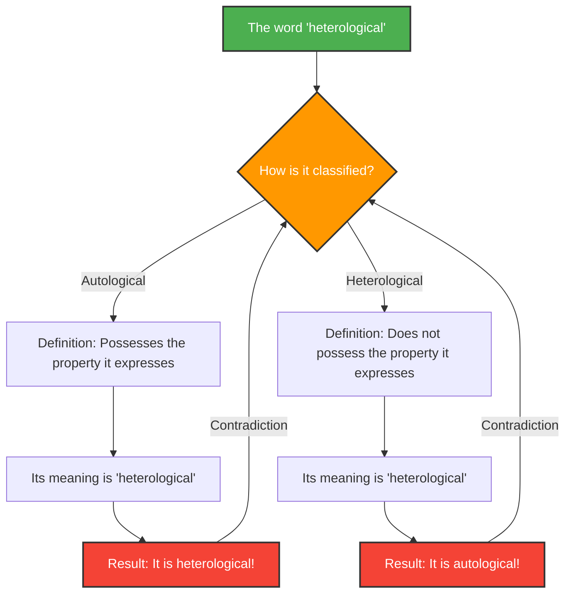

---
title: "When Words Describe Themselves: The Grelling-Nelson Paradox"
description: "Unraveling the deep labyrinth of logic and semantics created by the classification of 'autological' and 'heterological' words."
date: 2026-09-10T21:00:00+09:00
draft: false
slug: "grelling-nelson-paradox"
image: "img/grelling_nelson.jpg"
math: true
mermaid: true
categories: ["Math Paradoxes", "Logic"]
tags: ["Paradox", "Semantics", "Self-Reference", "Set Theory"]
---

Words are tools for describing the world, but when we try to describe the words themselves, logic can fall into unexpected pitfalls.

Devised in 1908 by Kurt Grelling and Leonard Nelson, the **"Grelling-Nelson Paradox"** is a famous semantic paradox that confronts the limits of "words defining words."

## Classifying Words into Two Categories

Grelling and Nelson considered that all adjectives (words) could be classified into the following two groups:

1. **Autological**: A word that possesses the property it expresses.
2. **Heterological**: A word that does not possess the property it expresses.

### Let's Look at Some Examples

**Examples of Autological Words:**
- **"short"**: The word itself is short.
- **"English"**: The word itself is English.
- **"noun"**: The word is a noun.
- **"pentasyllabic"**: The word "pen-ta-syl-lab-ic" in English has five syllables.

**Examples of Heterological Words:**
- **"long"**: The word itself is short, not long.
- **"German"**: This word is English, not German.
- **"invisible"**: This word is currently clearly visible on your screen or paper.

Up to this point, it looks like mere wordplay. Every word should theoretically fall into one of the two categories: either it embodies its meaning or it doesn't.

## The Fatal Question: The Emergence of the Paradox

Now, here begins the paradox. Consider the following single word:

> **Is the word "heterological" itself autological or heterological?**

Whatever answer we choose for this question, we face a contradiction.

### Case 1: Assume "heterological" is "autological"

If the word "heterological" is "autological," by definition, it "possesses the property it expresses."
However, the meaning of this word is "heterological."
In other words, having the property of being "heterological" means that it is "heterological."
**We assumed it was autological, but the result turned out to be heterological.** (Contradiction)

### Case 2: Assume "heterological" is "heterological"

If the word "heterological" is "heterological," by definition, it "does not possess the property it expresses."
Since the meaning of this word is "heterological," not having that property means that it is "autological."
**We assumed it was heterological, but the result turned out to be autological.** (Contradiction)

Whichever way it goes, logic collapses.

## Connection to Math and Logic: A Relative of Russell's Paradox

This paradox is not a simple miscalculation or illusion like the "Missing Dollar Riddle." It shares essentially the same structure as **Russell's Paradox** ("Does the set of all sets that do not contain themselves contain itself?"), which shook the foundations of mathematics.

The Grelling-Nelson Paradox can be considered the semantic (word meaning) version of Russell's Paradox.

Russell's Paradox in set theory:
When defining a set
$$ R = \\{ x \mid x \notin x \\} $$
asking whether $R \in R$ or $R \notin R$ leads to a contradiction.

The Grelling-Nelson Paradox in semantics:
When defining $Het(x)$ as "the word $x$ does not possess the property $x$ (is heterological)",
$$ Het(\text{"Het"}) \iff \neg Het(\text{"Het"}) $$
leads to a logical contradiction.

## Why is This Paradox Important?

When words refer to themselves (self-reference), there is always a latent danger of infinite loop-like errors occurring.

This is not just a problem in philosophy or linguistics. In the fields of computer science and artificial intelligence, similar logical walls are encountered when programs attempt to evaluate or modify their own code, or when natural language processing models interpret semantic contradictions.

The Grelling-Nelson Paradox is a thought experiment that beautifully visualizes the bugs (limitations) inherently contained within the system of "language."
