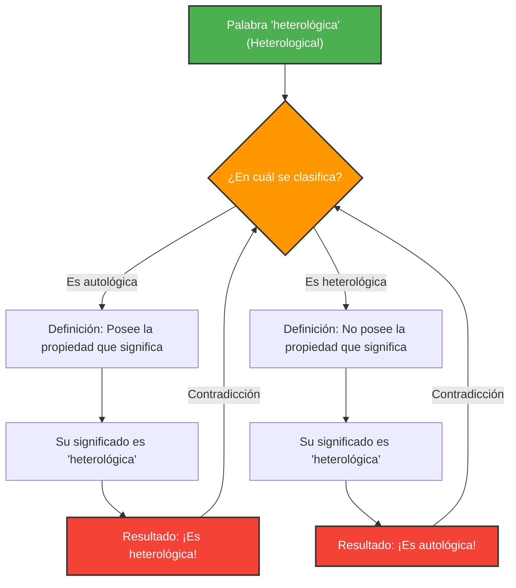

---
title: "Cuando las palabras se describen a sí mismas: la paradoja de Grelling-Nelson"
description: "Desentrañamos el profundo laberinto de la lógica y la semántica creado por la clasificación de palabras en 'autológicas' y 'heterológicas'."
date: 2026-09-10T21:00:00+09:00
draft: false
slug: "grelling-nelson-paradox"
image: "img/grelling_nelson.jpg"
math: true
mermaid: true
categories: ["Paradojas matemáticas", "Lógica"]
tags: ["Paradoja", "Semántica", "Autorreferencia", "Teoría de conjuntos"]
---

Las palabras son herramientas para describir el mundo, pero cuando intentamos usarlas para describir las palabras en sí mismas, la lógica puede caer en trampas inesperadas.

Ideada por Kurt Grelling y Leonard Nelson en 1908, la **"Paradoja de Grelling-Nelson" (Grelling-Nelson Paradox)** es una famosa paradoja semántica que nos enfrenta exactamente a ese límite de "las palabras definiendo palabras".

## Clasificando las palabras en dos

Grelling y Nelson consideraron que todos los adjetivos (palabras) podían clasificarse en los siguientes dos grupos:

1. **Autológicas (Autological)**: La palabra en sí misma posee la propiedad que significa.
2. **Heterológicas (Heterological)**: La palabra en sí misma no posee la propiedad que significa.

### Veamos algunos ejemplos

**Ejemplos de palabras autológicas:**
- **"Corto" (short)**: Esta misma palabra es corta.
- **"Español" (Spanish)**: Esta misma palabra está en español.
- **"Sustantivo" (noun)**: Esta palabra es un sustantivo.
- **"Pentasílaba" (pentasyllabic)**: La palabra en español "pen-ta-sí-la-ba" tiene cinco sílabas.

**Ejemplos de palabras heterológicas:**
- **"Largo" (long)**: Esta misma palabra es corta, no larga.
- **"Alemán" (German)**: Esta palabra es español, y no es alemán.
- **"Invisible" (invisible)**: Esta palabra ahora mismo es claramente visible en la pantalla o el papel.

Hasta aquí parece un simple juego de palabras. Toda palabra debería poder clasificarse sin falta en una de las dos categorías: encarna su propio significado o no lo hace.

## La pregunta fatal: El surgimiento de la paradoja

Aquí es donde comienza la paradoja. Consideremos la siguiente palabra.

> **¿La palabra "heterológica" (Heterological) es en sí misma autológica o heterológica?**

Ante esta pregunta, nos enfrentamos a una contradicción independientemente de la respuesta que elijamos.

### Caso 1: Supongamos que "heterológica" es "autológica"

Si la palabra "heterológica" (Heterological) es "autológica", por definición significa que "la palabra en sí misma posee la propiedad que significa".
Sin embargo, el significado de esta palabra es ser "heterológica".
En otras palabras, poseer la propiedad de ser "heterológica" significa que es "heterológica".
**Supusimos que era autológica, pero el resultado es que es heterológica.** (Contradicción)

### Caso 2: Supongamos que "heterológica" es "heterológica"

Si la palabra "heterológica" (Heterological) es "heterológica", por definición significa que "la palabra en sí misma no posee la propiedad que significa".
Como el significado de esta palabra es ser "heterológica", no poseer esa propiedad significa que es "autológica".
**Supusimos que era heterológica, pero el resultado es que es autológica.** (Contradicción)

Caigamos del lado que caigamos, la lógica se desmorona.

## Vínculo con las matemáticas y la lógica: Prima de la paradoja de Russell

Esta paradoja no es un simple error de cálculo o una ilusión como "el misterio del dólar perdido". Tiene esencialmente la misma estructura que la **Paradoja de Russell** ("¿El conjunto de todos los conjuntos que no se contienen a sí mismos, se contiene a sí mismo?"), que sacudió los cimientos de las matemáticas.

Se puede decir que la paradoja de Grelling-Nelson es la versión semántica (del significado de las palabras) de la paradoja de Russell.

La paradoja de Russell en la teoría de conjuntos:
Al definir un conjunto $$ R = \\{ x \mid x \notin x \\} $$,
preguntar si $R \in R$ o $R \notin R$ lleva a una contradicción.

La paradoja de Grelling-Nelson en semántica:
Al definir $Het(x)$ como "la palabra $x$ no posee la propiedad $x$ (es heterológica)",
se cae en la contradicción lógica de:
$$ Het(\text{"Het"}) \iff \neg Het(\text{"Het"}) $$

## ¿Por qué es importante esta paradoja?

Cuando las palabras se refieren a las propias palabras (autorreferencia), siempre existe el peligro latente de que ocurra un error similar a un bucle infinito.

Este no es solo un problema de la filosofía o la lingüística. En el campo de la informática y la inteligencia artificial, cuando un programa intenta evaluar o modificar su propio código, o cuando un modelo de procesamiento de lenguaje natural interpreta contradicciones semánticas, nos enfrentamos a barreras lógicas similares.

La paradoja de Grelling-Nelson es un experimento mental que visualiza de manera brillante un error (límite) que el sistema del "lenguaje" contiene intrínsecamente.
