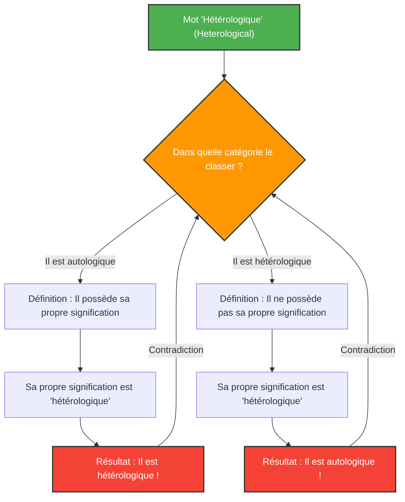

Les mots sont des outils pour décrire le monde, mais lorsque nous essayons de décrire les mots eux-mêmes, la logique peut tomber dans des pièges inattendus.

Conçu par Kurt Grelling et Leonard Nelson en 1908, le **"Paradoxe de Grelling-Nelson (Grelling-Nelson Paradox)"** est un célèbre paradoxe sémantique qui met en évidence les limites de cette "définition des mots par les mots".

## Classer les mots en deux catégories

Grelling et Nelson ont considéré que tous les adjectifs (ou mots) pouvaient être classés dans les deux groupes suivants :

1. **Autologique (Autological)** : Un mot qui possède lui-même la propriété qu'il décrit.
2. **Hétérologique (Heterological)** : Un mot qui ne possède pas lui-même la propriété qu'il décrit.

### Regardons quelques exemples

**Exemples de mots autologiques :**
- **"Court" (short)** : Ce mot lui-même est court.
- **"Français" (French)** : Ce mot lui-même est français.
- **"Nom" (noun)** : Ce mot est un nom.
- **"Pentasyllabique" (pentasyllabic)** : En français, "pen-ta-syl-la-bique" a cinq syllabes.

**Exemples de mots hétérologiques :**
- **"Long" (long)** : Ce mot lui-même est court, pas long.
- **"Allemand" (German)** : Ce mot est en français (ou en anglais), et n'est pas en allemand.
- **"Invisible" (invisible)** : Ce mot est parfaitement visible en ce moment sur l'écran ou le papier.

Jusqu'ici, cela ressemble à un simple jeu de mots. Chaque mot devrait nécessairement pouvoir être classé soit comme incarnant sa propre signification, soit comme ne l'incarnant pas.

## La question fatale : l'émergence du paradoxe

C'est ici que commence le paradoxe. Considérons le mot suivant.

> **Le mot "Hétérologique" (Heterological) lui-même est-il autologique ou hétérologique ?**

Face à cette question, nous sommes confrontés à une contradiction, quelle que soit la réponse choisie.

### Cas 1 : Supposons que "Hétérologique" soit "Autologique"

Si le mot "Hétérologique" (Heterological) est "autologique", alors par définition, il "possède la propriété que le mot lui-même signifie".
Cependant, la signification de ce mot est d'être "hétérologique".
En d'autres termes, avoir la propriété d'être "hétérologique" signifie qu'il est "hétérologique".
**Nous avons supposé qu'il était autologique, mais le résultat est qu'il est devenu hétérologique.** (Contradiction)

### Cas 2 : Supposons que "Hétérologique" soit "Hétérologique"

Si le mot "Hétérologique" (Heterological) est "hétérologique", alors par définition, il "ne possède pas la propriété que le mot lui-même signifie".
Comme la signification de ce mot est "hétérologique", ne pas posséder cette propriété signifie qu'il est "autologique".
**Nous avons supposé qu'il était hétérologique, mais le résultat est qu'il est devenu autologique.** (Contradiction)

La logique s'effondre dans les deux cas.

## Lien avec les mathématiques et la logique : un parent du paradoxe de Russell

Ce paradoxe n'est pas une simple erreur de calcul ou une illusion comme l'"énigme du dollar manquant". Il a fondamentalement la même structure que le **paradoxe de Russell** ("L'ensemble de tous les ensembles qui ne se contiennent pas eux-mêmes se contient-il lui-même ?"), qui a ébranlé les fondements des mathématiques.

Le paradoxe de Grelling-Nelson peut être vu comme la version sémantique (la signification des mots) du paradoxe de Russell.

Le paradoxe de Russell dans la théorie des ensembles :
Lorsqu'on définit l'ensemble
$$ R = \{ x \mid x \notin x \} $$
demander si $R \in R$ ou $R \notin R$ conduit à une contradiction.

Le paradoxe de Grelling-Nelson en sémantique :
Si l'on définit $Het(x)$ comme "le mot $x$ n'a pas la propriété $x$ (est hétérologique)", on tombe dans la contradiction logique :
$$ Het(\text{"Het"}) \iff \neg Het(\text{"Het"}) $$

## Pourquoi ce paradoxe est-il important ?

Lorsqu'un mot fait référence à lui-même (auto-référence), il y a toujours un risque d'erreurs s'apparentant à une boucle infinie.

Ce n'est pas seulement un problème de philosophie ou de linguistique. En informatique et en intelligence artificielle, lorsque des programmes tentent d'évaluer ou de modifier leur propre code, ou lorsque les modèles de traitement du langage naturel interprètent des contradictions sémantiques, ils se heurtent à des barrières logiques similaires.

Le paradoxe de Grelling-Nelson est une expérience de pensée qui visualise brillamment les bugs (limites) inhérents au système qu'est le "langage".
