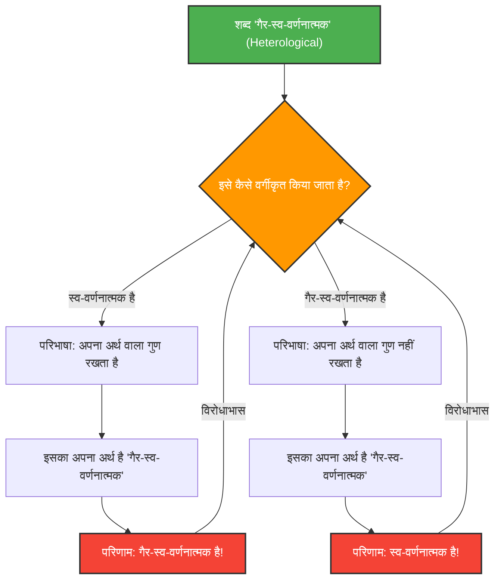

---
title: "जब शब्द खुद का वर्णन करते हैं: ग्रेलिंग-नेल्सन विरोधाभास"
description: "'स्व-वर्णनात्मक' और 'गैर-स्व-वर्णनात्मक' शब्दों के वर्गीकरण द्वारा उत्पन्न तर्क और अर्थशास्त्र की गहरी भूलभुलैया को सुलझाएं।"
date: 2026-09-10T21:00:00+09:00
draft: false
slug: "grelling-nelson-paradox"
image: "img/grelling_nelson.jpg"
math: true
mermaid: true
categories: ["गणितीय विरोधाभास", "तर्कशास्त्र"]
tags: ["विरोधाभास", "अर्थशास्त्र", "स्व-संदर्भ", "समुच्चय सिद्धान्त"]
---

शब्द दुनिया का वर्णन करने के लिए उपकरण हैं, लेकिन जब हम खुद शब्दों का वर्णन करने का प्रयास करते हैं, तो तर्क कभी-कभी अप्रत्याशित जाल में फंस सकता है।

1908 में कर्ट ग्रेलिंग और लियोनार्ड नेल्सन द्वारा तैयार किया गया **"ग्रेलिंग-नेल्सन विरोधाभास (Grelling-Nelson Paradox)"**, अर्थशास्त्र का एक प्रसिद्ध विरोधाभास है जो वास्तव में "शब्दों को परिभाषित करने वाले शब्दों" की सीमाओं को उजागर करता है।

## शब्दों को दो समूहों में वर्गीकृत करना

ग्रेलिंग और नेल्सन ने विचार किया कि सभी विशेषणों (शब्दों) को निम्नलिखित दो समूहों में वर्गीकृत किया जा सकता है:

1. **स्व-वर्णनात्मक (Autological)**: वे शब्द जिनमें स्वयं वह गुण होता है जो उस शब्द का अर्थ है।
2. **गैर-स्व-वर्णनात्मक (Heterological)**: वे शब्द जिनमें स्वयं वह गुण नहीं होता है जो उस शब्द का अर्थ है।

### आइए कुछ उदाहरण देखें

**स्व-वर्णनात्मक शब्दों के उदाहरण:**
- **"छोटा (short)"**: यह शब्द अपने आप में छोटा है।
- **"अंग्रेजी का (English)"**: यह शब्द अपने आप में अंग्रेजी का है।
- **"संज्ञा (noun)"**: यह शब्द एक संज्ञा है।
- **"पांच-शब्दांश का (pentasyllabic)"**: अंग्रेजी में "pen-ta-syl-lab-ic" के पांच शब्दांश होते हैं।

**गैर-स्व-वर्णनात्मक शब्दों के उदाहरण:**
- **"लंबा (long)"**: यह शब्द स्वयं छोटा है और लंबा नहीं है।
- **"जर्मन (German)"**: यह शब्द हिंदी (या अंग्रेजी) है और जर्मन नहीं है।
- **"अदृश्य (invisible)"**: यह शब्द इस समय आपकी स्क्रीन या कागज पर स्पष्ट रूप से दिखाई दे रहा है।

यहाँ तक यह एक साधारण शब्दों के खेल जैसा लगता है। प्रत्येक शब्द को निश्चित रूप से इस आधार पर वर्गीकृत किया जा सकता है कि यह अपने अर्थ को मूर्त रूप देता है या नहीं।

## घातक प्रश्न: विरोधाभास की उत्पत्ति

अब यहाँ से विरोधाभास शुरू होता है। आइए निम्नलिखित एक शब्द पर विचार करें:

> **क्या "गैर-स्व-वर्णनात्मक (Heterological)" शब्द स्वयं स्व-वर्णनात्मक है? या गैर-स्व-वर्णनात्मक है?**

इस प्रश्न के लिए हम जो भी उत्तर चुनें, हमें विरोधाभास का सामना करना पड़ेगा।

### केस 1: मान लें कि "गैर-स्व-वर्णनात्मक" एक 'स्व-वर्णनात्मक' शब्द है

यदि "गैर-स्व-वर्णनात्मक (Heterological)" शब्द "स्व-वर्णनात्मक" है, तो परिभाषा के अनुसार इसका मतलब है कि "शब्द में स्वयं वह गुण है जो इसका अर्थ है।"
हालाँकि, इस शब्द का अर्थ "गैर-स्व-वर्णनात्मक" होना है।
दूसरे शब्दों में, "गैर-स्व-वर्णनात्मक" गुण होने का अर्थ यह है कि यह "गैर-स्व-वर्णनात्मक" है।
**भले ही हमने यह मान लिया कि यह स्व-वर्णनात्मक है, परिणाम गैर-स्व-वर्णनात्मक निकला।** (विरोधाभास)

### केस 2: मान लें कि "गैर-स्व-वर्णनात्मक" एक 'गैर-स्व-वर्णनात्मक' शब्द है

यदि "गैर-स्व-वर्णनात्मक (Heterological)" शब्द "गैर-स्व-वर्णनात्मक" है, तो परिभाषा के अनुसार इसका मतलब है कि "शब्द में स्वयं वह गुण नहीं है जो इसका अर्थ है।"
चूंकि इस शब्द का अर्थ "गैर-स्व-वर्णनात्मक" है, इसलिए इस गुण के न होने का अर्थ है कि यह "स्व-वर्णनात्मक" है।
**भले ही हमने यह मान लिया कि यह गैर-स्व-वर्णनात्मक है, परिणाम स्व-वर्णनात्मक निकला।** (विरोधाभास)

चाहे हम किसी भी दिशा में जाएँ, तर्क विफल हो जाता है।

## गणित और तर्कशास्त्र से संबंध: रसेल के विरोधाभास का रिश्तेदार

यह विरोधाभास "लापता एक डॉलर के रहस्य" जैसी कोई साधारण गणना की गलती या भ्रम नहीं है। इसकी संरचना अनिवार्य रूप से **रसेल के विरोधाभास** के समान ही है ("क्या उन सभी समुच्चयों का समुच्चय जो स्वयं को शामिल नहीं करते हैं, स्वयं को शामिल करता है?"), जिसने गणित की नींव को हिला दिया था।

ग्रेलिंग-नेल्सन विरोधाभास को रसेल के विरोधाभास का अर्थशास्त्रीय (शब्द के अर्थ का) संस्करण कहा जा सकता है।

समुच्चय सिद्धान्त में रसेल का विरोधाभास:
जब हम एक समुच्चय को इस प्रकार परिभाषित करते हैं:
$$ R = \{ x \mid x \notin x \} $$
और पूछते हैं कि क्या $R \in R$ है या $R \notin R$, तो इससे विरोधाभास उत्पन्न होता है।

अर्थशास्त्र में ग्रेलिंग-नेल्सन विरोधाभास:
जब $Het(x)$ को परिभाषित किया जाता है कि "शब्द $x$ में गुण $x$ नहीं है (यह गैर-स्व-वर्णनात्मक है)", तो हम निम्नलिखित तार्किक विरोधाभास में पड़ जाते हैं:
$$ Het(\text{"Het"}) \iff \neg Het(\text{"Het"}) $$

## यह विरोधाभास क्यों महत्वपूर्ण है?

जब कोई शब्द स्वयं को संदर्भित करता है (स्व-संदर्भ), तो हमेशा एक अनंत लूप जैसी त्रुटि होने का खतरा होता है।

यह केवल दर्शन या भाषा विज्ञान की समस्या नहीं है। कंप्यूटर विज्ञान और कृत्रिम बुद्धिमत्ता के क्षेत्र में भी, जब कोई प्रोग्राम अपने स्वयं के कोड का मूल्यांकन या संशोधन करने का प्रयास करता है, या जब प्राकृतिक भाषा प्रसंस्करण मॉडल अर्थ में विरोधाभासों की व्याख्या करने का प्रयास करते हैं, तो उन्हें समान तार्किक बाधाओं का सामना करना पड़ता है।

ग्रेलिंग-नेल्सन विरोधाभास एक शानदार विचार प्रयोग है जो "भाषा" प्रणाली की अंतर्निहित बग (सीमा) को दृश्यमान बनाता है।
