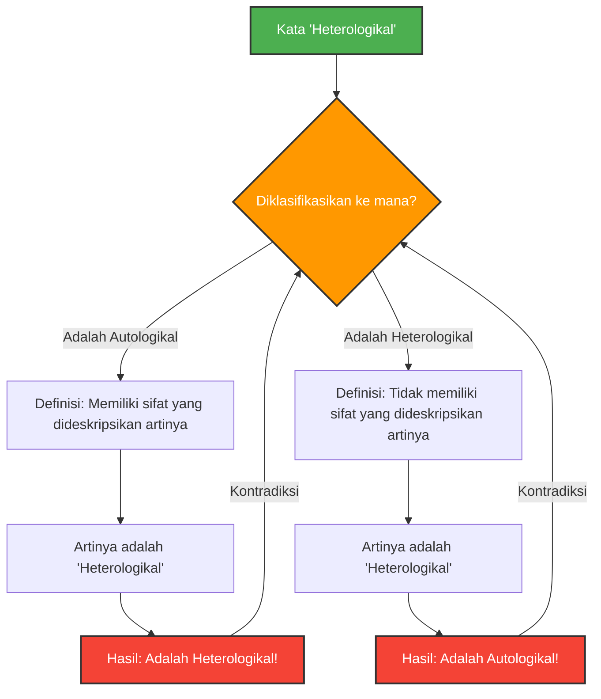

---
title: "Ketika Kata Mendeskripsikan Dirinya Sendiri: Paradoks Grelling-Nelson"
description: "Mengurai labirin mendalam logika dan semantik yang dihasilkan dari klasifikasi kata menjadi 'autologikal' dan 'heterologikal'."
date: 2026-09-10T21:00:00+09:00
draft: false
slug: "grelling-nelson-paradox"
image: "img/grelling_nelson.jpg"
math: true
mermaid: true
categories: ["Paradoks Matematika", "Logika"]
tags: ["Paradoks", "Semantik", "Referensi-diri", "Teori Himpunan"]
---

Kata-kata adalah alat untuk mendeskripsikan dunia, tetapi ketika kita mencoba mendeskripsikan kata itu sendiri, logika kadang-kadang jatuh ke dalam perangkap yang tak terduga.

Diciptakan pada tahun 1908 oleh Kurt Grelling dan Leonard Nelson, **"Paradoks Grelling-Nelson"** adalah paradoks semantik terkenal yang dengan tepat menunjukkan batas dari "kata yang mendefinisikan kata".

## Mengklasifikasikan Kata Menjadi Dua

Grelling dan Nelson menganggap bahwa semua kata sifat (kata-kata) dapat diklasifikasikan ke dalam dua kelompok berikut.

1. **Autologikal (Autological)**: Kata tersebut memiliki sifat yang dideskripsikan oleh arti kata itu sendiri.
2. **Heterologikal (Heterological)**: Kata tersebut tidak memiliki sifat yang dideskripsikan oleh arti kata itu sendiri.

### Mari Kita Lihat Contohnya

**Contoh kata-kata Autologikal:**
- **"Pendek" (short)**: Kata ini sendiri pendek.
- **"Inggris" (English)**: Kata ini sendiri adalah bahasa Inggris.
- **"Kata benda" (noun)**: Kata ini adalah kata benda.
- **"Pentasyllabic" (lima suku kata)**: Dalam bahasa Inggris, "pen-ta-syl-lab-ic" memiliki 5 suku kata.

**Contoh kata-kata Heterologikal:**
- **"Panjang" (long)**: Kata ini sendiri pendek, bukan panjang.
- **"Jerman" (German)**: Kata ini adalah bahasa Indonesia (atau Inggris), bukan bahasa Jerman.
- **"Tak terlihat" (invisible)**: Kata ini saat ini terlihat jelas di atas layar atau kertas.

Sejauh ini, tampaknya hanya seperti permainan kata. Semua kata seharusnya bisa diklasifikasikan dengan pasti, apakah mewujudkan artinya sendiri atau tidak.

## Pertanyaan Fatal: Munculnya Paradoks

Nah, dari sinilah paradoks dimulai. Mari kita pertimbangkan satu kata berikut.

> **Apakah kata "Heterologikal" itu sendiri Autologikal? Atau Heterologikal?**

Terhadap pertanyaan ini, kita akan menghadapi kontradiksi tidak peduli jawaban mana yang kita pilih.

### Kasus 1: Mengasumsikan "Heterologikal" itu "Autologikal"

Jika kata "Heterologikal" itu "Autologikal", berdasarkan definisi, kata itu "memiliki sifat yang dideskripsikan oleh arti kata itu sendiri".
Namun, arti dari kata ini adalah "Heterologikal".
Dengan kata lain, memiliki sifat "Heterologikal" berarti kata itu "Heterologikal".
**Meskipun diasumsikan Autologikal, hasilnya menjadi Heterologikal.** (Kontradiksi)

### Kasus 2: Mengasumsikan "Heterologikal" itu "Heterologikal"

Jika kata "Heterologikal" itu "Heterologikal", berdasarkan definisi, kata itu "tidak memiliki sifat yang dideskripsikan oleh arti kata itu sendiri".
Karena arti kata ini adalah "Heterologikal", tidak memiliki sifat tersebut berarti ia "Autologikal".
**Meskipun diasumsikan Heterologikal, hasilnya menjadi Autologikal.** (Kontradiksi)

Ke arah mana pun kita memilih, logikanya akan runtuh.

## Hubungan dengan Matematika dan Logika: Kerabat dari Paradoks Russell

Paradoks ini bukan kesalahan perhitungan sederhana atau ilusi seperti "misteri dolar yang hilang". Ia pada dasarnya memiliki struktur yang sama dengan **Paradoks Russell** ("Apakah himpunan dari semua himpunan yang tidak memuat dirinya sendiri, memuat dirinya sendiri?") yang mengguncang fondasi matematika.

Paradoks Grelling-Nelson bisa dikatakan sebagai versi semantik (arti kata) dari Paradoks Russell.

Paradoks Russell dalam Teori Himpunan:
$$ R = \\{ x \mid x \notin x \\} $$
Ketika mendefinisikan himpunan tersebut, menanyakan apakah $R \in R$ atau $R \notin R$ akan mengarah pada kontradiksi.

Paradoks Grelling-Nelson dalam Semantik:
Ketika $Het(x)$ didefinisikan sebagai "kata $x$ tidak memiliki sifat $x$ (Heterologikal)",
$$ Het(\text{"Het"}) \iff \neg Het(\text{"Het"}) $$
kita akan jatuh ke dalam kontradiksi logis tersebut.

## Mengapa Paradoks Ini Penting?

Ketika kata merujuk pada dirinya sendiri (referensi-diri), selalu ada bahaya tersembunyi terjadinya kesalahan seperti perulangan tak terbatas.

Ini bukan hanya masalah filosofi atau linguistik. Dalam bidang ilmu komputer dan kecerdasan buatan, kita juga menghadapi hambatan logis serupa ketika sebuah program mencoba mengevaluasi atau memodifikasi kodenya sendiri, atau ketika model pemrosesan bahasa alami menafsirkan kontradiksi makna.

Paradoks Grelling-Nelson adalah sebuah eksperimen pemikiran yang dengan brilian memvisualisasikan "bug" (batasan) yang secara inheren terkandung di dalam sistem "bahasa".
