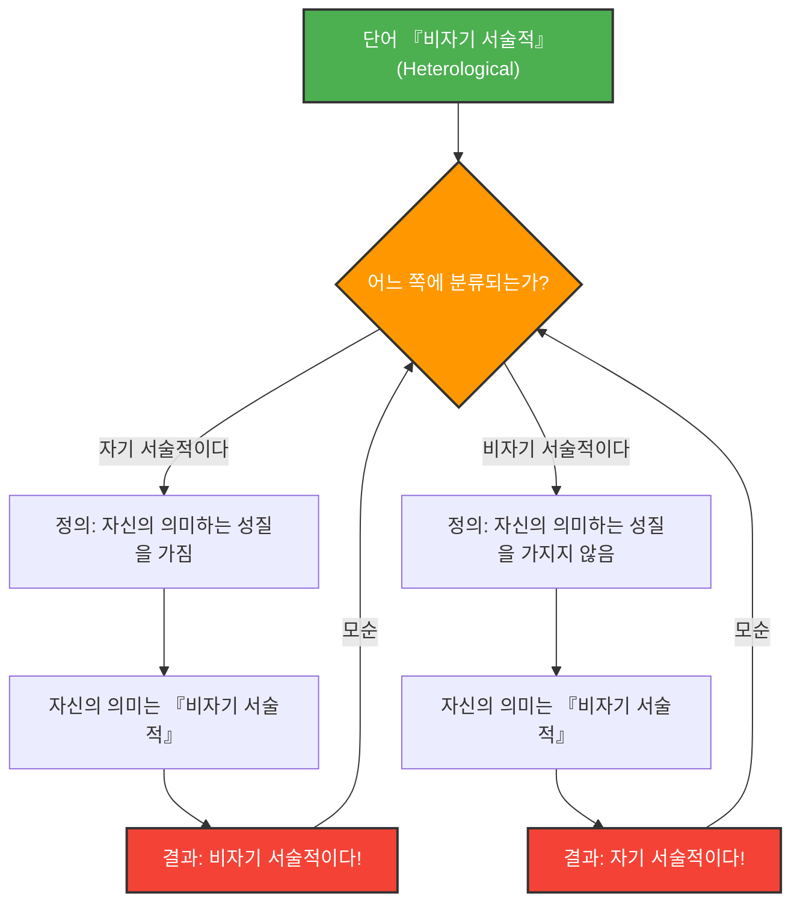

---
title: "단어가 자기 자신을 묘사할 때: 그렐링-넬슨의 역설"
description: "'자기 서술적'인 단어와 '비자기 서술적'인 단어의 분류가 만들어내는 논리학과 의미론의 깊은 미궁을 파헤칩니다."
date: 2026-09-10T21:00:00+09:00
draft: false
slug: "grelling-nelson-paradox"
image: "img/grelling_nelson.jpg"
math: true
mermaid: true
categories: ["수학 역설", "논리학"]
tags: ["역설", "의미론", "자기 참조", "집합론"]
---

언어는 세상을 묘사하기 위한 도구이지만, 언어 그 자체를 묘사하려고 할 때 논리는 예상치 못한 함정에 빠지기도 합니다.

1908년 쿠르트 그렐링과 레너드 넬슨에 의해 고안된 **'그렐링-넬슨의 역설(Grelling-Nelson Paradox)'**은 바로 그 '단어가 단어를 정의한다'는 것의 한계를 들이미는 의미론의 유명한 역설입니다.

## 단어를 두 가지로 분류하기

그렐링과 넬슨은 모든 형용사(단어)를 다음의 두 그룹으로 분류할 수 있다고 생각했습니다.

1. **자기 서술적(Autological)**: 그 단어 자체가 그 단어가 의미하는 성질을 가지고 있는 것.
2. **비자기 서술적(Heterological)**: 그 단어 자체가 그 단어가 의미하는 성질을 가지고 있지 않은 것.

### 예를 살펴봅시다

**자기 서술적인 단어의 예:**
- **'짧은(short)'**: 이 단어 자체도 짧습니다.
- **'영어의(English)'**: 이 단어 자체도 영어입니다.
- **'명사(noun)'**: 이 단어는 명사입니다.
- **'5음절의(pentasyllabic)'**: 영어로 'pen-ta-syl-lab-ic'은 5개의 음절을 가집니다.

**비자기 서술적인 단어의 예:**
- **'긴(long)'**: 이 단어 자체는 짧으며, 길지 않습니다.
- **'독일어의(German)'**: 이 단어는 한국어(또는 영어)이며, 독일어가 아닙니다.
- **'눈에 보이지 않는(invisible)'**: 이 단어는 지금 화면이나 종이 위에 확실하게 보이고 있습니다.

여기까지는 단순한 말장난처럼 보입니다. 모든 단어는 자신의 의미를 체현하고 있거나, 그렇지 않거나 둘 중 하나로 반드시 분류될 수 있을 것입니다.

## 치명적인 질문: 역설의 발생

그럼, 여기서부터가 역설의 시작입니다. 다음의 한 단어에 대해 생각해 봅시다.

> **'비자기 서술적(Heterological)'이라는 단어 자체는 자기 서술적일까요? 아니면 비자기 서술적일까요?**

이 질문에 대해 우리는 어떤 답을 선택하더라도 모순에 직면하게 됩니다.

### 케이스 1: '비자기 서술적'이 『자기 서술적』이라고 가정한다

만약 '비자기 서술적(Heterological)'이라는 단어가 '자기 서술적'이라고 한다면, 정의에 의해 '그 단어 자체가 의미하는 성질을 가지고 있다'는 것이 됩니다.
하지만 이 단어의 의미는 '비자기 서술적'이라는 것입니다.
즉, '비자기 서술적'이라는 성질을 가지고 있다는 것은 그것이 '비자기 서술적'이라는 의미가 됩니다.
**자기 서술적이라고 가정했는데, 결과는 비자기 서술적이 되어버렸습니다.** (모순)

### 케이스 2: '비자기 서술적'이 『비자기 서술적』이라고 가정한다

만약 '비자기 서술적(Heterological)'이라는 단어가 '비자기 서술적'이라고 한다면, 정의에 의해 '그 단어 자체가 의미하는 성질을 가지고 있지 않다'는 것이 됩니다.
이 단어의 의미는 '비자기 서술적'이므로, 그 성질을 가지고 있지 않다는 것은 '자기 서술적'이라는 의미가 됩니다.
**비자기 서술적이라고 가정했는데, 결과는 자기 서술적이 되어버렸습니다.** (모순)

어느 쪽으로 가든 논리가 붕괴하고 마는 것입니다.

## 수학·논리학과의 연결: 러셀의 역설의 친척

이 역설은 '사라진 1달러의 수수께끼'와 같은 단순한 계산 실수나 착각이 아닙니다. 수학의 기초를 뒤흔든 **러셀의 역설**('자기 자신을 포함하지 않는 모든 집합의 집합은 자기 자신을 포함하는가?')과 본질적으로 같은 구조를 가지고 있습니다.

그렐링-넬슨의 역설은 러셀의 역설의 의미론(단어의 의미) 버전이라고도 할 수 있습니다.

집합론에서의 러셀의 역설:
$$ R = \\{ x \mid x \notin x \\} $$
라는 집합을 정의했을 때, $R \in R$인지 $R \notin R$인지를 물으면 모순이 발생한다.

의미론에서의 그렐링-넬슨의 역설:
$Het(x)$를 '단어 $x$가 성질 $x$를 가지지 않는다(비자기 서술적이다)'라고 정의했을 때,
$$ Het(\text{"Het"}) \iff \neg Het(\text{"Het"}) $$
라는 논리적인 모순에 빠진다.

## 왜 이 역설이 중요한가?

단어가 단어 자신을 언급할(자기 참조) 때, 거기에는 무한 루프와 같은 에러가 발생할 위험이 항상 잠재되어 있습니다.

이는 철학이나 언어학만의 문제가 아닙니다. 컴퓨터 과학이나 인공지능 분야에서도 프로그램이 자기 자신의 코드를 평가하고 수정하려고 할 때나, 자연어 처리 모델이 의미의 모순을 해석할 때 비슷한 논리의 벽에 직면하게 됩니다.

그렐링-넬슨의 역설은 '언어'라는 시스템이 본질적으로 내포하고 있는 버그(한계)를 훌륭하게 시각화한 사고 실험인 것입니다.
