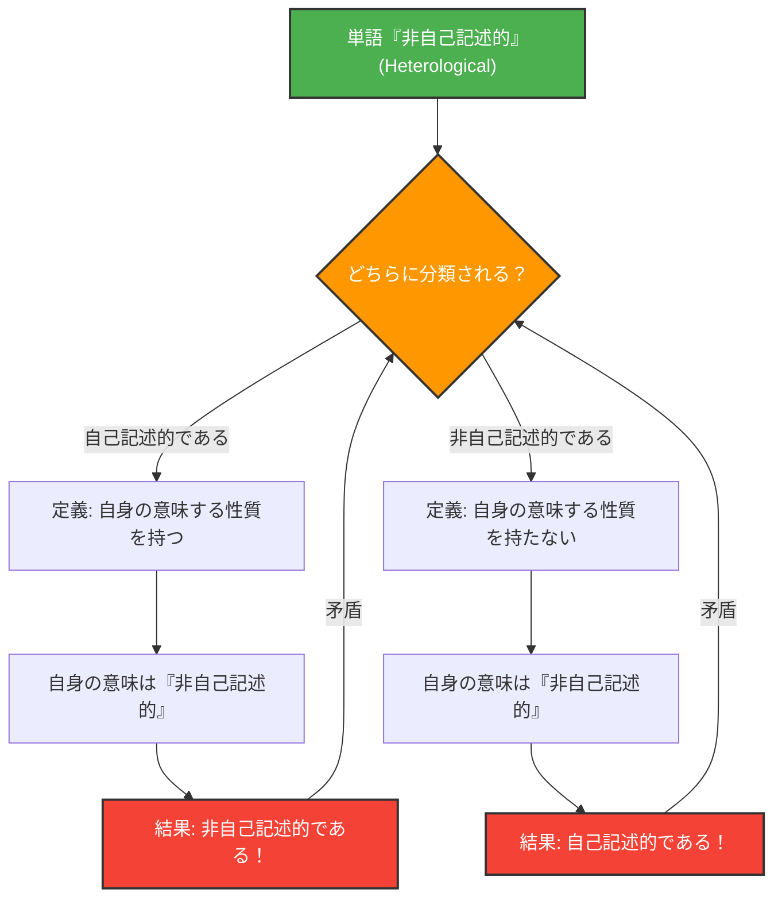

言葉は世界を記述するための道具ですが、言葉そのものを記述しようとした時、論理は予期せぬ落とし穴にハマることがあります。

1908年にクルト・グレリングとレナード・ネルソンによって考案された**「グレリング＝ネルソンのパラドックス（Grelling-Nelson Paradox）」**は、まさにその「言葉が言葉を定義する」ことの限界を突きつける、意味論の有名なパラドックスです。

## 言言葉を2つに分類する

グレリングとネルソンは、すべての形容詞（言葉）を以下の2つのグループに分類できると考えました。

1. **自己記述的（Autological）**: その言葉自身が、その言葉の意味する性質を持っているもの。
2. **非自己記述的（Heterological）**: その言葉自身が、その言葉の意味する性質を持っていないもの。

### 例を見てみましょう

**自己記述的な言葉の例：**
- **「短い（short）」**：この言葉自体が短いです。
- **「英語の（English）」**：この言葉自体が英語です。
- **「名詞（noun）」**：この言葉は名詞です。
- **「五音節の（pentasyllabic）」**：英語で「pen-ta-syl-lab-ic」は5つの音節を持ちます。

**非自己記述的な言葉の例：**
- **「長い（long）」**：この言葉自体は短く、長くありません。
- **「ドイツ語の（German）」**：この言葉は日本語（または英語）であり、ドイツ語ではありません。
- **「目に見えない（invisible）」**：この言葉は今、画面や紙の上にしっかりと見えています。

ここまでは単なる言葉遊びのように見えます。すべての言葉は、自分の意味を体現しているか、していないかのどちらかに必ず分類できるはずです。

## 致命的な質問：パラドックスの発生

では、ここからがパラドックスの始まりです。次の一語について考えてみましょう。

> **「非自己記述的（Heterological）」という言葉自体は、自己記述的でしょうか？それとも非自己記述的でしょうか？**

この問いに対して、私たちはどちらの答えを選んでも矛盾に直面します。

### ケース1：「非自己記述的」は『自己記述的』であると仮定する

もし「非自己記述的（Heterological）」という言葉が「自己記述的」であるとすれば、定義により「その言葉自身が意味する性質を持っている」ことになります。
しかし、この言葉の意味は「非自己記述的」であることです。
つまり、「非自己記述的」という性質を持っているということは、それは「非自己記述的」だということになります。
**自己記述的だと仮定したのに、結果は非自己記述的になってしまいました。**（矛盾）

### ケース2：「非自己記述的」は『非自己記述的』であると仮定する

もし「非自己記述的（Heterological）」という言葉が「非自己記述的」であるとすれば、定義により「その言葉自身が意味する性質を持っていない」ことになります。
この言葉の意味は「非自己記述的」ですから、その性質を持っていないということは、「自己記述的」だということになります。
**非自己記述的だと仮定したのに、結果は自己記述的になってしまいました。**（矛盾）

どちらに転んでも論理が崩壊してしまうのです。

## 数学・論理学との繋がり：ラッセルのパラドックスの親戚

このパラドックスは、「消えた1ドルの謎」のような単純な計算ミスや錯覚ではありません。数学の基礎を揺るがした**ラッセルのパラドックス**（「自分自身を含まないすべての集合の集合は、自分自身を含むか？」）と本質的に同じ構造を持っています。

グレリング＝ネルソンのパラドックスは、ラッセルのパラドックスの意味論（言葉の意味）バージョンとも言えます。

集合論におけるラッセルのパラドックス：
$$ R = \\{ x \mid x \notin x \\} $$
という集合を定義したとき、$R \in R$ か $R \notin R$ かを問うと矛盾する。

意味論におけるグレリング＝ネルソンのパラドックス：
$Het(x)$ を「単語 $x$ が性質 $x$ を持たない（非自己記述的である）」と定義したとき、
$$ Het(\text{"Het"}) \iff \neg Het(\text{"Het"}) $$
という論理的な矛盾に陥る。

## なぜこのパラドックスが重要なのか？

言葉が言葉自身を言及する（自己言及）とき、そこには無限ループのようなエラーが発生する危険が常に潜んでいます。

これは哲学や言語学だけの問題ではありません。コンピュータサイエンスや人工知能の分野でも、プログラムが自分自身のコードを評価・修正しようとする際や、自然言語処理モデルが意味の矛盾を解釈する際に、似たような論理の壁に直面します。

グレリング＝ネルソンのパラドックスは、「言語」というシステムが本質的に内包しているバグ（限界）を、見事に可視化した思考実験なのです。
