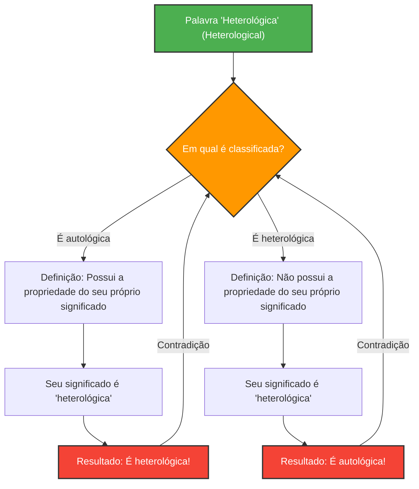

As palavras são ferramentas para descrever o mundo, mas quando tentamos usá-las para descrever as próprias palavras, a lógica pode cair em armadilhas inesperadas.

Criado em 1908 por Kurt Grelling e Leonard Nelson, o **"Paradoxo de Grelling-Nelson"** é um famoso paradoxo semântico que expõe exatamente os limites de quando "as palavras definem as palavras".

## Classificando as palavras em dois grupos

Grelling e Nelson propuseram que todos os adjetivos (palavras) podem ser classificados nos dois grupos a seguir:

1. **Autológicas (Autological)**: A palavra em si possui a propriedade que ela mesma significa.
2. **Heterológicas (Heterological)**: A palavra em si não possui a propriedade que ela mesma significa.

### Vejamos alguns exemplos

**Exemplos de palavras autológicas:**
- **"Curto" (short)**: Esta própria palavra é curta.
- **"Inglês" (English)**: Esta própria palavra é inglês.
- **"Substantivo" (noun)**: Esta palavra é um substantivo.
- **"Pentassilábico" (pentasyllabic)**: Em inglês, "pen-ta-syl-lab-ic" possui 5 sílabas.

**Exemplos de palavras heterológicas:**
- **"Longo" (long)**: Esta palavra em si é curta e não longa.
- **"Alemão" (German)**: Esta palavra está em português (ou inglês) e não é alemão.
- **"Invisível" (invisible)**: Esta palavra é claramente visível agora na tela ou no papel.

Até aqui parece um mero jogo de palavras. Afinal, todas as palavras devem necessariamente ser classificadas entre aquelas que encarnam o seu próprio significado e as que não o fazem.

## A pergunta fatal: O surgimento do paradoxo

Agora, aqui começa o paradoxo. Vamos refletir sobre a seguinte palavra.

> **A própria palavra "heterológica" (Heterological) é autológica ou heterológica?**

Para essa pergunta, depararemo-nos com uma contradição independentemente da resposta que escolhermos.

### Caso 1: Supor que "heterológica" é *autológica*

Se a palavra "heterológica" for "autológica", por definição, "ela possui a propriedade que ela mesma significa".
Porém, o significado desta palavra é ser "heterológica".
Ou seja, ter a propriedade de ser "heterológica" significa que ela é "heterológica".
**Supusemos que fosse autológica, mas o resultado foi que ela é heterológica.** (Contradição)

### Caso 2: Supor que "heterológica" é *heterológica*

Se a palavra "heterológica" for "heterológica", por definição, "ela não possui a propriedade que ela mesma significa".
Como o significado desta palavra é "heterológica", não ter essa propriedade significa que ela é "autológica".
**Supusemos que fosse heterológica, mas o resultado foi que ela é autológica.** (Contradição)

Independentemente do caminho escolhido, a lógica entra em colapso.

## Conexão com a Matemática e a Lógica: Um parente do Paradoxo de Russell

Este paradoxo não é um simples erro de cálculo ou ilusão como o "enigma do dólar desaparecido". Ele possui essencialmente a mesma estrutura do **Paradoxo de Russell** ("O conjunto de todos os conjuntos que não contêm a si mesmos contém a si mesmo?"), que abalou os fundamentos da matemática.

O paradoxo de Grelling-Nelson pode ser considerado a versão semântica (do significado das palavras) do paradoxo de Russell.

O Paradoxo de Russell na Teoria dos Conjuntos:
$$ R = \{ x \mid x \notin x \} $$
Ao definir tal conjunto, questionar se $R \in R$ ou $R \notin R$ resulta em uma contradição.

O Paradoxo de Grelling-Nelson na Semântica:
Quando definimos $Het(x)$ como "a palavra $x$ não possui a propriedade $x$ (é heterológica)",
$$ Het(\text{"Het"}) \iff \neg Het(\text{"Het"}) $$
caímos em uma contradição lógica.

## Por que este paradoxo é importante?

Quando a linguagem se refere a si própria (autorreferência), existe sempre o perigo oculto de ocorrer um erro semelhante a um loop infinito.

Este não é um problema exclusivo da filosofia ou da linguística. No campo da ciência da computação e da inteligência artificial, enfrentamos barreiras lógicas semelhantes quando um programa tenta avaliar ou modificar o seu próprio código, ou quando modelos de processamento de linguagem natural tentam interpretar contradições de significado.

O paradoxo de Grelling-Nelson é um experimento mental que visualiza de forma brilhante os "bugs" (limites) inerentes ao próprio sistema da "linguagem".
