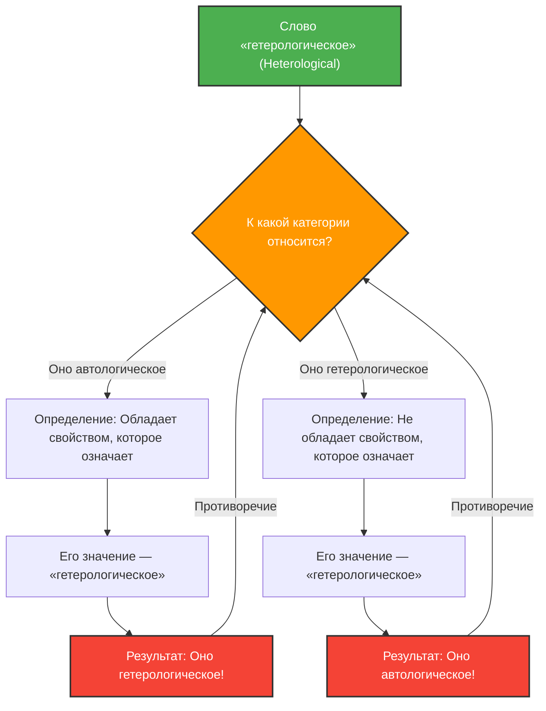

---
title: "Когда слово описывает само себя: Парадокс Греллинга-Нельсона"
description: "Разбираем глубокий лабиринт логики и семантики, порожденный классификацией слов на «автологические» и «гетерологические»."
date: 2026-09-10T21:00:00+09:00
draft: false
slug: "grelling-nelson-paradox"
image: "img/grelling_nelson.jpg"
math: true
mermaid: true
categories: ["Математические парадоксы", "Логика"]
tags: ["Парадокс", "Семантика", "Самореференция", "Теория множеств"]
---

Слова — это инструменты для описания мира, но когда мы пытаемся описать сами слова, логика может попасть в неожиданную ловушку.

**«Парадокс Греллинга-Нельсона» (Grelling-Nelson Paradox)**, предложенный в 1908 году Куртом Греллингом и Леонардом Нельсоном, — это знаменитый семантический парадокс, который указывает на пределы того, когда «слово определяет слово».

## Разделение слов на две категории

Греллинг и Нельсон считали, что все прилагательные (слова) можно разделить на две группы:

1. **Автологические (Autological)**: Само слово обладает свойством, которое оно означает.
2. **Гетерологические (Heterological)**: Само слово не обладает свойством, которое оно означает.

### Рассмотрим примеры

**Примеры автологических слов:**
- **«Короткое» (short)**: Само это слово короткое.
- **«Английское» (English)**: Само это слово является английским.
- **«Существительное» (noun)**: Это слово является существительным.
- **«Пятисложное» (pentasyllabic)**: Слово «pen-ta-syl-lab-ic» в английском языке состоит из 5 слогов.

**Примеры гетерологических слов:**
- **«Длинное» (long)**: Само это слово короткое, а не длинное.
- **«Немецкое» (German)**: Это слово русское (или английское), а не немецкое.
- **«Невидимое» (invisible)**: Это слово сейчас четко видно на экране или бумаге.

Пока это кажется просто игрой слов. Каждое слово обязательно можно отнести к одной из двух категорий: либо оно воплощает свой собственный смысл, либо нет.

## Роковой вопрос: Возникновение парадокса

Здесь начинается парадокс. Давайте подумаем о следующем слове.

> **Является ли само слово «гетерологическое» (Heterological) автологическим или гетерологическим?**

При ответе на этот вопрос мы сталкиваемся с противоречием, какой бы вариант мы ни выбрали.

### Случай 1: Предположим, что «гетерологическое» является «автологическим»

Если слово «гетерологическое» (Heterological) является «автологическим», то по определению «само слово обладает свойством, которое оно означает».
Однако значение этого слова — «гетерологическое».
То есть, обладая свойством «гетерологическое», оно оказывается «гетерологическим».
**Мы предположили, что оно автологическое, но в результате оно стало гетерологическим.** (Противоречие)

### Случай 2: Предположим, что «гетерологическое» является «гетерологическим»

Если слово «гетерологическое» (Heterological) является «гетерологическим», то по определению «само слово не обладает свойством, которое оно означает».
Поскольку значение этого слова — «гетерологическое», то не обладая этим свойством, оно оказывается «автологическим».
**Мы предположили, что оно гетерологическое, но в результате оно стало автологическим.** (Противоречие)

В любом случае логика рушится.

## Связь с математикой и логикой: Родственник парадокса Рассела

Этот парадокс — не просто вычислительная ошибка или иллюзия вроде «загадки об исчезнувшем долларе». Он имеет ту же фундаментальную структуру, что и **парадокс Рассела** («Содержит ли себя множество всех множеств, не содержащих себя?»), потрясший основы математики.

Парадокс Греллинга-Нельсона можно назвать семантической версией (версией значения слов) парадокса Рассела.

Парадокс Рассела в теории множеств:
$$ R = \{ x \mid x \notin x \} $$
Если определить такое множество, то при ответе на вопрос, $R \in R$ или $R \notin R$, возникает противоречие.

Парадокс Греллинга-Нельсона в семантике:
Если определить $Het(x)$ как «слово $x$ не обладает свойством $x$ (является гетерологическим)»,
$$ Het(\text{"Het"}) \iff \neg Het(\text{"Het"}) $$
мы попадаем в логическое противоречие.

## Почему этот парадокс важен?

Когда слово ссылается само на себя (самореференция), всегда существует риск возникновения ошибки типа бесконечного цикла.

Это проблема не только философии или лингвистики. В области информатики и искусственного интеллекта возникают аналогичные логические барьеры, когда программа пытается оценить и изменить свой собственный код, или когда модели обработки естественного языка интерпретируют смысловые противоречия.

Парадокс Греллинга-Нельсона — это мысленный эксперимент, который блестяще визуализирует «баги» (ограничения), присущие самой системе «языка».
