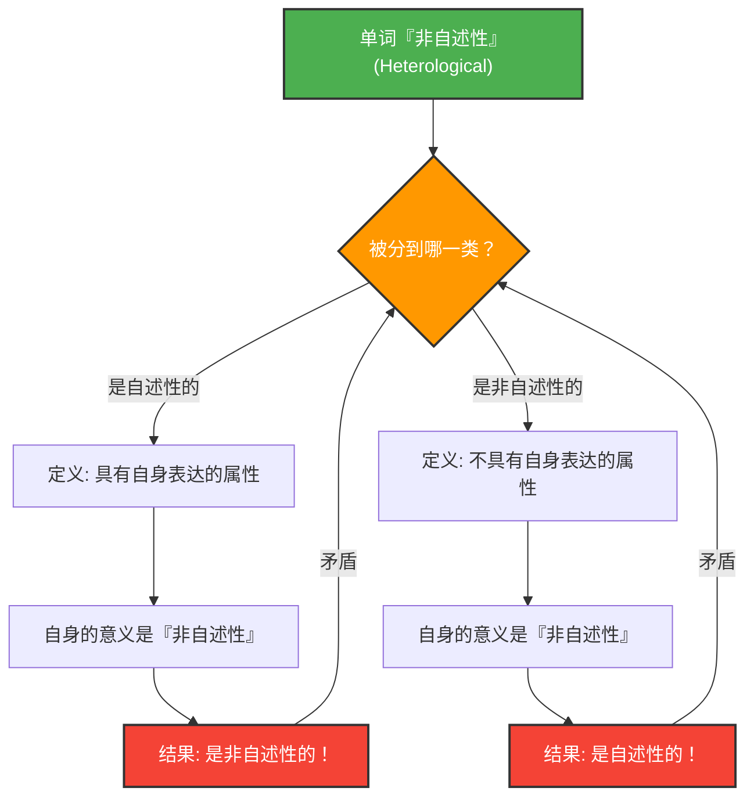

---
title: "当词语描述它自己：格雷林-纳尔逊悖论"
description: "解开由“自述性”和“非自述性”词汇分类产生的逻辑学与语义学深层迷宫。"
date: 2026-09-10T21:00:00+09:00
draft: false
slug: "grelling-nelson-paradox"
image: "img/grelling_nelson.jpg"
math: true
mermaid: true
categories: ["数学悖论", "逻辑学"]
tags: ["悖论", "语义学", "自我指涉", "集合论"]
---

词语是用来描述世界的工具，但当我们试图用词语来描述词语本身时，逻辑有时会陷入意想不到的陷阱。

由库尔特·格雷林（Kurt Grelling）和伦纳德·纳尔逊（Leonard Nelson）在1908年提出的**“格雷林-纳尔逊悖论（Grelling-Nelson Paradox）”**，正是一个著名的语义学悖论，它直接指出了“词语定义词语”时的局限性。

## 将词语分为两类

格雷林和纳尔逊认为，可以将所有的形容词（词语）分为以下两类：

1. **自述性（Autological）**：该词语本身具有其所表达的属性。
2. **非自述性（Heterological）**：该词语本身不具有其所表达的属性。

### 让我们看一些例子

**自述性词语的例子：**
- **“短的（short）”**：这个词语本身就很短。
- **“英语的（English）”**：这个词语本身就是英语。
- **“名词（noun）”**：这个词语是一个名词。
- **“五音节的（pentasyllabic）”**：在英语中，“pen-ta-syl-lab-ic”包含五个音节。

**非自述性词语的例子：**
- **“长的（long）”**：这个词语本身很短，并不长。
- **“德语的（German）”**：这个词语是中文（或英文），并不是德语。
- **“不可见的（invisible）”**：这个词现在正清清楚楚地显示在屏幕或纸上。

到这里为止，这看起来仅仅像是文字游戏。所有的词语似乎都必然可以被归类为“体现了自身意义”或“未体现自身意义”这两种情况之一。

## 致命的问题：悖论的产生

那么，这就是悖论的开始了。让我们来思考以下这个词：

> **“非自述性（Heterological）”这个词本身，是自述性的，还是非自述性的呢？**

面对这个问题，无论我们选择哪种答案，都会面临矛盾。

### 情况1：假设“非自述性”是『自述性』的

如果“非自述性（Heterological）”这个词是“自述性”的，根据定义，这意味着它“具有该词语自身所表达的属性”。
然而，这个词的意义是“非自述性”。
也就是说，具有“非自述性”这个属性，意味着它是“非自述性”的。
**我们假设它是自述性的，结果它却变成了非自述性的。**（矛盾）

### 情况2：假设“非自述性”是『非自述性』的

如果“非自述性（Heterological）”这个词是“非自述性”的，根据定义，这意味着它“不具有该词语自身所表达的属性”。
既然这个词的意义是“非自述性”，那么不具有这个属性，就意味着它是“自述性”的。
**我们假设它是非自述性的，结果它却变成了自述性的。**（矛盾）

无论倒向哪一边，逻辑都会崩溃。

## 与数学和逻辑学的联系：罗素悖论的亲戚

这个悖论绝不仅仅是类似“消失的1美元之谜”那样简单的计算错误或错觉。它与动摇了数学基础的**罗素悖论**（“所有不包含自身的集合的集合，是否包含自身？”）具有本质上相同的结构。

格雷林-纳尔逊悖论可以说是罗素悖论在语义学（词语意义）上的版本。

集合论中的罗素悖论：
$$ R = \\{ x \mid x \notin x \\} $$
当定义了这样一个集合时，追问 $R \in R$ 还是 $R \notin R$ 就会产生矛盾。

语义学中的格雷林-纳尔逊悖论：
当定义 $Het(x)$ 为“单词 $x$ 不具有属性 $x$（即非自述性）”时，
$$ Het(\text{"Het"}) \iff \neg Het(\text{"Het"}) $$
就会陷入这样的逻辑矛盾中。

## 为什么这个悖论很重要？

当词语指涉词语自身（自我指涉）时，往往潜藏着像无限循环一样发生错误的危险。

这不仅仅是哲学或语言学的问题。在计算机科学和人工智能领域，当程序试图评估或修改自身的代码时，或是自然语言处理模型在解释意义的矛盾时，也会面临类似的逻辑壁垒。

格雷林-纳尔逊悖论是一个出色的思想实验，它将“语言”这一系统本质上所包含的漏洞（局限性）巧妙地可视化了。
