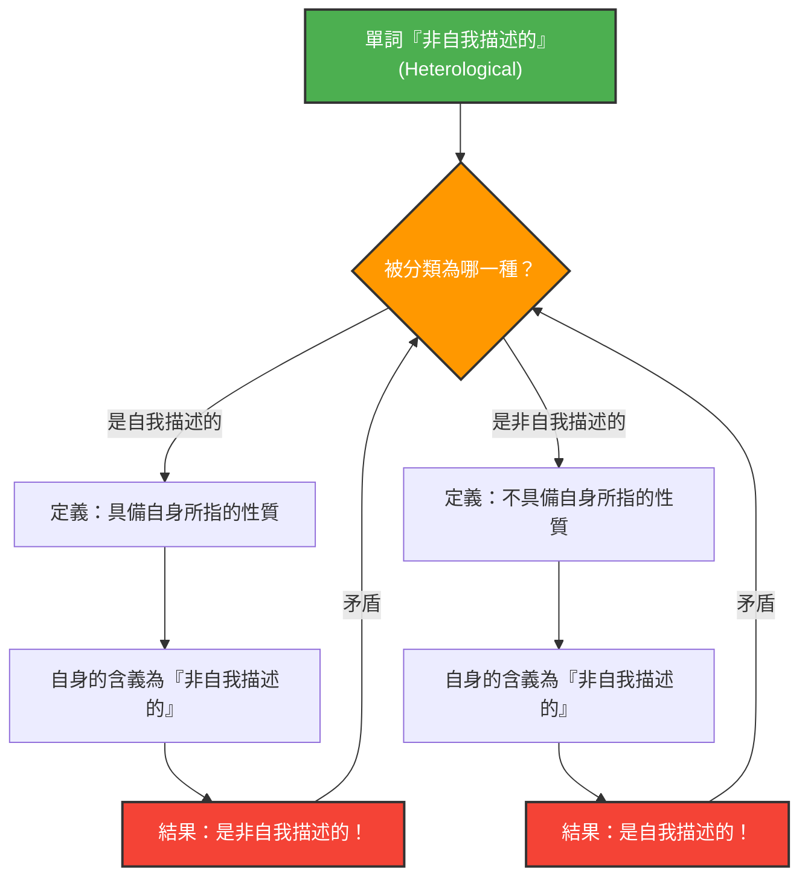

詞語是我們用來描述世界的工具，但當我們試圖用詞語來描述詞語本身時，邏輯有時會陷入意想不到的陷阱中。

1908年由庫爾特·格雷林（Kurt Grelling）和倫納德·納爾遜（Leonard Nelson）提出的**「格雷林-納爾遜悖論（Grelling-Nelson Paradox）」**，正是一個直指「以詞語定義詞語」極限的著名語義學悖論。

## 將詞語分為兩類

格雷林和納爾遜認為，可以將所有的形容詞（詞語）分為以下兩類：

1. **自我描述的（Autological）**: 該詞語本身具備其含義所指的性質。
2. **非自我描述的（Heterological）**: 該詞語本身不具備其含義所指的性質。

### 讓我們來看些例子

**自我描述的詞語例子：**
- **「短（short）」**：這個詞語本身就很短。
- **「英語的（English）」**：這個詞語本身就是英語。
- **「名詞（noun）」**：這個詞語是一個名詞。
- **「五音節的（pentasyllabic）」**：在英語中，「pen-ta-syl-lab-ic」剛好有五個音節。

**非自我描述的詞語例子：**
- **「長（long）」**：這個詞語本身很短，並不長。
- **「德語的（German）」**：這個詞語是中文（或英文），並不是德語。
- **「不可見的（invisible）」**：這個詞語現在正清楚地顯示在螢幕或紙張上。

到目前為止，這看起來就像單純的文字遊戲。所有的詞語似乎都必定能被分類為「體現了自身含義」或「未體現自身含義」這兩種之一。

## 致命的問題：悖論的產生

那麼，這正是悖論的開端。讓我們來思考以下這個詞語：

> **「非自我描述的（Heterological）」這個詞語本身，是「自我描述的」還是「非自我描述的」呢？**

對於這個問題，無論我們選擇哪一個答案，都會面臨矛盾。

### 情況1：假設「非自我描述的」是『自我描述的』

如果「非自我描述的（Heterological）」這個詞語是「自我描述的」，那麼根據定義，它必須「具備該詞語本身所指的性質」。
然而，這個詞語的含義是「非自我描述的」。
也就是說，如果它具備了「非自我描述的」性質，那麼它就是「非自我描述的」。
**我們明明假設它是「自我描述的」，結果卻變成了「非自我描述的」。**（產生矛盾）

### 情況2：假設「非自我描述的」是『非自我描述的』

如果「非自我描述的（Heterological）」這個詞語是「非自我描述的」，那麼根據定義，它「不具備該詞語本身所指的性質」。
因為這個詞語的含義是「非自我描述的」，不具備這個性質，就意味著它是「自我描述的」。
**我們明明假設它是「非自我描述的」，結果卻變成了「自我描述的」。**（產生矛盾）

無論轉向哪一邊，邏輯都會崩潰。

## 與數學、邏輯學的關聯：羅素悖論的親戚

這個悖論並非像「消失的一元謎題」那種簡單的計算錯誤或錯覺。它與動搖了數學基礎的**羅素悖論**（「所有不包含自身的集合所組成的集合，是否包含其自身？」）在本質上具有相同的結構。

格雷林-納爾遜悖論可以說是羅素悖論的語義學（詞語含義）版本。

集合論中的羅素悖論：
$$ R = \{ x \mid x \notin x \} $$
當我們定義了如上的集合時，若追問 $R \in R$ 還是 $R \notin R$，就會產生矛盾。

語義學中的格雷林-納爾遜悖論：
當我們將 $Het(x)$ 定義為「單詞 $x$ 不具備性質 $x$（即非自我描述的）」時，
$$ Het(\text{"Het"}) \iff \neg Het(\text{"Het"}) $$
就會陷入上述的邏輯矛盾之中。

## 為什麼這個悖論如此重要？

當詞語指涉詞語本身（自我指涉）時，總是潛藏著發生如同無限迴圈般錯誤的危險。

這不僅僅是哲學或語言學的問題。在計算機科學與人工智慧領域，當程式試圖評估或修改自身的程式碼時，或是當自然語言處理模型在解譯語義矛盾時，同樣會面臨類似的邏輯障礙。

格雷林-納爾遜悖論是一個精彩的思維實驗，它成功地將「語言」這個系統本質上所內含的 Bug（局限性）可視化了。
