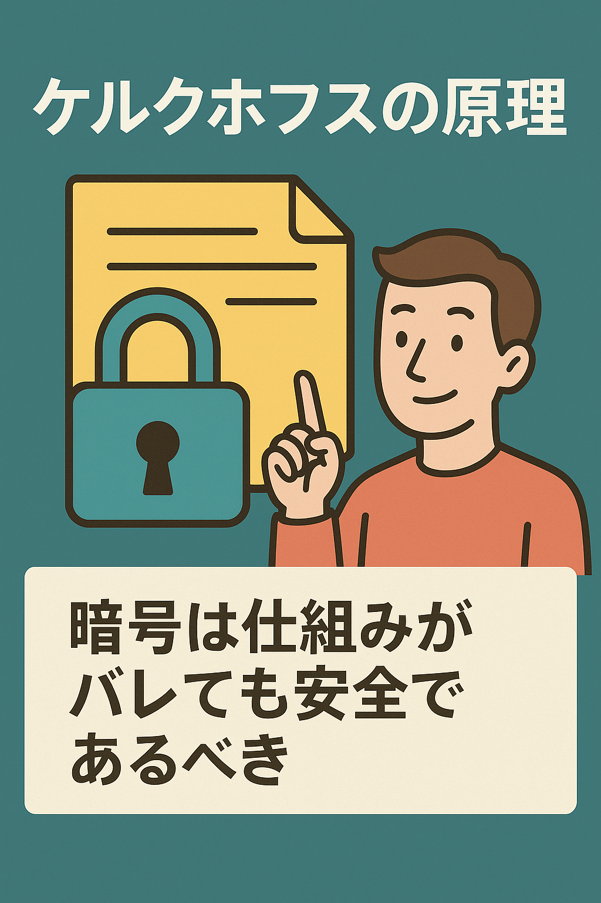

---

title: "Principio de Kerckhoffs"
date: 2025-04-16T23:53:08+09:00
tags: ["Principio de Kerckhoffs", "Criptografía"]
draft: false
image: "img_2.png"
categories: ["Matemáticas, Criptografía y Cuántica"]
---

# Principio de Kerckhoffs

---

¡Hola!

Hoy me gustaría hablar sobre un tema un poco interesante y, de hecho, extremadamente importante: el "Principio de Kerckhoffs".

Ah, esperen, esperen.
Quizás algunos de ustedes piensen: "Nunca he oído hablar del 'Principio de Kerckhoffs' y suena demasiado técnico...". No se preocupen. Este artículo está escrito precisamente para ustedes.

---

## ¿Qué significa una "criptografía segura"?

Por ejemplo, imaginen que alguien les dice: "Esta caja fuerte solo puede ser abierta por quienes conocen el método secreto".

A primera vista, eso parece muy seguro, ¿verdad?
Pero, si lo piensan bien, ¿no les da un poco de inquietud?

Algo así como, "¿qué pasa si se descubre ese secreto? ¿Se acabó todo?".

De hecho, este es el motivo por el cual aparece el Principio de Kerckhoffs.

---

## Pero, ¿qué es el "Principio de Kerckhoffs"?

En términos muy generales, es la idea de que:

**"Un sistema criptográfico debe ser seguro incluso si se conoce su funcionamiento."**

Dicho de otra manera: "La seguridad debe depender únicamente de la 'clave secreta', ¡y está bien que el método de encriptación en sí sea público!".

Por el contrario, esto significa que "un sistema donde solo el algoritmo (el funcionamiento) es un secreto, se considera poco confiable".

---

## "Si el funcionamiento es secreto, es seguro" puede ser un poco peligroso

Una forma de pensar muy común es esta:

>"Nadie ha visto el interior de esta aplicación, así que la seguridad está bien."

Entiendo el sentimiento.
Pero, eso es lo mismo que decir "como nadie lo ha visto, no encontrarán los defectos, así que estamos a salvo".

En realidad, el simple hecho de que "nadie lo haya visto" puede convertirse en un riesgo en sí mismo.

---

## ¿Pero por qué es tan importante este principio?

La razón es que, si alguien logra descubrir cómo funciona y puede descifrarlo fácilmente, entonces ese sistema criptográfico ya no sirve.

Para usar una analogía, es como tener una cerradura con un mecanismo muy complejo, pero que resulta que se puede abrir con una llave maestra comprada en una tienda de todo a un dólar.

Lo importante no es decir "estamos seguros porque la llave es secreta", sino "incluso si mostramos todo el mecanismo, no se puede abrir sin la llave correcta".

---

## El sentimiento de "¿pero no da un poco de miedo?"

Aquí es donde muchas personas sienten:

>"Revelar todo el mecanismo, ¿no da un poco de miedo?"

Esa inquietud es comprensible.
Porque es natural pensar: "Si muestro todo lo que hay dentro, ¿no me copiarán o lo usarán con malas intenciones?".

Pero, ahí es exactamente donde radica el núcleo del Principio de Kerckhoffs.
La "fortaleza que no se desmorona incluso al mostrar el interior" es lo que constituye la verdadera seguridad.

---

## Dicho esto, requiere un poco de valor al principio

Si nos ponemos en el lugar de los desarrolladores, "hacer público el funcionamiento = que se vean las debilidades", y claro, eso da nervios.

Pero piénsenlo un momento.

Un sistema que se muestra de forma transparente y dice "cualquiera puede verificarlo", al final resulta más confiable.

Es parecido a las relaciones humanas, ¿verdad?

"Las personas que nos aceptan después de mostrarles nuestro verdadero yo" son, al fin y al cabo, las que más tranquilidad nos dan.

---

## En conclusión

El Principio de Kerckhoffs puede sonar un poco teórico, pero su esencia es muy simple.

Se trata simplemente de:
**"Creemos un sistema que no se rompa sin importar a quién se lo mostremos."**

Más allá de los secretos superficiales, un diseño sólido.
En lugar de código que no quieres que nadie vea, código que no te dé vergüenza mostrar.

Ese tipo de "fortaleza" será cada vez más demandado en los tiempos venideros.

---

¡Gracias por leer!

Hablar de seguridad puede ser un poco difícil, pero tiene partes que se conectan con "las relaciones humanas" o "la sensación de seguridad en la vida diaria", ¿verdad?
Sin presiones, si vamos aprendiendo poco a poco, seguro que traerá cosas buenas.

---

