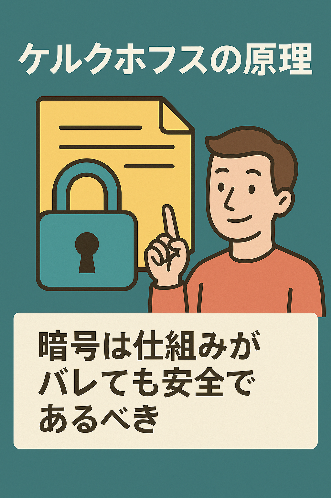

# ケルクホフスの原理

---

こんにちは！

今日はちょっと面白くて、実はものすごく大事な「ケルクホフスの原理」というお話をしてみたいと思います。

あ、待って待って。  
「ケルクホフスの原理」って聞いたことないし、カタカナ多くてすでにちょっとアレ…って思った方もいるかもしれません。安心してください。この記事は、そんな方にこそ読んでほしい内容なんです。

---

## 「安全な暗号」って、どういうこと？

たとえば誰かが「この金庫、秘密の開け方を知ってる人しか開けられません」って言ってきたとします。

それって一見、めっちゃ安心に見えますよね。  
でも、よく考えてみるとちょっと不安じゃないですか？

「その秘密、バレたら終わりでは？」みたいな。

実は、これがケルクホフスの原理が登場するきっかけなんです。

---

## そもそも「ケルクホフスの原理」ってなに？

これ、ものすごくざっくり言うと、

**「暗号は、仕組みがバレても安全であるべきだ」**という考え方です。

もっと言えば、「安全性は“秘密の鍵”だけに頼るべきで、暗号の方法そのものは公開されててもOK！」ということです。

逆に言えば、「暗号のアルゴリズム（仕組み）を秘密にしてるだけの状態は、信頼性が低い」と見なされちゃうんです。

---

## 「仕組みが秘密なら安心」は、ちょっと危険かもしれません

よくあるのが、こんな考え方。

>「このアプリの中身は誰にも見せてないから、セキュリティは大丈夫」

気持ちは分かります。  
でも、それって「誰も見てないから悪いところも見つからないし、大丈夫だよね」って言ってるのと同じです。

実際には、その“誰も見てない”こと自体がリスクになっちゃうこともあるんです。

---

## でも、なんでそんな原理が大事なの？

というのも、もし誰かが仕組みを手に入れて、簡単に解読できちゃったら、その暗号はアウトです。

例えるなら、ドアの鍵がめっちゃ複雑な仕組みでできてるんだけど、実は100円ショップで作れる合鍵で開いちゃう、みたいな感じです。

「鍵が秘密だから大丈夫」じゃなくて、「仕組みを全部見せても、ちゃんとした鍵がないと開けられない」が大事なんですね。

---

## 「でも、なんか怖くない？」という気持ち

ここで多くの人が感じるのが、

>「仕組みを全部さらけ出すって、なんか怖くない？」

という不安です。

分かります。  
だって「中身を全部見せたら、真似されたり、悪用されたりしないの？」って思っちゃいますよね。

でも、そこがまさにケルクホフスの原理の肝なんです。  
「中身を見せても崩れない強さ」こそが、ホンモノのセキュリティ、というわけです。

---

## とはいえ、最初はちょっと勇気がいります

開発者の気持ちになってみると、「仕組みを公開する＝弱点も見られる」ようで、そりゃあドキドキします。

でも、考えてみてください。

仕組みをちゃんと見せた上で「誰でも検証していいよ」と言えるものの方が、結果的に信頼されます。

それって、人間関係と似てますよね。

「本当の自分を見せた上で仲良くしてくれる人」って、やっぱり一番安心できます。

---

## というわけで

ケルクホフスの原理って、ちょっと理屈っぽく聞こえるかもしれませんが、本質はとてもシンプルです。

**「誰に見せても壊れない仕組みを作ろう」**というだけの話なんですね。

表面的な秘密よりも、ちゃんとした設計。  
誰にも見せたくないコードより、見せても恥ずかしくないコード。

そういう「強さ」が、これからの時代にはますます求められていくのかもしれません。

---

読んでくれてありがとうございました！

セキュリティの話ってちょっと難しいけど、でも「人との関係」とか「日常の安心感」にもつながる部分があるんですよね。  
気負わず、でもちょっとずつ知っていくと、きっといいことあると思います。

---

