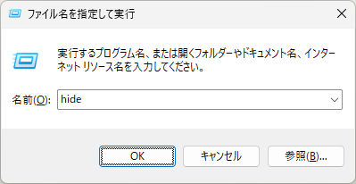

## コマンド「hide」で秀丸エディタを立ち上げる方法を紹介します。

注釈: この方法は`Windows 10/11`で動作確認しています。

1. レジストリエディタを開きます。
2. `HKEY_LOCAL_MACHINE\SOFTWARE\Microsoft\Windows\CurrentVersion\App Paths`に移動します。
3. `App Paths`に`hide.exe`というキーを作成します。※このキー名の`.exe`の前がコマンド名になります。
4. `hide.exe`キーの`(既定)`に秀丸エディタの実行ファイルパスを設定します。私の環境では`"C:\Program Files (x86)\Hidemaru\Hidemaru.exe"`でした。
5. `hide.exe`キーの`Path`という文字列を作成します。
6. `Path`のデータに秀丸エディタの実行ファイルがあるフォルダのパスを設定します。私の環境では`"C:\Program Files (x86)\Hidemaru"`でした。
7. これで`Winキー`+`Rキー`で表示される *ファイル名を指定して実行* で、`hide`というコマンドで秀丸エディタを立ち上げることができるようになります。また、コマンドプロンプトでは`start hide`というコマンドで秀丸エディタを立ち上げることができます。

```
Windows Registry Editor Version 5.00

[HKEY_LOCAL_MACHINE\SOFTWARE\Microsoft\Windows\CurrentVersion\App Paths\hide.exe]
@="\"C:\\Program Files (x86)\\Hidemaru\\Hidemaru.exe\""
"Path"="\"C:\\Program Files (x86)\\Hidemaru\\\""
```
上記の内容を`.reg`ファイルに保存して実行すると、レジストリに設定が追加されます。


