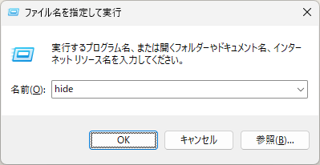

## Aqui está como iniciar o Hidemaru Editor com o comando 'hide'.

Nota: Este método foi testado no `Windows 10/11`.

1. Abra o Editor do Registro.
2. Navegue até `HKEY_LOCAL_MACHINE\SOFTWARE\Microsoft\Windows\CurrentVersion\App Paths`.
3. Crie uma chave chamada `hide.exe` em `App Paths`. **A parte antes de `.exe` no nome desta chave se torna o nome do comando.**
4. Defina o valor `(Padrão)` da chave `hide.exe` para o caminho do arquivo executável do Hidemaru Editor. No meu ambiente, era `"C:\Program Files (x86)\Hidemaru\Hidemaru.exe"`.
5. Crie um valor de String chamado `Path` na chave `hide.exe`.
6. Defina os dados do `Path` para o caminho da pasta contendo o arquivo executável do Hidemaru Editor. No meu ambiente, era `"C:\Program Files (x86)\Hidemaru"`.
7. Agora, na caixa de diálogo **Executar** (pressione a tecla `Win` + `R`), você pode iniciar o Hidemaru Editor digitando o comando `hide`. Além disso, no Prompt de Comando, você pode iniciá-lo com o comando `start hide`.

```
Windows Registry Editor Version 5.00

[HKEY_LOCAL_MACHINE\SOFTWARE\Microsoft\Windows\CurrentVersion\App Paths\hide.exe]
@="\"C:\\Program Files (x86)\\Hidemaru\\Hidemaru.exe\""
"Path"="\"C:\\Program Files (x86)\\Hidemaru\\\""
```
Se você salvar o conteúdo acima em um arquivo `.reg` e executá-lo, as configurações serão adicionadas ao registro.


