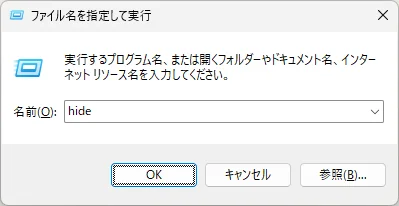

## 以下介紹如何使用「hide」指令啟動 Hidemaru 編輯器。

注意：此方法已在 `Windows 10/11` 上測試過。

1. 打開「登錄編輯程式」。
2. 導覽至 `HKEY_LOCAL_MACHINE\SOFTWARE\Microsoft\Windows\CurrentVersion\App Paths`。
3. 在 `App Paths` 下建立一個名為 `hide.exe` 的機碼。 **在此機碼名稱中， `.exe` 前面的部分即為指令名稱。**
4. 將 `hide.exe` 機碼的 `(預設值)` 設為 Hidemaru 編輯器執行檔的路徑。在我的環境中是 `"C:\Program Files (x86)\Hidemaru\Hidemaru.exe"`。
5. 在 `hide.exe` 機碼中建立一個名為 `Path` 的字串值。
6. 將 `Path` 的資料設為包含 Hidemaru 編輯器執行檔的資料夾路徑。在我的環境中是 `"C:\Program Files (x86)\Hidemaru"`。
7. 現在，在按下 `Win` 鍵 + `R` 鍵開啟的 **執行** 對話方塊中，您可以使用 `hide` 指令啟動 Hidemaru 編輯器。此外，在命令提示字元中，您可以使用 `start hide` 指令啟動它。

```
Windows Registry Editor Version 5.00

[HKEY_LOCAL_MACHINE\SOFTWARE\Microsoft\Windows\CurrentVersion\App Paths\hide.exe]
@="\"C:\\Program Files (x86)\\Hidemaru\\Hidemaru.exe\""
"Path"="\"C:\\Program Files (x86)\\Hidemaru\\\""
```
如果您將上述內容儲存為 `.reg` 檔案並執行它，這些設定將被新增至登錄檔中。


