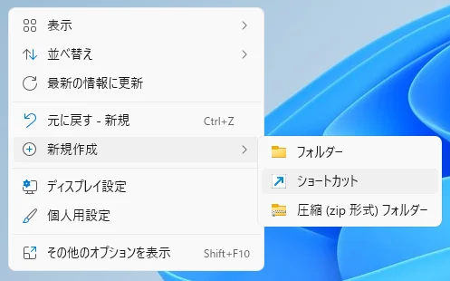
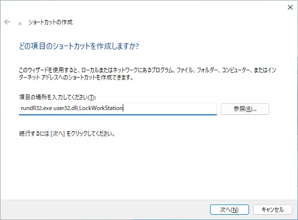
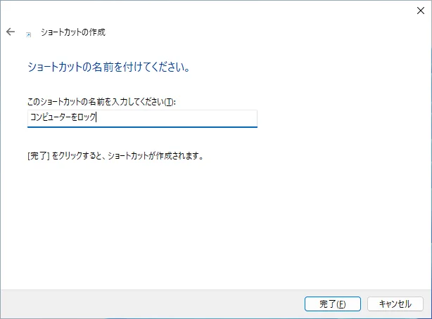
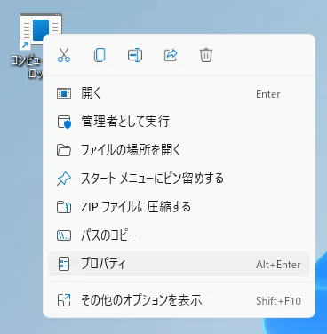
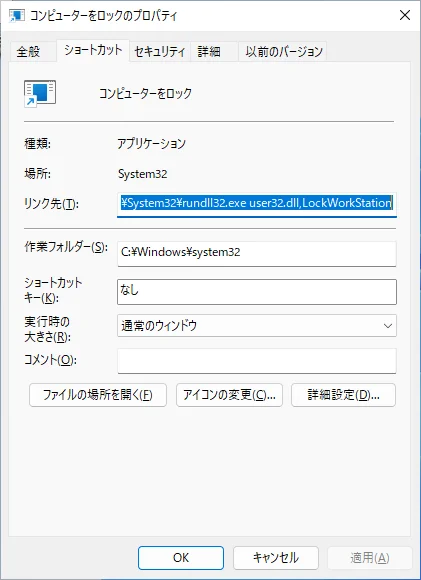
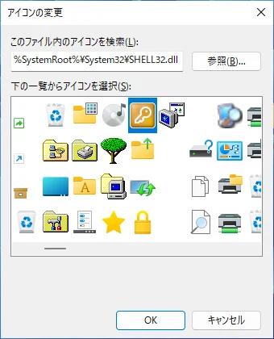
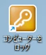

Hier erfahren Sie, wie Sie eine Verknüpfung zum Sperren Ihres Computers erstellen.

Es ist praktisch, da Sie Ihren Computer sperren können, indem Sie einfach auf die erstellte Verknüpfung auf dem Desktop doppelklicken.

## Erstellung

#### 1. Klicken Sie mit der rechten Maustaste auf den Desktop und wählen Sie `Neu` > `Verknüpfung`

#### 2. Der Bildschirm zur Erstellung von Verknüpfungen wird angezeigt. Geben Sie `rundll32.exe user32.dll,LockWorkStation` ein und klicken Sie auf `Weiter`

#### 3. Geben Sie den Namen der Verknüpfung `Computer sperren` ein und klicken Sie auf `Fertig stellen`

#### 4. Ändern Sie das Symbol der erstellten Verknüpfung

Klicken Sie mit der rechten Maustaste auf die erstellte Verknüpfung und wählen Sie `Eigenschaften`

Klicken Sie auf `Anderes Symbol...`

Wählen Sie das gelbe Schloss-Symbol und klicken Sie auf `OK`. Klicken Sie dann erneut auf `OK`, um die Eigenschaften zu schließen.

Das war's.

Durch Doppelklicken auf die erstellte Verknüpfung wird der Computer gesperrt.

Sie können auch die `Windows-Taste` + `L` drücken, um den Computer auf die gleiche Weise zu sperren.

※ Hinweis: Beim Sperren des Computers wird kein Bestätigungsdialogfeld angezeigt.
