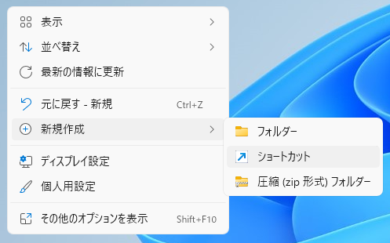
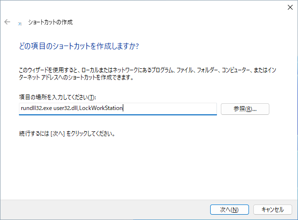
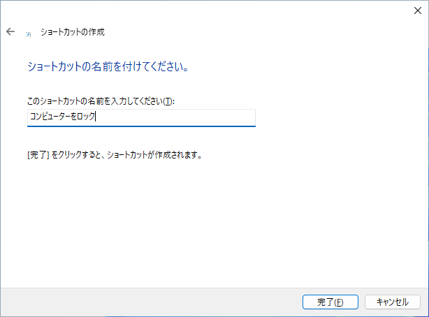
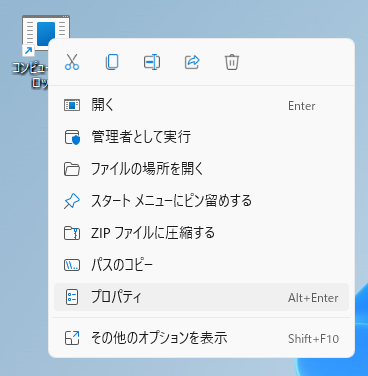
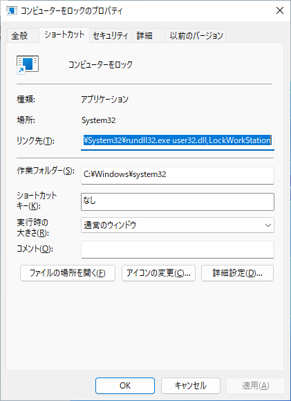
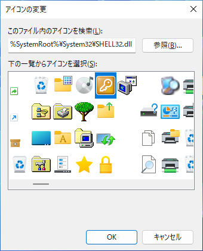
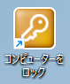

介绍一下如何创建锁定计算机的快捷方式。

将创建的快捷方式放在桌面等地，双击即可锁定计算机，非常方便。

## 创建方法

#### 1. 在桌面上右键单击，选择 `新建` ＞ `快捷方式`

#### 2. 会显示创建快捷方式的画面，输入 `rundll32.exe user32.dll,LockWorkStation`，然后点击 `下一步`

#### 3. 输入快捷方式的名称 `锁定计算机`，然后点击 `完成`

#### 4. 更改已创建的快捷方式的图标

右键单击已创建的快捷方式，选择 `属性`

点击 `更改图标`

选择黄色的方形图标并点击 `确定`，再次点击 `确定` 关闭属性窗口

以上。

双击已创建的快捷方式即可锁定计算机。

按下 `Win键` + `L键` 也可以同样地锁定计算机。

※注意：不会显示锁定计算机的确认对话框。
