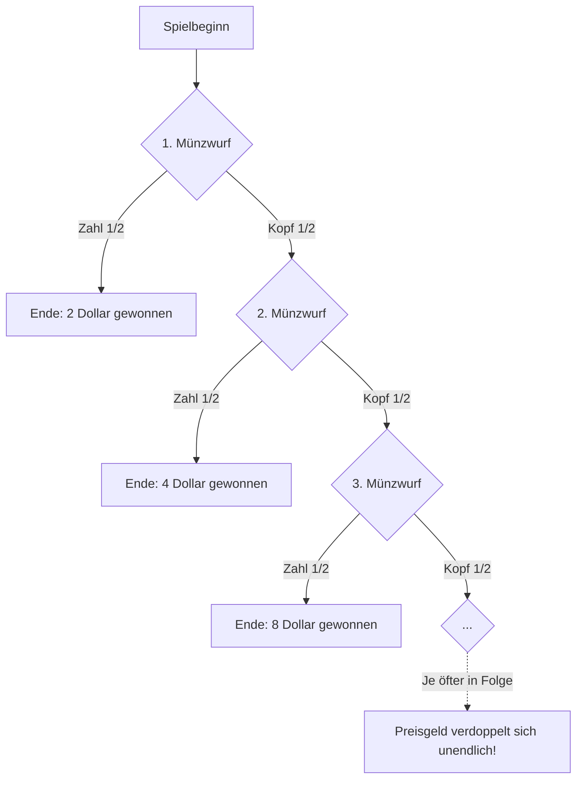

## 1. Das Traum-Glücksspiel mit „unendlichem“ Erwartungswert

Stellen Sie sich vor, Sie gehen durch ein Casino und ein Croupier lädt Sie zu einem neuen Münzwurf-Spiel ein.

**【Spielregeln】**
1. Sie zahlen eine Teilnahmegebühr, um das Spiel zu starten.
2. Eine Münze wird geworfen. Wenn **Kopf** fällt, verdoppelt sich das Preisgeld und Sie dürfen erneut werfen.
3. Wenn **Zahl** fällt, endet das Spiel sofort. Sie erhalten das bis zu diesem Zeitpunkt angesammelte Preisgeld.

Das anfängliche Preisgeld beginnt bei 2 Dollar.
- Fällt beim 1. Wurf Zahl, erhalten Sie **2 Dollar** und das Spiel endet.
- Fällt beim 1. Wurf Kopf und beim 2. Wurf Zahl, erhalten Sie **4 Dollar** und das Spiel endet.
- Fällt beim 1. Wurf Kopf, beim 2. Wurf Kopf und beim 3. Wurf Zahl, erhalten Sie **8 Dollar** und das Spiel endet.
- ...und so weiter. Solange Kopf fällt, verdoppelt sich das Preisgeld auf 16 Dollar, 32 Dollar, 64 Dollar...

Nun eine Frage an Sie:
**Würden Sie an diesem Spiel teilnehmen, wenn die Teilnahmegebühr „10.000 Dollar“ betragen würde?**

Wahrscheinlich werden die meisten Menschen mit „Nein“ antworten. Denn es besteht eine 50-prozentige Wahrscheinlichkeit, dass gleich beim ersten Wurf Zahl fällt und Sie nur 2 Dollar erhalten, was einen enormen Verlust bedeuten würde.

Wenn man jedoch streng nach der mathematischen Wahrscheinlichkeitstheorie (dem Erwartungswert) rechnet, offenbart sich eine erstaunliche Tatsache: **Mathematisch gesehen sollten Sie sich, egal ob die Teilnahmegebühr 10.000 Dollar oder 1 Million Dollar beträgt, sogar Ihr gesamtes Vermögen leihen, um an diesem Spiel teilzunehmen.**

Warum ist das so?

---

## 2. Lasst uns den Erwartungswert berechnen

Ein mathematischer Indikator, um zu beurteilen, ob ein Glücksspiel „profitabel oder verlustreich“ ist, ist der **„Erwartungswert“**.
Der Erwartungswert ist eine Zahl, die angibt, „wie viel Gewinn man durchschnittlich pro Runde macht, wenn man das Spiel sehr oft wiederholt“. Die Formel ist **die Summe aller („möglichen Preisgelder“ × „deren Wahrscheinlichkeit“)**.

Berechnen wir den Erwartungswert für dieses Spiel:

- **Wahrscheinlichkeit, dass beim 1. Wurf Zahl fällt:** $\frac{1}{2}$
  Das Preisgeld beträgt $2$ Dollar.
  Beitrag zum Erwartungswert = $2 \times \frac{1}{2} = 1$ Dollar

- **Wahrscheinlichkeit, dass beim 2. Wurf Zahl fällt:** Da Kopf, dann Zahl fallen muss: $\frac{1}{2} \times \frac{1}{2} = \frac{1}{4}$
  Das Preisgeld beträgt $4$ Dollar.
  Beitrag zum Erwartungswert = $4 \times \frac{1}{4} = 1$ Dollar

- **Wahrscheinlichkeit, dass beim 3. Wurf Zahl fällt:** Da Kopf, Kopf, dann Zahl fallen muss: $(\frac{1}{2})^3 = \frac{1}{8}$
  Das Preisgeld beträgt $8$ Dollar.
  Beitrag zum Erwartungswert = $8 \times \frac{1}{8} = 1$ Dollar

- **Wahrscheinlichkeit, dass beim $n$-ten Wurf Zahl fällt:** $(\frac{1}{2})^n$
  Das Preisgeld beträgt $2^n$ Dollar.
  Beitrag zum Erwartungswert = $2^n \times (\frac{1}{2})^n = 1$ Dollar

Das bedeutet, egal in welcher Runde das Spiel endet, der Erwartungswert dieses Musters beträgt **immer „1 Dollar“**.
Da das Spiel theoretisch unendlich lange weitergehen kann, sieht die Summe all dieser Erwartungswerte wie folgt aus:

$$ \text{Gesamterwartungswert} = 1 + 1 + 1 + 1 + \dots = \infty \text{ (Unendlich)} $$

Die Antwort der Mathematik lautet: **„Der Erwartungswert dieses Spiels ist unendlich.“**
Da der Erwartungswert unendlich ist, ist es theoretisch gesehen absolut „profitabel“, ganz gleich, wie hoch die Teilnahmegebühr ist.

Das ist das **„Sankt-Petersburg-Paradoxon“**, das 1713 von Nicolaus Bernoulli aufgestellt wurde.
Das korrekte mathematische Ergebnis (ein unendlicher Wert) und das realistische menschliche Empfinden (man möchte nur wenige Dollar bezahlen) stehen im krassen Widerspruch zueinander.

---

## 3. Die Entdeckung des „Nutzens“ zur Lösung der Diskrepanz zwischen Mathematik und Menschen

Derjenige, der dieses Paradoxon löste, war der geniale Mathematiker Daniel Bernoulli, der Cousin von Nicolaus. (Da er diese Arbeit an der Akademie der Wissenschaften in Sankt Petersburg präsentierte, erhielt das Paradoxon diesen Namen.)

Daniel beschäftigte sich intensiv mit der menschlichen Psychologie.
Er dachte sich: **„Menschen beurteilen Dinge nicht nach dem ‚absoluten Geldbetrag‘, sondern nach der ‚Zufriedenheit (dem Nutzen)‘, die das Geld bringt.“**

Dies wird als das **„Gesetz vom abnehmenden Grenznutzen“** bezeichnet.

### Der Wert von Geld sinkt mit der Menge, die man besitzt
Stellen Sie sich zum Beispiel vor, Sie sind in der Wüste und sehr durstig. Das erste Glas Wasser hat für Sie einen so hohen Wert (Zufriedenheit), dass Sie „sogar 10.000 Dollar dafür zahlen würden“. Aber während Sie ein zweites und drittes Glas trinken, sinkt der Wert jedes weiteren Glases Wasser immer mehr. Beim zehnten Glas würden Sie wahrscheinlich sagen: „Ich will es nicht mehr, selbst wenn es kostenlos ist.“

Mit Geld verhält es sich genauso.
- „10.000 Euro“ haben für jemanden ohne Ersparnisse einen immensen, lebensrettenden Wert.
- Für einen Milliardär wie Elon Musk haben „10.000 Euro“ jedoch nur noch den Wert (die Zufriedenheit) einer gefundenen Ein-Cent-Münze auf der Straße.

Das heißt, selbst wenn das Preisgeld unendlich auf 2 Dollar $\rightarrow$ 4 Dollar $\rightarrow$ 8 Dollar $\rightarrow$ 16 Dollar... ansteigt, **wächst die „Freude (der Nutzen)“, die ein Mensch empfindet, nicht proportional und unendlich mit dem Betrag mit**.

---

## 4. Den Erwartungswert mit dem „Nutzen“ neu berechnen

Daniel Bernoulli nahm an, dass „der Wert von Geld (der Nutzen), den ein Mensch empfindet, proportional zum Logarithmus ($\log$) des Betrags ist“.

Wenn wir den Betrag $x$ nennen, können wir den Wert (den Nutzen) $u(x)$, den ein Mensch empfindet, als logarithmische Funktion darstellen (hier betrachten wir ein einfaches Modell mit der Basis 2).

- Nutzen eines Preisgeldes von $2$ Dollar: $\log_2(2) = 1$
- Nutzen eines Preisgeldes von $4$ Dollar: $\log_2(4) = 2$
- Nutzen eines Preisgeldes von $8$ Dollar: $\log_2(8) = 3$
- Nutzen eines Preisgeldes von $2^n$ Dollar: $\log_2(2^n) = n$

Der Betrag verdoppelt sich jedes Mal, aber die menschliche „Freude“ steigt nur in kleinen Schritten an: 1, 2, 3...
Berechnen wir den Erwartungswert (**Erwartungsnutzen**) mit diesem „Nutzen“ neu.

$$ \text{Erwartungsnutzen} = \sum_{n=1}^{\infty} \left( n \times \left(\frac{1}{2}\right)^n \right) $$
$$ = 1 \cdot \frac{1}{2} + 2 \cdot \frac{1}{4} + 3 \cdot \frac{1}{8} + 4 \cdot \frac{1}{16} + \dots $$

Wenn man die Summe dieser unendlichen Reihe berechnet, ist das Ergebnis nicht „unendlich“, sondern **es konvergiert gegen „2“.**
Wenn man den Betrag zurückrechnet, bei dem der Nutzen „2“ ist, erhält man $2^2 = 4$ Dollar.

Das bedeutet, wenn man die menschliche Psychologie (den Nutzen) in die Berechnungen einbezieht, ergibt sich die äußerst vernünftige und realistische Antwort: **„Der Wert dieses Spiels liegt für das menschliche Empfinden bei etwa ‚4 Dollar‘.“**
Genau deshalb sind wir nicht bereit, 10.000 Dollar für dieses Spiel zu bezahlen.

---

## 5. Fazit: Das Paradoxon, das die Tür zu den Wirtschaftswissenschaften öffnete

Das Sankt-Petersburg-Paradoxon war ein bahnbrechendes Paradoxon, das mathematisch bewies, dass die objektive Zahl des „Geldbetrags“ und der subjektive Wert der „menschlichen Zufriedenheit“ nicht übereinstimmen.

Das von Daniel Bernoulli vorgeschlagene Konzept des „Nutzens (Utility)“ wurde 200 Jahre später zur wichtigsten Grundlage der modernen Mikroökonomie und Finanzmathematik (wie der Portfoliotheorie).
Unser Verhalten, Versicherungen abzuschließen oder unser Portfolio zu diversifizieren, lässt sich alles durch diesen menschlichen psychologischen Mechanismus des „abnehmenden Grenznutzens“ erklären (der Schmerz über einen großen Verlust ist viel größer als die Freude über einen großen Gewinn).

Ein einfaches Rechenproblem eines Glücksspiels wurde zum Auslöser dafür, den menschlichen Geist zu entschlüsseln und die riesige Disziplin der Wirtschaftswissenschaften hervorzubringen.
