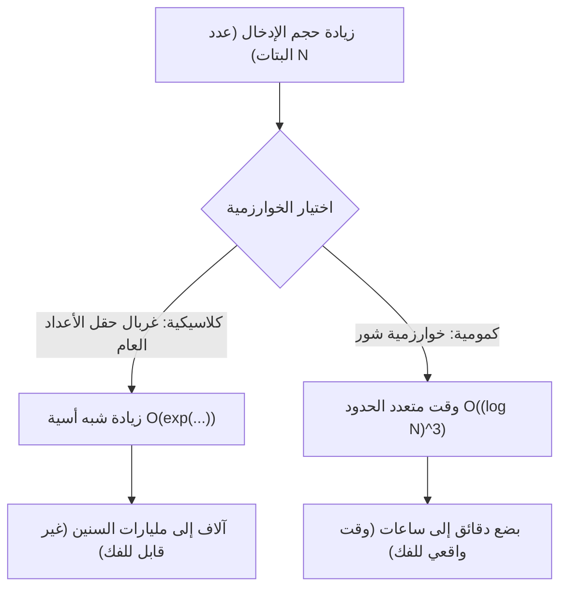
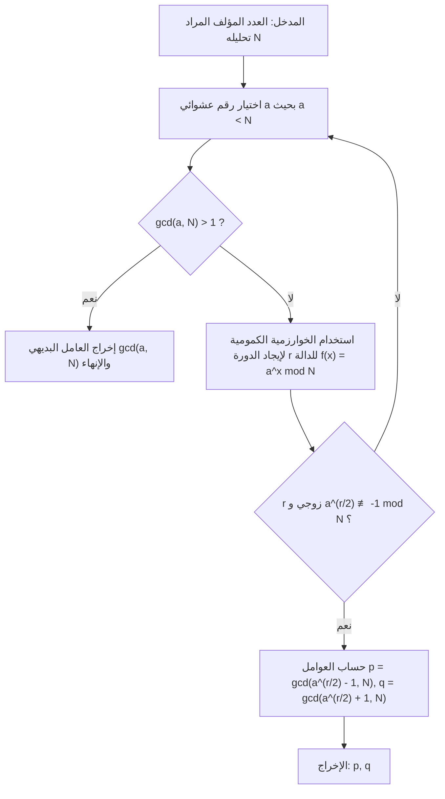
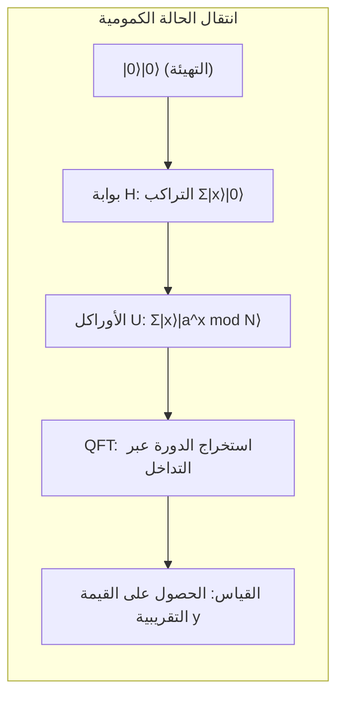

# 1. مقدمة: أزمة التشفير التي تجلبها الحواسيب الكمومية

تعتمد معظم معايير الأمان في مجتمع الإنترنت الحديث على **تشفير المفتاح العام** (خاصة تشفير RSA). عندما نرسل معلومات بطاقة الائتمان الخاصة بنا للتسوق عبر الإنترنت أو نتبادل البيانات شديدة السرية، فإن محتوى هذه الاتصالات محمي بقوة بواسطة تشفير RSA.

يعتمد أساس أمان تشفير RSA على حقيقة رياضية مفادها أن "**تحليل الأعداد الصحيحة الضخمة إلى عواملها الأولية يعد أمرًا بالغ الصعوبة بالنسبة للحواسيب الكلاسيكية (مثل أجهزة الكمبيوتر الشخصية والحواسيب الخارقة التي نستخدمها عادةً)**". ومع ذلك، فإن "**خوارزمية شور (Shor's Algorithm)**" التي أعلن عنها بيتر شور (Peter Shor) في عام 1994، قلبت هذا الافتراض رأسًا على عقب. لقد تم إثبات رياضيًا أنه إذا تم تشغيل خوارزمية شور على حاسوب كمومي واسع النطاق، فيمكنها حل مشاكل تحليل العوامل الأولية التي قد تستغرق من الحواسيب الكلاسيكية وقتًا أطول من عمر الكون، في غضون بضع دقائق إلى بضع ساعات.

في هذا المقال، سنشرح بالتفصيل الدقيق كيف تقوم خوارزمية شور بتحليل العوامل الأولية بسرعة، بدءًا من آليتها الرياضية وحتى التنفيذ العملي للمحاكاة باستخدام بايثون وإطار عمل الحوسبة الكمومية **Qiskit**.

---

# 2. تغيير جذري في التعقيد الحسابي: من الوقت الأسي إلى الوقت متعدد الحدود

لماذا يعد تحليل العوامل الأولية صعبًا؟ حتى لو استخدمنا "طريقة غربال حقل الأعداد العام (General Number Field Sieve, GNFS)"، والتي تُعرف بأنها أفضل خوارزمية لتحليل العوامل الأولية في الحواسيب الكلاسيكية، فإن تعقيدها الحسابي سيكون شبه أسي.

يُعطى الوقت اللازم لتحليل عدد مؤلف من $N$ خانة إلى عوامله الأولية باستخدام الطرق الكلاسيكية على النحو التالي:

$$ O\left(\exp\left( c (\log N)^{1/3} (\log \log N)^{2/3} \right)\right) $$

لهذا السبب، بمجرد زيادة طول المفتاح (على سبيل المثال، إلى 2048 بت أو 4096 بت)، فإن فك التشفير باستخدام الحواسيب الكلاسيكية سيستغرق وقتًا غير واقعي، مثل آلاف أو عشرات الآلاف من السنين.

ومع ذلك، عند استخدام **خوارزمية شور** على حاسوب كمومي، يتم تقليل التعقيد الحسابي بشكل كبير إلى وقت متعدد الحدود بالنسبة لعدد البتات المدخلة $\log N$.

$$ O((\log N)^3) $$

هذا يعني أنه إذا قمنا بمضاعفة عدد البتات، فإن وقت الحساب سيزداد بشكل فلكي على الحاسوب الكلاسيكي، بينما سيزداد على الأكثر بحوالي 8 أضعاف على الحاسوب الكمومي. هذا **التقليل في فئة التعقيد الحسابي من الوقت الأسي إلى الوقت متعدد الحدود (الشمول في فئة BQP)** هو العظمة الحقيقية لخوارزمية شور.



---

# 3. النظرة العامة للخوارزمية والخلفية الرياضية

في الواقع، لا تقوم خوارزمية شور بتنفيذ كل شيء على الحاسوب الكمومي. إنها تعتمد على التعاون بين المعالجة المسبقة واللاحقة التي يقوم بها الحاسوب الكلاسيكي، والجزء الأساسي (خوارزمية إيجاد الدورة) الذي يقوم به الحاسوب الكمومي.

التدفق العام للخوارزمية هو كما يلي.



## اختزال تحليل العوامل الأولية إلى مشكلة إيجاد الدورة

تكمن عبقرية شور في تحويله لـ "**مشكلة تحليل العوامل الأولية**" إلى "**مشكلة إيجاد الدورة (Order Finding Problem)**".

نعتبر عددًا صحيحًا $N$ (الرقم المراد تحليله)، وعددًا صحيحًا أوليًا نسبيًا معه $a$ ($1 < a < N$). نُعرّف دالة الأس النمطية التالية:

$$ f(x) = a^x \bmod N $$

هذه الدالة لها دورة معينة $r$. أي أنه لأي $x$، يتحقق $f(x+r) = f(x)$. بشكل خاص، عندما يكون $x=0$:

$$ a^r \equiv 1 \pmod N $$

أصغر عدد صحيح موجب $r$ يحقق هذا يسمى "رتبة (Order) العدد $a$ قياسًا لـ $N$". إذا تمكنا من إيجاد هذه الدورة $r$، فيمكننا استنتاج العوامل الأولية بالطريقة التالية.

بتعديل المعادلة:
$$ a^r - 1 \equiv 0 \pmod N $$
إذا كان $r$ عددًا زوجيًا، يمكننا تحليله باستخدام صيغة الفرق بين مربعين:
$$ (a^{r/2} - 1)(a^{r/2} + 1) \equiv 0 \pmod N $$

هذا يعني أن $N$ يشترك في قاسم مشترك إما مع $(a^{r/2} - 1)$ أو $(a^{r/2} + 1)$ (بشرط أن يحقق الشرط $a^{r/2} \not\equiv -1 \pmod N$). وبالتالي، باستخدام خوارزمية إقليدس:

$$ p = \gcd(a^{r/2} - 1, N) $$
$$ q = \gcd(a^{r/2} + 1, N) $$

بحساب ما سبق، يمكننا العثور على العوامل الأولية غير البديهية $p, q$ للعدد $N$. يمكن إجراء هذا الحساب (حساب القاسم المشترك الأكبر وتوليد الأرقام العشوائية) بسرعة كبيرة على الحواسيب الكلاسيكية. المشكلة تقتصر على **كيفية إيجاد الدورة $r$ بسرعة**. في الحواسيب الكلاسيكية، يستغرق إيجاد هذه الدورة $r$ نفسها وقتًا أسيًا. وهنا يأتي دور الحواسيب الكمومية.

---

# 4. جزء الخوارزمية الكمومية: آلية إيجاد الدورة

يتكون الروتين الفرعي لإيجاد الدورة $r$ باستخدام الحاسوب الكمومي من الخطوات الأربع التالية:



## الخطوة 1: تهيئة السجل الكمومي والتراكب

أولاً، نُعد سجلين كموميين. السجل الأول يُستخدم لإدخال الحالة، والسجل الثاني لتخزين نتيجة حساب الدالة.
الحالة الأولية هي كلها $|0\rangle$.

$$ |\psi_0\rangle = |0\rangle_1 |0\rangle_2 $$

نطبق بوابة هادامارد (Hadamard Gate) على جميع البتات الكمومية في السجل الأول، لإنشاء حالة تراكب متساوية الاحتمال لجميع المدخلات الممكنة $x$ (من $0$ إلى $Q-1$، حيث $Q=2^n$).

$$ |\psi_1\rangle = \frac{1}{\sqrt{Q}} \sum_{x=0}^{Q-1} |x\rangle_1 |0\rangle_2 $$

وبهذا، يحتفظ الحاسوب الكمومي بحالة لجميع المدخلات الـ $Q$ في نفس الوقت بعملية واحدة. هذا هو المصدر القوي لـ **التوازي الكمومي**.

## الخطوة 2: تطبيق دالة الأوراكل (الأسية النمطية)

بعد ذلك، باستخدام الدائرة المنطقية الكمومية $U_f$، نحسب الدالة $f(x) = a^x \bmod N$ ونخزن النتيجة في السجل الثاني.

$$ |\psi_2\rangle = \frac{1}{\sqrt{Q}} \sum_{x=0}^{Q-1} |x\rangle_1 |a^x \bmod N\rangle_2 $$

في هذه المرحلة، يكون السجلان الأول والثاني في حالة **تشابك كمومي (Entanglement)**. إذا قمنا (افتراضيًا) برصد السجل الثاني وحصلنا على قيمة معينة $k = a^{x_0} \bmod N$، فإن حالة السجل الأول ستنهار إلى تراكب لقيم $x$ التي تعطي تلك القيمة $k$. نظرًا لأن دورة الدالة هي $r$، ستكون الحالات المتبقية هي قيم تبعد بمسافة $r$، أي $x_0, x_0+r, x_0+2r, \dots$.

$$ |\psi_3\rangle = \sqrt{\frac{r}{Q}} \sum_{j=0}^{M-1} |x_0 + j r\rangle_1 |k\rangle_2 $$

ولكن، نحن لا نريد معرفة $x_0$، بل نريد معرفة الدورة $r$ نفسها. من المستحيل ملاحظة $r$ مباشرة من هذه الحالة. لذلك، نستخدم تحويل فورييه الكمومي.

## الخطوة 3: التداخل الطوري بواسطة تحويل فورييه الكمومي (QFT)

نُطبق **تحويل فورييه الكمومي (Quantum Fourier Transform, QFT)** على السجل الأول. QFT هو النسخة الكمومية من تحويل فورييه المتقطع الكلاسيكي، ويقوم بتحويل سعات متجه الحالة. يُعرّف تأثير QFT على حالة الأساس $|x\rangle$ على النحو التالي:

$$ QFT |x\rangle = \frac{1}{\sqrt{Q}} \sum_{y=0}^{Q-1} \omega^{xy} |y\rangle $$

حيث $\omega = e^{2\pi i / Q}$.

عند تطبيق QFT، تتداخل سعات الحالة. دون الدخول في التفاصيل الرياضية المعقدة، عند تطبيق QFT على حالة ذات دورة $r$، فإن الموجة تُحدث **تداخلاً بناءً (Constructive Interference)** فقط عندما تكون $y$ قريبة جدًا من مضاعف صحيح للرقم $Q/r$. أما الحالات الأخرى فتُلغى فيها سعات الاحتمال بسبب **التداخل الهدام (Destructive Interference)** وتقترب من الصفر.

## الخطوة 4: القياس والتوسع في الكسور المستمرة

أخيرًا، نقيس السجل الأول. القيمة $y$ التي يتم الحصول عليها بالقياس ستحقق الشرط التالي باحتمال كبير:

$$ y \approx c \frac{Q}{r} \implies \frac{y}{Q} \approx \frac{c}{r} $$

(حيث $c$ هو عدد صحيح مجهول يحقق $0 \le c < r$)

من خلال تطبيق الخوارزمية الكلاسيكية لـ **الكسور المستمرة (Continued Fraction Expansion)** على العدد الكسري الناتج $y/Q$، يمكننا حساب الكسر التقريبي $c/r$ واستخراج الدورة $r$ من المقام.

---

# 5. محاكاة التنفيذ باستخدام بايثون و Qiskit

لأن النظرية وحدها قد لا تعطي إحساسًا ملموسًا، دعونا نقوم بمحاكاة خوارزمية شور فعليًا باستخدام بايثون وإطار عمل الحوسبة الكمومية من IBM **Qiskit**.

هنا، سننفذ السيناريو الكلاسيكي والأكثر شهرة وهو "**تحليل $N=15$ باستخدام $a=7$**".

## إعداد بيئة التشغيل

يرجى تثبيت Qiskit مسبقًا.

```bash
pip install qiskit qiskit-aer numpy
```

## النظرة العامة على كود بايثون

الكود التالي هو مثال تنفيذي لخوارزمية شور مخصص لـ $N=15, a=7$. نظرًا لأن بناء دائرة أسية نمطية عامة مكلف جدًا في المحاكيات الحالية، فقد قمنا بترميز سلوك البوابات المنطقية للحالة الخاصة $a=7$.

```python
import numpy as np
from qiskit import QuantumCircuit
from qiskit_aer import AerSimulator
from qiskit.visualization import plot_histogram
from fractions import Fraction
import math

# 1. دالة لإنشاء تحويل فورييه الكمومي العكسي (QFT†)
def qft_dagger(n):
    """إنشاء دائرة تحويل فورييه الكمومي العكسي لـ n بت كمومي"""
    qc = QuantumCircuit(n)
    # بوابة SWAP لعكس الترتيب
    for qubit in range(n//2):
        qc.swap(qubit, n-qubit-1)
    # تطبيق بوابة الطور المتحكم فيها وبوابة H
    for j in range(n):
        for m in range(j):
            qc.cp(-np.pi/float(2**(j-m)), m, j)
        qc.h(j)
    qc.name = "QFT_dagger"
    return qc

# 2. دالة لإنشاء عملية الأس النمطية المتحكم فيها 7^x mod 15
def c_amod15(a, power):
    """إنشاء بوابة U للتحكم لـ a وأس معينين (مخصص لـ N=15)"""
    U = QuantumCircuit(4)        
    for _ in range(power):
        # منطق مرمز لحالة 7^x mod 15 عندما a=7
        if a in [2,13]:
            U.swap(2,3)
            U.swap(1,2)
            U.swap(0,1)
        if a in [7,8]:
            U.swap(0,1)
            U.swap(1,2)
            U.swap(2,3)
        if a in [4, 11]:
            U.swap(1,3)
            U.swap(0,2)
        if a in [7,11,13]:
            for q in range(4):
                U.x(q)
    U = U.to_gate()
    U.name = f"{a}^{power} mod 15"
    c_U = U.control()
    return c_U

# 3. تكوين الدائرة الكمومية الرئيسية
def shor_circuit(a, n_count):
    # n_count: عدد بتات سجل التحكم
    # سجل الهدف يحتاج 4 بتات لتمثيل 0 إلى 15
    qc = QuantumCircuit(n_count + 4, n_count)
    
    # تهيئة السجل الأول (سجل التحكم) (إنشاء تراكب)
    for q in range(n_count):
        qc.h(q)
        
    # تهيئة السجل الثاني (سجل الهدف) إلى |1> (0001)
    qc.x(3 + n_count)
    
    # تطبيق عملية الأس النمطية المتحكم فيها (الأوراكل)
    for q in range(n_count):
        # تطبيق عملية 2^q
        qc.append(c_amod15(a, 2**q), 
                 [q] + [i+n_count for i in range(4)])
        
    # تطبيق تحويل فورييه الكمومي العكسي على السجل الأول
    qc.append(qft_dagger(n_count), range(n_count))
    
    # قياس السجل الأول
    qc.measure(range(n_count), range(n_count))
    return qc

# --- قسم التنفيذ ---
if __name__ == "__main__":
    N = 15
    a = 7
    n_count = 8  # استخدام 8 بتات كمومية في سجل التحكم (Q=256)
    
    print(f"إعدادات البحث: N={N}, a={a}, عدد بتات التحكم={n_count}")
    
    # إنشاء الدائرة
    qc = shor_circuit(a, n_count)
    
    # التنفيذ على المحاكي
    sim = AerSimulator()
    # يوصى باستخدام transpile في الإصدارات الأحدث من Qiskit
    from qiskit import transpile
    compiled_circuit = transpile(qc, sim)
    job = sim.run(compiled_circuit, shots=1024)
    result = job.result()
    counts = result.get_counts()
    
    print("\nنتائج القياس (سلسلة البتات: عدد مرات الرصد):")
    for bitstring, count in counts.items():
        print(f"  {bitstring}: {count} مرات")
        
    # المعالجة البعدية الكلاسيكية: تحديد الدورة r بواسطة الكسور المستمرة
    print("\n--- حساب الدورة وتحليل العوامل الأولية ---")
    phases = []
    for output in counts:
        # تحويل سلسلة البتات إلى عدد عشري
        decimal = int(output, 2)
        # الطور = القيمة المقاسة / 2^n_count
        phase = decimal / (2**n_count)
        phases.append(phase)
        
        # الحصول على كسر تقريبي عبر الكسور المستمرة. أقصى مقام هو N=15
        frac = Fraction(phase).limit_denominator(15)
        r = frac.denominator
        
        print(f"القيمة المرصودة: {decimal:3d} | الطور: {phase:.4f} | الكسر المستمر: {frac} | الدورة المقدرة r = {r}")
        
        # التأكد مما إذا كانت الدورة r زوجية وتعطي نتائج صالحة
        if r % 2 == 0:
            guess1 = math.gcd(a**(r//2) - 1, N)
            guess2 = math.gcd(a**(r//2) + 1, N)
            if guess1 not in [1, N] or guess2 not in [1, N]:
                print(f"  => نجاح！ عوامل {N} الأولية هي {guess1} و {guess2}.")
            else:
                print(f"  => عوامل بديهية فقط. يرجى إعادة المحاولة.")
        else:
            print(f"  => فشل لأن الدورة فردية.")
```

## شرح الكود وتحليل نتائج التنفيذ

عند تشغيل الكود أعلاه، سنحصل باحتمال كبير على ذروات معينة (قيم مرصودة) كنتيجة لقياس سجل التحكم. في حالة `n_count=8` ($Q=256$)، إذا استخدمنا حاسوبًا كموميًا مثاليًا (أو محاكيًا)، فإن القيم مثل `0`, `64`, `128`, `192` ستظهر باحتمال هائل.

عند تقسيم هذه القيم على $Q=256$، سنجد أن الطور $y/Q$ يصبح $0.0$, $0.25$, $0.5$, $0.75$ على التوالي.
عند توسيع هذه الأطوار إلى كسور مستمرة، نحصل على:
- $0.25 \to 1/4$ (الدورة المقدرة $r=4$)
- $0.50 \to 1/2$ (الدورة المقدرة $r=2$)
- $0.75 \to 3/4$ (الدورة المقدرة $r=4$)

باستخدام الدورة $r=4$ التي حصلنا عليها هنا، نحسب العوامل الأولية.
بما أن $a=7, r=4$:
$p = \gcd(7^2 - 1, 15) = \gcd(48, 15) = 3$
$q = \gcd(7^2 + 1, 15) = \gcd(50, 15) = 5$

لقد نجحنا بنجاح كبير في تحليل $15 = 3 \times 5$ إلى عوامله الأولية.

> [!TIP]
> إذا تم الحصول على القيمة المقاسة $y=128$ (الطور $0.5$)، فإن المقام يصبح $2$، ونحصل على قاسم للدورة الحقيقية بدلاً من الدورة $r=4$. في مثل هذه الحالات، يمكننا الوصول إلى الدورة الحقيقية بتنفيذ الخوارزمية عدة مرات أو عن طريق التحقق من مضاعفات الـ $r$ التي حصلنا عليها.

---

# 6. تحديات التطبيق العملي وحدود عصر NISQ

على الرغم من سهولة تحليل $N=15$ على المحاكي، إلا أنه لا تزال هناك عقبات عديدة أمام الحواسيب الكمومية الفعلية لتحليل تشفير RSA-2048 المستخدم في العالم الحقيقي (والذي يتكون من 617 رقمًا عشريًا).

يُطلق على العصر الذي نعيش فيه الآن اسم **عصر NISQ (Noisy Intermediate-Scale Quantum: الحواسيب الكمومية متوسطة الحجم والمصحوبة بالضوضاء)**. البتات الكمومية حساسة للغاية لضوضاء البيئة الخارجية، وتتسبب في حدوث "فقدان الترابط (Decoherence)" أثناء العمليات الحسابية، مما يؤدي إلى تدمير حالتها.

لتنفيذ دائرة عميقة (تحتوي على عدد كبير من البوابات) مثل خوارزمية شور بدقة، فإن **تصحيح الأخطاء الكمومية (Quantum Error Correction)** أمر لا غنى عنه. لإنشاء "بت كمومي منطقي" واحد خالٍ من الضوضاء، يلزم تشفير آلاف "البتات الكمومية المادية" باستخدام رمز السطح (Surface Code) أو طرق مشابهة.

لكسر تشفير RSA ذي الـ 2048 بت، يُقدر أننا نحتاج إلى آلاف البتات الكمومية المنطقية المثالية، ولتحقيق ذلك نحتاج إلى حاسوب كمومي متسامح مع الأخطاء يحتوي على **ملايين إلى عشرات الملايين من البتات الكمومية المادية**. نظرًا لأن أحدث المعالجات الكمومية الحالية تحتوي فقط على مئات إلى آلاف البتات الكمومية المادية، فلن يتم كسر أنظمة التشفير في العالم على الفور.

> [!WARNING]
> ومع ذلك، هناك نموذج تهديد يُعرف باسم "خزّن الآن، وفك التشفير لاحقًا (Store Now, Decrypt Later)". يمكن للمهاجمين تخزين كميات هائلة من الاتصالات السرية المشفرة حاليًا كما هي، واعتماد استراتيجية لفك تشفيرها بالكامل في اللحظة التي يتم فيها إنجاز حاسوب كمومي قوي بعد 10 إلى 20 عامًا.

---

# 7. الانتقال إلى التشفير ما بعد الكمومي (PQC)

استعدادًا لمجيء "Q-Day (اليوم الذي تكسر فيه الحواسيب الكمومية التشفير)"، يعكف علماء التشفير حول العالم، بقيادة المعهد الوطني للمعايير والتقنية (NIST) في الولايات المتحدة، على تطوير معايير **التشفير ما بعد الكمومي (Post-Quantum Cryptography, PQC)**.

يعتمد PQC على مسائل رياضية جديدة (مثل مشاكل الشبكات، ومسائل كثيرات الحدود متعددة المتغيرات، والطرق المعتمدة على دوال التجزئة) والتي يُعتقد رياضيًا أنه لا يمكن حلها بكفاءة حتى باستخدام خوارزمية شور (أو حتى خوارزمية جروفر). لقد تم بالفعل اختيار خوارزميات مثل "CRYSTALS-Kyber" و "CRYSTALS-Dilithium" كمعايير قياسية، وبدأ دمجها تدريجيًا في بروتوكولات الاتصال الخاصة بـ iMessage من Apple ومختلف متصفحات الويب.

بالنسبة للمهندسين الذين يديرون البنية التحتية لتكنولوجيا المعلومات، فإن دمج "المرونة التشفيرية (Crypto-Agility: التصميم الذي يسمح بالتبديل السريع لأساليب التشفير)" في الأنظمة للانتقال من تشفير RSA ومنحنيات إهليلجية الحالي إلى PQC سيكون مهمة حاسمة في المستقبل.

---

# 8. خاتمة

في هذا المقال، قمنا بشرح مفصل ومكثف بخلفية نظرية واسعة، بدءًا من الأساس الرياضي النظري لخوارزمية شور، مرورًا بآلية استخراج الدورة باستخدام تحويل فورييه الكمومي، وصولاً إلى كود المحاكاة العملي باستخدام بايثون و Qiskit.

حقيقة أن القوانين الفيزيائية للعالم المجهري (ميكانيكا الكم) يمكن أن تقلب المفاهيم الأساسية لعلم المعلومات الماكروسكوبي مثل نظرية التعقيد الحسابي ونظرية التشفير رأسًا على عقب، هي واحدة من أكثر التحولات النموذجية إثارة في تاريخ العلم. لن نرفع أعيننا عن تقنية الحوسبة الكمومية التي تستمر في التطور حاليًا، والمعركة التي تخوضها ضد تقنيات التشفير الجديدة.

ندعوك لتشغيل كود بايثون المقدم هنا في بيئتك الخاصة لتجربة "سحر الحوسبة" الذي يولده التراكب والتداخل في الحالات الكمومية.

---
**المراجع**
- Shor, P. W. (1994). "Algorithms for quantum computation: discrete logarithms and factoring". Proceedings 35th Annual Symposium on Foundations of Computer Science.
- Nielsen, M. A., & Chuang, I. L. (2010). "Quantum Computation and Quantum Information". Cambridge University Press.
- Qiskit Documentation: https://qiskit.org/documentation/
